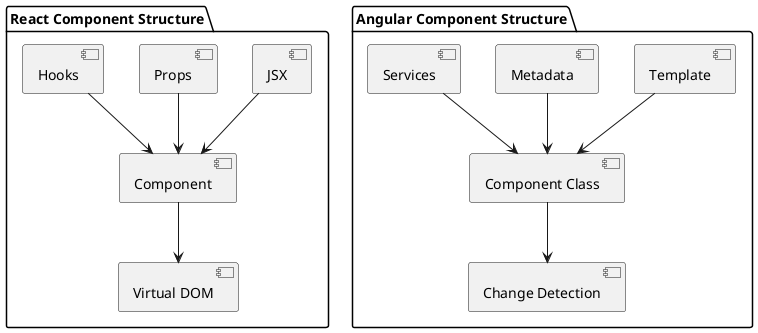
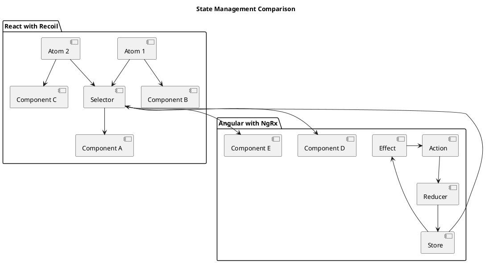
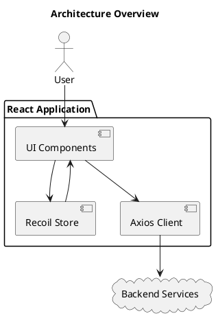

# Architecture Decision Record: React vs Angular for Large SPA Web Application

## Status

Accepted

## Context

Our team needs to select a frontend framework for building a large-scale Single Page Application (SPA). The application will have complex UI interactions, manage significant amounts of state, and connect to multiple backend services. We require excellent performance, maintainability, and the ability to scale the development team over time.

Key considerations include:
- Developer productivity and learning curve
- Performance for complex UI interactions
- State management capabilities
- Community support and longevity
- Testing capabilities
- Integration with existing systems
- Talent availability

Both React and Angular are widely-used frameworks that could potentially meet our needs, so a detailed analysis is required to determine the best fit for our specific requirements.

## Decision

**We will use React with Recoil for state management and Axios for HTTP requests.**

## Consequences

### Detailed Comparison of React vs Angular

#### Framework Philosophy

**Angular**
- Comprehensive, opinionated framework
- Full-featured with built-in solutions for HTTP, forms, routing, etc.
- Uses TypeScript by default
- Follows MVC/MVVM patterns

**React**
- Focused library for UI components with ecosystem of libraries
- Minimal core with flexibility to choose complementary libraries
- Can use JavaScript or TypeScript
- Component-based architecture with one-way data flow

```
+---------------------+---------------------+
|       Angular       |        React        |
+---------------------+---------------------+
| Complete framework  | UI library          |
| Opinionated         | Unopinionated       |
| Steep learning      | Gradual learning    |
| TypeScript-first    | JS or TS            |
| Rigid structure     | Flexible structure  |
+---------------------+---------------------+
```

#### Performance

**Angular**
- Uses change detection to track and update the DOM
- Two-way data binding can impact performance in complex applications
- Ahead-of-Time (AOT) compilation improves runtime performance
- Angular Ivy improved rendering performance significantly

**React**
- Virtual DOM approach for efficient UI updates
- Unidirectional data flow simplifies optimizations
- Component-based architecture facilitates more granular performance optimizations
- Concurrent Mode and Suspense for improved user experience

```ascii
React Rendering Performance Edge:

   Change in State
         |
         v
+------------------+
|  Virtual DOM     |
+------------------+
         |
         v
+------------------+
|   Diff Process   |
+------------------+
         |
         v
+------------------+
| Minimal DOM Ops  |
+------------------+
```

#### Developer Experience & Learning Curve

**Angular**
- Steeper learning curve with many Angular-specific concepts
- Consistent patterns across different Angular applications
- Complex terminology and extensive documentation
- Enforces structured development approach

**React**
- Gentler learning curve with fewer core concepts
- Flexible approaches allow gradual adoption of best practices
- Primarily JavaScript with JSX extension
- More freedom in project structure and organization

#### Component Model

**Angular**
- Components are more heavyweight with decorators and metadata
- Templates are separate using Angular-specific syntax
- Deep component hierarchies can be complex to manage

**React**
- Components can be simple functions
- JSX integrates HTML-like syntax directly in JavaScript/TypeScript
- Component composition is a core strength



#### State Management

**Angular**
- Built-in services and dependency injection
- RxJS for reactive programming
- NgRx (Redux implementation) for complex state
- Higher learning curve for effective state management

**React with Recoil**
- Recoil designed specifically for React
- Atom-based approach makes state management more intuitive
- Excellent TypeScript integration
- Better performance with fine-grained updates
- Simpler API compared to Redux or MobX



Key Recoil advantages over NgRx:
- Less boilerplate code
- More intuitive APIs focused on atoms of state
- Better TypeScript integration
- Fine-grained reactivity (only affected components re-render)
- Built-in async support with Suspense integration
- Easier learning curve for developers

#### HTTP Clients

**Angular HttpClient**
- Built into Angular core
- Strong TypeScript integration
- Interceptors for request/response transformation
- Reactive approach with Observables

**Axios**
- Modern, promise-based HTTP client
- Request/response interceptors
- Automatic JSON transformation
- Simple, straightforward API
- Works in browser and Node.js environments
- Widespread adoption and familiar to many developers

```ascii
Axios Request Flow:

Request → Request Interceptors → HTTP Call → Response Interceptors → Response
```

While Angular's HttpClient is tightly integrated with Angular, Axios provides a simpler API that many developers are already familiar with, reducing the learning curve.

#### Community & Ecosystem

**Angular**
- Google-backed with strong enterprise adoption
- Less third-party libraries due to comprehensive core
- More standardized approach to common problems

**React**
- Facebook-backed with massive community adoption
- Vast ecosystem of third-party libraries
- Multiple solutions for common problems allowing optimal choices

```
npm downloads last year (approximate):
React: ~16M/week  
Angular: ~3M/week
```

This difference in community size impacts available resources, third-party components, and issue resolution speed.

#### Build Size & Performance

**Angular**
- Generally larger initial bundle size
- Angular Ivy has improved this significantly
- Performance has historically been a concern for complex applications

**React**
- Smaller core library
- Can more easily implement code-splitting
- Better performance for dynamic content and complex UIs

#### Testing

**Angular**
- Built-in testing utilities
- TestBed for component testing
- End-to-end testing with Protractor

**React**
- React Testing Library for component testing
- Jest for unit testing
- Multiple E2E options (Cypress, Playwright)

### Why We Chose React with Recoil

1. **Technical advantages**
   - Better performance for complex UI interactions through Virtual DOM
   - Smaller bundle size improves initial load time
   - More flexible component model allows better code reuse
   - Recoil's atom-based state management fits our complex state requirements

2. **Development efficiency**
   - Shorter learning curve for new team members
   - JSX creates a more integrated development experience
   - Large ecosystem provides ready-made solutions for common problems
   - Recoil significantly reduces boilerplate compared to Redux or NgRx

3. **Future-proofing**
   - React's architecture supports concurrent rendering for better UX
   - Strong adoption trend indicates continued community support
   - Incremental path to adopting new features and patterns

4. **Team considerations**
   - Larger pool of React developers for hiring
   - Existing team has more React experience
   - Better alignment with team's JavaScript expertise

5. **Specific project needs**
   - Our UI has many dynamic, interactive components that benefit from React's approach
   - Complex state management needs are well-served by Recoil's model
   - Need to share components across multiple projects favors React's component model



## Implementation Strategy

1. **Project setup with TypeScript and React**
   - Use Create React App with TypeScript template for initial setup
   - Configure ESLint and Prettier for code quality

2. **State management with Recoil**
   - Organize atoms and selectors by feature
   - Use atom families for collections of similar state
   - Implement custom hooks for common state operations

3. **API communication with Axios**
   - Create API service layer with Axios
   - Implement request/response interceptors for auth and error handling
   - Use TypeScript for API response types

4. **Testing strategy**
   - Unit tests with Jest for utilities and hooks
   - Component tests with React Testing Library
   - Integration tests for critical user flows

## Risks and Mitigations

| Risk | Mitigation |
|------|------------|
| React's unopinionated nature leads to inconsistent code | Establish coding standards and architectural patterns early |
| Recoil is newer than some alternatives | Thoroughly test state management patterns and have fallback plan |
| Team members with Angular experience need transition time | Provide training and mentoring for React and Recoil |
| Multiple libraries instead of all-in-one framework | Create a well-documented starter template with chosen libraries |

## Conclusion

While both React and Angular are capable frameworks for building large SPAs, React with Recoil offers better performance, development experience, and flexibility for our specific needs. The combination of React's component model, Recoil's intuitive state management, and Axios's straightforward HTTP client provides an excellent foundation for our application.

The decision aligns with our team's skills, the project requirements, and future maintainability considerations. We recognize that Angular offers advantages in terms of built-in functionality and opinionated structure, but these benefits are outweighed by React's performance, flexibility, and ecosystem for our particular use case.
