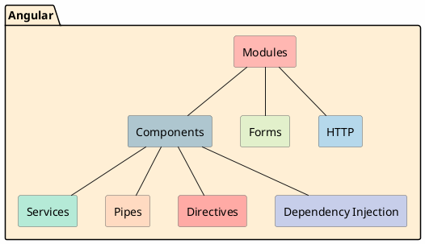
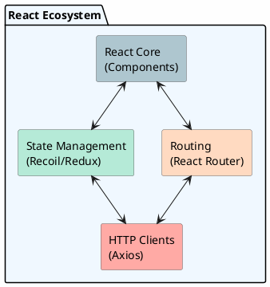
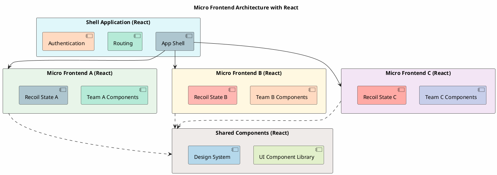
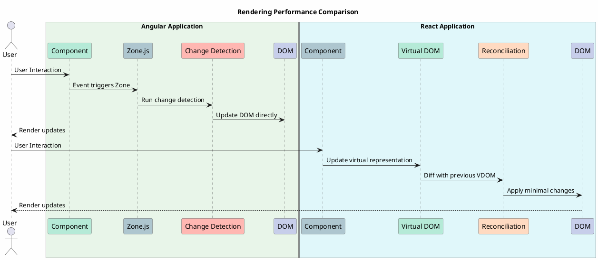
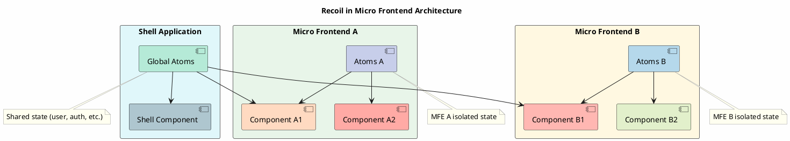
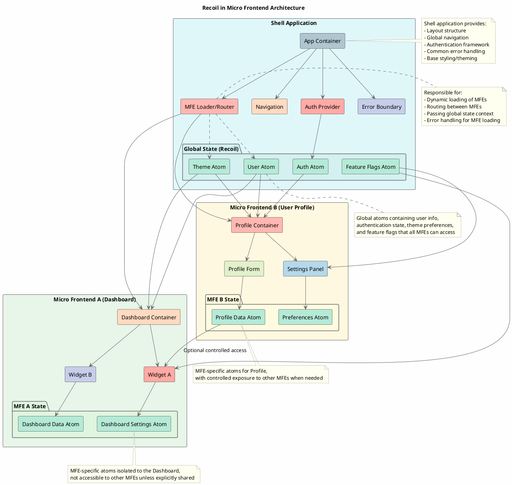

# ADR-001: Migration from Angular to React for Large-Scale SPA Development and Micro Frontend Architecture

## Status
Accepted

## Date
2023-11-15

## Context
Our development team has been using Angular for several years to build and maintain our large-scale single-page applications (SPAs). While Angular has served us well, we've encountered several challenges as our applications have grown in complexity and size. These challenges include performance bottlenecks, steep learning curve for new team members, and limitations in flexibility for certain use cases.

Additionally, our organization has set a strategic goal to move towards a micro frontend architecture to enable:
- Independent development and deployment of frontend components
- Better scaling of development teams
- More focused, maintainable codebases
- Improved technical flexibility across different parts of our application

After extensive research and prototyping, we're considering a strategic shift to React for future development. This ADR documents the reasoning behind this decision, including comparisons between Angular and React in various aspects relevant to large-scale SPA development and micro frontend architecture.

## Decision Drivers
* Developer productivity and onboarding efficiency
* Application performance at scale
* Flexibility and adaptability to changing requirements
* Long-term maintainability
* Ecosystem health and community support
* State management solutions
* HTTP client capabilities
* Compatibility with micro frontend architecture
* Team autonomy and independent deployment capabilities
* Technology flexibility across different micro frontends
* Integration and communication between micro frontends

## Decision
We will adopt React as our primary frontend framework for new feature development and gradually migrate existing Angular components to React. This will be accompanied by Recoil for state management and Axios for HTTP requests. This transition aligns with our strategic goal of moving towards a micro frontend architecture.

## Detailed Comparison

### Architecture & Philosophy

#### Angular
Angular provides a complete, opinionated framework with built-in solutions for most common problems:

* Follows an MVC (Model-View-Controller) architecture
* Uses TypeScript by default
* Leverages dependency injection extensively
* Provides integrated solutions for routing, forms, HTTP, etc.
* Two-way data binding with zone.js change detection
* Monolithic framework design that can be challenging to break into truly independent micro frontends
* Module federation requires additional configuration and careful planning
* Strong opinions on structure can limit flexibility needed for diverse micro frontend teams



#### React
React is a library focused on UI rendering with a vibrant ecosystem of complementary libraries:

* Follows a component-based architecture
* Can use JavaScript or TypeScript
* One-way data flow with explicit state updates
* Functional programming paradigm with hooks
* "Bring your own" approach for routing, state management, etc.
* Lightweight library approach making it ideal for micro frontend architecture
* Easier to isolate and package as independent deployable units
* Simpler integration with Web Components and custom elements
* Better support for module federation and runtime integration



### Micro Frontend Architecture Compatibility

#### Angular Challenges
* Larger bundle sizes complicate micro frontend loading performance
* Angular's comprehensive framework nature can lead to duplication across micro frontends
* Version conflicts between Angular versions can create runtime issues
* Angular Elements adds overhead when creating custom elements
* Bootstrapping multiple Angular applications on a single page can be resource-intensive

#### React Advantages
* Smaller runtime footprint ideal for loading multiple micro frontends
* Easier integration with module federation and dynamic imports
* React components can be wrapped as Web Components with minimal overhead
* Simpler sharing of components between micro frontends
* Flexible rendering strategies support various micro frontend implementation patterns



### Performance

#### Angular
* Zone.js-based change detection can become inefficient in complex applications
* Larger bundle size due to comprehensive framework
* Initial loading time is typically longer
* AOT compilation improves runtime performance but increases build time
* Performance optimizations require deep framework knowledge
* Multiple Angular instances can lead to increased memory usage
* Sharing code between micro frontends requires careful planning to avoid duplication
* Zone.js used in each micro frontend can cause conflicts

#### React
* Virtual DOM provides efficient updates
* Smaller initial bundle size
* Code-splitting is more straightforward
* Fine-grained rendering control with React.memo, useMemo, etc.
* Concurrent rendering with React 18+ offers improved user experience
* Lighter weight allows multiple React instances to co-exist with less overhead
* Shared libraries can be more easily extracted and loaded once
* Server-side rendering can be applied to individual micro frontends for performance
* Suspense and lazy loading integrate well with micro frontend loading patterns



### Developer Experience

#### Angular
* Enforces consistent code structure across projects
* Steep learning curve with many Angular-specific concepts
* Comprehensive CLI with code generation
* Strong typing with TypeScript integration
* Excellent IDE support with clear error messages

#### React
* Gentler learning curve for JavaScript developers
* More flexibility in code organization
* Simpler mental model (functions and props)
* Easy to incrementally adopt
* Highly composable components
* Extensive hot-reloading support

### State Management

#### Angular
* Services with RxJS for simple state
* NgRx (Redux pattern) for complex applications
* Complex state interactions often require extensive boilerplate
* Steep learning curve for RxJS and NgRx
* Strong integration with Angular's change detection
* Sharing state between micro frontends requires additional custom solutions
* NgRx stores typically exist at application level, making micro frontend isolation harder

```plantuml
@startuml
skinparam BackgroundColor FEFEFE
skinparam ArrowColor 666666
skinparam ComponentBorderColor 666666

title Angular with NgRx State Management

[Component] #AEC6CF --> [Action Dispatch] #B5EAD7
[Action Dispatch] --> [Effect] #FFDAC1
[Effect] --> [Service] #FFAAA5
[Service] --> [Effect]
[Effect] --> [Reducer] #C7CEEA
[Reducer] --> [Store] #FFB7B2
[Store] --> [Selector] #E2F0CB
[Selector] --> [Component]
@enduml
```

#### React with Recoil
* Atom-based state management designed specifically for React
* Significantly less boilerplate than Redux
* Easier sharing of state between components
* Built-in support for derived state (selectors)
* Better performance through fine-grained updates
* Async state management with minimal code
* Atoms can be scoped to micro frontends while still allowing selective sharing
* Better isolation of state between micro frontends
* Simpler API reduces coupling between micro frontends when state needs to be shared

```plantuml
@startuml
skinparam BackgroundColor FEFEFE
skinparam ArrowColor 666666
skinparam ComponentBorderColor 666666

title React with Recoil State Management

[Component A] #AEC6CF --> [Atom] #B5EAD7
[Component B] #FFDAC1 --> [Atom]
[Atom] --> [Component A]
[Atom] --> [Component B]
[Atom] --> [Selector] #C7CEEA
[Selector] --> [Component C] #FFAAA5
[Component D] #FFB7B2 --> [Async Selector] #E2F0CB
[External Data Source] #B5D8EB --> [Async Selector]
[Async Selector] --> [Component D]
@enduml
```





### HTTP Client Comparison

#### Angular HttpClient
* Tightly integrated with Angular's dependency injection
* Built-in RxJS integration
* Interceptors for request/response manipulation
* Testing utilities included
* TypeScript integration for response typing

#### Axios
* Framework-agnostic with simple Promise-based API
* Request/response interception
* Automatic JSON transformation
* Client-side protection against XSRF
* Wide browser support
* Cancellation support
* Simpler learning curve

```ascii
Angular HttpClient                      Axios
+------------------+                  +------------------+
| HttpClient       |                  | Axios Instance   |
+------------------+                  +------------------+
| - get()          |                  | - get()          |
| - post()         |                  | - post()         |
| - put()          |                  | - put()          |
| - delete()       |                  | - delete()       |
+------------------+                  +------------------+
| - Interceptors   |                  | - Interceptors   |
| - RxJS Observable|                  | - Promises       |
| - Angular DI     |                  | - No dependencies|
+------------------+                  +------------------+
```

### Ecosystem and Community Support

#### Angular
* Backed by Google
* Complete framework with official solutions
* Slower adoption of new web standards
* Less third-party libraries due to framework completeness
* Generally more enterprise-focused

#### React
* Backed by Facebook/Meta
* Massive ecosystem of third-party libraries
* Rapid adoption of new web standards
* Very active community with numerous resources
* Used by many major companies (Facebook, Netflix, Airbnb, etc.)

## Rationale for Choosing React + Recoil + Axios

After careful consideration, we're selecting React with Recoil and Axios for the following reasons:

1. **Improved Developer Experience**: React's simpler mental model and component-based architecture will reduce onboarding time for new developers and improve productivity for existing team members.

2. **Performance at Scale**: React's virtual DOM and more efficient rendering strategies will help us address performance bottlenecks in our larger applications.

3. **Flexibility and Adaptability**: React's "library, not framework" approach gives us more flexibility to adapt to changing requirements and adopt new technologies as needed.

4. **Recoil for State Management**: Recoil provides a simpler yet powerful alternative to NgRx with less boilerplate and better performance characteristics for our use cases. Its atom-based approach aligns well with React's component model.

5. **Axios for HTTP Requests**: While Angular's HttpClient is well integrated with Angular, Axios provides similar capabilities with a simpler API, better browser support, and no framework dependencies.

6. **Future-Proofing**: React's massive adoption and community support ensure longer-term viability and continuous improvement.

7. **Incremental Adoption**: React allows us to gradually migrate existing applications component by component, reducing risk compared to a complete rewrite.

8. **Micro Frontend Architecture Support**: React's lightweight nature makes it significantly more suitable for micro frontend architecture:
   - Smaller bundle sizes reduce the overhead of loading multiple micro frontends
   - Simpler integration models between independently deployed applications
   - Better compatibility with module federation and dynamic loading
   - More flexible approach to sharing components between teams
   - Less opinionated structure allows teams to make decisions appropriate to their domains

9. **Independent Team Development**: React's smaller API surface and simpler mental model enable teams to work more independently, which is crucial for successful micro frontend implementation.

10. **Technology Flexibility**: React's approach allows different teams to make their own technology choices for state management, styling, etc., while maintaining a consistent core library.

## Implications

### Positive
* Improved performance for complex UIs
* Reduced bundle size
* Faster developer onboarding
* Greater flexibility for implementing custom solutions
* Access to wider ecosystem of libraries and tools
* Simplified state management with Recoil
* Easier testing of components in isolation
* Better alignment with micro frontend architecture goals
* Reduced coupling between application domains
* More autonomous team development
* Potential for independent scaling and deployment of application sections
* Ability to modernize the application incrementally

### Negative
* Learning curve for Angular-experienced developers
* Migration effort for existing code
* Need to select and integrate libraries instead of using built-in Angular solutions
* Initial productivity may decrease during transition
* Need to establish new coding standards and best practices
* Need to establish clear boundaries between micro frontends
* Potential challenges in shared state management across micro frontends
* Increased need for cross-team component design system alignment

## Implementation Strategy
1. Start with new features/modules using React
2. Create a compatibility layer for Angular-React interop
3. Gradually migrate existing Angular components to React
4. Define micro frontend boundaries based on business domains
5. Establish patterns for micro frontend communication and integration
6. Implement a module federation approach for loading micro frontends
7. Create a shared component library to ensure consistency
8. Develop sandbox environments for independent micro frontend testing
9. Provide training and resources for team members
10. Establish React/Recoil/Axios best practices and patterns

```plantuml
@startuml
skinparam BackgroundColor FEFEFE
skinparam ArrowColor 666666
skinparam StateBackgroundColor #E0F7FA
skinparam StateBorderColor 666666
skinparam NoteBorderColor 999999
skinparam NoteBackgroundColor FFFFF0

title Micro Frontend Migration Strategy

[*] --> "Identify MFE Boundaries" #AEC6CF
"Identify MFE Boundaries" --> "Build Shell Application" #B5EAD7
"Build Shell Application" --> "Create Shared Component Library" #FFDAC1
"Create Shared Component Library" --> "Implement First MFE" #FFAAA5
"Implement First MFE" --> "Add Communication Layer" #C7CEEA
"Add Communication Layer" --> "Convert Existing Features" #FFB7B2
"Convert Existing Features" --> "Establish CI/CD Pipelines" #E2F0CB
"Establish CI/CD Pipelines" --> [*]

note right of "Identify MFE Boundaries"
  Define based on business domains
  and team organization
end note

note right of "Create Shared Component Library"
  React components implementing
  design system
end note

note right of "Add Communication Layer"
  Custom events, URL parameters,
  or shared state
end note
@enduml
```

## References
* [React Official Documentation](https://reactjs.org/docs/getting-started.html)
* [Angular Official Documentation](https://angular.io/docs)
* [Recoil Documentation](https://recoiljs.org/docs/introduction/getting-started)
* [Axios Documentation](https://axios-http.com/docs/intro)
* [Performance Comparison Studies](https://www.toptal.com/react/react-vs-angular)
* [State Management Patterns](https://medium.com/dailyjs/state-management-with-recoil-part-1-9fee874100e3)
* [Micro Frontends](https://micro-frontends.org/)
* [Module Federation Examples](https://github.com/module-federation/module-federation-examples)
* [Building Micro-Frontends with React](https://martinfowler.com/articles/micro-frontends.html)
* [State Management in Micro Frontend Architecture](https://medium.com/swlh/state-management-in-micro-frontend-architecture-1b8c6650meee4)
