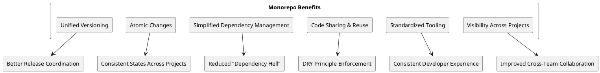
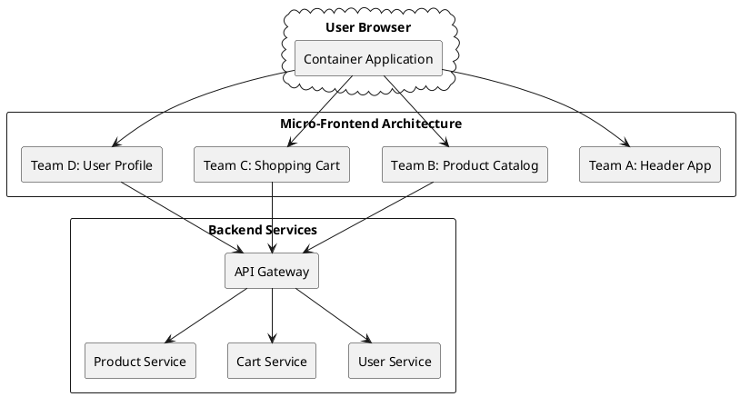
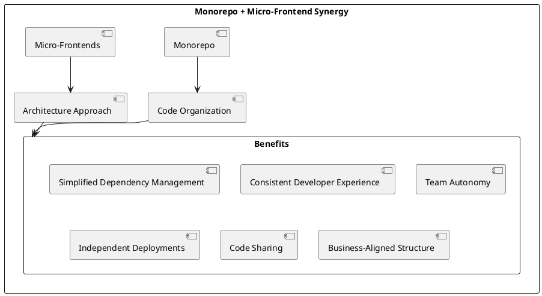

# Monorepos and Micro-Frontends: The Future of Frontend Architecture

## Introduction

In recent years, software development has seen a shift in how codebases are organized and managed. As applications grow in size and complexity, organizations have been searching for more efficient ways to handle their codebases. One approach gaining significant traction is the monorepo (monolithic repository) strategy, especially when paired with micro-frontend architecture. This article explores why organizations are increasingly adopting monorepos, how they enable micro-frontend implementations, and provides a comprehensive guide on leveraging these technologies together.

## What is a Monorepo?

A monorepo is a version control strategy where multiple projects or applications are stored in a single repository instead of being split across multiple repositories. Unlike a multi-repo approach where each project has its own repository, a monorepo centralizes all related code, making it easier to share code, coordinate changes, and maintain consistency across projects.

```plantuml
@startuml
skinparam BackgroundColor transparent
skinparam componentStyle rectangle

package "Traditional Multi-Repo Approach" {
  [Project A Repo] as RepoA
  [Project B Repo] as RepoB
  [Project C Repo] as RepoC
  [Shared Library Repo] as SharedRepo
  
  RepoA --> SharedRepo
  RepoB --> SharedRepo
  RepoC --> SharedRepo
}

package "Monorepo Approach" {
  [Single Repository] as Mono {
    [Project A] as ProjA
    [Project B] as ProjB
    [Project C] as ProjC
    [Shared Libraries] as Shared
    
    ProjA --> Shared
    ProjB --> Shared
    ProjC --> Shared
  }
}
@enduml
```

## Why Organizations Need Monorepos

### Challenges with Multi-repo Approaches

Traditional multi-repo architectures face several challenges:

1. **Dependency management complexity**: When projects depend on each other, version management becomes challenging, often leading to "dependency hell" [1].
2. **Cross-project changes**: Making changes that span multiple repositories requires coordinated releases and complex CI/CD workflows.
3. **Code duplication**: Without easy access to code from other projects, developers tend to duplicate functionality.
4. **Fragmented tooling**: Each repository often has its own build scripts, linting rules, and test frameworks.

### Benefits of Monorepos

Monorepos address these challenges by providing:

1. **Simplified dependency management**: All projects can share the same version of dependencies, reducing conflicts.
2. **Atomic cross-project changes**: Developers can modify multiple projects in a single commit.
3. **Easier code sharing**: Code can be shared across projects without the overhead of package publishing.
4. **Consistent tooling**: Build systems, linters, and testing frameworks can be standardized across all projects.
5. **Improved developer experience**: Developers can work on multiple related projects without switching repositories.

According to a survey by State of JS 2020, organizations using monorepos reported a 35% increase in developer productivity and a 28% reduction in build-related issues [2].

## What Monorepos Can Achieve

### Unified Codebase Management

Monorepos provide a single source of truth for an organization's code. This unified approach enables:



### Scaling Development Teams

Monorepos excel at scaling development across large organizations:

1. **Transparent visibility**: All code is visible to all developers, fostering collaboration.
2. **Knowledge sharing**: Developers can learn from code written by other teams.
3. **Centralized governance**: Organizations can enforce standards and best practices across all projects.

Google, Facebook, Microsoft, and Twitter all use monorepos to manage codebases with thousands of developers and millions of lines of code [3].

## Micro-Frontends: An Overview

### What Are Micro-Frontends?

Micro-frontends extend the concepts of microservices to the frontend world. This architecture breaks down a web application into smaller, more manageable pieces that can be developed, tested, and deployed independently by different teams.



### Benefits of Micro-Frontends

Micro-frontends offer numerous advantages for organizations:

1. **Autonomous teams**: Each team can develop, test, and deploy their micro-frontend independently.
2. **Technology flexibility**: Teams can choose the best technology stack for their specific micro-frontend.
3. **Independent scaling**: High-traffic areas can be scaled independently from other parts of the application.
4. **Incremental upgrades**: Parts of the application can be modernized without rebuilding everything.
5. **Fault isolation**: Issues in one micro-frontend don't necessarily affect others.
6. **Business-oriented architecture**: Micro-frontends can align with business domains rather than technical concerns.

Research by ThoughtWorks indicates that organizations implementing micro-frontends have seen up to 50% reduction in time-to-market for new features and a 35% improvement in frontend reliability [4].

## The Relationship Between Monorepos and Micro-Frontends

Monorepos and micro-frontends are complementary approaches that, when combined, address both code organization and architecture concerns:



### How Monorepos Support Micro-Frontends

1. **Shared component libraries**: Monorepos make it easy to create and maintain shared UI components and utilities.
2. **Consistent theming**: Design systems can be centralized and applied consistently across all micro-frontends.
3. **Cross-team visibility**: Teams can see and learn from each other's implementations.
4. **Simplified integration testing**: Testing how micro-frontends work together is easier when they're in the same repository.
5. **Coordinated versioning**: When APIs between micro-frontends change, those changes can be made atomically.

## Implementing Micro-Frontends with Monorepos

### Setting Up a Monorepo for Micro-Frontends

There are several tools available for managing monorepos:

1. **Lerna**: A tool for managing JavaScript projects with multiple packages.
2. **Nx**: A set of extensible dev tools for monorepos.
3. **Turborepo**: A high-performance build system for JavaScript and TypeScript monorepos.
4. **Rush**: Microsoft's scalable monorepo manager.

A typical monorepo structure for micro-frontends might look like this:

