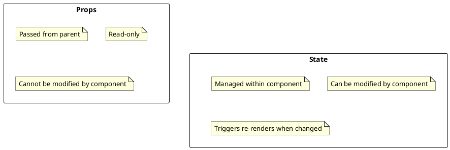
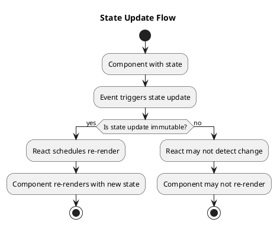

# Component State with TypeScript

State management is a fundamental aspect of React applications. This section explores how to effectively manage state in React components using TypeScript.

## Understanding Component State

State represents the data that can change over time in your application. React components use state to:

1. Store data that may change during the component's lifecycle
2. Trigger re-renders when the data changes
3. Maintain component-specific information

### State vs Props

Before diving into state management, let's clarify the difference between state and props:



- **Props**: Data passed from parent to child components (read-only)
- **State**: Data managed within a component (mutable)

## useState Hook

The `useState` hook is the primary way to add state to functional components in React.

### Basic Usage

```tsx
import React, { useState } from 'react';

function Counter() {
  // Declare a state variable named "count" with initial value 0
  const [count, setCount] = useState(0);

  return (
    <div>
      <p>You clicked {count} times</p>
      <button onClick={() => setCount(count + 1)}>
        Click me
      </button>
    </div>
  );
}
```

### useState with TypeScript

TypeScript enhances `useState` by providing type safety. There are two main ways to type your state:

#### 1. Type Inference

In many cases, TypeScript can infer the type from the initial value:

```tsx
// TypeScript infers count as number
const [count, setCount] = useState(0);

// TypeScript infers text as string
const [text, setText] = useState('');

// TypeScript infers isActive as boolean
const [isActive, setIsActive] = useState(false);
```

#### 2. Explicit Type Annotation

For more complex types or when the initial value might not reflect all possible values, use explicit type annotation:

```tsx
// Explicitly typing as number
const [count, setCount] = useState<number>(0);

// Explicitly typing as string | null
const [username, setUsername] = useState<string | null>(null);

// Explicitly typing as a custom type
interface User {
  id: number;
  name: string;
  email: string;
}

const [user, setUser] = useState<User | null>(null);
```

## Managing Complex State

For complex state objects, it's important to properly type and handle updates to maintain type safety.

### Object State

```tsx
interface FormState {
  username: string;
  email: string;
  password: string;
  isSubmitting: boolean;
}

function SignupForm() {
  const [form, setForm] = useState<FormState>({
    username: '',
    email: '',
    password: '',
    isSubmitting: false
  });

  const handleChange = (e: React.ChangeEvent<HTMLInputElement>) => {
    const { name, value } = e.target;
    
    // Update form state while preserving other fields
    setForm({
      ...form,
      [name]: value
    });
  };

  const handleSubmit = (e: React.FormEvent<HTMLFormElement>) => {
    e.preventDefault();
    setForm({
      ...form,
      isSubmitting: true
    });
    
    // Submission logic...
  };

  return (
    <form onSubmit={handleSubmit}>
      <input
        type="text"
        name="username"
        value={form.username}
        onChange={handleChange}
        placeholder="Username"
      />
      <input
        type="email"
        name="email"
        value={form.email}
        onChange={handleChange}
        placeholder="Email"
      />
      <input
        type="password"
        name="password"
        value={form.password}
        onChange={handleChange}
        placeholder="Password"
      />
      <button type="submit" disabled={form.isSubmitting}>
        {form.isSubmitting ? 'Submitting...' : 'Sign Up'}
      </button>
    </form>
  );
}
```

### Array State

```tsx
interface Todo {
  id: number;
  text: string;
  completed: boolean;
}

function TodoList() {
  const [todos, setTodos] = useState<Todo[]>([]);
  const [input, setInput] = useState('');

  const addTodo = () => {
    if (input.trim() === '') return;
    
    const newTodo: Todo = {
      id: Date.now(),
      text: input.trim(),
      completed: false
    };
    
    setTodos([...todos, newTodo]);
    setInput('');
  };

  const toggleTodo = (id: number) => {
    setTodos(
      todos.map(todo =>
        todo.id === id ? { ...todo, completed: !todo.completed } : todo
      )
    );
  };

  const removeTodo = (id: number) => {
    setTodos(todos.filter(todo => todo.id !== id));
  };

  return (
    <div>
      <div>
        <input
          type="text"
          value={input}
          onChange={e => setInput(e.target.value)}
          placeholder="Add a todo"
        />
        <button onClick={addTodo}>Add</button>
      </div>
      
      <ul>
        {todos.map(todo => (
          <li key={todo.id}>
            <span
              style={{
                textDecoration: todo.completed ? 'line-through' : 'none'
              }}
              onClick={() => toggleTodo(todo.id)}
            >
              {todo.text}
            </span>
            <button onClick={() => removeTodo(todo.id)}>Remove</button>
          </li>
        ))}
      </ul>
    </div>
  );
}
```

## State Updates and Immutability

In React, state updates should always be performed immutably. This is especially important when working with TypeScript to ensure type safety.



### Updating Primitive State

For primitive values, simply pass the new value to the state setter:

```tsx
const [count, setCount] = useState(0);

// Correct: direct update
setCount(count + 1);

// Correct: using function update
setCount(prevCount => prevCount + 1);
```

### Updating Object State

For objects, create a new object with the updated properties:

```tsx
interface User {
  name: string;
  age: number;
  email: string;
}

const [user, setUser] = useState<User>({
  name: 'John',
  age: 30,
  email: 'john@example.com'
});

// Correct: Create a new object with spread operator
setUser({
  ...user,
  age: 31
});

// Incorrect: Mutating the state directly
// user.age = 31; // Don't do this!
// setUser(user);
```

### Updating Array State

For arrays, use array methods that return new arrays:

```tsx
const [items, setItems] = useState<string[]>(['apple', 'banana']);

// Correct: Adding an item
setItems([...items, 'orange']);

// Correct: Removing an item
setItems(items.filter(item => item !== 'banana'));

// Correct: Updating an item
setItems(items.map(item => (item === 'apple' ? 'green apple' : item)));
```

## Functional Updates

When a state update depends on the previous state value, use the functional update form to avoid stale state issues:

```tsx
// Potentially problematic in async contexts:
setCount(count + 1);

// Safer approach using functional updates:
setCount(prevCount => prevCount + 1);
```

This is especially important in event handlers, timeouts, async functions, or any logic that might capture a stale state value.

### Example with Asynchronous Updates

```tsx
function Counter() {
  const [count, setCount] = useState(0);

  const handleDelayedIncrement = () => {
    // Delayed update
    setTimeout(() => {
      // Using functional update to ensure we have the latest state
      setCount(prevCount => prevCount + 1);
      
      // This might use stale state if count changed between click and timeout:
      // setCount(count + 1);
    }, 1000);
  };

  return (
    <div>
      <p>Count: {count}</p>
      <button onClick={() => setCount(count + 1)}>Increment</button>
      <button onClick={handleDelayedIncrement}>Delayed Increment</button>
    </div>
  );
}
```

## Multiple State Variables vs. Single Object

You can choose to manage related state either as multiple state variables or as a single object:

### Multiple State Variables

```tsx
function UserForm() {
  const [username, setUsername] = useState('');
  const [email, setEmail] = useState('');
  const [isValid, setIsValid] = useState(false);
  
  // Usage
  const handleUsernameChange = (e: React.ChangeEvent<HTMLInputElement>) => {
    setUsername(e.target.value);
  };
  
  // ...rest of component
}
```

### Single Object

```tsx
interface UserFormState {
  username: string;
  email: string;
  isValid: boolean;
}

function UserForm() {
  const [formState, setFormState] = useState<UserFormState>({
    username: '',
    email: '',
    isValid: false
  });
  
  // Usage
  const handleUsernameChange = (e: React.ChangeEvent<HTMLInputElement>) => {
    setFormState({
      ...formState,
      username: e.target.value
    });
  };
  
  // ...rest of component
}
```

**Guidelines for choosing:**

- Use multiple state variables for unrelated state items
- Use a single object for closely related state items
- Consider performance (object updates trigger a single re-render)
- Consider code readability and maintainability

## Example: Building a Counter Application

Let's build a complete counter application with TypeScript that demonstrates various state concepts:

```tsx
// src/components/Counter/Counter.tsx
import React, { useState } from 'react';
import './Counter.css';

interface CounterProps {
  initialCount?: number;
  step?: number;
  minValue?: number;
  maxValue?: number;
}

export function Counter({
  initialCount = 0,
  step = 1,
  minValue = Number.MIN_SAFE_INTEGER,
  maxValue = Number.MAX_SAFE_INTEGER
}: CounterProps) {
  // State
  const [count, setCount] = useState<number>(initialCount);
  const [incrementAmount, setIncrementAmount] = useState<number>(step);
  
  // Derived state
  const isMinimum = count <= minValue;
  const isMaximum = count >= maxValue;
  
  // Event handlers
  const increment = () => {
    if (count + incrementAmount <= maxValue) {
      setCount(prevCount => prevCount + incrementAmount);
    } else {
      setCount(maxValue);
    }
  };
  
  const decrement = () => {
    if (count - incrementAmount >= minValue) {
      setCount(prevCount => prevCount - incrementAmount);
    } else {
      setCount(minValue);
    }
  };
  
  const reset = () => {
    setCount(initialCount);
  };
  
  const handleIncrementAmountChange = (e: React.ChangeEvent<HTMLInputElement>) => {
    const value = parseInt(e.target.value, 10);
    setIncrementAmount(isNaN(value) ? 1 : value);
  };
  
  return (
    <div className="counter">
      <div className="counter-display">
        <span data-testid="count-value">{count}</span>
      </div>
      
      <div className="counter-controls">
        <button 
          onClick={decrement}
          disabled={isMinimum}
          data-testid="decrement-button"
        >
          -
        </button>
        
        <button 
          onClick={increment}
          disabled={isMaximum}
          data-testid="increment-button"
        >
          +
        </button>
      </div>
      
      <div className="counter-settings">
        <label>
          Step Size:
          <input 
            type="number" 
            min="1"
            value={incrementAmount}
            onChange={handleIncrementAmountChange}
            data-testid="step-input"
          />
        </label>
        
        <button 
          onClick={reset}
          data-testid="reset-button"
        >
          Reset
        </button>
      </div>
    </div>
  );
}
```

### CSS for the Counter Component

```css
/* src/components/Counter/Counter.css */
.counter {
  display: flex;
  flex-direction: column;
  align-items: center;
  padding: 20px;
  border-radius: 8px;
  background-color: #f8f9fa;
  box-shadow: 0 2px 5px rgba(0, 0, 0, 0.1);
  width: 300px;
  margin: 0 auto;
}

.counter-display {
  font-size: 3rem;
  padding: 20px 0;
  width: 100%;
  text-align: center;
  border-bottom: 1px solid #e0e0e0;
  margin-bottom: 20px;
}

.counter-controls {
  display: flex;
  width: 100%;
  justify-content: space-between;
  margin-bottom: 20px;
}

.counter-controls button {
  width: 48%;
  height: 50px;
  font-size: 1.5rem;
  background-color: #007bff;
  color: white;
  border: none;
  border-radius: 4px;
  cursor: pointer;
}

.counter-controls button:disabled {
  background-color: #cccccc;
  cursor: not-allowed;
}

.counter-settings {
  width: 100%;
  display: flex;
  flex-direction: column;
  gap: 10px;
}

.counter-settings label {
  display: flex;
  justify-content: space-between;
  align-items: center;
  margin-bottom: 10px;
}

.counter-settings input {
  width: 60px;
  padding: 5px;
  font-size: 1rem;
}

.counter-settings button {
  padding: 10px;
  background-color: #6c757d;
  color: white;
  border: none;
  border-radius: 4px;
  cursor: pointer;
}
```

### Unit Testing the Counter Component

```tsx
// src/components/Counter/Counter.test.tsx
import React from 'react';
import { render, screen, fireEvent } from '@testing-library/react';
import { Counter } from './Counter';

describe('Counter Component', () => {
  // Test 1: Renders with default values
  test('renders with initial count of 0', () => {
    render(<Counter />);
    expect(screen.getByTestId('count-value')).toHaveTextContent('0');
  });

  // Test 2: Renders with custom initial count
  test('renders with custom initial count', () => {
    render(<Counter initialCount={10} />);
    expect(screen.getByTestId('count-value')).toHaveTextContent('10');
  });

  // Test 3: Increments count when increment button is clicked
  test('increments count when increment button is clicked', () => {
    render(<Counter />);
    const incrementButton = screen.getByTestId('increment-button');
    
    fireEvent.click(incrementButton);
    expect(screen.getByTestId('count-value')).toHaveTextContent('1');
    
    fireEvent.click(incrementButton);
    expect(screen.getByTestId('count-value')).toHaveTextContent('2');
  });

  // Test 4: Decrements count when decrement button is clicked
  test('decrements count when decrement button is clicked', () => {
    render(<Counter initialCount={5} />);
    const decrementButton = screen.getByTestId('decrement-button');
    
    fireEvent.click(decrementButton);
    expect(screen.getByTestId('count-value')).toHaveTextContent('4');
    
    fireEvent.click(decrementButton);
    expect(screen.getByTestId('count-value')).toHaveTextContent('3');
  });

  // Test 5: Resets counter to initial value
  test('resets counter to initial value', () => {
    render(<Counter initialCount={5} />);
    const incrementButton = screen.getByTestId('increment-button');
    const resetButton = screen.getByTestId('reset-button');
    
    fireEvent.click(incrementButton); // 6
    fireEvent.click(incrementButton); // 7
    expect(screen.getByTestId('count-value')).toHaveTextContent('7');
    
    fireEvent.click(resetButton);
    expect(screen.getByTestId('count-value')).toHaveTextContent('5');
  });

  // Test 6: Changes increment amount
  test('changes increment amount', () => {
    render(<Counter />);
    const incrementButton = screen.getByTestId('increment-button');
    const stepInput = screen.getByTestId('step-input');
    
    // Change step to 5
    fireEvent.change(stepInput, { target: { value: '5' } });
    
    fireEvent.click(incrementButton);
    expect(screen.getByTestId('count-value')).toHaveTextContent('5');
    
    fireEvent.click(incrementButton);
    expect(screen.getByTestId('count-value')).toHaveTextContent('10');
  });

  // Test 7: Respects minimum value
  test('respects minimum value constraint', () => {
    render(<Counter initialCount={2} minValue={0} />);
    const decrementButton = screen.getByTestId('decrement-button');
    
    fireEvent.click(decrementButton); // 1
    expect(screen.getByTestId('count-value')).toHaveTextContent('1');
    
    fireEvent.click(decrementButton); // 0
    expect(screen.getByTestId('count-value')).toHaveTextContent('0');
    
    // Should not go below min
    fireEvent.click(decrementButton);
    expect(screen.getByTestId('count-value')).toHaveTextContent('0');
    expect(decrementButton).toBeDisabled();
  });

  // Test 8: Respects maximum value
  test('respects maximum value constraint', () => {
    render(<Counter initialCount={8} maxValue={10} />);
    const incrementButton = screen.getByTestId('increment-button');
    
    fireEvent.click(incrementButton); // 9
    expect(screen.getByTestId('count-value')).toHaveTextContent('9');
    
    fireEvent.click(incrementButton); // 10
    expect(screen.getByTestId('count-value')).toHaveTextContent('10');
    
    // Should not go above max
    fireEvent.click(incrementButton);
    expect(screen.getByTestId('count-value')).toHaveTextContent('10');
    expect(incrementButton).toBeDisabled();
  });
});
```

## Common Pitfalls and Best Practices

### 1. State Updates Are Asynchronous

Don't rely on the state value being updated immediately after calling the setter:

```tsx
// Problematic:
setCount(count + 1);
console.log(count); // May still show the old value

// If you need to use the new value right away:
setCount(prevCount => {
  const newCount = prevCount + 1;
  // Do something with newCount
  return newCount;
});

// Or use useEffect to respond to state changes:
useEffect(() => {
  console.log('Count updated:', count);
}, [count]);
```

### 2. Stale Closures in Event Handlers

Event handlers capture state values at render time, which can lead to stale values:

```tsx
// Potential stale closure issue in async handlers
const handleDelayedAction = () => {
  setTimeout(() => {
    // count might be stale here
    console.log(count);
  }, 1000);
};

// Fix with functional updates
const handleSafeAction = () => {
  setTimeout(() => {
    setCount(currentCount => {
      console.log(currentCount); // Will have the current value
      return currentCount + 1;
    });
  }, 1000);
};
```

### 3. Over-complicated State

Avoid creating overly complex state objects when simpler structures will do:

```tsx
// Often too complex
const [state, setState] = useState({
  user: { name: '', email: '' },
  ui: { isLoading: false, activeTab: 'profile' },
  form: { values: {}, errors: {} }
});

// Better separation of concerns
const [user, setUser] = useState({ name: '', email: '' });
const [isLoading, setIsLoading] = useState(false);
const [activeTab, setActiveTab] = useState('profile');
const [formValues, setFormValues] = useState({});
const [formErrors, setFormErrors] = useState({});
```

### 4. Type Safety with useState

Always provide proper TypeScript types for your state, especially for:
- Empty arrays: `useState<string[]>([])` instead of just `useState([])`
- Initially null/undefined values: `useState<User | null>(null)`
- Complex objects: Use interfaces or types to define their structure

## Advanced State Management Patterns

For more complex state management needs, consider:

1. **useReducer**: For complex state logic (covered in a later section)
2. **Context API**: For sharing state across components (covered in a later section)
3. **State management libraries**: Redux, MobX, Jotai, Recoil, Zustand (covered in later sections)

## Conclusion

In this section, we've explored how to effectively manage state in React components using TypeScript. We've covered:

- Basic state management with `useState`
- Typing state correctly with TypeScript
- Managing complex state objects and arrays
- Immutable state updates
- Functional updates to avoid stale state
- Testing state management

In the next section, we'll dive into component lifecycle and the `useEffect` hook to handle side effects in functional components.
