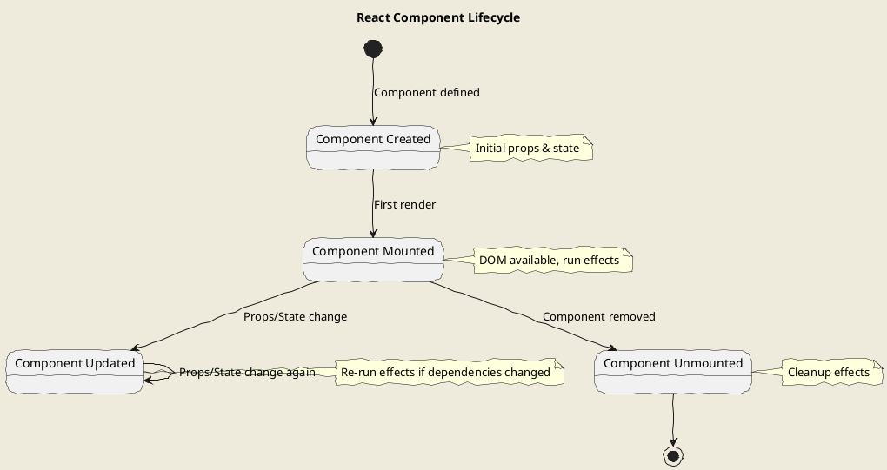
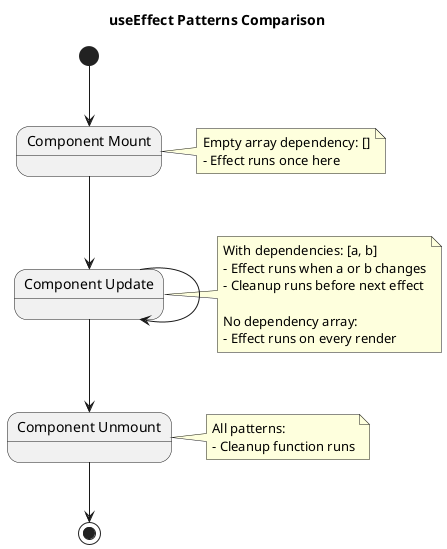
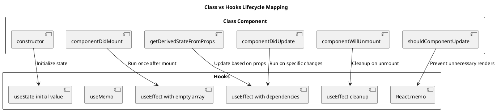
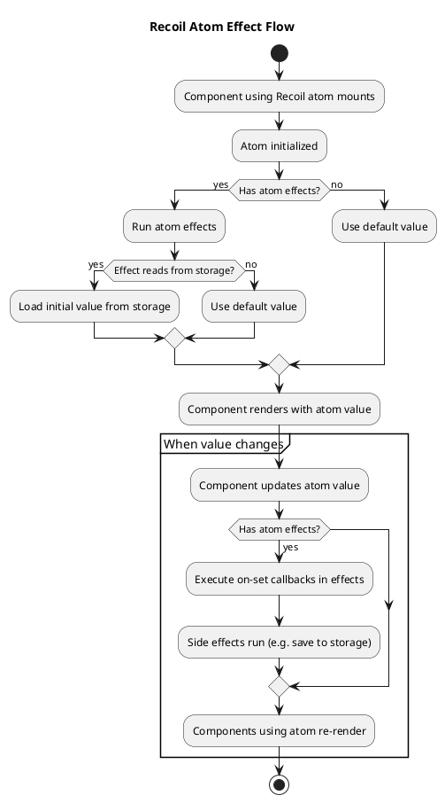
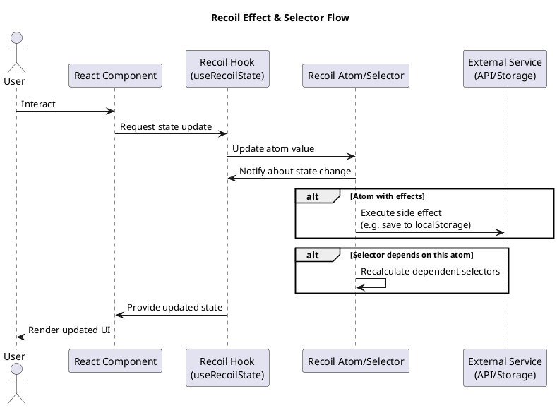
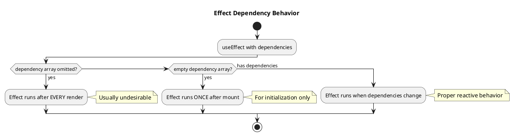

# Lifecycle and Effects in React with TypeScript

React components go through a series of lifecycle phases - they're created (mounted), updated, and eventually removed (unmounted). In class components, these phases were handled with specific lifecycle methods. In functional components, the `useEffect` hook handles these lifecycle events and side effects.

## Component Lifecycle Overview

The React component lifecycle can be visualized as follows:



## Understanding Side Effects

Side effects in React components include:
- Data fetching
- DOM manipulation
- Subscription management
- Timers and intervals
- Logging
- Integration with third-party libraries

In functional components, these effects are handled with the `useEffect` hook.

## The useEffect Hook

`useEffect` lets you perform side effects in functional components. It runs after render, ensuring the DOM has been updated.

### Basic Syntax

```tsx
useEffect(() => {
  // Effect code - runs after render
  
  return () => {
    // Optional cleanup - runs before next effect or unmount
  };
}, [/* dependencies */]);
```

### With TypeScript

TypeScript helps ensure your effects and their dependencies are properly typed:

```tsx
import React, { useEffect, useState } from 'react';

function Timer() {
  const [seconds, setSeconds] = useState<number>(0);
  
  useEffect(() => {
    const interval = setInterval(() => {
      setSeconds(prev => prev + 1);
    }, 1000);
    
    // TypeScript ensures this returns a cleanup function or undefined
    return () => {
      clearInterval(interval);
    };
  }, []); // Empty dependency array - runs once on mount
  
  return <div>Timer: {seconds} seconds</div>;
}
```

## Different useEffect Patterns

### 1. Running Once on Mount

To run an effect only once when the component mounts (similar to `componentDidMount`), use an empty dependency array:

```tsx
useEffect(() => {
  console.log('Component mounted');
  // Initialize something, fetch initial data, etc.
  
  return () => {
    console.log('Component will unmount');
    // Cleanup resources
  };
}, []);
```

### 2. Running on Every Render

To run an effect after every render, omit the dependency array:

```tsx
useEffect(() => {
  console.log('Component rendered');
  // Not recommended for most cases due to performance concerns
});
```

### 3. Running When Dependencies Change

To run an effect when specific values change, include them in the dependency array:

```tsx
useEffect(() => {
  console.log(`User ID changed to: ${userId}`);
  // Update something based on userId
}, [userId]);
```

### 4. Cleanup Function

Effects can return a cleanup function that runs before the next effect execution or when the component unmounts:

```tsx
useEffect(() => {
  const subscription = subscribeToData(userId);
  
  // Cleanup function
  return () => {
    subscription.unsubscribe();
  };
}, [userId]);
```

## TypeScript with useEffect

TypeScript helps catch common mistakes with `useEffect`:

### 1. Type Checking Dependencies

TypeScript ensures your dependency array includes all values referenced in your effect:

```tsx
// TypeScript will warn if userId is used inside but not listed in dependencies
useEffect(() => {
  fetchUserData(userId);
}, []); // Missing dependency warning
```

### 2. Event Listener Types

```tsx
useEffect(() => {
  // Type-safe event listener
  const handleResize = (event: UIEvent) => {
    setWindowWidth(window.innerWidth);
  };
  
  window.addEventListener('resize', handleResize);
  
  return () => {
    window.removeEventListener('resize', handleResize);
  };
}, []);
```

### 3. Async Effects

`useEffect` callbacks cannot be directly async, but you can define async functions inside:

```tsx
interface User {
  id: number;
  name: string;
  email: string;
}

const UserProfile: React.FC<{ userId: number }> = ({ userId }) => {
  const [user, setUser] = useState<User | null>(null);
  const [loading, setLoading] = useState<boolean>(false);
  const [error, setError] = useState<string | null>(null);
  
  useEffect(() => {
    // Define async function inside useEffect
    const fetchUser = async () => {
      setLoading(true);
      setError(null);
      
      try {
        const response = await fetch(`/api/users/${userId}`);
        
        if (!response.ok) {
          throw new Error('Failed to fetch user data');
        }
        
        const userData: User = await response.json();
        setUser(userData);
      } catch (err) {
        setError(err instanceof Error ? err.message : 'An error occurred');
        setUser(null);
      } finally {
        setLoading(false);
      }
    };
    
    // Call the async function
    fetchUser();
    
    // Optional cleanup
    return () => {
      // Cancel any pending requests if needed
    };
  }, [userId]);
  
  if (loading) return <div>Loading...</div>;
  if (error) return <div>Error: {error}</div>;
  if (!user) return <div>No user data</div>;
  
  return (
    <div>
      <h2>{user.name}</h2>
      <p>Email: {user.email}</p>
    </div>
  );
};
```

## Common useEffect Scenarios

### 1. Data Fetching

```tsx
interface Post {
  id: number;
  title: string;
  body: string;
}

function PostList() {
  const [posts, setPosts] = useState<Post[]>([]);
  const [loading, setLoading] = useState<boolean>(true);
  const [error, setError] = useState<string | null>(null);
  
  useEffect(() => {
    const fetchPosts = async () => {
      try {
        const response = await fetch('https://jsonplaceholder.typicode.com/posts');
        
        if (!response.ok) {
          throw new Error(`HTTP error: ${response.status}`);
        }
        
        const data: Post[] = await response.json();
        setPosts(data);
      } catch (err) {
        setError(err instanceof Error ? err.message : 'Failed to fetch posts');
      } finally {
        setLoading(false);
      }
    };
    
    fetchPosts();
  }, []);
  
  if (loading) return <div>Loading posts...</div>;
  if (error) return <div>Error: {error}</div>;
  
  return (
    <div>
      <h1>Posts</h1>
      <ul>
        {posts.map(post => (
          <li key={post.id}>
            <h3>{post.title}</h3>
            <p>{post.body}</p>
          </li>
        ))}
      </ul>
    </div>
  );
}
```

### 2. Subscription Management

```tsx
interface Message {
  id: string;
  text: string;
  timestamp: number;
}

function LiveChat({ chatId }: { chatId: string }) {
  const [messages, setMessages] = useState<Message[]>([]);
  
  useEffect(() => {
    // Setup chat connection
    console.log(`Connecting to chat: ${chatId}`);
    const connection = createChatConnection(chatId);
    
    // Subscribe to new messages
    const unsubscribe = connection.subscribe((newMessage: Message) => {
      setMessages(prevMessages => [...prevMessages, newMessage]);
    });
    
    // Cleanup on unmount or chatId change
    return () => {
      console.log(`Disconnecting from chat: ${chatId}`);
      unsubscribe();
      connection.close();
    };
  }, [chatId]); // Reconnect if chatId changes
  
  return (
    <div className="chat-container">
      <h2>Live Chat: {chatId}</h2>
      <div className="messages">
        {messages.map(msg => (
          <div key={msg.id} className="message">
            <span>{new Date(msg.timestamp).toLocaleTimeString()}: </span>
            <span>{msg.text}</span>
          </div>
        ))}
      </div>
    </div>
  );
}

// Mock function (in a real app, this would connect to a real chat service)
function createChatConnection(chatId: string) {
  return {
    subscribe: (callback: (msg: Message) => void) => {
      // In a real app, this would set up WebSocket listeners etc.
      const interval = setInterval(() => {
        const newMsg: Message = {
          id: Math.random().toString(36).substring(7),
          text: `Random message in chat ${chatId}`,
          timestamp: Date.now()
        };
        callback(newMsg);
      }, 3000);
      
      return () => clearInterval(interval);
    },
    close: () => {
      // Close connection logic
      console.log("Connection closed");
    }
  };
}
```

### 3. DOM Manipulation

```tsx
function ResizeObserver() {
  const divRef = useRef<HTMLDivElement>(null);
  const [dimensions, setDimensions] = useState({ width: 0, height: 0 });
  
  useEffect(() => {
    if (!divRef.current) return;
    
    const element = divRef.current;
    
    // Create ResizeObserver to monitor element size
    const resizeObserver = new ResizeObserver(entries => {
      for (const entry of entries) {
        const { width, height } = entry.contentRect;
        setDimensions({ width, height });
      }
    });
    
    // Start observing
    resizeObserver.observe(element);
    
    // Cleanup function to stop observing
    return () => {
      resizeObserver.unobserve(element);
      resizeObserver.disconnect();
    };
  }, []);
  
  return (
    <div>
      <div 
        ref={divRef}
        style={{ 
          width: '100%', 
          height: '200px', 
          backgroundColor: 'lightblue',
          resize: 'both',
          overflow: 'auto'
        }}
      >
        Resize me!
      </div>
      <p>
        Current dimensions: {dimensions.width}px × {dimensions.height}px
      </p>
    </div>
  );
}
```

### 4. Timers and Intervals

```tsx
interface CountdownProps {
  seconds: number;
  onComplete?: () => void;
}

function Countdown({ seconds, onComplete }: CountdownProps) {
  const [timeLeft, setTimeLeft] = useState<number>(seconds);
  
  useEffect(() => {
    // Reset timer if seconds prop changes
    setTimeLeft(seconds);
  }, [seconds]);
  
  useEffect(() => {
    if (timeLeft <= 0) {
      if (onComplete) {
        onComplete();
      }
      return;
    }
    
    const timer = setInterval(() => {
      setTimeLeft(prev => prev - 1);
    }, 1000);
    
    return () => clearInterval(timer);
  }, [timeLeft, onComplete]);
  
  // Format time as mm:ss
  const formatTime = (time: number): string => {
    const minutes = Math.floor(time / 60);
    const seconds = time % 60;
    return `${minutes.toString().padStart(2, '0')}:${seconds.toString().padStart(2, '0')}`;
  };
  
  return (
    <div className="countdown">
      <div className="countdown-time">{formatTime(timeLeft)}</div>
      <progress max={seconds} value={timeLeft} />
    </div>
  );
}
```

## Example: Building a Data Fetching Component

Let's build a complete data fetching component with proper loading, error handling, and TypeScript typing:

```tsx
// src/components/DataFetcher/DataFetcher.tsx
import React, { useEffect, useState } from 'react';
import './DataFetcher.css';

// Generic type for fetched data
interface FetcherProps<T> {
  url: string;
  renderItem: (item: T) => React.ReactNode;
  renderEmpty?: () => React.ReactNode;
  loadingComponent?: React.ReactNode;
  errorComponent?: (error: string) => React.ReactNode;
}

export function DataFetcher<T>({
  url,
  renderItem,
  renderEmpty = () => <div className="empty-message">No items found</div>,
  loadingComponent = <div className="loading">Loading...</div>,
  errorComponent = (error) => <div className="error">Error: {error}</div>
}: FetcherProps<T>) {
  const [data, setData] = useState<T[]>([]);
  const [loading, setLoading] = useState<boolean>(true);
  const [error, setError] = useState<string | null>(null);
  
  useEffect(() => {
    // Reset state when URL changes
    setLoading(true);
    setError(null);
    
    const abortController = new AbortController();
    
    const fetchData = async () => {
      try {
        const response = await fetch(url, { 
          signal: abortController.signal 
        });
        
        if (!response.ok) {
          throw new Error(`HTTP error: ${response.status}`);
        }
        
        const result = await response.json();
        setData(result);
      } catch (err) {
        if (!(err instanceof DOMException && err.name === 'AbortError')) {
          setError(err instanceof Error ? err.message : 'An error occurred');
        }
      } finally {
        setLoading(false);
      }
    };
    
    fetchData();
    
    // Cleanup function - abort fetch if component unmounts or URL changes
    return () => {
      abortController.abort();
    };
  }, [url]);
  
  if (loading) return <>{loadingComponent}</>;
  if (error) return <>{errorComponent(error)}</>;
  if (data.length === 0) return <>{renderEmpty()}</>;
  
  return (
    <div className="data-fetcher">
      {data.map((item, index) => (
        <div key={index} className="data-item">
          {renderItem(item)}
        </div>
      ))}
    </div>
  );
}
```

### CSS for the DataFetcher Component

```css
/* src/components/DataFetcher/DataFetcher.css */
.data-fetcher {
  display: flex;
  flex-direction: column;
  gap: 16px;
}

.data-item {
  padding: 16px;
  background-color: #f8f9fa;
  border-radius: 8px;
  box-shadow: 0 2px 4px rgba(0, 0, 0, 0.1);
}

.loading {
  display: flex;
  justify-content: center;
  padding: 20px;
  font-size: 18px;
  color: #6c757d;
}

.error {
  padding: 16px;
  background-color: #f8d7da;
  color: #721c24;
  border-radius: 4px;
  margin: 16px 0;
}

.empty-message {
  padding: 20px;
  text-align: center;
  color: #6c757d;
  background-color: #f8f9fa;
  border-radius: 8px;
}
```

### Using the DataFetcher Component

```tsx
// Example usage
interface User {
  id: number;
  name: string;
  email: string;
  website: string;
}

function UserList() {
  return (
    <div className="user-list-container">
      <h1>Users</h1>
      <DataFetcher<User>
        url="https://jsonplaceholder.typicode.com/users"
        renderItem={(user) => (
          <div className="user-card">
            <h3>{user.name}</h3>
            <p>Email: {user.email}</p>
            <p>Website: {user.website}</p>
          </div>
        )}
        loadingComponent={
          <div className="custom-loading">
            <p>Loading users...</p>
            <div className="spinner"></div>
          </div>
        }
      />
    </div>
  );
}
```

### Unit Testing the DataFetcher Component

```tsx
// src/components/DataFetcher/DataFetcher.test.tsx
import React from 'react';
import { render, screen, waitFor } from '@testing-library/react';
import { DataFetcher } from './DataFetcher';
import { rest } from 'msw';
import { setupServer } from 'msw/node';

// Mock data
interface TestItem {
  id: number;
  name: string;
}

const testData: TestItem[] = [
  { id: 1, name: 'Item 1' },
  { id: 2, name: 'Item 2' },
  { id: 3, name: 'Item 3' }
];

// Setup mock server
const server = setupServer(
  rest.get('/test-api', (req, res, ctx) => {
    return res(ctx.json(testData));
  }),
  
  rest.get('/empty-api', (req, res, ctx) => {
    return res(ctx.json([]));
  }),
  
  rest.get('/error-api', (req, res, ctx) => {
    return res(ctx.status(500), ctx.json({ message: 'Server error' }));
  })
);

beforeAll(() => server.listen());
afterEach(() => server.resetHandlers());
afterAll(() => server.close());

describe('DataFetcher Component', () => {
  // Test 1: Loading state
  test('displays loading state initially', () => {
    render(
      <DataFetcher<TestItem>
        url="/test-api"
        renderItem={(item) => <div>{item.name}</div>}
      />
    );
    
    expect(screen.getByText('Loading...')).toBeInTheDocument();
  });

  // Test 2: Successful data fetching
  test('renders items when data is loaded successfully', async () => {
    render(
      <DataFetcher<TestItem>
        url="/test-api"
        renderItem={(item) => <div data-testid={`item-${item.id}`}>{item.name}</div>}
      />
    );
    
    await waitFor(() => {
      expect(screen.getByTestId('item-1')).toBeInTheDocument();
      expect(screen.getByTestId('item-2')).toBeInTheDocument();
      expect(screen.getByTestId('item-3')).toBeInTheDocument();
    });
    
    expect(screen.getByText('Item 1')).toBeInTheDocument();
    expect(screen.getByText('Item 2')).toBeInTheDocument();
    expect(screen.getByText('Item 3')).toBeInTheDocument();
  });

  // Test 3: Empty data
  test('displays empty message when no items are returned', async () => {
    render(
      <DataFetcher<TestItem>
        url="/empty-api"
        renderItem={(item) => <div>{item.name}</div>}
      />
    );
    
    await waitFor(() => {
      expect(screen.getByText('No items found')).toBeInTheDocument();
    });
  });

  // Test 4: Custom empty message
  test('displays custom empty component when provided', async () => {
    render(
      <DataFetcher<TestItem>
        url="/empty-api"
        renderItem={(item) => <div>{item.name}</div>}
        renderEmpty={() => <div>Custom empty message</div>}
      />
    );
    
    await waitFor(() => {
      expect(screen.getByText('Custom empty message')).toBeInTheDocument();
    });
  });

  // Test 5: Error handling
  test('displays error message when fetch fails', async () => {
    render(
      <DataFetcher<TestItem>
        url="/error-api"
        renderItem={(item) => <div>{item.name}</div>}
      />
    );
    
    await waitFor(() => {
      expect(screen.getByText(/Error:/)).toBeInTheDocument();
    });
  });

  // Test 6: Custom loading component
  test('displays custom loading component when provided', () => {
    render(
      <DataFetcher<TestItem>
        url="/test-api"
        renderItem={(item) => <div>{item.name}</div>}
        loadingComponent={<div>Custom loading...</div>}
      />
    );
    
    expect(screen.getByText('Custom loading...')).toBeInTheDocument();
  });
});
```

## Comparing Effect Approaches

Different approaches to managing effects have their own advantages and disadvantages. Here's a comparison to help you choose the right approach for your use case:

### Comparing useEffect Patterns

| Approach | Usage | Pros | Cons | When to Use |
|---------|-------|------|------|-------------|
| Empty dependency array `[]` | Run once on mount | Simple, clear purpose | Can't react to prop/state changes | For initialization, one-time setup |
| Dependencies `[a, b]` | Run when values change | Reactive, updates in sync with dependencies | Can trigger multiple rerenders | For effects that depend on specific values |
| No dependency array | Run on every render | Always up-to-date | Performance concerns, potential infinite loops | Rarely - only when effect must run on every render |
| Cleanup function | Cleanup before next effect or unmount | Prevents memory leaks, ensures proper resource management | Extra code complexity | Always when subscribing, setting timers, or adding listeners |



### Class-based vs Hooks Approach

| Feature | Class Components | Functional Components + Hooks |
|---------|-----------------|------------------------------|
| Code organization | Lifecycle methods grouped by phase | Effects grouped by concern |
| Mental model | OOP with this binding | Functional with closures |
| Bundle size | Larger | Usually smaller |
| Optimization | shouldComponentUpdate | React.memo + useMemo + useCallback |
| TypeScript integration | More verbose typing | Better type inference |



## Using Effects with Recoil

[Recoil](https://recoiljs.org/) is a state management library for React that provides a way to create and manage global state atoms. When using Recoil with effects, there are several patterns to consider.

### Setting Up Recoil

First, install and set up Recoil:

```bash
npm install recoil
```

```tsx
// src/App.tsx
import React from 'react';
import { RecoilRoot } from 'recoil';

const App: React.FC = () => {
  return (
    <RecoilRoot>
      {/* Your app components */}
    </RecoilRoot>
  );
};
```

### Basic Recoil Atoms and Effects

```tsx
// atoms.ts
import { atom } from 'recoil';

export const counterState = atom({
  key: 'counterState',
  default: 0,
});

export const userState = atom<{
  id: number;
  name: string;
} | null>({
  key: 'userState',
  default: null,
});
```

```tsx
// UserProfile.tsx
import React, { useEffect } from 'react';
import { useRecoilState } from 'recoil';
import { userState } from './atoms';

interface UserProfileProps {
  userId: number;
}

export function UserProfile({ userId }: UserProfileProps) {
  const [user, setUser] = useRecoilState(userState);
  
  // Effect to fetch user data when userId changes
  useEffect(() => {
    const fetchUser = async () => {
      try {
        const response = await fetch(`/api/users/${userId}`);
        const userData = await response.json();
        setUser(userData);
      } catch (error) {
        console.error('Error fetching user:', error);
        setUser(null);
      }
    };
    
    fetchUser();
    
    // Cleanup: reset user when component unmounts or userId changes
    return () => {
      setUser(null);
    };
  }, [userId, setUser]);
  
  if (!user) return <div>Loading user...</div>;
  
  return (
    <div>
      <h2>{user.name}</h2>
      <p>User ID: {user.id}</p>
    </div>
  );
}
```

### Recoil Atom Effects

Atom effects are a powerful way to add side effects directly to atoms:

```tsx
// atomsWithEffects.ts
import { atom, AtomEffect } from 'recoil';

// Persist atom to localStorage
const localStorageEffect: <T>(key: string) => AtomEffect<T> = 
  (key) => ({ setSelf, onSet }) => {
    const savedValue = localStorage.getItem(key);
    if (savedValue != null) {
      setSelf(JSON.parse(savedValue));
    }
    
    onSet((newValue, _, isReset) => {
      if (isReset) {
        localStorage.removeItem(key);
      } else {
        localStorage.setItem(key, JSON.stringify(newValue));
      }
    });
  };

// Define atom with effect
export const persistedCounterState = atom({
  key: 'persistedCounterState',
  default: 0,
  effects: [
    localStorageEffect('persisted_counter')
  ]
});
```



### Async Recoil Selectors with Effects

```tsx
// asyncSelectors.ts
import { atom, selector, selectorFamily } from 'recoil';

// Current user ID
export const currentUserIdState = atom({
  key: 'currentUserIdState',
  default: 1
});

// Async selector that fetches user data
export const userQuery = selectorFamily({
  key: 'userQuery',
  get: (userId: number) => async () => {
    const response = await fetch(`https://jsonplaceholder.typicode.com/users/${userId}`);
    
    if (!response.ok) {
      throw new Error('Failed to fetch user');
    }
    
    return response.json();
  }
});

// Selector that depends on currentUserIdState
export const currentUserQuery = selector({
  key: 'currentUserQuery',
  get: ({ get }) => {
    const userId = get(currentUserIdState);
    return get(userQuery(userId));
  }
});
```

```tsx
// UserDataComponent.tsx
import React from 'react';
import { useRecoilState, useRecoilValue } from 'recoil';
import { currentUserIdState, currentUserQuery } from './asyncSelectors';

export function UserDataComponent() {
  const [userId, setUserId] = useRecoilState(currentUserIdState);
  // This will trigger async fetch when rendered
  const userData = useRecoilValue(currentUserQuery);
  
  return (
    <div>
      <div>
        <label>
          User ID: 
          <select 
            value={userId} 
            onChange={(e) => setUserId(Number(e.target.value))}
          >
            {[1, 2, 3, 4, 5].map(id => (
              <option key={id} value={id}>User {id}</option>
            ))}
          </select>
        </label>
      </div>
      
      <div>
        <h2>{userData.name}</h2>
        <p>Email: {userData.email}</p>
        <p>Phone: {userData.phone}</p>
      </div>
    </div>
  );
}
```

### Understanding Recoil Effect Flow



### Unit Testing with Recoil

Testing components that use Recoil requires wrapping them in a `RecoilRoot`:

```tsx
// UserComponent.test.tsx
import React from 'react';
import { render, screen, act } from '@testing-library/react';
import { RecoilRoot } from 'recoil';
import { UserProfile } from './UserProfile';

// Mock fetch API
global.fetch = jest.fn();

describe('UserProfile Component with Recoil', () => {
  beforeEach(() => {
    jest.clearAllMocks();
  });
  
  test('fetches and displays user data', async () => {
    // Mock successful API response
    (global.fetch as jest.Mock).mockResolvedValueOnce({
      ok: true,
      json: async () => ({ id: 1, name: 'Test User' }),
    });
    
    // Render with RecoilRoot
    render(
      <RecoilRoot>
        <UserProfile userId={1} />
      </RecoilRoot>
    );
    
    // Initial loading state
    expect(screen.getByText(/loading user/i)).toBeInTheDocument();
    
    // Wait for user data to load
    await screen.findByText('Test User');
    
    // Verify API was called correctly
    expect(global.fetch).toHaveBeenCalledWith('/api/users/1');
    expect(screen.getByText('User ID: 1')).toBeInTheDocument();
  });
  
  test('handles API error', async () => {
    // Mock API error
    (global.fetch as jest.Mock).mockRejectedValueOnce(new Error('API error'));
    
    render(
      <RecoilRoot>
        <UserProfile userId={1} />
      </RecoilRoot>
    );
    
    // Should show loading initially
    expect(screen.getByText(/loading user/i)).toBeInTheDocument();
    
    // Should still show loading after failed fetch
    // (since our component keeps showing loading on error)
    await act(async () => {
      await new Promise(resolve => setTimeout(resolve, 0));
    });
    
    expect(screen.getByText(/loading user/i)).toBeInTheDocument();
  });
});
```

### Testing Atom Effects

Testing atom effects requires a different approach:

```tsx
// atomEffects.test.ts
import { renderHook, act } from '@testing-library/react-hooks';
import { RecoilRoot, useRecoilState } from 'recoil';
import { persistedCounterState } from './atomsWithEffects';

describe('Persisted Counter Atom', () => {
  // Mock localStorage
  const localStorageMock = (() => {
    let store: Record<string, string> = {};
    
    return {
      getItem: jest.fn((key: string) => store[key] || null),
      setItem: jest.fn((key: string, value: string) => {
        store[key] = value;
      }),
      removeItem: jest.fn((key: string) => {
        delete store[key];
      }),
      clear: jest.fn(() => {
        store = {};
      }),
    };
  })();
  
  Object.defineProperty(window, 'localStorage', {
    value: localStorageMock
  });
  
  beforeEach(() => {
    localStorageMock.clear();
    jest.clearAllMocks();
  });
  
  test('loads initial value from localStorage if available', () => {
    // Setup localStorage with initial value
    localStorageMock.setItem('persisted_counter', '42');
    
    // Render hook with RecoilRoot
    const { result } = renderHook(() => useRecoilState(persistedCounterState), {
      wrapper: ({ children }) => <RecoilRoot>{children}</RecoilRoot>
    });
    
    // Verify initial value was loaded from localStorage
    expect(result.current[0]).toBe(42);
  });
  
  test('saves to localStorage when value changes', () => {
    const { result } = renderHook(() => useRecoilState(persistedCounterState), {
      wrapper: ({ children }) => <RecoilRoot>{children}</RecoilRoot>
    });
    
    // Initial value should be default
    expect(result.current[0]).toBe(0);
    
    // Update value
    act(() => {
      result.current[1](10);
    });
    
    // Verify value was saved to localStorage
    expect(localStorageMock.setItem).toHaveBeenCalledWith(
      'persisted_counter', 
      '10'
    );
  });
});
```

## Common Pitfalls and Best Practices

### 1. The Dependency Array

The dependency array is crucial for proper `useEffect` behavior. Common issues include:



**Common mistakes:**
- **Missing dependencies**: Causes stale closures and bugs
- **Unnecessary dependencies**: Causes too many effect runs
- **Object or array dependencies**: Creates new references on each render, causing effect to run constantly

**Solutions:**
- Use the ESLint plugin `eslint-plugin-react-hooks` with the `exhaustive-deps` rule
- Restructure your effect to avoid problematic dependencies
- Use primitive values as dependencies when possible
- Use useCallback/useMemo for function/object dependencies

### 2. Infinite Loops

```tsx
// DON'T DO THIS: Creates infinite render loop
const [data, setData] = useState([]);

useEffect(() => {
  // This runs after every render
  // And it updates state, which causes another render
  setData([...data, 'new item']);
}, [data]); // data is a dependency, so effect runs when data changes
```

**Fix:**

```tsx
// Only run once on mount
useEffect(() => {
  setData(['initial item']);
}, []);

// Or if you really need to update based on previous data
useEffect(() => {
  if (someCondition) {
    setData(prevData => [...prevData, 'new item']);
  }
}, [someCondition]);
```

### 3. Async Effects Cleanup

When working with async operations, ensure cleanup functions work properly:

```tsx
useEffect(() => {
  let isMounted = true;
  
  const fetchData = async () => {
    const result = await api.fetchSomething();
    
    // Prevent state update if component unmounted
    if (isMounted) {
      setData(result);
    }
  };
  
  fetchData();
  
  return () => {
    isMounted = false;
  };
}, []);
```

### 4. Multiple Effects vs. Single Effect

Prefer multiple focused effects over a single large effect:

```tsx
// Better: Separate concerns into multiple effects
useEffect(() => {
  // Effect for auth state
}, [user]);

useEffect(() => {
  // Effect for data fetching
}, [query]);

// Rather than:
useEffect(() => {
  // Mixed concerns in one effect
  // Handle auth state
  // Handle data fetching
}, [user, query]);
```

### 5. Effect Dependencies with Functions

When functions are used in effects, they should either be:
- Defined inside the effect
- Wrapped in `useCallback`
- Added to the dependency array

```tsx
// Option 1: Define inside (best for effect-specific functions)
useEffect(() => {
  function handleData(data) {
    // Process data
  }
  
  fetchData().then(handleData);
}, []);

// Option 2: Use useCallback for functions needed outside effect
const handleData = useCallback((data) => {
  // Process data
}, [/* dependencies */]);

useEffect(() => {
  fetchData().then(handleData);
}, [handleData]);
```

## Conclusion

In this section, we've explored how to work with lifecycle events and side effects in React components using TypeScript. The `useEffect` hook is a powerful tool that helps you manage side effects while ensuring type safety. We've covered various patterns for data fetching, subscription management, timers, and DOM manipulation, along with best practices and common pitfalls to avoid. Additionally, we've seen how to integrate effects with Recoil for state management, including both component-level effects and atom effects.

In the next section, we'll dive into event handling in React with TypeScript, learning how to properly type event handlers for various user interactions.
