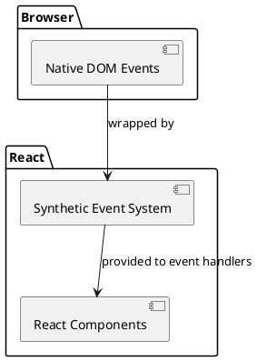
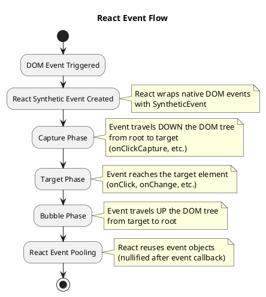
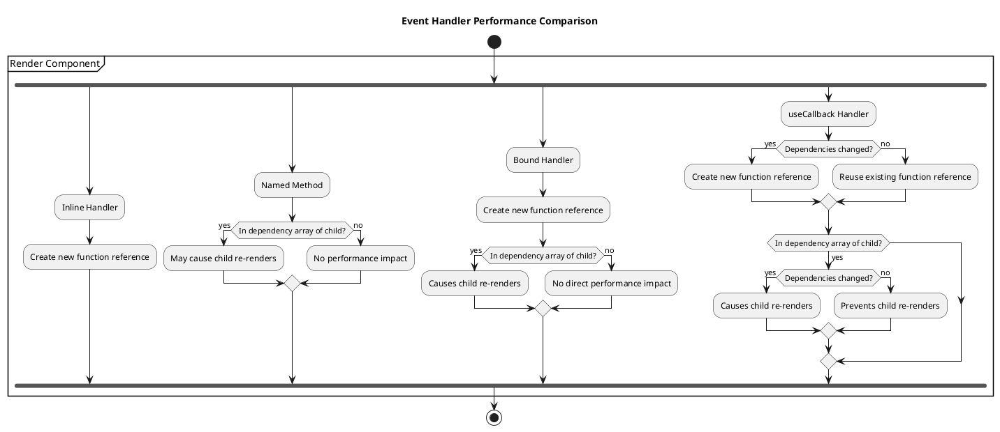
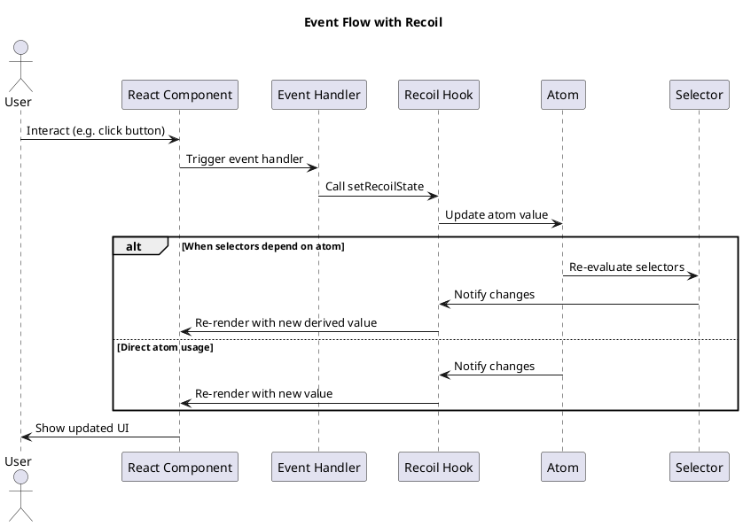

# Handling Events with TypeScript in React

Event handling is a core part of building interactive React applications. TypeScript enhances event handling by providing type safety for event objects, which helps catch errors during development and provides better developer experience through autocompletion and documentation.

## Understanding React Events

React implements a synthetic event system that normalizes browser events for cross-browser compatibility. These synthetic events are wrappers around native browser events and provide a consistent interface.



## Basic Event Handling

### Basic Event Handler Syntax

```tsx
import React from 'react';

function ButtonExample() {
  // Basic click handler
  const handleClick = () => {
    console.log('Button clicked!');
  };

  return (
    <button onClick={handleClick}>
      Click Me
    </button>
  );
}
```

## TypeScript Event Types

React with TypeScript provides specific types for different events. These types help ensure you're using the event object correctly.

### Common Event Types

```tsx
import React from 'react';

function EventTypesExample() {
  // Mouse event handler
  const handleClick = (event: React.MouseEvent<HTMLButtonElement>) => {
    console.log('Button clicked at:', event.clientX, event.clientY);
    event.preventDefault(); // Prevent default behavior
  };

  // Form event handler
  const handleSubmit = (event: React.FormEvent<HTMLFormElement>) => {
    event.preventDefault(); // Prevent form submission
    console.log('Form submitted');
  };

  // Change event handler for input
  const handleChange = (event: React.ChangeEvent<HTMLInputElement>) => {
    console.log('Input value:', event.target.value);
  };

  // Focus event handler
  const handleFocus = (event: React.FocusEvent<HTMLInputElement>) => {
    console.log('Input focused');
  };

  // Keyboard event handler
  const handleKeyDown = (event: React.KeyboardEvent<HTMLInputElement>) => {
    console.log('Key pressed:', event.key);
    if (event.key === 'Enter') {
      console.log('Enter key pressed!');
    }
  };

  return (
    <div>
      <button onClick={handleClick}>Click Me</button>

      <form onSubmit={handleSubmit}>
        <input
          type="text"
          onChange={handleChange}
          onFocus={handleFocus}
          onKeyDown={handleKeyDown}
        />
        <button type="submit">Submit</button>
      </form>
    </div>
  );
}
```

### Common React Event Types Reference

Here's a table of commonly used React event types in TypeScript:

| Event Category | TypeScript Type | HTML Elements | Common Props |
|---------------|----------------|--------------|--------------|
| Mouse Events | `React.MouseEvent<T>` | Button, Div, etc. | onClick, onMouseOver, onMouseOut |
| Form Events | `React.FormEvent<T>` | Form | onSubmit |
| Input Events | `React.ChangeEvent<T>` | Input, Select, Textarea | onChange |
| Keyboard Events | `React.KeyboardEvent<T>` | Input, Div (with tabIndex) | onKeyDown, onKeyPress, onKeyUp |
| Focus Events | `React.FocusEvent<T>` | Input, Button | onFocus, onBlur |
| Clipboard Events | `React.ClipboardEvent<T>` | Input, Div | onCopy, onCut, onPaste |
| Drag Events | `React.DragEvent<T>` | Div, Img | onDrag, onDrop |
| Touch Events | `React.TouchEvent<T>` | Div, Button | onTouchStart, onTouchMove |

## Accessing Event Target Values

TypeScript helps ensure you correctly access event target properties:

```tsx
import React, { useState } from 'react';

function FormExample() {
  const [inputValue, setInputValue] = useState('');
  const [selected, setSelected] = useState('option1');

  // Event handler for text input
  const handleInputChange = (event: React.ChangeEvent<HTMLInputElement>) => {
    setInputValue(event.target.value);
  };

  // Event handler for select element
  const handleSelectChange = (event: React.ChangeEvent<HTMLSelectElement>) => {
    setSelected(event.target.value);
  };

  // Event handler for checkbox input
  const handleCheckboxChange = (event: React.ChangeEvent<HTMLInputElement>) => {
    console.log('Checked:', event.target.checked);
  };

  // Event handler for radio input
  const handleRadioChange = (event: React.ChangeEvent<HTMLInputElement>) => {
    console.log('Selected radio:', event.target.value);
  };

  return (
    <div>
      <div>
        <label>
          Text Input:
          <input type="text" value={inputValue} onChange={handleInputChange} />
        </label>
        <p>You typed: {inputValue}</p>
      </div>

      <div>
        <label>
          Select Option:
          <select value={selected} onChange={handleSelectChange}>
            <option value="option1">Option 1</option>
            <option value="option2">Option 2</option>
            <option value="option3">Option 3</option>
          </select>
        </label>
        <p>You selected: {selected}</p>
      </div>

      <div>
        <label>
          <input type="checkbox" onChange={handleCheckboxChange} />
          Check me
        </label>
      </div>

      <div>
        <label>
          <input
            type="radio"
            name="radioGroup"
            value="radio1"
            onChange={handleRadioChange}
          />
          Radio 1
        </label>
        <label>
          <input
            type="radio"
            name="radioGroup"
            value="radio2"
            onChange={handleRadioChange}
          />
          Radio 2
        </label>
      </div>
    </div>
  );
}
```

## Event Handler Patterns

### 1. Inline Event Handlers

```tsx
function InlineHandlers() {
  const [count, setCount] = useState(0);

  return (
    <div>
      <p>Count: {count}</p>
      
      {/* Simple inline handler */}
      <button onClick={() => setCount(count + 1)}>
        Increment
      </button>
      
      {/* Inline handler with event parameter */}
      <button onClick={(e: React.MouseEvent<HTMLButtonElement>) => {
        e.preventDefault();
        setCount(count - 1);
      }}>
        Decrement
      </button>
    </div>
  );
}
```

### 2. Event Handlers with Parameters

```tsx
function ParameterizedHandlers() {
  const [selectedId, setSelectedId] = useState<string | null>(null);

  // Method 1: Using bind
  const handleSelect = (id: string, e: React.MouseEvent) => {
    e.preventDefault();
    setSelectedId(id);
    console.log(`Selected item ${id}`);
  };

  // Method 2: Using arrow function
  const handleItemClick = (id: string) => (e: React.MouseEvent) => {
    e.preventDefault();
    setSelectedId(id);
    console.log(`Clicked item ${id}`);
  };

  return (
    <div>
      <p>Selected ID: {selectedId || 'None'}</p>
      
      {/* Using bind */}
      <button onClick={(e) => handleSelect('item1', e)}>
        Select Item 1
      </button>
      
      {/* Using arrow function */}
      <button onClick={handleItemClick('item2')}>
        Select Item 2
      </button>
    </div>
  );
}
```

### 3. Event Delegation

Event delegation is a technique in React where a single event listener is attached to a parent element instead of attaching event listeners to multiple child elements. When an event occurs on a child element, the event bubbles up the DOM tree, and the parent element's event listener handles the event based on the target element :

#### Traditional Approach (Without Delegation)

In a typical scenario, you might have a list of items, and you want to handle a click event on each item. Without event delegation, you would attach a separate event listener to each list item. This approach works fine for a small number of items, but it can become inefficient if you have a large list or if the list is dynamically generated. Every list item will have its own event listener, which can impact performance.

```tsx
function List() {
  const items = ['Item 1', 'Item 2', 'Item 3'];

  return (
    <ul>
      {items.map((item, index) => (
        <li key={index} onClick={() => console.log(`Clicked: ${item}`)}>
          {item}
        </li>
      ))}
    </ul>
  );
}
```

#### Event Delegation Approach

With event delegation, you attach a single event listener to the parent element and then use the event.target property to determine which list item was clicked. Here's how you can implement it:


```tsx
function List() {
  const items = ['Item 1', 'Item 2', 'Item 3'];

  const handleClick = (event) => {
    if (event.target.tagName === 'LI') {
      console.log(`Clicked: ${event.target.textContent}`);
    }
  };

  return (
    <ul onClick={handleClick}>
      {items.map((item, index) => (
        <li key={index}>{item}</li>
      ))}
    </ul>
  );
}
```

Another example

```tsx
interface Item {
  id: string;
  name: string;
}

function EventDelegation() {
  const items: Item[] = [
    { id: 'item1', name: 'Item 1' },
    { id: 'item2', name: 'Item 2' },
    { id: 'item3', name: 'Item 3' },
  ];

  const handleListClick = (event: React.MouseEvent<HTMLUListElement>) => {
    const target = event.target as HTMLElement;
    const itemId = target.dataset.itemId;
    
    if (itemId) {
      console.log(`Item clicked: ${itemId}`);
    }
  };

  return (
    <ul onClick={handleListClick}>
      {items.map(item => (
        <li key={item.id} data-item-id={item.id}>
          {item.name}
        </li>
      ))}
    </ul>
  );
}
```

## Form Handling with TypeScript

Form handling is one of the most common uses of event handling in React applications.

### Basic Form Handling

```tsx
import React, { useState, FormEvent } from 'react';

interface FormData {
  username: string;
  email: string;
  password: string;
}

function SimpleForm() {
  const [formData, setFormData] = useState<FormData>({
    username: '',
    email: '',
    password: ''
  });
  
  const [errors, setErrors] = useState<Partial<FormData>>({});

  const handleChange = (e: React.ChangeEvent<HTMLInputElement>) => {
    const { name, value } = e.target;
    
    setFormData({
      ...formData,
      [name]: value
    });
  };

  const validateForm = (): boolean => {
    const newErrors: Partial<FormData> = {};
    
    if (!formData.username) {
      newErrors.username = 'Username is required';
    }
    
    if (!formData.email) {
      newErrors.email = 'Email is required';
    } else if (!/\S+@\S+\.\S+/.test(formData.email)) {
      newErrors.email = 'Email is invalid';
    }
    
    if (!formData.password) {
      newErrors.password = 'Password is required';
    } else if (formData.password.length < 6) {
      newErrors.password = 'Password must be at least 6 characters';
    }
    
    setErrors(newErrors);
    return Object.keys(newErrors).length === 0;
  };

  const handleSubmit = (e: FormEvent<HTMLFormElement>) => {
    e.preventDefault();
    
    if (validateForm()) {
      console.log('Form submitted:', formData);
      // Submit to server or perform other actions
    } else {
      console.log('Form has errors');
    }
  };

  return (
    <form onSubmit={handleSubmit}>
      <div>
        <label htmlFor="username">Username</label>
        <input
          type="text"
          id="username"
          name="username"
          value={formData.username}
          onChange={handleChange}
        />
        {errors.username && <p className="error">{errors.username}</p>}
      </div>

      <div>
        <label htmlFor="email">Email</label>
        <input
          type="email"
          id="email"
          name="email"
          value={formData.email}
          onChange={handleChange}
        />
        {errors.email && <p className="error">{errors.email}</p>}
      </div>

      <div>
        <label htmlFor="password">Password</label>
        <input
          type="password"
          id="password"
          name="password"
          value={formData.password}
          onChange={handleChange}
        />
        {errors.password && <p className="error">{errors.password}</p>}
      </div>

      <button type="submit">Sign Up</button>
    </form>
  );
}
```

### Using a Generic Change Handler

For forms with many fields, you can create a more generic change handler:

```tsx
interface FormValues {
  [key: string]: string | boolean | number;
}

function GenericForm() {
  const [values, setValues] = useState<FormValues>({
    firstName: '',
    lastName: '',
    email: '',
    age: 0,
    subscribe: false
  });

  // Generic change handler that works with different input types
  const handleChange = (
    e: React.ChangeEvent<HTMLInputElement | HTMLSelectElement | HTMLTextAreaElement>
  ) => {
    const { name, value, type } = e.target as HTMLInputElement;
    
    // Handle checkboxes differently
    const newValue = type === 'checkbox' 
      ? (e.target as HTMLInputElement).checked 
      : type === 'number' 
        ? parseInt(value, 10) 
        : value;
    
    setValues({
      ...values,
      [name]: newValue
    });
  };

  const handleSubmit = (e: React.FormEvent<HTMLFormElement>) => {
    e.preventDefault();
    console.log(values);
    // Process form submission
  };

  return (
    <form onSubmit={handleSubmit}>
      <div>
        <label htmlFor="firstName">First Name</label>
        <input
          type="text"
          id="firstName"
          name="firstName"
          value={values.firstName as string}
          onChange={handleChange}
        />
      </div>
      
      <div>
        <label htmlFor="lastName">Last Name</label>
        <input
          type="text"
          id="lastName"
          name="lastName"
          value={values.lastName as string}
          onChange={handleChange}
        />
      </div>
      
      <div>
        <label htmlFor="email">Email</label>
        <input
          type="email"
          id="email"
          name="email"
          value={values.email as string}
          onChange={handleChange}
        />
      </div>
      
      <div>
        <label htmlFor="age">Age</label>
        <input
          type="number"
          id="age"
          name="age"
          value={values.age as number}
          onChange={handleChange}
        />
      </div>
      
      <div>
        <label>
          <input
            type="checkbox"
            name="subscribe"
            checked={values.subscribe as boolean}
            onChange={handleChange}
          />
          Subscribe to newsletter
        </label>
      </div>
      
      <button type="submit">Submit</button>
    </form>
  );
}
```

## Event Flow in React

Understanding event flow (bubbling and capturing) is important for properly handling events in React:



## Example: Building a Form with Validation

Let's create a complete form with validation and proper TypeScript typing:

```tsx
// src/components/ContactForm/ContactForm.tsx
import React, { useState } from 'react';
import './ContactForm.css';

interface FormData {
  name: string;
  email: string;
  subject: string;
  message: string;
  priority: 'low' | 'medium' | 'high';
  agreeToTerms: boolean;
}

interface FormErrors {
  [key: string]: string;
}

interface ContactFormProps {
  onSubmitSuccess?: (data: FormData) => void;
}

export function ContactForm({ onSubmitSuccess }: ContactFormProps) {
  // Initial form state
  const initialFormData: FormData = {
    name: '',
    email: '',
    subject: '',
    message: '',
    priority: 'medium',
    agreeToTerms: false
  };
  
  // Form state
  const [formData, setFormData] = useState<FormData>(initialFormData);
  const [errors, setErrors] = useState<FormErrors>({});
  const [isSubmitting, setIsSubmitting] = useState<boolean>(false);
  const [isSubmitted, setIsSubmitted] = useState<boolean>(false);

  // Handle input change
  const handleChange = (
    e: React.ChangeEvent<HTMLInputElement | HTMLTextAreaElement | HTMLSelectElement>
  ) => {
    const { name, value, type } = e.target as HTMLInputElement;
    
    const inputValue = type === 'checkbox' 
      ? (e.target as HTMLInputElement).checked 
      : value;
      
    setFormData({
      ...formData,
      [name]: inputValue
    });
    
    // Clear error when field is edited
    if (errors[name]) {
      setErrors({
        ...errors,
        [name]: ''
      });
    }
  };

  // Validate form data
  const validateForm = (): boolean => {
    const newErrors: FormErrors = {};
    
    // Name validation
    if (!formData.name.trim()) {
      newErrors.name = 'Name is required';
    } else if (formData.name.trim().length < 2) {
      newErrors.name = 'Name must be at least 2 characters';
    }
    
    // Email validation
    if (!formData.email.trim()) {
      newErrors.email = 'Email is required';
    } else if (!/\S+@\S+\.\S+/.test(formData.email)) {
      newErrors.email = 'Email is invalid';
    }
    
    // Subject validation
    if (!formData.subject.trim()) {
      newErrors.subject = 'Subject is required';
    }
    
    // Message validation
    if (!formData.message.trim()) {
      newErrors.message = 'Message is required';
    } else if (formData.message.trim().length < 10) {
      newErrors.message = 'Message must be at least 10 characters';
    }
    
    // Terms validation
    if (!formData.agreeToTerms) {
      newErrors.agreeToTerms = 'You must agree to the terms';
    }
    
    setErrors(newErrors);
    return Object.keys(newErrors).length === 0;
  };

  // Form submission handler
  const handleSubmit = async (e: React.FormEvent<HTMLFormElement>) => {
    e.preventDefault();
    
    if (!validateForm()) {
      return;
    }
    
    setIsSubmitting(true);
    
    try {
      // Simulate API call
      await new Promise(resolve => setTimeout(resolve, 1500));
      
      // Reset form
      setFormData(initialFormData);
      setIsSubmitted(true);
      
      if (onSubmitSuccess) {
        onSubmitSuccess(formData);
      }
    } catch (error) {
      console.error('Error submitting form:', error);
      setErrors({
        form: 'Failed to submit the form. Please try again.'
      });
    } finally {
      setIsSubmitting(false);
    }
  };

  // Reset form to try again after successful submission
  const handleReset = () => {
    setFormData(initialFormData);
    setErrors({});
    setIsSubmitted(false);
  };

  if (isSubmitted) {
    return (
      <div className="contact-form-success">
        <h2>Thank you for your message!</h2>
        <p>We have received your inquiry and will respond shortly.</p>
        <button 
          onClick={handleReset}
          className="btn"
          type="button"
        >
          Send Another Message
        </button>
      </div>
    );
  }

  return (
    <form className="contact-form" onSubmit={handleSubmit} noValidate>
      {errors.form && <div className="form-error">{errors.form}</div>}
      
      <div className="form-group">
        <label htmlFor="name">Name</label>
        <input
          id="name"
          name="name"
          type="text"
          value={formData.name}
          onChange={handleChange}
          className={errors.name ? 'error' : ''}
          data-testid="name-input"
        />
        {errors.name && <div className="error-message">{errors.name}</div>}
      </div>
      
      <div className="form-group">
        <label htmlFor="email">Email</label>
        <input
          id="email"
          name="email"
          type="email"
          value={formData.email}
          onChange={handleChange}
          className={errors.email ? 'error' : ''}
          data-testid="email-input"
        />
        {errors.email && <div className="error-message">{errors.email}</div>}
      </div>
      
      <div className="form-group">
        <label htmlFor="subject">Subject</label>
        <input
          id="subject"
          name="subject"
          type="text"
          value={formData.subject}
          onChange={handleChange}
          className={errors.subject ? 'error' : ''}
          data-testid="subject-input"
        />
        {errors.subject && <div className="error-message">{errors.subject}</div>}
      </div>
      
      <div className="form-group">
        <label htmlFor="priority">Priority</label>
        <select
          id="priority"
          name="priority"
          value={formData.priority}
          onChange={handleChange}
          data-testid="priority-select"
        >
          <option value="low">Low</option>
          <option value="medium">Medium</option>
          <option value="high">High</option>
        </select>
      </div>
      
      <div className="form-group">
        <label htmlFor="message">Message</label>
        <textarea
          id="message"
          name="message"
          value={formData.message}
          onChange={handleChange}
          rows={5}
          className={errors.message ? 'error' : ''}
          data-testid="message-input"
        />
        {errors.message && <div className="error-message">{errors.message}</div>}
      </div>
      
      <div className="form-group checkbox">
        <label>
          <input
            type="checkbox"
            name="agreeToTerms"
            checked={formData.agreeToTerms}
            onChange={handleChange}
            data-testid="terms-checkbox"
          />
          I agree to the terms and conditions
        </label>
        {errors.agreeToTerms && <div className="error-message">{errors.agreeToTerms}</div>}
      </div>
      
      <button 
        type="submit" 
        disabled={isSubmitting}
        className="submit-btn"
        data-testid="submit-button"
      >
        {isSubmitting ? 'Submitting...' : 'Submit'}
      </button>
    </form>
  );
}
```

### CSS for the Contact Form

```css
/* src/components/ContactForm/ContactForm.css */
.contact-form {
  max-width: 600px;
  margin: 0 auto;
  padding: 20px;
  background-color: #f8f9fa;
  border-radius: 8px;
  box-shadow: 0 2px 4px rgba(0, 0, 0, 0.1);
}

.form-group {
  margin-bottom: 20px;
}

.form-group label {
  display: block;
  margin-bottom: 5px;
  font-weight: 500;
}

.form-group input,
.form-group textarea,
.form-group select {
  width: 100%;
  padding: 10px;
  border: 1px solid #ced4da;
  border-radius: 4px;
  font-size: 16px;
}

.form-group input.error,
.form-group textarea.error {
  border-color: #dc3545;
  background-color: #fff8f8;
}

.error-message {
  color: #dc3545;
  font-size: 14px;
  margin-top: 5px;
}

.form-error {
  background-color: #f8d7da;
  color: #721c24;
  padding: 10px;
  border-radius: 4px;
  margin-bottom: 20px;
}

.checkbox {
  display: flex;
  align-items: flex-start;
}

.checkbox label {
  display: flex;
  align-items: center;
  margin-bottom: 0;
}

.checkbox input {
  width: auto;
  margin-right: 10px;
}

.submit-btn {
  background-color: #007bff;
  color: white;
  border: none;
  border-radius: 4px;
  padding: 12px 20px;
  font-size: 16px;
  cursor: pointer;
  transition: background-color 0.2s;
}

.submit-btn:disabled {
  background-color: #6c757d;
  cursor: not-allowed;
}

.submit-btn:hover:not(:disabled) {
  background-color: #0069d9;
}

.contact-form-success {
  max-width: 600px;
  margin: 0 auto;
  padding: 30px;
  background-color: #d4edda;
  border-radius: 8px;
  text-align: center;
  color: #155724;
}

.contact-form-success h2 {
  margin-top: 0;
}

.contact-form-success .btn {
  background-color: #28a745;
  color: white;
  border: none;
  border-radius: 4px;
  padding: 10px 20px;
  font-size: 16px;
  cursor: pointer;
  margin-top: 20px;
}

.contact-form-success .btn:hover {
  background-color: #218838;
}
```

### Unit Testing the Contact Form

```tsx
// src/components/ContactForm/ContactForm.test.tsx
import React from 'react';
import { render, screen, fireEvent, waitFor } from '@testing-library/react';
import { ContactForm } from './ContactForm';

describe('ContactForm Component', () => {
  // Test 1: Form renders correctly
  test('renders the contact form with all fields', () => {
    render(<ContactForm />);
    
    expect(screen.getByTestId('name-input')).toBeInTheDocument();
    expect(screen.getByTestId('email-input')).toBeInTheDocument();
    expect(screen.getByTestId('subject-input')).toBeInTheDocument();
    expect(screen.getByTestId('priority-select')).toBeInTheDocument();
    expect(screen.getByTestId('message-input')).toBeInTheDocument();
    expect(screen.getByTestId('terms-checkbox')).toBeInTheDocument();
    expect(screen.getByTestId('submit-button')).toBeInTheDocument();
  });

  // Test 2: Validation errors are shown
  test('shows validation errors when form is submitted with empty fields', () => {
    render(<ContactForm />);
    
    // Submit the empty form
    fireEvent.click(screen.getByTestId('submit-button'));
    
    // Check if error messages are displayed
    expect(screen.getByText(/name is required/i)).toBeInTheDocument();
    expect(screen.getByText(/email is required/i)).toBeInTheDocument();
    expect(screen.getByText(/subject is required/i)).toBeInTheDocument();
    expect(screen.getByText(/message is required/i)).toBeInTheDocument();
    expect(screen.getByText(/you must agree to the terms/i)).toBeInTheDocument();
  });

  // Test 3: Form submission works with valid data
  test('submits the form when all fields are valid', async () => {
    const mockSubmitSuccess = jest.fn();
    render(<ContactForm onSubmitSuccess={mockSubmitSuccess} />);
    
    // Fill out the form
    fireEvent.change(screen.getByTestId('name-input'), { target: { value: 'John Doe' } });
    fireEvent.change(screen.getByTestId('email-input'), { target: { value: 'john@example.com' } });
    fireEvent.change(screen.getByTestId('subject-input'), { target: { value: 'Test Subject' } });
    fireEvent.change(screen.getByTestId('priority-select'), { target: { value: 'high' } });
    fireEvent.change(screen.getByTestId('message-input'), { target: { value: 'This is a test message content.' } });
    fireEvent.click(screen.getByTestId('terms-checkbox'));
    
    // Submit the form
    fireEvent.click(screen.getByTestId('submit-button'));
    
    // Should show loading state
    expect(screen.getByText(/submitting.../i)).toBeInTheDocument();
    
    // Wait for submission to complete
    await waitFor(() => {
      expect(screen.getByText(/thank you for your message/i)).toBeInTheDocument();
    });
    
    // Check if success callback was called
    expect(mockSubmitSuccess).toHaveBeenCalledWith({
      name: 'John Doe',
      email: 'john@example.com',
      subject: 'Test Subject',
      message: 'This is a test message content.',
      priority: 'high',
      agreeToTerms: true
    });
  });

  // Test 4: Email validation works
  test('shows error for invalid email format', () => {
    render(<ContactForm />);
    
    // Fill out form with invalid email
    fireEvent.change(screen.getByTestId('name-input'), { target: { value: 'John Doe' } });
    fireEvent.change(screen.getByTestId('email-input'), { target: { value: 'invalid-email' } });
    fireEvent.change(screen.getByTestId('subject-input'), { target: { value: 'Test' } });
    fireEvent.change(screen.getByTestId('message-input'), { target: { value: 'Test message.' } });
    fireEvent.click(screen.getByTestId('terms-checkbox'));
    
    // Submit form
    fireEvent.click(screen.getByTestId('submit-button'));
    
    // Should show email validation error
    expect(screen.getByText(/email is invalid/i)).toBeInTheDocument();
  });

  // Test 5: Reset form after successful submission
  test('allows sending another message after successful submission', async () => {
    render(<ContactForm />);
    
    // Fill and submit form
    fireEvent.change(screen.getByTestId('name-input'), { target: { value: 'John Doe' } });
    fireEvent.change(screen.getByTestId('email-input'), { target: { value: 'john@example.com' } });
    fireEvent.change(screen.getByTestId('subject-input'), { target: { value: 'Test' } });
    fireEvent.change(screen.getByTestId('message-input'), { target: { value: 'This is a test message.' } });
    fireEvent.click(screen.getByTestId('terms-checkbox'));
    fireEvent.click(screen.getByTestId('submit-button'));
    
    // Wait for success message
    await waitFor(() => {
      expect(screen.getByText(/thank you for your message/i)).toBeInTheDocument();
    });
    
    // Click the "Send Another Message" button
    fireEvent.click(screen.getByText(/send another message/i));
    
    // Form should be reset and visible again
    expect(screen.getByTestId('name-input')).toBeInTheDocument();
    expect(screen.getByTestId('name-input')).toHaveValue('');
  });
});
```

## Best Practices for Event Handling

### 1. Use Type-Safe Event Handlers

```tsx
// ❌ Not Type-Safe
const handleChange = (e) => {
  // No intellisense, e.target.value could be anything
  setState(e.target.value);
};

// ✅ Type-Safe
const handleChange = (e: React.ChangeEvent<HTMLInputElement>) => {
  // Full intellisense and type checking
  setState(e.target.value);
};
```

### 2. Avoid Anonymous Inline Functions for Performance-Critical Components

```tsx
// ❌ Creates new function on every render
<button onClick={() => handleClick(id)}>Click</button>

// ✅ More efficient with useCallback
const handleButtonClick = useCallback((id: string) => () => {
  handleClick(id);
}, [handleClick]);

<button onClick={handleButtonClick(id)}>Click</button>
```

### 3. Use Event Delegation for Lists

```tsx
// ❌ Attaches handler to every item
<ul>
  {items.map(item => (
    <li key={item.id} onClick={() => handleItemClick(item.id)}>
      {item.name}
    </li>
  ))}
</ul>

// ✅ Single handler with delegation
<ul onClick={handleListClick}>
  {items.map(item => (
    <li key={item.id} data-id={item.id}>
      {item.name}
    </li>
  ))}
</ul>
```

### 4. Clean Up Event Listeners

```tsx
useEffect(() => {
  window.addEventListener('resize', handleResize);
  
  // ✅ Always clean up event listeners
  return () => {
    window.removeEventListener('resize', handleResize);
  };
}, []);
```

### 5. Prevent Default Behavior When Needed

```tsx
const handleSubmit = (e: React.FormEvent<HTMLFormElement>) => {
  // ✅ Prevent default form submission
  e.preventDefault();
  
  // Process form data
};
```

### 6. Use Event Pooling Awareness

React 17+ no longer uses event pooling, but if you work with older versions:

```tsx
// For React <17 (with event pooling):
const handleClick = (e: React.MouseEvent) => {
  // ✅ Persist the event for asynchronous usage
  e.persist();
  
  setTimeout(() => {
    console.log(e.type); // without persist(), this would be null
  }, 1000);
};
```

## Comparing Event Handling Approaches

Different approaches to event handling have their own advantages and trade-offs. Here's a comprehensive comparison to help you choose the right approach for your specific needs:

### Inline vs. Method Approaches

| Approach | Implementation | Pros | Cons | Best For |
|----------|---------------|------|------|----------|
| Inline Handler | `<button onClick={() => setCount(count + 1)}>` | Simple, direct, good for one-off handlers | Creates new function on each render, can impact performance | Simple actions, prototyping |
| Named Method | `<button onClick={handleClick}>` | Cleaner JSX, reusable, better performance | Requires separate method declaration | Most production code |
| Bound Method | `<button onClick={(e) => handleClick(id, e)}>` | Allows passing extra parameters | Creates new function on each render | When parameters beyond the event are needed |
| useCallback | `const handleClick = useCallback(() => {...}, [deps])` | Memoized function reference | Extra code complexity | Performance-critical components |



### Event Delegation vs. Direct Binding

| Approach | Implementation | Pros | Cons | Best For |
|----------|---------------|------|------|----------|
| Direct Binding | Each element has its own handler | Simple, clear ownership | Memory usage scales with element count | Small sets of elements |
| Event Delegation | Parent element handles events for children | Better memory usage, works for dynamic elements | Requires more complex event filtering logic | Long lists, dynamic content |

```plantuml
@startuml
title Direct Binding vs Event Delegation

package "Direct Binding" {
  [List Component] --> [Item 1] : attach onClick
  [List Component] --> [Item 2] : attach onClick
  [List Component] --> [Item 3] : attach onClick
  [List Component] --> [Item n] : attach onClick
}

package "Event Delegation" {
  [List Component] : onClick handler
  [List Component] --> [Item 1]
  [List Component] --> [Item 2]
  [List Component] --> [Item 3]
  [List Component] --> [Item n]
  note right of [List Component]
    Single handler determines 
    which item was clicked
  end note
}

@enduml
```

### Synthetic Events vs Native Events

| Aspect | React Synthetic Events | Native DOM Events |
|--------|------------------------|-------------------|
| Cross-browser compatibility | Normalized API | Browser-specific differences |
| TypeScript integration | Strong types via React typings | Generic Event types |
| Event pooling | Reused in React 16 and earlier | N/A |
| Performance | Small overhead | Direct |
| Access outside React | Requires `e.persist()` in React 16 and earlier | Always available |

## Using Events with Recoil

Recoil provides powerful state management capabilities that work well with React's event system. Let's explore how to effectively handle events when using Recoil.

### Setting Up Recoil

First, install and setup Recoil:

```bash
npm install recoil
```

```tsx
// src/index.tsx
import React from 'react';
import ReactDOM from 'react-dom';
import { RecoilRoot } from 'recoil';
import App from './App';

ReactDOM.render(
  <React.StrictMode>
    <RecoilRoot>
      <App />
    </RecoilRoot>
  </React.StrictMode>,
  document.getElementById('root')
);
```

### Basic Recoil Atoms for Events

```tsx
// atoms.ts
import { atom } from 'recoil';

// Counter state
export const counterState = atom({
  key: 'counterState',
  default: 0,
});

// Form state
export interface FormStateType {
  name: string;
  email: string;
  message: string;
  isSubmitting: boolean;
}

export const formState = atom<FormStateType>({
  key: 'formState',
  default: {
    name: '',
    email: '',
    message: '',
    isSubmitting: false
  }
});

// Selected item state
export const selectedItemIdState = atom<string | null>({
  key: 'selectedItemIdState',
  default: null
});
```

### Handling Click Events with Recoil

```tsx
// CounterComponent.tsx
import React from 'react';
import { useRecoilState } from 'recoil';
import { counterState } from './atoms';

export function CounterComponent() {
  const [count, setCount] = useRecoilState(counterState);
  
  // Event handlers
  const handleIncrement = (e: React.MouseEvent<HTMLButtonElement>): void => {
    e.preventDefault();
    setCount(prevCount => prevCount + 1);
  };
  
  const handleDecrement = (e: React.MouseEvent<HTMLButtonElement>): void => {
    e.preventDefault();
    setCount(prevCount => prevCount - 1);
  };
  
  const handleReset = (e: React.MouseEvent<HTMLButtonElement>): void => {
    e.preventDefault();
    setCount(0);
  };
  
  return (
    <div className="counter">
      <h2>Count: {count}</h2>
      <div className="counter-controls">
        <button onClick={handleDecrement}>-</button>
        <button onClick={handleIncrement}>+</button>
        <button onClick={handleReset}>Reset</button>
      </div>
    </div>
  );
}
```

### Form Events with Recoil

```tsx
// ContactFormWithRecoil.tsx
import React from 'react';
import { useRecoilState } from 'recoil';
import { formState, FormStateType } from './atoms';

export function ContactFormWithRecoil() {
  const [form, setForm] = useRecoilState(formState);
  
  // Generic change handler for form inputs
  const handleChange = (e: React.ChangeEvent<HTMLInputElement | HTMLTextAreaElement>): void => {
    const { name, value } = e.target;
    setForm(prevForm => ({
      ...prevForm,
      [name]: value
    }));
  };
  
  // Form submission handler
  const handleSubmit = async (e: React.FormEvent<HTMLFormElement>): Promise<void> => {
    e.preventDefault();
    
    // Start submission
    setForm(prevForm => ({
      ...prevForm,
      isSubmitting: true
    }));
    
    try {
      // Simulate API call
      await new Promise(resolve => setTimeout(resolve, 1000));
      
      // Log successful submission
      console.log('Form submitted:', form);
      
      // Reset form
      setForm({
        name: '',
        email: '',
        message: '',
        isSubmitting: false
      });
      
      alert('Form submitted successfully!');
    } catch (error) {
      console.error('Error submitting form:', error);
      
      // Reset submission state but keep form data
      setForm(prevForm => ({
        ...prevForm,
        isSubmitting: false
      }));
    }
  };
  
  return (
    <form onSubmit={handleSubmit} className="contact-form">
      <div className="form-group">
        <label htmlFor="name">Name</label>
        <input
          id="name"
          name="name"
          type="text"
          value={form.name}
          onChange={handleChange}
          required
        />
      </div>
      
      <div className="form-group">
        <label htmlFor="email">Email</label>
        <input
          id="email"
          name="email"
          type="email"
          value={form.email}
          onChange={handleChange}
          required
        />
      </div>
      
      <div className="form-group">
        <label htmlFor="message">Message</label>
        <textarea
          id="message"
          name="message"
          value={form.message}
          onChange={handleChange}
          required
          rows={5}
        />
      </div>
      
      <button type="submit" disabled={form.isSubmitting}>
        {form.isSubmitting ? 'Submitting...' : 'Submit'}
      </button>
    </form>
  );
}
```

### Recoil Selectors and Events

Selectors can compute derived state based on atoms and are perfect for form validation:

```tsx
// formSelectors.ts
import { selector } from 'recoil';
import { formState } from './atoms';

export const formErrorsSelector = selector({
  key: 'formErrorsSelector',
  get: ({ get }) => {
    const form = get(formState);
    const errors: { [key: string]: string } = {};
    
    // Name validation
    if (!form.name.trim()) {
      errors.name = 'Name is required';
    }
    
    // Email validation
    if (!form.email.trim()) {
      errors.email = 'Email is required';
    } else if (!/\S+@\S+\.\S+/.test(form.email)) {
      errors.email = 'Email is invalid';
    }
    
    // Message validation
    if (!form.message.trim()) {
      errors.message = 'Message is required';
    } else if (form.message.trim().length < 10) {
      errors.message = 'Message must be at least 10 characters';
    }
    
    return errors;
  }
});

export const isFormValidSelector = selector({
  key: 'isFormValidSelector',
  get: ({ get }) => {
    const errors = get(formErrorsSelector);
    return Object.keys(errors).length === 0;
  }
});
```

```tsx
// ValidatedContactFormWithRecoil.tsx
import React from 'react';
import { useRecoilState, useRecoilValue } from 'recoil';
import { formState } from './atoms';
import { formErrorsSelector, isFormValidSelector } from './formSelectors';

export function ValidatedContactFormWithRecoil() {
  const [form, setForm] = useRecoilState(formState);
  const errors = useRecoilValue(formErrorsSelector);
  const isFormValid = useRecoilValue(isFormValidSelector);
  
  // Generic change handler for form inputs
  const handleChange = (e: React.ChangeEvent<HTMLInputElement | HTMLTextAreaElement>): void => {
    const { name, value } = e.target;
    setForm(prevForm => ({
      ...prevForm,
      [name]: value
    }));
  };
  
  // Form submission handler
  const handleSubmit = async (e: React.FormEvent<HTMLFormElement>): Promise<void> => {
    e.preventDefault();
    
    if (!isFormValid) {
      alert('Please fix the errors in the form');
      return;
    }
    
    setForm(prevForm => ({
      ...prevForm,
      isSubmitting: true
    }));
    
    try {
      await new Promise(resolve => setTimeout(resolve, 1000));
      console.log('Form submitted:', form);
      
      setForm({
        name: '',
        email: '',
        message: '',
        isSubmitting: false
      });
      
      alert('Form submitted successfully!');
    } catch (error) {
      console.error('Error submitting form:', error);
      setForm(prevForm => ({
        ...prevForm,
        isSubmitting: false
      }));
    }
  };
  
  return (
    <form onSubmit={handleSubmit} className="contact-form">
      <div className="form-group">
        <label htmlFor="name">Name</label>
        <input
          id="name"
          name="name"
          type="text"
          value={form.name}
          onChange={handleChange}
          className={errors.name ? 'error' : ''}
        />
        {errors.name && <div className="error-message">{errors.name}</div>}
      </div>
      
      <div className="form-group">
        <label htmlFor="email">Email</label>
        <input
          id="email"
          name="email"
          type="email"
          value={form.email}
          onChange={handleChange}
          className={errors.email ? 'error' : ''}
        />
        {errors.email && <div className="error-message">{errors.email}</div>}
      </div>
      
      <div className="form-group">
        <label htmlFor="message">Message</label>
        <textarea
          id="message"
          name="message"
          value={form.message}
          onChange={handleChange}
          rows={5}
          className={errors.message ? 'error' : ''}
        />
        {errors.message && <div className="error-message">{errors.message}</div>}
      </div>
      
      <button type="submit" disabled={form.isSubmitting || !isFormValid}>
        {form.isSubmitting ? 'Submitting...' : 'Submit'}
      </button>
    </form>
  );
}
```

### Event Flow with Recoil

To understand how events work with Recoil, let's visualize the flow:



### List Selection with Recoil

```tsx
// ItemList.tsx
import React from 'react';
import { useRecoilState } from 'recoil';
import { selectedItemIdState } from './atoms';

interface Item {
  id: string;
  name: string;
}

interface ItemListProps {
  items: Item[];
}

export function ItemList({ items }: ItemListProps) {
  const [selectedId, setSelectedId] = useRecoilState(selectedItemIdState);
  
  // Event handler for item selection
  const handleItemClick = (itemId: string) => (e: React.MouseEvent<HTMLLIElement>): void => {
    e.preventDefault();
    setSelectedId(itemId === selectedId ? null : itemId);
  };
  
  return (
    <ul className="item-list">
      {items.map(item => (
        <li 
          key={item.id}
          onClick={handleItemClick(item.id)}
          className={item.id === selectedId ? 'selected' : ''}
        >
          {item.name}
        </li>
      ))}
    </ul>
  );
}

// ItemDetail.tsx
import React from 'react';
import { useRecoilValue } from 'recoil';
import { selectedItemIdState } from './atoms';

interface Item {
  id: string;
  name: string;
  description: string;
}

interface ItemDetailProps {
  items: Item[];
}

export function ItemDetail({ items }: ItemDetailProps) {
  const selectedId = useRecoilValue(selectedItemIdState);
  const selectedItem = items.find(item => item.id === selectedId);
  
  if (!selectedItem) {
    return <div className="item-detail">Select an item to view details</div>;
  }
  
  return (
    <div className="item-detail">
      <h2>{selectedItem.name}</h2>
      <p>{selectedItem.description}</p>
    </div>
  );
}
```

### Unit Testing with Recoil Events

Testing components that use Recoil requires wrapping them in a `RecoilRoot`:

```tsx
// ContactFormWithRecoil.test.tsx
import React from 'react';
import { render, screen, fireEvent, waitFor } from '@testing-library/react';
import { RecoilRoot } from 'recoil';
import { ContactFormWithRecoil } from './ContactFormWithRecoil';

describe('ContactFormWithRecoil', () => {
  test('renders form elements', () => {
    render(
      <RecoilRoot>
        <ContactFormWithRecoil />
      </RecoilRoot>
    );
    
    expect(screen.getByLabelText(/name/i)).toBeInTheDocument();
    expect(screen.getByLabelText(/email/i)).toBeInTheDocument();
    expect(screen.getByLabelText(/message/i)).toBeInTheDocument();
    expect(screen.getByRole('button', { name: /submit/i })).toBeInTheDocument();
  });
  
  test('handles input changes', () => {
    render(
      <RecoilRoot>
        <ContactFormWithRecoil />
      </RecoilRoot>
    );
    
    const nameInput = screen.getByLabelText(/name/i);
    fireEvent.change(nameInput, { target: { value: 'John Doe' } });
    expect(nameInput).toHaveValue('John Doe');
    
    const emailInput = screen.getByLabelText(/email/i);
    fireEvent.change(emailInput, { target: { value: 'john@example.com' } });
    expect(emailInput).toHaveValue('john@example.com');
    
    const messageInput = screen.getByLabelText(/message/i);
    fireEvent.change(messageInput, { target: { value: 'Test message' } });
    expect(messageInput).toHaveValue('Test message');
  });
  
  test('handles form submission', async () => {
    // Spy on console.log
    jest.spyOn(console, 'log').mockImplementation(() => {});
    
    render(
      <RecoilRoot>
        <ContactFormWithRecoil />
      </RecoilRoot>
    );
    
    // Fill form
    fireEvent.change(screen.getByLabelText(/name/i), { 
      target: { value: 'John Doe' } 
    });
    fireEvent.change(screen.getByLabelText(/email/i), { 
      target: { value: 'john@example.com' } 
    });
    fireEvent.change(screen.getByLabelText(/message/i), { 
      target: { value: 'Test message' } 
    });
    
    // Submit form
    fireEvent.click(screen.getByRole('button', { name: /submit/i }));
    
    // Button should show submitting state
    expect(screen.getByRole('button')).toHaveTextContent(/submitting/i);
    expect(screen.getByRole('button')).toBeDisabled();
    
    // Wait for submission to complete
    await waitFor(() => {
      expect(screen.getByRole('button')).toHaveTextContent(/submit/i);
    });
    
    // Form should be reset
    expect(screen.getByLabelText(/name/i)).toHaveValue('');
    expect(screen.getByLabelText(/email/i)).toHaveValue('');
    expect(screen.getByLabelText(/message/i)).toHaveValue('');
    
    // Console log should have been called
    expect(console.log).toHaveBeenCalledWith(
      'Form submitted:', 
      expect.objectContaining({
        name: 'John Doe',
        email: 'john@example.com',
        message: 'Test message'
      })
    );
    
    // Clean up spy
    (console.log as jest.Mock).mockRestore();
  });
});
```

### Testing List Selection with Recoil

```tsx
// ItemList.test.tsx
import React from 'react';
import { render, screen, fireEvent } from '@testing-library/react';
import { RecoilRoot, useRecoilValue } from 'recoil';
import { ItemList } from './ItemList';
import { selectedItemIdState } from './atoms';

// Sample items
const testItems = [
  { id: 'item1', name: 'Item 1' },
  { id: 'item2', name: 'Item 2' },
  { id: 'item3', name: 'Item 3' }
];

// Helper component to track selectedItemId
const SelectedItemTracker: React.FC = () => {
  const selectedId = useRecoilValue(selectedItemIdState);
  return <div data-testid="selected-tracker">{selectedId || 'none'}</div>;
};

describe('ItemList with Recoil', () => {
  test('renders items correctly', () => {
    render(
      <RecoilRoot>
        <ItemList items={testItems} />
      </RecoilRoot>
    );
    
    expect(screen.getByText('Item 1')).toBeInTheDocument();
    expect(screen.getByText('Item 2')).toBeInTheDocument();
    expect(screen.getByText('Item 3')).toBeInTheDocument();
  });
  
  test('selects item when clicked', () => {
    render(
      <RecoilRoot>
        <ItemList items={testItems} />
        <SelectedItemTracker />
      </RecoilRoot>
    );
    
    // Initial state should be none
    expect(screen.getByTestId('selected-tracker')).toHaveTextContent('none');
    
    // Click first item
    fireEvent.click(screen.getByText('Item 1'));
    expect(screen.getByTestId('selected-tracker')).toHaveTextContent('item1');
    
    // Click second item
    fireEvent.click(screen.getByText('Item 2'));
    expect(screen.getByTestId('selected-tracker')).toHaveTextContent('item2');
  });
  
  test('deselects item when clicked twice', () => {
    render(
      <RecoilRoot>
        <ItemList items={testItems} />
        <SelectedItemTracker />
      </RecoilRoot>
    );
    
    // Click item to select it
    fireEvent.click(screen.getByText('Item 3'));
    expect(screen.getByTestId('selected-tracker')).toHaveTextContent('item3');
    
    // Click again to deselect
    fireEvent.click(screen.getByText('Item 3'));
    expect(screen.getByTestId('selected-tracker')).toHaveTextContent('none');
  });
});
```

## Conclusion

Event handling in React with TypeScript provides a robust way to build interactive applications with type safety. We've explored:

- TypeScript's event types for React
- Common event handling patterns and their comparisons
- Form handling with validation
- Building reusable form components
- Testing event handlers
- Integrating events with Recoil state management
- Testing Recoil-based event handling

By leveraging TypeScript's type system combined with Recoil's state management capabilities, you can create well-structured, type-safe applications that are both maintainable and performant.

In the next part of our guide, we'll explore testing React applications in more depth, including how to test more complex interactions and state flows.
