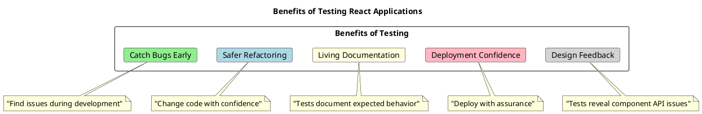

# Testing Libraries Overview

Testing is a critical aspect of developing reliable React applications. This section provides an overview of popular testing libraries for React applications with TypeScript, highlighting their strengths, weaknesses, and ideal use cases.

## Why Test React Applications?

Testing your React applications provides several key benefits:

1. **Catching bugs early**: Tests catch bugs before they reach production
2. **Facilitating refactoring**: Tests help ensure changes don't break existing functionality
3. **Documentation**: Tests serve as living documentation for how components should behave
4. **Confidence**: Tests give confidence when deploying new features or changes
5. **Design feedback**: Tests can provide feedback on component design and API



## Testing Pyramid for React Applications

The testing pyramid suggests having more lower-level tests than higher-level tests, due to their speed and reliability:

```plantuml
@startuml
title Testing Pyramid for React Applications

skinparam component {
  BackgroundColor<<unit>> LightGreen
  BackgroundColor<<integration>> LightBlue
  BackgroundColor<<e2e>> LightPink
}

skinparam DefaultTextAlignment center

rectangle "End-to-End Tests" as e2e #LightPink {
  note right: "Cypress, Playwright\nSlow but comprehensive"
}

rectangle "Integration Tests" as integration #LightBlue {
  note right: "React Testing Library\nTest components together"
}

rectangle "Unit Tests" as unit #LightGreen {
  note right: "Jest, Vitest\nTest isolated functions/hooks"
}

e2e -[hidden]-> integration
integration -[hidden]-> unit

note bottom of unit: "Many"
note bottom of integration: "Some"
note bottom of e2e: "Few"

e2e.w -- [hidden] e2e.e
integration.w -- [hidden] integration.e

unit.w -- [hidden] unit.e

@enduml
```

## Popular Testing Libraries

### Jest

[Jest](https://jestjs.io/) is a complete JavaScript testing solution developed by Facebook. It's often the default test runner for React applications.

#### Key Features:

- Zero configuration for most JavaScript projects
- Built-in assertion library
- Snapshot testing
- Mocking capabilities
- Code coverage reports
- Parallel test execution

#### Basic Jest Example:

```tsx
// basic.test.ts
function sum(a: number, b: number): number {
  return a + b;
}

describe('sum function', () => {
  it('adds two numbers correctly', () => {
    expect(sum(1, 2)).toBe(3);
    expect(sum(-1, 1)).toBe(0);
    expect(sum(5, 5)).toBe(10);
  });
});
```

### React Testing Library

[React Testing Library](https://testing-library.com/docs/react-testing-library/intro) (RTL) is a lightweight solution for testing React components. It encourages testing components in a way that resembles how users interact with your application.

#### Key Features:

- Focuses on testing from the user's perspective
- Avoids testing implementation details
- Encourages accessibility
- Simple and intuitive API
- Works well with Jest

#### Basic RTL Example:

```tsx
// counter.tsx
import React, { useState } from 'react';

function Counter() {
  const [count, setCount] = useState(0);
  
  return (
    <div>
      <div data-testid="count">{count}</div>
      <button onClick={() => setCount(count + 1)}>Increment</button>
    </div>
  );
}

// counter.test.tsx
import React from 'react';
import { render, screen, fireEvent } from '@testing-library/react';
import Counter from './counter';

describe('Counter component', () => {
  it('increments count when button is clicked', () => {
    render(<Counter />);
    
    // Initial state check
    expect(screen.getByTestId('count')).toHaveTextContent('0');
    
    // Interact with the component
    fireEvent.click(screen.getByText('Increment'));
    
    // Check if state updated correctly
    expect(screen.getByTestId('count')).toHaveTextContent('1');
  });
});
```

### The Relationship Between Jest and React Testing Library

Jest and React Testing Library are often used together, but they serve different purposes in testing React applications:

#### Distinct Roles

- **Jest** is a test runner and assertion library. It provides the framework for writing and running tests, along with tools for making assertions about your code's behavior. Jest:
  - Runs test files and organizes them into suites
  - Provides assertion methods (expect, toBe, etc.)
  - Offers mocking capabilities for dependencies
  - Enables snapshot testing
  - Generates test reports and coverage metrics

- **React Testing Library** is a library that provides utilities for testing React components through simulated user interactions. It:
  - Renders React components into a virtual DOM
  - Provides queries to find elements (like a user would)
  - Offers utilities to simulate user interactions
  - Focuses on testing behavior rather than implementation details

#### Why They Work Together

React Testing Library is not a complete testing solution on its own—it needs a test runner like Jest to execute tests and provide the testing environment. When used together:

1. Jest provides the environment and runs the test files
2. RTL renders components and provides tools to interact with them
3. Jest's assertion methods verify the expected outcomes

This combination creates a powerful testing solution that allows you to write tests that closely resemble how users interact with your application.

### Enzyme

[Enzyme](https://enzymejs.github.io/enzyme/) is a JavaScript testing utility for React developed by Airbnb. It provides a more component-focused API for testing.

#### Key Features:

- Multiple rendering approaches (shallow, mount, render)
- Focus on component internals
- Ability to traverse component trees
- Intuitive API for finding and interacting with elements
- Good for testing implementation details

> **Note**: Enzyme has been less actively maintained recently and doesn't have full React 18 support. Many teams are moving away from Enzyme toward React Testing Library.

#### Basic Enzyme Example:

```tsx
// button.tsx
import React from 'react';

function Button({ onClick, children }: { onClick: () => void, children: React.ReactNode }) {
  return (
    <button onClick={onClick} className="custom-button">
      {children}
    </button>
  );
}

// button.test.tsx (with Enzyme)
import React from 'react';
import { shallow } from 'enzyme';
import Button from './button';

describe('Button component', () => {
  it('renders with correct text', () => {
    const wrapper = shallow(<Button onClick={() => {}}>Click me</Button>);
    expect(wrapper.text()).toBe('Click me');
    expect(wrapper.hasClass('custom-button')).toBe(true);
  });
  
  it('calls onClick when clicked', () => {
    const handleClick = jest.fn();
    const wrapper = shallow(<Button onClick={handleClick}>Click me</Button>);
    
    wrapper.simulate('click');
    expect(handleClick).toHaveBeenCalledTimes(1);
  });
});
```

### Vitest

[Vitest](https://vitest.dev/) is a newer testing framework designed for Vite-based applications. It's fast, feature-rich, and compatible with the Jest API.

#### Key Features:

- Extremely fast execution (uses Vite for transform and bundling)
- Native TypeScript support
- Compatible with Jest's API
- Watch mode with smart detection
- Built-in code coverage
- ESM support out of the box

#### Basic Vitest Example:

```tsx
// math.ts
export function multiply(a: number, b: number): number {
  return a * b;
}

// math.test.ts
import { describe, it, expect } from 'vitest';
import { multiply } from './math';

describe('math utilities', () => {
  it('multiplies two numbers correctly', () => {
    expect(multiply(2, 3)).toBe(6);
    expect(multiply(0, 5)).toBe(0);
    expect(multiply(-2, 3)).toBe(-6);
  });
});
```

### Testing Library Comparison

Here's a comparison of the major testing libraries to help you choose the right one for your project:

| Feature | Jest | React Testing Library | Enzyme | Vitest |
|---------|------|----------------------|--------|--------|
| Focus | General JS testing | User-centric component testing | Component internals | Fast Vite integration |
| React 18 Support | ✅ | ✅ | ⚠️ (Limited) | ✅ |
| TypeScript Support | ✅ | ✅ | ✅ | ✅ (Native) |
| Speed | Good | Good | Good | Very Fast |
| Configuration | Zero-config | Simple | Moderate | Minimal |
| Assertion Style | `expect().toBe()` | `expect().toHaveTextContent()` | `expect(wrapper).to.have.text()` | `expect().toBe()` |
| Mocking | Built-in | Via Jest | Via Jest | Built-in |
| Community | Very Large | Large & Growing | Large but Declining | Growing |
| Maintenance | Active | Very Active | Less Active | Very Active |
| Best For | Unit tests, all JS testing | Component behavior testing | Legacy React apps | Vite-based projects |

## Setting Up Testing Environment

### Jest with TypeScript

To set up Jest with TypeScript and React Testing Library:

1. Install dependencies:

```bash
npm install --save-dev jest @types/jest ts-jest @testing-library/react @testing-library/jest-dom @testing-library/user-event jest-environment-jsdom
```

2. Create a Jest configuration file (`jest.config.js`):

```javascript
module.exports = {
  preset: 'ts-jest',
  testEnvironment: 'jsdom',
  setupFilesAfterEnv: ['<rootDir>/src/setupTests.ts'],
  moduleNameMapper: {
    '\\.(css|less|sass|scss)$': '<rootDir>/__mocks__/styleMock.js',
    '\\.(gif|ttf|eot|svg)$': '<rootDir>/__mocks__/fileMock.js',
  },
  testMatch: ['**/__tests__/**/*.ts?(x)', '**/?(*.)+(spec|test).ts?(x)'],
};
```

3. Create a setup file for Jest DOM (`src/setupTests.ts`):

```typescript
// src/setupTests.ts
import '@testing-library/jest-dom';
```

4. Create mock files for CSS and other assets:

```javascript
// __mocks__/styleMock.js
module.exports = {};

// __mocks__/fileMock.js
module.exports = 'test-file-stub';
```

5. Add test scripts to `package.json`:

```json
{
  "scripts": {
    "test": "jest",
    "test:watch": "jest --watch",
    "test:coverage": "jest --coverage"
  }
}
```

### Vitest Setup

If you're using Vite, setting up Vitest is simpler:

1. Install dependencies:

```bash
npm install --save-dev vitest @testing-library/react @testing-library/jest-dom jsdom
```

2. Create a Vitest configuration file (`vitest.config.ts`):

```typescript
import { defineConfig } from 'vitest/config';
import react from '@vitejs/plugin-react';

export default defineConfig({
  plugins: [react()],
  test: {
    globals: true,
    environment: 'jsdom',
    setupFiles: './src/setupTests.ts',
    coverage: {
      reporter: ['text', 'json', 'html'],
    },
  },
});
```

3. Create a setup file (`src/setupTests.ts`):

```typescript
// src/setupTests.ts
import '@testing-library/jest-dom';
```

4. Add test scripts to `package.json`:

```json
{
  "scripts": {
    "test": "vitest run",
    "test:watch": "vitest",
    "test:coverage": "vitest run --coverage"
  }
}
```

## Which Testing Library Should I Choose?

For most new React projects with TypeScript, we recommend the following combination:

1. **Jest** or **Vitest** as the test runner:
   - Use Jest for Create React App or established projects
   - Use Vitest for Vite-based projects

2. **React Testing Library** for component testing:
   - RTL encourages testing behavior rather than implementation details
   - It works well with accessibility standards
   - It's well-maintained and has excellent TypeScript support

3. **@testing-library/user-event** for simulating user interactions:
   - More realistic user event simulation than fireEvent
   - Better mimics actual browser behavior

4. **jest-dom** or **@testing-library/jest-dom** for additional DOM assertions:
   - Provides custom matchers for asserting on DOM elements

### Example Project Setup

Here's a complete example of a component and its test with the recommended setup:

```tsx
// src/components/Button/Button.tsx
import React from 'react';
import './Button.css';

interface ButtonProps {
  variant?: 'primary' | 'secondary' | 'danger';
  size?: 'small' | 'medium' | 'large';
  disabled?: boolean;
  onClick?: () => void;
  children: React.ReactNode;
}

function Button({
  variant = 'primary',
  size = 'medium',
  disabled = false,
  onClick,
  children
}: ButtonProps) {
  const handleClick = () => {
    if (onClick && !disabled) {
      onClick();
    }
  };

  return (
    <button
      className={`button button-${variant} button-${size}`}
      disabled={disabled}
      onClick={handleClick}
      data-testid="custom-button"
    >
      {children}
    </button>
  );
}

export default Button;
```

```tsx
// src/components/Button/Button.test.tsx
import React from 'react';
import { render, screen } from '@testing-library/react';
import userEvent from '@testing-library/user-event';
import Button from './Button';

describe('Button component', () => {
  test('renders with default props', () => {
    render(<Button>Click me</Button>);
    
    const button = screen.getByTestId('custom-button');
    expect(button).toHaveClass('button button-primary button-medium');
    expect(button).toHaveTextContent('Click me');
    expect(button).not.toBeDisabled();
  });
  
  test('renders with custom props', () => {
    render(
      <Button variant="secondary" size="large" disabled>
        Submit
      </Button>
    );
    
    const button = screen.getByTestId('custom-button');
    expect(button).toHaveClass('button button-secondary button-large');
    expect(button).toHaveTextContent('Submit');
    expect(button).toBeDisabled();
  });
  
  test('calls onClick when clicked', async () => {
    const handleClick = jest.fn();
    render(<Button onClick={handleClick}>Click me</Button>);
    
    const button = screen.getByTestId('custom-button');
    await userEvent.click(button);
    
    expect(handleClick).toHaveBeenCalledTimes(1);
  });
  
  test('does not call onClick when disabled', async () => {
    const handleClick = jest.fn();
    render(<Button onClick={handleClick} disabled>Click me</Button>);
    
    const button = screen.getByTestId('custom-button');
    await userEvent.click(button);
    
    expect(handleClick).not.toHaveBeenCalled();
  });
});
```

## Best Practices for Testing React Applications

1. **Test behavior, not implementation**: Focus on what the component does, not how it does it.

2. **Avoid snapshot tests for complex components**: They're brittle and don't communicate intent well.

3. **Use data-testid attributes sparingly**: Prefer querying by role, text, or label when possible.

4. **Test accessibility**: Ensure your components can be accessed by all users.

5. **Keep tests simple and focused**: Test one thing per test.

6. **Mock external dependencies**: Don't depend on external services in unit tests.

7. **Test edge cases**: Test loading states, error states, and boundary conditions.

8. **Write maintainable tests**: Avoid duplication with test helpers and custom queries.

9. **Run tests on CI**: Make sure tests run on every pull request or commit.

10. **Maintain test coverage**: Aim for high coverage but focus on critical paths.

## Common Testing Pitfalls

1. **Over-relying on implementation details**: Testing implementation details (like state) makes tests brittle.

2. **Under-testing**: Not testing enough functionality or edge cases.

3. **Slow tests**: Tests should be fast to encourage frequent running.

4. **Non-isolated tests**: Tests should not depend on each other.

5. **Testing the wrong things**: Focus on user-facing behavior over internal logic.

6. **Ignoring accessibility**: Ensuring components are accessible should be part of testing.

7. **Not testing error paths**: Always test how your component behaves when things go wrong.

## Conclusion

A solid testing strategy is essential for building reliable React applications. By understanding the strengths and weaknesses of different testing libraries and following best practices, you can create maintainable tests that give you confidence in your code.

In the next section, we'll explore component testing in depth, focusing on how to effectively test React components using React Testing Library.
