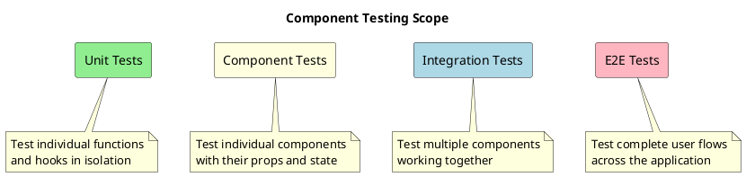
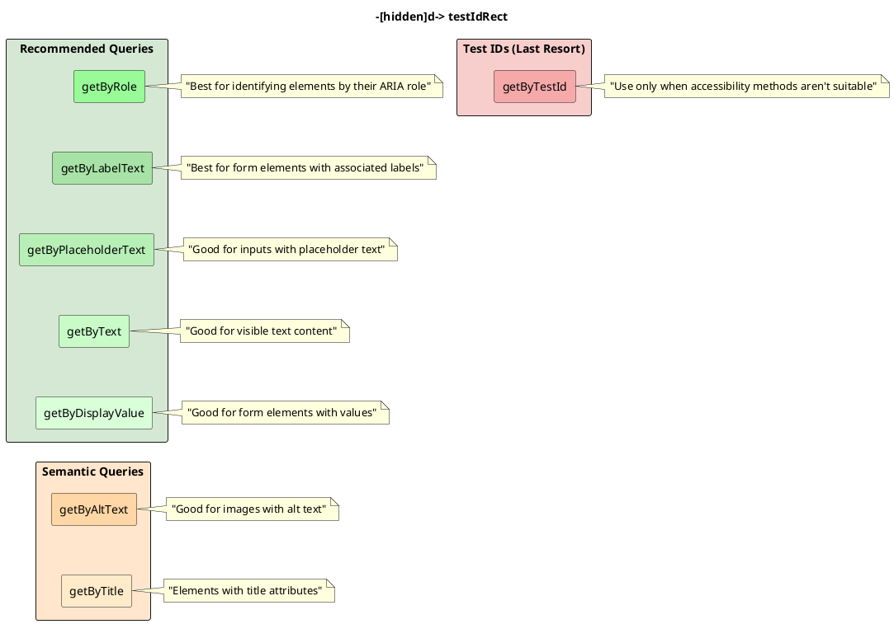

# Component Testing

In this section, we'll explore how to effectively test React components with TypeScript using React Testing Library (RTL). We'll cover rendering components, querying elements, and making assertions about the rendered output.

## Understanding Component Testing

Component testing focuses on verifying that a component renders correctly and behaves as expected when users interact with it. This level of testing sits between unit testing (testing individual functions) and end-to-end testing (testing complete user flows).



## Setting Up for Testing

Before diving into component testing, ensure your testing environment is properly configured:

1. Install necessary packages:
   ```bash
   npm install --save-dev @testing-library/react @testing-library/jest-dom @testing-library/user-event jest ts-jest @types/jest
   ```

2. Create or update your Jest configuration:
   ```javascript
   // jest.config.js
   module.exports = {
     preset: 'ts-jest',
     testEnvironment: 'jsdom',
     setupFilesAfterEnv: ['./src/setupTests.ts'],
     moduleNameMapper: {
       '\\.(css|less|scss)$': 'identity-obj-proxy',
     },
   };
   ```

3. Set up Jest DOM assertions:
   ```typescript
   // src/setupTests.ts
   import '@testing-library/jest-dom';
   ```

4. Add scripts to your package.json:
   ```json
   {
     "scripts": {
       "test": "jest",
       "test:watch": "jest --watch"
     }
   }
   ```

## Basic Component Testing

Let's start with testing a simple component. We'll create a `Greeting` component and test its rendering behavior.

```tsx
// src/components/Greeting/Greeting.tsx
import React from 'react';

interface GreetingProps {
  name: string;
}

function Greeting({ name }: GreetingProps) {
  return <h1>Hello, {name}!</h1>;
}

export default Greeting;
```

Now, let's write a test for this component:

```tsx
// src/components/Greeting/Greeting.test.tsx
import React from 'react';
import { render, screen } from '@testing-library/react';
import Greeting from './Greeting';

describe('Greeting component', () => {
  test('renders the greeting with the provided name', () => {
    render(<Greeting name="World" />);
    
    // Assert that the greeting is rendered with the correct text
    expect(screen.getByText('Hello, World!')).toBeInTheDocument();
  });
  
  test('contains the name within an h1 element', () => {
    render(<Greeting name="Jane" />);
    
    // Assert that the greeting is within an h1 element
    const headingElement = screen.getByRole('heading', { level: 1 });
    expect(headingElement).toHaveTextContent('Hello, Jane!');
  });
});
```

## Rendering Components

React Testing Library provides a `render` function to mount components into a virtual DOM for testing.

### Basic Rendering

```tsx
import { render } from '@testing-library/react';
import MyComponent from './MyComponent';

test('renders component', () => {
  render(<MyComponent />);
  // Now you can make assertions about the rendered output
});
```

### Rendering with Props

```tsx
test('renders with props', () => {
  render(<MyComponent name="John" age={30} />);
  // Test with specific props
});
```

### Using RenderResult

The `render` function returns a `RenderResult` object with useful utilities:

```tsx
test('using render result', () => {
  const { getByText, getByRole, rerender, unmount } = render(<MyComponent />);
  
  // Use utilities from the render result
  expect(getByText('Hello')).toBeInTheDocument();
  
  // Rerender with different props
  rerender(<MyComponent name="Jane" />);
  
  // Unmount component (usually not needed)
  unmount();
});
```

### Rendering with Context

Many components depend on React context. You can wrap components in context providers during testing:

```tsx
// src/contexts/ThemeContext.tsx
import React, { createContext, useState } from 'react';

type Theme = 'light' | 'dark';

interface ThemeContextType {
  theme: Theme;
  toggleTheme: () => void;
}

export const ThemeContext = createContext<ThemeContextType | undefined>(undefined);

export function ThemeProvider({ children }: { children: React.ReactNode }) {
  const [theme, setTheme] = useState<Theme>('light');
  
  const toggleTheme = () => {
    setTheme(prev => prev === 'light' ? 'dark' : 'light');
  };
  
  return (
    <ThemeContext.Provider value={{ theme, toggleTheme }}>
      {children}
    </ThemeContext.Provider>
  );
}

// src/components/ThemeDisplay/ThemeDisplay.tsx
import React, { useContext } from 'react';
import { ThemeContext } from '../../contexts/ThemeContext';

function ThemeDisplay() {
  const themeContext = useContext(ThemeContext);
  
  if (!themeContext) {
    throw new Error('ThemeDisplay must be used within a ThemeProvider');
  }
  
  const { theme, toggleTheme } = themeContext;
  
  return (
    <div>
      <p>Current theme: {theme}</p>
      <button onClick={toggleTheme}>Toggle Theme</button>
    </div>
  );
}

export default ThemeDisplay;
```

Here's how to test a component that uses context:

```tsx
// src/components/ThemeDisplay/ThemeDisplay.test.tsx
import React from 'react';
import { render, screen } from '@testing-library/react';
import userEvent from '@testing-library/user-event';
import ThemeDisplay from './ThemeDisplay';
import { ThemeProvider } from '../../contexts/ThemeContext';

describe('ThemeDisplay component', () => {
  test('displays the current theme', () => {
    render(
      <ThemeProvider>
        <ThemeDisplay />
      </ThemeProvider>
    );
    
    expect(screen.getByText('Current theme: light')).toBeInTheDocument();
  });
  
  test('toggles theme when button is clicked', async () => {
    render(
      <ThemeProvider>
        <ThemeDisplay />
      </ThemeProvider>
    );
    
    // Initial state check
    expect(screen.getByText('Current theme: light')).toBeInTheDocument();
    
    // Click toggle button
    await userEvent.click(screen.getByText('Toggle Theme'));
    
    // Check if theme changed
    expect(screen.getByText('Current theme: dark')).toBeInTheDocument();
  });
  
  test('throws error when used outside of ThemeProvider', () => {
    // Testing error cases
    // Silence console.error for this test
    jest.spyOn(console, 'error').mockImplementation(() => {});
    
    expect(() => {
      render(<ThemeDisplay />);
    }).toThrow('ThemeDisplay must be used within a ThemeProvider');
    
    // Restore console.error
    (console.error as jest.Mock).mockRestore();
  });
});
```

### Creating a Custom Render Function

For components that need the same providers in multiple tests, create a custom render function:

```tsx
// src/test-utils.tsx
import React from 'react';
import { render, RenderOptions } from '@testing-library/react';
import { ThemeProvider } from './contexts/ThemeContext';
import { RecoilRoot } from 'recoil';

// Create a wrapper with all providers
const AllProviders: React.FC<{ children: React.ReactNode }> = ({ children }) => {
  return (
    <RecoilRoot>
      <ThemeProvider>
        {children}
      </ThemeProvider>
    </RecoilRoot>
  );
};

// Custom render function
const customRender = (
  ui: React.ReactElement,
  options?: Omit<RenderOptions, 'wrapper'>,
) => render(ui, { wrapper: AllProviders, ...options });

// Re-export everything from React Testing Library
export * from '@testing-library/react';

// Override the render method
export { customRender as render };
```

Now you can use your custom render function in tests:

```tsx
// Import from your test-utils instead of testing-library/react
import { render, screen } from '../test-utils';
import MyComponent from './MyComponent';

test('renders with all providers', () => {
  render(<MyComponent />);
  // Component now has access to all providers
});
```

## Querying Elements

React Testing Library provides several methods to query elements in the rendered output. These query methods prioritize accessibility and user experience.

### Query Variants

Each query comes in three variants:

1. `getBy*`: Returns the element or throws an error if not found
2. `queryBy*`: Returns the element or returns `null` if not found
3. `findBy*`: Returns a Promise that resolves to the element (for async queries)

Each of these also has an "All" version (`getAllBy*`, `queryAllBy*`, `findAllBy*`) that returns multiple elements.

### Common Query Methods

Here are the most commonly used query methods:

```tsx
// Example component
function UserProfile({ user, onEdit }) {
  return (
    <div>
      <h1>User Profile</h1>
      
      <div data-testid="user-details">
        <p>Name: <span title="Full name">{user.name}</span></p>
        <p>Email: {user.email}</p>
      </div>
      <label htmlFor="notes">Notes:</label>
      <textarea id="notes" placeholder="Add notes here" />
      <button aria-label="Edit profile" onClick={onEdit}>
        Edit
      </button>
    </div>
  );
}

// Examples of different queries
test('query examples', () => {
  render(<UserProfile user={{ name: 'John', email: 'john@example.com', avatar: '/avatar.png' }} onEdit={() => {}} />);
  
  // By text content
  screen.getByText('User Profile');
  screen.getByText(/name:/i);
  screen.getByText('John', { exact: false });
  
  // By role
  screen.getByRole('heading', { name: 'User Profile' });
  screen.getByRole('img', { name: /john's avatar/i });
  screen.getByRole('button', { name: 'Edit profile' });
  
  // By label text
  screen.getByLabelText('Notes:');
  
  // By placeholder
  screen.getByPlaceholderText('Add notes here');
  
  // By test ID (use sparingly)
  screen.getByTestId('user-details');
  
  // By title
  screen.getByTitle('Full name');
  
  // By form attributes
  screen.getByDisplayValue('');  // Empty textarea
});
```

### Query Priority

React Testing Library recommends this query priority (from most to least recommended):

1. Queries accessible to everyone:
   - `getByRole`
   - `getByLabelText`
   - `getByPlaceholderText`
   - `getByText`
   - `getByDisplayValue`

2. Semantic queries:
   - `getByAltText`
   - `getByTitle`

3. Test IDs (last resort):
   - `getByTestId`



## Making Assertions

After querying elements, you need to make assertions about them.

### Common Assertions

React Testing Library extends Jest's assertions with custom matchers from `@testing-library/jest-dom`:

```tsx
// Element presence
expect(element).toBeInTheDocument();
expect(element).not.toBeInTheDocument();

// Visibility
expect(element).toBeVisible();
expect(element).not.toBeVisible();

// Enabled/Disabled
expect(element).toBeEnabled();
expect(element).toBeDisabled();

// Text content
expect(element).toHaveTextContent('Expected text');
expect(element).not.toHaveTextContent('Unexpected text');

// Classes and styles
expect(element).toHaveClass('some-class');
expect(element).toHaveStyle({ color: 'red' });

// Form elements
expect(inputElement).toHaveValue('Expected value');
expect(checkboxElement).toBeChecked();
expect(selectElement).toHaveDisplayValue('Selected option');

// Focus
expect(element).toHaveFocus();

// Attributes
expect(element).toHaveAttribute('src', 'image.jpg');
```

## Comprehensive Component Testing Example

Let's put everything together by creating and testing a more complex component: a card component with expandable/collapsible content.

```tsx
// src/components/ExpandableCard/ExpandableCard.tsx
import React, { useState } from 'react';
import './ExpandableCard.css';

interface ExpandableCardProps {
  title: string;
  children: React.ReactNode;
  initialExpanded?: boolean;
  onToggle?: (isExpanded: boolean) => void;
}

function ExpandableCard({ 
  title, 
  children, 
  initialExpanded = false,
  onToggle
}: ExpandableCardProps) {
  const [isExpanded, setIsExpanded] = useState(initialExpanded);
  
  const handleToggle = () => {
    const newExpandedState = !isExpanded;
    setIsExpanded(newExpandedState);
    if (onToggle) {
      onToggle(newExpandedState);
    }
  };
  
  return (
    <div className="expandable-card" data-testid="expandable-card">
      <div className="card-header">
        <h2>{title}</h2>
        <button 
          aria-label={isExpanded ? 'Collapse' : 'Expand'}
          aria-expanded={isExpanded}
          onClick={handleToggle}
          className="toggle-btn"
        >
          {isExpanded ? '−' : '+'}
        </button>
      </div>
      
      {isExpanded && (
        <div className="card-content">
          {children}
        </div>
      )}
    </div>
  );
}

export default ExpandableCard;
```

```css
/* src/components/ExpandableCard/ExpandableCard.css */
.expandable-card {
  border: 1px solid #ddd;
  border-radius: 4px;
  margin-bottom: 16px;
  background-color: white;
}

.card-header {
  padding: 12px 16px;
  display: flex;
  justify-content: space-between;
  align-items: center;
  background-color: #f5f5f5;
}

.card-header h2 {
  margin: 0;
  font-size: 18px;
}

.toggle-btn {
  background: none;
  border: none;
  font-size: 24px;
  cursor: pointer;
  width: 32px;
  height: 32px;
  border-radius: 50%;
  display: flex;
  align-items: center;
  justify-content: center;
  color: #333;
}

.toggle-btn:hover {
  background-color: #e0e0e0;
}

.card-content {
  padding: 16px;
}
```

Now, let's write comprehensive tests for our ExpandableCard component:

```tsx
// src/components/ExpandableCard/ExpandableCard.test.tsx
import React from 'react';
import { render, screen, fireEvent } from '@testing-library/react';
import userEvent from '@testing-library/user-event';
import ExpandableCard from './ExpandableCard';

describe('ExpandableCard component', () => {
  const defaultProps = {
    title: 'Test Card',
    children: <p>Card content</p>
  };
  
  test('renders with title', () => {
    render(<ExpandableCard {...defaultProps} />);
    
    expect(screen.getByRole('heading', { level: 2 })).toHaveTextContent('Test Card');
  });
  
  test('content is hidden by default', () => {
    render(<ExpandableCard {...defaultProps} />);
    
    expect(screen.queryByText('Card content')).not.toBeInTheDocument();
  });
  
  test('shows content when initialExpanded is true', () => {
    render(<ExpandableCard {...defaultProps} initialExpanded />);
    
    expect(screen.getByText('Card content')).toBeInTheDocument();
  });
  
  test('toggle button expands content when clicked', async () => {
    render(<ExpandableCard {...defaultProps} />);
    
    // Initial state - content is hidden
    expect(screen.queryByText('Card content')).not.toBeInTheDocument();
    
    // Expand the card
    const toggleButton = screen.getByRole('button', { name: 'Expand' });
    await userEvent.click(toggleButton);
    
    // Check if content is visible
    expect(screen.getByText('Card content')).toBeInTheDocument();
    expect(toggleButton).toHaveAttribute('aria-label', 'Collapse');
    expect(toggleButton).toHaveAttribute('aria-expanded', 'true');
  });
  
  test('toggle button collapses content when expanded', async () => {
    render(<ExpandableCard {...defaultProps} initialExpanded />);
    
    // Initial state - content is visible
    expect(screen.getByText('Card content')).toBeInTheDocument();
    
    // Collapse the card
    const toggleButton = screen.getByRole('button', { name: 'Collapse' });
    await userEvent.click(toggleButton);
    
    // Check if content is hidden
    expect(screen.queryByText('Card content')).not.toBeInTheDocument();
    expect(toggleButton).toHaveAttribute('aria-label', 'Expand');
    expect(toggleButton).toHaveAttribute('aria-expanded', 'false');
  });
  
  test('calls onToggle callback when toggled', async () => {
    const handleToggle = jest.fn();
    render(<ExpandableCard {...defaultProps} onToggle={handleToggle} />);
    
    // Toggle to expand
    await userEvent.click(screen.getByRole('button'));
    expect(handleToggle).toHaveBeenCalledWith(true);
    
    // Toggle to collapse
    await userEvent.click(screen.getByRole('button'));
    expect(handleToggle).toHaveBeenCalledWith(false);
    
    // Check total calls
    expect(handleToggle).toHaveBeenCalledTimes(2);
  });
  
  test('applies correct CSS classes', () => {
    render(<ExpandableCard {...defaultProps} />);
    
    expect(screen.getByTestId('expandable-card')).toHaveClass('expandable-card');
    expect(screen.getByRole('heading', { level: 2 }).parentElement).toHaveClass('card-header');
  });
});
```

## Testing with Recoil State Management

Since we're planning to use Recoil for state management, let's see how to test components that use Recoil atoms and selectors:

```tsx
// src/state/atoms.ts
import { atom, selector } from 'recoil';

export const counterState = atom({
  key: 'counterState',
  default: 0,
});

export const doubleCountState = selector({
  key: 'doubleCountState',
  get: ({ get }) => {
    const count = get(counterState);
    return count * 2;
  },
});

// src/components/Counter/Counter.tsx
import React from 'react';
import { useRecoilState, useRecoilValue } from 'recoil';
import { counterState, doubleCountState } from '../../state/atoms';

function Counter() {
  const [count, setCount] = useRecoilState(counterState);
  const doubleCount = useRecoilValue(doubleCountState);
  
  return (
    <div>
      <p data-testid="count-value">Count: {count}</p>
      <p data-testid="double-count-value">Double Count: {doubleCount}</p>
      <button onClick={() => setCount(count + 1)}>Increment</button>
      <button onClick={() => setCount(count - 1)}>Decrement</button>
      <button onClick={() => setCount(0)}>Reset</button>
    </div>
  );
}

export default Counter;
```

To test this component, we need to wrap it with a `RecoilRoot`:

```tsx
// src/components/Counter/Counter.test.tsx
import React from 'react';
import { render, screen } from '@testing-library/react';
import userEvent from '@testing-library/user-event';
import { RecoilRoot, MutableSnapshot } from 'recoil';
import Counter from './Counter';
import { counterState } from '../../state/atoms';

describe('Counter component with Recoil', () => {
  test('renders initial count', () => {
    render(
      <RecoilRoot>
        <Counter />
      </RecoilRoot>
    );
    
    expect(screen.getByTestId('count-value')).toHaveTextContent('Count: 0');
    expect(screen.getByTestId('double-count-value')).toHaveTextContent('Double Count: 0');
  });
  
  test('increments and decrements count', async () => {
    render(
      <RecoilRoot>
        <Counter />
      </RecoilRoot>
    );
    
    // Increment
    await userEvent.click(screen.getByRole('button', { name: 'Increment' }));
    expect(screen.getByTestId('count-value')).toHaveTextContent('Count: 1');
    expect(screen.getByTestId('double-count-value')).toHaveTextContent('Double Count: 2');
    
    // Increment again
    await userEvent.click(screen.getByRole('button', { name: 'Increment' }));
    expect(screen.getByTestId('count-value')).toHaveTextContent('Count: 2');
    expect(screen.getByTestId('double-count-value')).toHaveTextContent('Double Count: 4');
    
    // Decrement
    await userEvent.click(screen.getByRole('button', { name: 'Decrement' }));
    expect(screen.getByTestId('count-value')).toHaveTextContent('Count: 1');
    expect(screen.getByTestId('double-count-value')).toHaveTextContent('Double Count: 2');
  });
  
  test('resets count to 0', async () => {
    // Initialize with a non-zero count
    const initializeState = ({ set }: MutableSnapshot) => {
      set(counterState, 5);
    };
    
    render(
      <RecoilRoot initializeState={initializeState}>
        <Counter />
      </RecoilRoot>
    );
    
    // Check initial value
    expect(screen.getByTestId('count-value')).toHaveTextContent('Count: 5');
    expect(screen.getByTestId('double-count-value')).toHaveTextContent('Double Count: 10');
    
    // Reset
    await userEvent.click(screen.getByRole('button', { name: 'Reset' }));
    expect(screen.getByTestId('count-value')).toHaveTextContent('Count: 0');
    expect(screen.getByTestId('double-count-value')).toHaveTextContent('Double Count: 0');
  });
});
```

## Testing Loading and Error States

Components often have loading and error states that need testing. Let's create and test a data fetching component:

```tsx
// src/components/UserList/UserList.tsx
import React, { useState, useEffect } from 'react';

interface User {
  id: number;
  name: string;
  email: string;
}

function UserList() {
  const [users, setUsers] = useState<User[]>([]);
  const [loading, setLoading] = useState(true);
  const [error, setError] = useState<string | null>(null);

  useEffect(() => {
    const fetchUsers = async () => {
      try {
        setLoading(true);
        const response = await fetch('https://jsonplaceholder.typicode.com/users');
        
        if (!response.ok) {
          throw new Error(`HTTP error! Status: ${response.status}`);
        }
        
        const data = await response.json();
        setUsers(data);
      } catch (err) {
        setError(err instanceof Error ? err.message : 'An error occurred');
      } finally {
        setLoading(false);
      }
    };

    fetchUsers();
  }, []);

  if (loading) {
    return <div data-testid="loading">Loading users...</div>;
  }

  if (error) {
    return <div data-testid="error">Error: {error}</div>;
  }

  if (users.length === 0) {
    return <div data-testid="no-users">No users found.</div>;
  }

  return (
    <div>
      <h2>Users</h2>
      <ul data-testid="user-list">
        {users.map((user) => (
          <li key={user.id}>
            <strong>{user.name}</strong> - {user.email}
          </li>
        ))}
      </ul>
    </div>
  );
}

export default UserList;
```

Here's how to test loading, success, and error states using Jest's mocking capabilities:

```tsx
// src/components/UserList/UserList.test.tsx
import React from 'react';
import { render, screen, waitFor } from '@testing-library/react';
import UserList from './UserList';

// Mock the global fetch function
global.fetch = jest.fn();

describe('UserList component', () => {
  // Helper function to set up fetch mock
  function mockFetch(success: boolean, data?: any) {
    if (success) {
      (global.fetch as jest.Mock).mockResolvedValueOnce({
        ok: true,
        json: async () => data || [],
      });
    } else {
      (global.fetch as jest.Mock).mockResolvedValueOnce({
        ok: false,
        status: 500,
      });
    }
  }
  
  beforeEach(() => {
    jest.clearAllMocks();
  });

  test('renders loading state initially', () => {
    // Setup mock to delay resolution
    mockFetch(true, []);
    
    render(<UserList />);
    
    expect(screen.getByTestId('loading')).toBeInTheDocument();
    expect(screen.queryByTestId('error')).not.toBeInTheDocument();
    expect(screen.queryByTestId('user-list')).not.toBeInTheDocument();
  });
  
  test('renders user list when fetch succeeds', async () => {
    // Mock data
    const mockUsers = [
      { id: 1, name: 'John Doe', email: 'john@example.com' },
      { id: 2, name: 'Jane Smith', email: 'jane@example.com' },
    ];
    
    // Setup mock
    mockFetch(true, mockUsers);
    
    render(<UserList />);
    
    // Wait for loading to finish
    await waitFor(() => {
      expect(screen.queryByTestId('loading')).not.toBeInTheDocument();
    });
    
    // Check for user list
    expect(screen.getByTestId('user-list')).toBeInTheDocument();
    expect(screen.getByText('John Doe')).toBeInTheDocument();
    expect(screen.getByText('jane@example.com')).toBeInTheDocument();
  });
  
  test('renders no users message when fetch returns empty array', async () => {
    // Setup mock with empty array
    mockFetch(true, []);
    
    render(<UserList />);
    
    // Wait for loading to finish
    await waitFor(() => {
      expect(screen.queryByTestId('loading')).not.toBeInTheDocument();
    });
    
    // Check for no users message
    expect(screen.getByTestId('no-users')).toBeInTheDocument();
    expect(screen.getByText('No users found.')).toBeInTheDocument();
  });
  
  test('renders error message when fetch fails', async () => {
    // Setup mock to fail
    mockFetch(false);
    
    render(<UserList />);
    
    // Wait for loading to finish
    await waitFor(() => {
      expect(screen.queryByTestId('loading')).not.toBeInTheDocument();
    });
    
    // Check for error message
    expect(screen.getByTestId('error')).toBeInTheDocument();
    expect(screen.getByText(/Error:/i)).toBeInTheDocument();
  });
});
```

## Best Practices for Component Testing

1. **Test from the user's perspective**: Focus on what users see and do, not implementation details.

2. **Test Component API**: Test all props and their effects on the component's behavior.

3. **Give components good accessibility**: Use semantic HTML and ARIA attributes to make testing easier and improve accessibility.

4. **Avoid implementation details**: Don't test component state directly, focus on output.

5. **Minimize use of `data-testid`**: Prefer querying by role, text, or label.

6. **Keep tests simple**: One assertion per test is ideal, though not always practical.

7. **Mock external dependencies**: Stub out API calls, browser APIs, etc.

8. **Test all states**: Test loading, success, error, and empty states.

9. **Test edge cases**: Test boundary conditions and unexpected inputs.

10. **Reset state between tests**: Ensure test isolation to prevent test interdependence.

11. **Use `screen` queries**: Prefer `screen.getByRole()` over destructuring queries from render.

12. **Use `userEvent` over `fireEvent` when possible**: It more closely simulates real user interactions.

## Common Testing Anti-Patterns

1. **Snapshot testing everything**: Snapshots are brittle and don't communicate intent.

2. **Testing implementation details**: Testing state or methods directly makes tests brittle.

3. **Too many mocks**: Excessive mocking can lead to tests that don't catch real issues.

4. **Duplicate assertions**: Repeating the same assertions across tests increases maintenance cost.

5. **Testing the library**: Don't test that React or other libraries work correctly.

6. **Non-isolated tests**: Tests should be independent and not rely on the state of other tests.

## Conclusion

Component testing is essential for building reliable React applications. By focusing on user behavior and accessibility, you can create tests that not only verify your components work correctly but also improve their quality.

In this section, we've covered:
- Setting up a testing environment for React components
- Rendering components and querying elements
- Making assertions about rendered output
- Testing components with state and props
- Testing components with context and Recoil
- Testing loading, error, and success states

In the next section, we'll explore testing user interactions in more depth, focusing on forms, events, and user workflows.
