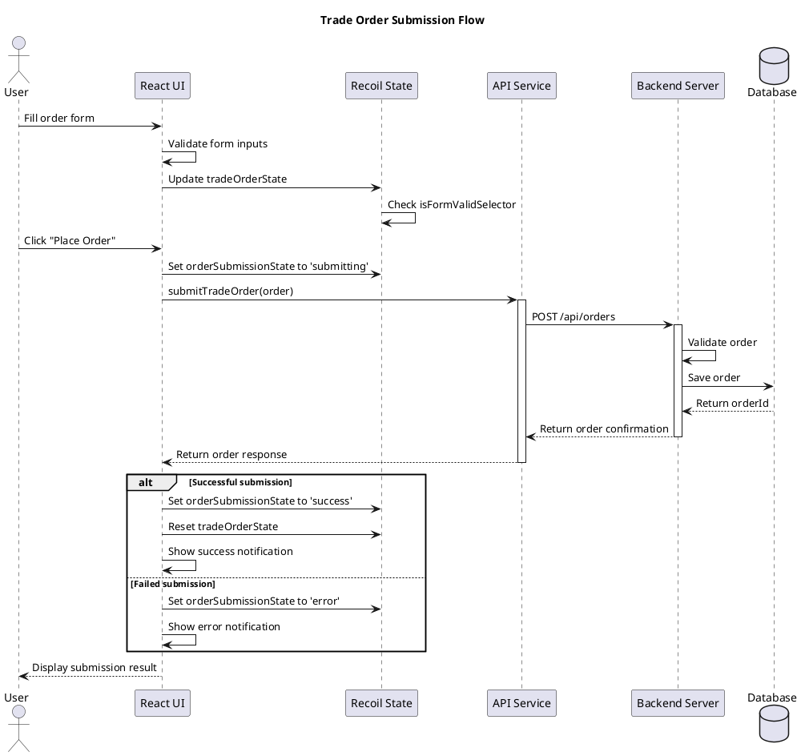
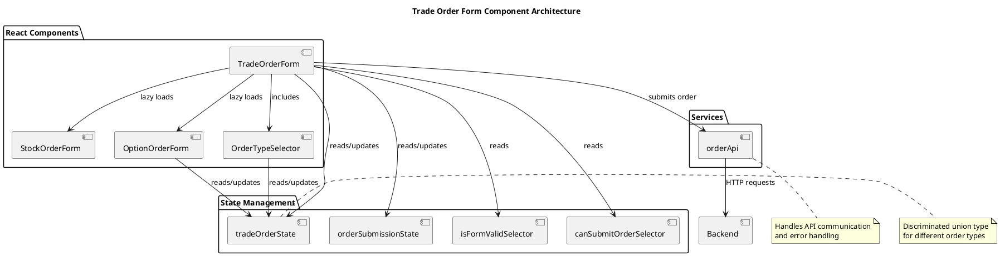
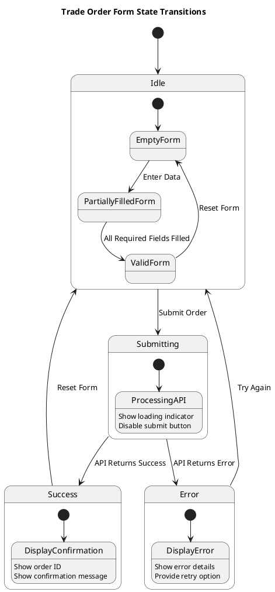
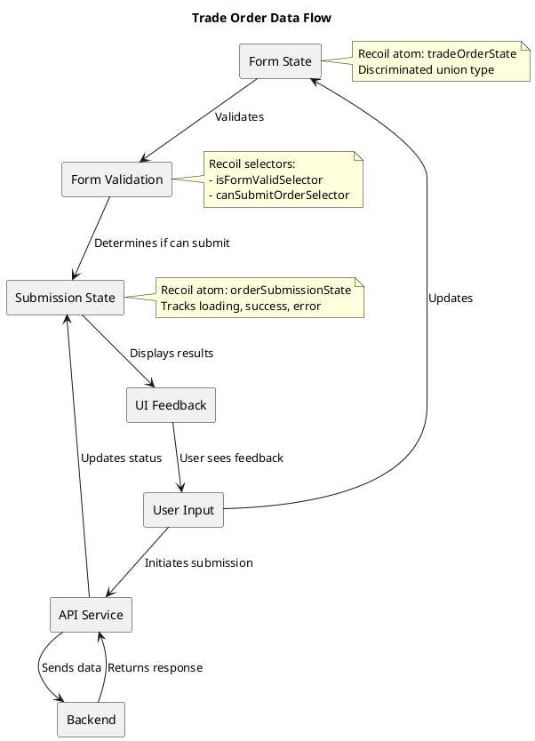

# Building and Testing a Financial Trade Order Application

This guide walks through building a dynamic trade order form for financial instruments using React 18+, TypeScript, and Recoil for state management. We'll implement comprehensive tests using Jest and React Testing Library with `@testing-library/user-event` for realistic user interactions.

## Application Requirements

Our application needs to:

1. Allow users to submit orders for financial instruments (stocks or options)
2. Provide dynamic form fields based on the instrument type:
   - All orders: Ticker symbol (e.g., MSFT, GOOGL, AAPL)
   - Options only: Strike price and expiry date
3. Support market orders and limit orders (with price specification)
4. Validate user inputs
5. Submit the order to an API

## Project Setup

### Dependencies

First, let's set up our project with the necessary dependencies:

```bash
# Create a new React TypeScript project
npx create-react-app trade-order-app --template typescript

# Navigate to the project directory
cd trade-order-app

# Install additional dependencies
npm install recoil axios @mui/material @emotion/react @emotion/styled
npm install --save-dev jest @testing-library/react @testing-library/user-event @testing-library/jest-dom @types/jest
```

### Webpack Configuration

Since we're using webpack instead of Vite, we'll need to customize the webpack configuration. We'll use `react-app-rewired` to avoid ejecting:

```bash
npm install --save-dev react-app-rewired customize-cra
```

Create a `config-overrides.js` file in the root of your project:

```javascript
// config-overrides.js
const { override, addBabelPreset } = require('customize-cra');

module.exports = override(
  // Add your webpack customizations here
  addBabelPreset('@babel/preset-typescript')
);
```

Update your `package.json` scripts:

```json
"scripts": {
  "start": "react-app-rewired start",
  "build": "react-app-rewired build",
  "test": "react-app-rewired test --env=jsdom",
  "eject": "react-scripts eject"
}
```

## Recoil State Management Setup

Let's define our Recoil atoms and selectors for managing the trade order form state using a discriminated union pattern:

```tsx
// src/state/atoms.ts
import { atom, selector } from 'recoil';

export type OrderType = 'market' | 'limit';

// Base interface with common properties for all order types
interface BaseOrderState {
  ticker: string;
  quantity: number;
  orderType: OrderType;
  limitPrice: number | null; // Only used when orderType is 'limit'
}

// Stock-specific order state
interface StockOrderState extends BaseOrderState {
  instrumentType: 'stock';
}

// Option-specific order state
interface OptionOrderState extends BaseOrderState {
  instrumentType: 'option';
  strikePrice: number;
  expiryDate: string;
}

// Discriminated union type
export type TradeOrderState = StockOrderState | OptionOrderState;

// Helper function to create initial state
const createInitialState = (): TradeOrderState => ({
  ticker: '',
  instrumentType: 'stock',
  orderType: 'market',
  quantity: 1,
  limitPrice: null,
});

export const tradeOrderState = atom<TradeOrderState>({
  key: 'tradeOrderState',
  default: createInitialState(),
});

export const isFormValidSelector = selector({
  key: 'isFormValidSelector',
  get: ({ get }) => {
    const order = get(tradeOrderState);
    
    // Basic validation rules for all orders
    if (!order.ticker || order.ticker.length < 1) return false;
    if (order.quantity <= 0) return false;
    if (order.orderType === 'limit' && (!order.limitPrice || order.limitPrice <= 0)) return false;
    
    // Option-specific validation
    if (order.instrumentType === 'option') {
      if (!order.strikePrice || order.strikePrice <= 0) return false;
      if (!order.expiryDate) return false;
    }
    
    return true;
  },
});
```

## Enhanced Recoil State Management for Order

Let's enhance our Recoil state management to track the order submission process:

```tsx
// src/state/orderAtoms.ts
import { atom, selector } from 'recoil';
import { ApiError, OrderResponse } from '../services/orderApi';

// Submission state atom
export interface OrderSubmissionState {
  status: 'idle' | 'submitting' | 'success' | 'error';
  response?: OrderResponse;
  error?: ApiError | Error;
}

export const orderSubmissionState = atom<OrderSubmissionState>({
  key: 'orderSubmissionState',
  default: {
    status: 'idle',
  },
});

// Selector to determine if order can be submitted
export const canSubmitOrderSelector = selector({
  key: 'canSubmitOrderSelector',
  get: ({ get }) => {
    const isFormValid = get(isFormValidSelector);
    const submissionState = get(orderSubmissionState);
    
    // Can submit if form is valid and not currently submitting
    return isFormValid && submissionState.status !== 'submitting';
  },
});

// Selector to get a human-readable status message
export const submissionStatusMessageSelector = selector({
  key: 'submissionStatusMessageSelector',
  get: ({ get }) => {
    const submission = get(orderSubmissionState);
    
    switch (submission.status) {
      case 'idle':
        return '';
      case 'submitting':
        return 'Submitting order...';
      case 'success':
        return `Order confirmed! Order ID: ${submission.response?.orderId}`;
      case 'error':
        return `Error: ${submission.error?.message || 'An unknown error occurred'}`;
      default:
        return '';
    }
  },
});
```

## Enhanced Recoil Features

Our application already uses atoms and selectors effectively, but we can further improve it with two powerful Recoil features: Atom Effects and the Transaction API.

### Atom Effects for Form Persistence

Atom Effects allow us to add side effects to our atoms, such as persisting form state to localStorage. This ensures users won't lose their work if they accidentally navigate away or refresh the page:

```tsx
// src/state/atoms.ts
import { atom, selector, AtomEffect } from 'recoil';
import { TradeOrderState } from '../types';

// Persistence effect for saving form state to localStorage
const localStoragePersist: AtomEffect<TradeOrderState> = ({setSelf, onSet, trigger}) => {
  // Initialize atom from stored value on page load
  if (trigger === 'get') {
    const savedValue = localStorage.getItem('tradeOrderForm');
    if (savedValue != null) {
      try {
        const parsedValue = JSON.parse(savedValue);
        setSelf(parsedValue);
      } catch (error) {
        console.error('Failed to parse stored order form data', error);
      }
    }
  }

  // Save to localStorage on state changes
  onSet((newValue, _, isReset) => {
    isReset
      ? localStorage.removeItem('tradeOrderForm')
      : localStorage.setItem('tradeOrderForm', JSON.stringify(newValue));
  });
};

// Add the effect to the atom
export const tradeOrderState = atom<TradeOrderState>({
  key: 'tradeOrderState',
  default: createInitialState(),
  effects: [
    localStoragePersist
  ]
});
```

### Transaction API for Coordinated Updates

When submitting an order, we need to update multiple atoms atomically. The `useRecoilTransaction_UNSTABLE` hook allows us to group these updates into a single transaction:

```tsx
// src/hooks/useOrderTransaction.ts
import { useRecoilTransaction_UNSTABLE } from 'recoil';
import { tradeOrderState, orderSubmissionState } from '../state/atoms';
import { OrderResponse } from '../services/orderApi';

export function useOrderTransaction() {
  return useRecoilTransaction_UNSTABLE(({set, reset}) => (
    response: OrderResponse | null, 
    error: Error | null
  ) => {
    if (response) {
      // Success transaction - update multiple atoms in one go
      set(orderSubmissionState, {
        status: 'success',
        response,
        error: undefined
      });
      
      // Reset the form
      reset(tradeOrderState);
      
      // Could also update other atoms like orderHistoryState
      // set(orderHistoryState, prev => [...prev, {order, response}]);
    } else if (error) {
      // Error transaction
      set(orderSubmissionState, {
        status: 'error',
        response: undefined,
        error
      });
    }
  });
}
```

Update the submit handler in the TradeOrderForm component:

```tsx
// src/components/TradeOrderForm/index.tsx
import { useOrderTransaction } from '../../hooks/useOrderTransaction';

// ...existing code...

export const TradeOrderForm: React.FC = () => {
  // ...existing state...
  const performOrderTransaction = useOrderTransaction();

  const handleSubmit = async (e: React.FormEvent) => {
    e.preventDefault();
    if (!canSubmit) return;
    
    // Update submission state to "submitting"
    setSubmission({
      status: 'submitting',
    });
    
    try {
      // Call API service to submit the order
      const response = await submitTradeOrder(order);
      
      // Use transaction for coordinated state updates
      performOrderTransaction(response, null);
      
      // Show success snackbar
      setSnackbarOpen(true);
    } catch (error) {
      // Use transaction for error state
      performOrderTransaction(null, error as Error);
      
      // Show error snackbar
      setSnackbarOpen(true);
      
      console.error('Error submitting order:', error);
    }
  };

  // ...existing render code...
}
```

### Atom Family for Order History

For a more complete application, we can track order history using an atom family:

```tsx
// src/state/historyAtoms.ts
import { atomFamily, selectorFamily, atom } from 'recoil';
import { TradeOrderState } from '../types';
import { OrderResponse } from '../services/orderApi';

// Store completed orders by ID
export interface OrderHistoryItem {
  order: TradeOrderState;
  response: OrderResponse;
  timestamp: string;
}

export const orderHistoryItemFamily = atomFamily<OrderHistoryItem, string>({
  key: 'orderHistoryItem',
  default: (id) => ({
    order: {} as TradeOrderState,
    response: {
      orderId: id,
      status: 'pending',
      timestamp: new Date().toISOString()
    },
    timestamp: new Date().toISOString()
  })
});

// Track all order IDs
export const orderHistoryIdsState = atom<string[]>({
  key: 'orderHistoryIds',
  default: [],
});

// Selector to get the full history
export const orderHistorySelector = selector({
  key: 'orderHistorySelector',
  get: ({get}) => {
    const ids = get(orderHistoryIdsState);
    return ids.map(id => get(orderHistoryItemFamily(id)));
  }
});
```

### Benefits of These Enhancements

These Recoil features provide several significant benefits:

1. **Improved User Experience**: Form persistence prevents data loss due to accidental page refreshes or navigation
2. **State Consistency**: Transactions ensure multiple atoms update together, preventing inconsistent UI states
3. **Performance Optimization**: Batch updates reduce unnecessary re-renders
4. **Scalability**: The atom family approach allows efficient management of growing datasets
5. **Developer Experience**: More declarative approach to complex state management patterns

These enhancements make the application more robust without significantly increasing code complexity.

## Creating the Trade Order Form Component

Now let's implement the main trade order form component:

```tsx
// src/components/TradeOrderForm/index.tsx
import React, { lazy, Suspense } from 'react';
import { useRecoilState, useRecoilValue, useSetRecoilState } from 'recoil';
import { 
  tradeOrderState, 
  isFormValidSelector, 
  orderSubmissionState,
  canSubmitOrderSelector,
  submissionStatusMessageSelector
} from '../../state/atoms';
import { submitTradeOrder } from '../../services/orderApi';
import { 
  Box, 
  Button, 
  FormControl, 
  FormControlLabel, 
  FormLabel, 
  Paper, 
  Radio, 
  RadioGroup, 
  TextField, 
  Typography, 
  CircularProgress,
  Alert,
  Snackbar
} from '@mui/material';
import OrderTypeSelector from './OrderTypeSelector';

// Lazy load instrument-specific components
const StockOrderForm = lazy(() => import('./StockOrderForm'));
const OptionOrderForm = lazy(() => import('./OptionOrderForm'));

export const TradeOrderForm: React.FC = () => {
  const [order, setOrder] = useRecoilState(tradeOrderState);
  const [submission, setSubmission] = useRecoilState(orderSubmissionState);
  const isFormValid = useRecoilValue(isFormValidSelector);
  const canSubmit = useRecoilValue(canSubmitOrderSelector);
  const statusMessage = useRecoilValue(submissionStatusMessageSelector);
  
  // State for Snackbar
  const [snackbarOpen, setSnackbarOpen] = React.useState(false);
  
  // Handle Snackbar close
  const handleSnackbarClose = () => {
    setSnackbarOpen(false);
  };

  const handleTickerChange = (e: React.ChangeEvent<HTMLInputElement>) => {
    setOrder(prev => ({ ...prev, ticker: e.target.value.toUpperCase() }));
  };

  const handleInstrumentTypeChange = (e: React.ChangeEvent<HTMLInputElement>) => {
    const newType = e.target.value as 'stock' | 'option';
    
    if (newType === 'stock') {
      setOrder({
        ticker: order.ticker,
        instrumentType: 'stock',
        orderType: order.orderType,
        quantity: order.quantity,
        limitPrice: order.orderType === 'limit' ? order.limitPrice : null,
      });
    } else {
      setOrder({
        ticker: order.ticker,
        instrumentType: 'option',
        orderType: order.orderType,
        quantity: order.quantity,
        limitPrice: order.orderType === 'limit' ? order.limitPrice : null,
        strikePrice: 100, // Default value
        expiryDate: '2023-12-15', // Default value
      });
    }
  };

  const handleSubmit = async (e: React.FormEvent) => {
    e.preventDefault();
    if (!canSubmit) return;
    
    // Update submission state to "submitting"
    setSubmission({
      status: 'submitting',
    });
    
    try {
      // Call API service to submit the order
      const response = await submitTradeOrder(order);
      
      // Update submission state on success
      setSubmission({
        status: 'success',
        response,
      });
      
      // Show success snackbar
      setSnackbarOpen(true);
      
      // Reset form if submission was successful
      if (response.status === 'confirmed') {
        setOrder(createInitialState());
      }
    } catch (error) {
      // Update submission state on error
      setSubmission({
        status: 'error',
        error: error as Error,
      });
      
      // Show error snackbar
      setSnackbarOpen(true);
      
      console.error('Error submitting order:', error);
    }
  };

  return (
    <Paper elevation={3} sx={{ p: 3, maxWidth: 600, mx: 'auto', mt: 4 }}>
      <Typography variant="h5" component="h1" gutterBottom>
        Trade Order Form
      </Typography>
      
      {/* Show submission status */}
      {submission.status === 'submitting' && (
        <Alert severity="info" sx={{ mb: 2 }}>
          Submitting order...
        </Alert>
      )}
      
      {submission.status === 'success' && (
        <Alert severity="success" sx={{ mb: 2 }}>
          Order {submission.response?.orderId} submitted successfully with status: {submission.response?.status}
        </Alert>
      )}
      
      {submission.status === 'error' && (
        <Alert severity="error" sx={{ mb: 2 }}>
          Error: {submission.error instanceof Error ? submission.error.message : 'Unknown error'}
        </Alert>
      )}
      
      <form onSubmit={handleSubmit}>
        {/* Common fields for all orders */}
        <Box sx={{ mb: 2 }}>
          <TextField
            label="Ticker Symbol"
            fullWidth
            value={order.ticker}
            onChange={handleTickerChange}
            placeholder="e.g., MSFT, GOOGL, AAPL"
            inputProps={{ 'data-testid': 'ticker-input' }}
            required
            margin="normal"
          />
        </Box>

        {/* Instrument Type Selection */}
        <Box sx={{ mb: 2 }}>
          <FormControl component="fieldset" margin="normal">
            <FormLabel component="legend">Instrument Type</FormLabel>
            <RadioGroup
              row
              value={order.instrumentType}
              onChange={handleInstrumentTypeChange}
            >
              <FormControlLabel 
                value="stock" 
                control={<Radio data-testid="stock-radio" />} 
                label="Stock" 
              />
              <FormControlLabel 
                value="option" 
                control={<Radio data-testid="option-radio" />} 
                label="Option" 
              />
            </RadioGroup>
          </FormControl>
        </Box>

        {/* Instrument-specific form components */}
        <Suspense fallback={<Box sx={{ display: 'flex', justifyContent: 'center' }}><CircularProgress size={24} /></Box>}>
          {order.instrumentType === 'stock' ? <StockOrderForm /> : <OptionOrderForm />}
        </Suspense>

        {/* Quantity field */}
        <Box sx={{ mb: 2 }}>
          <TextField
            label="Quantity"
            type="number"
            fullWidth
            value={order.quantity}
            onChange={(e) => setOrder(prev => ({ ...prev, quantity: parseInt(e.target.value, 10) || 0 }))}
            inputProps={{ min: 1, 'data-testid': 'quantity-input' }}
            required
            margin="normal"
          />
        </Box>

        {/* Order Type Component */}
        <OrderTypeSelector />

        <Button 
          type="submit" 
          variant="contained" 
          color="primary" 
          fullWidth
          disabled={!canSubmit}
          data-testid="submit-button"
          startIcon={submission.status === 'submitting' ? <CircularProgress size={20} color="inherit" /> : null}
        >
          {submission.status === 'submitting' ? 'Submitting...' : 'Place Order'}
        </Button>
      </form>
      
      {/* Notification for status changes */}
      <Snackbar
        open={snackbarOpen}
        autoHideDuration={6000}
        onClose={handleSnackbarClose}
        message={statusMessage}
        data-testid="submission-snackbar"
      />
    </Paper>
  );
};

export default TradeOrderForm;
```

Now let's create the instrument-specific components:

```tsx
// src/components/TradeOrderForm/StockOrderForm.tsx
import React from 'react';
import { Box, Typography } from '@mui/material';

const StockOrderForm: React.FC = () => {
  return (
    <Box sx={{ mb: 2 }}>
      <Typography variant="body2" color="text.secondary">
        Standard stock order - no additional information needed.
      </Typography>
    </Box>
  );
};

export default StockOrderForm;
```

```tsx
// src/components/TradeOrderForm/OptionOrderForm.tsx
import React from 'react';
import { useRecoilState } from 'recoil';
import { tradeOrderState } from '../../state/atoms';
import { Box, FormControl, InputLabel, MenuItem, Select, SelectChangeEvent } from '@mui/material';

// Mock data for dropdowns
const EXPIRY_DATES = [
  '2023-12-15',
  '2023-12-22',
  '2023-12-29',
  '2024-01-19',
  '2024-02-16',
];

const STRIKE_PRICES = [
  100, 105, 110, 115, 120, 125, 130, 135, 140, 145, 150
];

const OptionOrderForm: React.FC = () => {
  const [order, setOrder] = useRecoilState(tradeOrderState);

  // Ensure order is of type OptionOrderState
  if (order.instrumentType !== 'option') {
    throw new Error('OptionOrderForm rendered with non-option order type');
  }

  const handleStrikePriceChange = (e: SelectChangeEvent<number>) => {
    const strikePrice = e.target.value as number;
    setOrder(prev => {
      if (prev.instrumentType === 'option') {
        return { ...prev, strikePrice };
      }
      return prev;
    });
  };

  const handleExpiryDateChange = (e: SelectChangeEvent<string>) => {
    const expiryDate = e.target.value;
    setOrder(prev => {
      if (prev.instrumentType === 'option') {
        return { ...prev, expiryDate };
      }
      return prev;
    });
  };

  return (
    <Box sx={{ mb: 2, display: 'flex', gap: 2 }}>
      <FormControl fullWidth margin="normal">
        <InputLabel>Strike Price</InputLabel>
        <Select
          value={order.strikePrice}
          onChange={handleStrikePriceChange}
          label="Strike Price"
          inputProps={{ 'data-testid': 'strike-select' }}
          required
        >
          {STRIKE_PRICES.map(price => (
            <MenuItem key={price} value={price}>${price}</MenuItem>
          ))}
        </Select>
      </FormControl>

      <FormControl fullWidth margin="normal">
        <InputLabel>Expiry Date</InputLabel>
        <Select
          value={order.expiryDate}
          onChange={handleExpiryDateChange}
          label="Expiry Date"
          inputProps={{ 'data-testid': 'expiry-select' }}
          required
        >
          {EXPIRY_DATES.map(date => (
            <MenuItem key={date} value={date}>{date}</MenuItem>
          ))}
        </Select>
      </FormControl>
    </Box>
  );
};

export default OptionOrderForm;
```

```tsx
// src/components/TradeOrderForm/OrderTypeSelector.tsx
import React from 'react';
import { useRecoilState } from 'recoil';
import { tradeOrderState, OrderType } from '../../state/atoms';
import { Box, FormControl, FormControlLabel, FormLabel, Radio, RadioGroup, TextField } from '@mui/material';

const OrderTypeSelector: React.FC = () => {
  const [order, setOrder] = useRecoilState(tradeOrderState);

  const handleOrderTypeChange = (e: React.ChangeEvent<HTMLInputElement>) => {
    const newType = e.target.value as OrderType;
    setOrder(prev => ({
      ...prev,
      orderType: newType,
      // Reset limit price when switching to market
      ...(newType === 'market' ? { limitPrice: null } : { limitPrice: 0.01 })
    }));
  };

  const handleLimitPriceChange = (e: React.ChangeEvent<HTMLInputElement>) => {
    const limitPrice = parseFloat(e.target.value) || 0;
    setOrder(prev => ({ ...prev, limitPrice }));
  };

  return (
    <>
      <Box sx={{ mb: 2 }}>
        <FormControl component="fieldset" margin="normal">
          <FormLabel component="legend">Order Type</FormLabel>
          <RadioGroup
            row
            value={order.orderType}
            onChange={handleOrderTypeChange}
          >
            <FormControlLabel 
              value="market" 
              control={<Radio data-testid="market-radio" />} 
              label="Market" 
            />
            <FormControlLabel 
              value="limit" 
              control={<Radio data-testid="limit-radio" />} 
              label="Limit" 
            />
          </RadioGroup>
        </FormControl>
      </Box>

      {order.orderType === 'limit' && (
        <Box sx={{ mb: 2 }}>
          <TextField
            label="Limit Price ($)"
            type="number"
            fullWidth
            value={order.limitPrice || ''}
            onChange={handleLimitPriceChange}
            inputProps={{ step: '0.01', min: '0.01', 'data-testid': 'limit-price-input' }}
            required
            margin="normal"
          />
        </Box>
      )}
    </>
  );
};

export default OrderTypeSelector;
```

## App Component with Recoil Provider

Let's set up our main App component with the Recoil provider:

```tsx
// src/App.tsx
import React from 'react';
import { RecoilRoot } from 'recoil';
import { TradeOrderForm } from './components/TradeOrderForm';
import { CssBaseline, Container } from '@mui/material';

function App() {
  return (
    <RecoilRoot>
      <CssBaseline />
      <Container>
        <TradeOrderForm />
      </Container>
    </RecoilRoot>
  );
}

export default App;
```

## Testing the Trade Order Form

Now let's create comprehensive tests for our trade order form using Jest and React Testing Library with @testing-library/user-event:

```tsx
// src/components/TradeOrderForm/index.test.tsx
import React, { Suspense } from 'react';
import { render, screen, act, waitFor } from '@testing-library/react';
import userEvent from '@testing-library/user-event';
import { RecoilRoot } from 'recoil';
import TradeOrderForm from './index';
import { submitTradeOrder } from '../../services/orderApi';

// Mock the API service
jest.mock('../../services/orderApi', () => ({
  submitTradeOrder: jest.fn(),
}));

// Mock the lazy-loaded components
jest.mock('./StockOrderForm', () => {
  return {
    __esModule: true,
    default: () => <div data-testid="stock-form">Stock Form Component</div>
  };
});

jest.mock('./OptionOrderForm', () => {
  return {
    __esModule: true,
    default: () => <div data-testid="option-form">Option Form Component</div>
  };
});

describe('TradeOrderForm', () => {
  // Helper to render component with Recoil and Suspense
  const renderWithRecoilAndSuspense = () => {
    return render(
      <RecoilRoot>
        <Suspense fallback={<div>Loading...</div>}>
          <TradeOrderForm />
        </Suspense>
      </RecoilRoot>
    );
  };

  // Setup user event for async testing
  const setupUserEvent = () => userEvent.setup();

  // Reset mocks between tests
  beforeEach(() => {
    jest.resetAllMocks();
    (submitTradeOrder as jest.Mock).mockResolvedValue({
      orderId: 'order-123',
      status: 'confirmed',
      timestamp: new Date().toISOString(),
    });
  });

  test('renders the trade order form with default values', async () => {
    renderWithRecoilAndSuspense();
    
    // Wait for suspense to resolve
    await screen.findByTestId('stock-form');
    
    // Check essential elements are rendered
    expect(screen.getByText('Trade Order Form')).toBeInTheDocument();
    expect(screen.getByTestId('ticker-input')).toBeInTheDocument();
    expect(screen.getByTestId('stock-radio')).toBeChecked();
    expect(screen.getByTestId('option-radio')).not.toBeChecked();
    expect(screen.getByTestId('market-radio')).toBeChecked();
    expect(screen.getByTestId('limit-radio')).not.toBeChecked();
    expect(screen.getByTestId('quantity-input')).toHaveValue(1);
    
    // Stock form should be visible, option form should not
    expect(screen.getByTestId('stock-form')).toBeInTheDocument();
    expect(screen.queryByTestId('option-form')).not.toBeInTheDocument();
    
    // Limit price field should not be present initially
    expect(screen.queryByTestId('limit-price-input')).not.toBeInTheDocument();
  });

  test('switches between stock and option forms', async () => {
    renderWithRecoilAndSuspense();
    const user = setupUserEvent();
    
    // Wait for suspense to resolve
    await screen.findByTestId('stock-form');
    
    // Initially, stock form is visible
    expect(screen.getByTestId('stock-form')).toBeInTheDocument();
    expect(screen.queryByTestId('option-form')).not.toBeInTheDocument();
    
    // Select option instrument type
    await user.click(screen.getByTestId('option-radio'));
    
    // Option form should now be visible, stock form should not
    await screen.findByTestId('option-form');
    expect(screen.getByTestId('option-form')).toBeInTheDocument();
    expect(screen.queryByTestId('stock-form')).not.toBeInTheDocument();
  });

  test('submits order and shows success message on successful API call', async () => {
    renderWithRecoilAndSuspense();
    const user = setupUserEvent();
    
    // Fill out a basic stock market order
    await user.type(screen.getByTestId('ticker-input'), 'MSFT');
    await user.clear(screen.getByTestId('quantity-input'));
    await user.type(screen.getByTestId('quantity-input'), '10');
    
    // Submit the form
    await user.click(screen.getByTestId('submit-button'));
    
    // Check if API was called with correct data
    expect(submitTradeOrder).toHaveBeenCalledWith(
      expect.objectContaining({
        ticker: 'MSFT',
        instrumentType: 'stock',
        orderType: 'market',
        quantity: 10,
      })
    );
    
    // Wait for success message
    await waitFor(() => {
      expect(screen.getByText(/Order order-123 submitted successfully/)).toBeInTheDocument();
    });
  });

  test('shows error message when API call fails', async () => {
    // Setup API to fail
    (submitTradeOrder as jest.Mock).mockRejectedValue({
      message: 'Server error',
    });
    
    renderWithRecoilAndSuspense();
    const user = setupUserEvent();
    
    // Fill out a basic stock market order
    await user.type(screen.getByTestId('ticker-input'), 'MSFT');
    await user.clear(screen.getByTestId('quantity-input'));
    await user.type(screen.getByTestId('quantity-input'), '10');
    
    // Submit the form
    await user.click(screen.getByTestId('submit-button'));
    
    // Wait for error message
    await waitFor(() => {
      expect(screen.getByText(/Error: Server error/)).toBeInTheDocument();
    });
  });

  test('disables submit button while submission is in progress', async () => {
    // Setup API to delay response
    (submitTradeOrder as jest.Mock).mockImplementation(() => {
      return new Promise(resolve => {
        setTimeout(() => {
          resolve({
            orderId: 'order-123',
            status: 'confirmed',
            timestamp: new Date().toISOString(),
          });
        }, 100);
      });
    });
    
    renderWithRecoilAndSuspense();
    const user = setupUserEvent();
    
    // Fill out a basic stock market order
    await user.type(screen.getByTestId('ticker-input'), 'MSFT');
    
    // Submit the form
    await user.click(screen.getByTestId('submit-button'));
    
    // Button should be disabled and show loading state
    expect(screen.getByTestId('submit-button')).toBeDisabled();
    expect(screen.getByText('Submitting...')).toBeInTheDocument();
    
    // Wait for submission to complete
    await waitFor(() => {
      expect(screen.getByText(/Order order-123 submitted successfully/)).toBeInTheDocument();
    });
    
    // Button should be enabled again
    expect(screen.getByTestId('submit-button')).not.toBeDisabled();
    expect(screen.getByText('Place Order')).toBeInTheDocument();
  });

  test('resets form after successful submission', async () => {
    renderWithRecoilAndSuspense();
    const user = setupUserEvent();
    
    // Fill out form
    await user.type(screen.getByTestId('ticker-input'), 'MSFT');
    await user.clear(screen.getByTestId('quantity-input'));
    await user.type(screen.getByTestId('quantity-input'), '10');
    
    // Submit
    await user.click(screen.getByTestId('submit-button'));
    
    // Wait for success
    await waitFor(() => {
      expect(screen.getByText(/submitted successfully/)).toBeInTheDocument();
    });
    
    // Form should be reset
    expect(screen.getByTestId('ticker-input')).toHaveValue('');
    expect(screen.getByTestId('quantity-input')).toHaveValue(1);
  });
});
```

## API Service Implementation

To properly save the trade order data, we need to implement an API service using Axios. Let's create a service module:

```tsx
// src/services/orderApi.ts
import axios from 'axios';
import { TradeOrderState } from '../state/atoms';

// Base API URL - typically would come from environment variables
const API_BASE_URL = process.env.REACT_APP_API_BASE_URL || 'https://api.example.com';

// Type for API response
export interface OrderResponse {
  orderId: string;
  status: 'pending' | 'confirmed' | 'rejected';
  timestamp: string;
  message?: string;
}

// Error type
export interface ApiError {
  statusCode: number;
  message: string;
  details?: Record<string, any>;
}

/**
 * Submit a trade order to the API
 */
export const submitTradeOrder = async (order: TradeOrderState): Promise<OrderResponse> => {
  try {
    const response = await axios.post<OrderResponse>(
      `${API_BASE_URL}/api/orders`,
      order,
      {
        headers: {
          'Content-Type': 'application/json',
          // Authentication would typically be included here
          // 'Authorization': `Bearer ${authToken}`
        },
      }
    );
    
    return response.data;
  } catch (error) {
    // Enhanced error handling
    if (axios.isAxiosError(error)) {
      const apiError: ApiError = {
        statusCode: error.response?.status || 500,
        message: error.response?.data?.message || 'An error occurred while submitting the order',
        details: error.response?.data?.details,
      };
      throw apiError;
    }
    throw new Error('An unexpected error occurred');
  }
};

/**
 * Validate order with API before submission (optional pre-check)
 */
export const validateTradeOrder = async (order: TradeOrderState): Promise<boolean> => {
  try {
    const response = await axios.post<{valid: boolean, errors?: string[]}>( 
      `${API_BASE_URL}/api/orders/validate`,
      order
    );
    return response.data.valid;
  } catch (error) {
    return false;
  }
};
```

## API Service Unit Tests

Let's also add unit tests specifically for the API service:

```tsx
// src/services/orderApi.test.ts
import axios from 'axios';
import { submitTradeOrder, validateTradeOrder } from './orderApi';

// Mock axios
jest.mock('axios');
const mockedAxios = axios as jest.Mocked<typeof axios>;

describe('Order API Service', () => {
  // Sample order data for tests
  const mockOrder = {
    ticker: 'AAPL',
    instrumentType: 'stock' as const,
    orderType: 'market' as const,
    quantity: 5,
    limitPrice: null,
  };

  // Sample API response
  const mockApiResponse = {
    orderId: 'order-123',
    status: 'confirmed' as const,
    timestamp: '2023-01-01T12:00:00Z',
  };

  beforeEach(() => {
    jest.resetAllMocks();
  });

  test('submitTradeOrder should send order data to API and return response', async () => {
    // Setup mock response
    mockedAxios.post.mockResolvedValueOnce({
      data: mockApiResponse,
      status: 200,
      statusText: 'OK',
      headers: {},
      config: {} as any,
    });

    // Call the service function
    const result = await submitTradeOrder(mockOrder);

    // Verify axios was called correctly
    expect(mockedAxios.post).toHaveBeenCalledWith(
      expect.stringContaining('/api/orders'),
      mockOrder,
      expect.objectContaining({
        headers: expect.objectContaining({
          'Content-Type': 'application/json',
        }),
      })
    );

    // Verify returned data
    expect(result).toEqual(mockApiResponse);
  });

  test('submitTradeOrder should handle API errors', async () => {
    // Setup mock error response
    const errorResponse = {
      message: 'Invalid order data',
      details: { field: 'ticker', error: 'required' },
    };
    
    mockedAxios.post.mockRejectedValueOnce({
      isAxiosError: true,
      response: {
        status: 400,
        data: errorResponse,
      },
    });

    // Verify error is thrown with correct data
    await expect(submitTradeOrder(mockOrder)).rejects.toEqual(
      expect.objectContaining({
        statusCode: 400,
        message: 'Invalid order data',
        details: { field: 'ticker', error: 'required' },
      })
    );
  });

  test('validateTradeOrder should return true for valid orders', async () => {
    mockedAxios.post.mockResolvedValueOnce({
      data: { valid: true },
      status: 200,
      statusText: 'OK',
      headers: {},
      config: {} as any,
    });

    const result = await validateTradeOrder(mockOrder);
    expect(result).toBe(true);
  });

  test('validateTradeOrder should return false for invalid orders', async () => {
    mockedAxios.post.mockResolvedValueOnce({
      data: { 
        valid: false, 
        errors: ['Ticker is required'] 
      },
      status: 200,
      statusText: 'OK',
      headers: {},
      config: {} as any,
    });

    const result = await validateTradeOrder(mockOrder);
    expect(result).toBe(false);
  });

  test('validateTradeOrder should handle API errors gracefully', async () => {
    mockedAxios.post.mockRejectedValueOnce(new Error('Network error'));
    const result = await validateTradeOrder(mockOrder);
    expect(result).toBe(false);
  });
});
```

## PlantUML Diagrams

Let's add some PlantUML diagrams to visualize the trade order workflow and data flow.

### Order Submission Sequence Diagram



### Component Architecture Diagram



### State Transitions Diagram



## Data Flow Diagram



## Advanced Interaction Testing with @testing-library/user-event

Interaction testing is a critical part of ensuring your application works as expected from a user's perspective. While React Testing Library's `fireEvent` API provides basic interaction capabilities, `@testing-library/user-event` offers a more comprehensive and realistic simulation of user interactions.

### Why Use user-event Over fireEvent?

The `fireEvent` API dispatches DOM events directly, but `user-event` simulates full browser interactions, which provides several advantages:

1. **More realistic event sequences**: When a user clicks a button, multiple events fire in sequence (pointerdown, pointerup, click). `user-event` simulates this full sequence.

2. **Respects browser behavior**: `user-event` follows browser behavior for focus management, input validation, and event bubbling.

3. **Better typing simulation**: When typing, `user-event` correctly handles modifier keys, key combinations, and focuses the element first.

4. **Detects accessibility issues**: Since it simulates actual user behavior, it can expose accessibility problems that might not be apparent with direct event dispatching.

### user-event API Explained

Let's explore key user-event methods used in our trade order form tests:

#### Typing Text

```tsx
// Types "MSFT" into the ticker input field
await user.type(screen.getByTestId('ticker-input'), 'MSFT');
```

This simulates:
1. Focusing the input
2. Pressing and releasing each key (M, S, F, T)
3. Triggering associated events (keydown, keypress, input, keyup)

The sequence is critical for components that depend on proper event order or respond to intermediate states during typing.

#### Clearing Inputs

```tsx
// Clears the quantity field before typing a new value
await user.clear(screen.getByTestId('quantity-input'));
```

This realistically simulates how a user would clear a field:
1. Triple-clicks to select all text
2. Presses delete or backspace

#### Clicking Elements

```tsx
// Clicks the option radio button
await user.click(screen.getByTestId('option-radio'));
```

This simulates:
1. Moving the mouse cursor to the element
2. Pressing and releasing the mouse button
3. Triggering the full chain of events (pointerover, pointerdown, pointerup, click)

#### Setup and Configuration

In our tests, we use the newer `setup()` API introduced in version 14:

```tsx
const setupUserEvent = () => userEvent.setup();
```

This creates a user instance with its own state, which is important for:
- Tracking element focus
- Managing keyboard state (pressed modifier keys)
- Providing proper cleanup between tests

### Common Testing Patterns

Our trading form uses several common interaction testing patterns:

#### Testing Form Submission Workflow

```tsx
test('form submission works when all required fields are filled', async () => {
  // Setup
  renderWithRecoilAndSuspense();
  const user = setupUserEvent();
  const consoleSpy = jest.spyOn(console, 'log').mockImplementation();
  
  // Fill form fields
  await user.type(screen.getByTestId('ticker-input'), 'MSFT');
  await user.click(screen.getByTestId('stock-radio'));
  await user.clear(screen.getByTestId('quantity-input'));
  await user.type(screen.getByTestId('quantity-input'), '10');
  
  // Submit the form
  await user.click(screen.getByTestId('submit-button'));
  
  // Verify outcomes
  expect(consoleSpy).toHaveBeenCalledWith(
    'Submitting order:',
    expect.objectContaining({
      ticker: 'MSFT',
      quantity: 10,
    })
  );
});
```

This test fully simulates a user interacting with the form before submission, ensuring the complete workflow functions correctly.

#### Testing Conditional UI Rendering

```tsx
test('shows option fields when option is selected', async () => {
  // Setup
  renderWithRecoilAndSuspense();
  const user = setupUserEvent();
  
  // Initial state verification
  expect(screen.queryByText('Strike Price')).not.toBeInTheDocument();
  
  // Interaction
  await user.click(screen.getByTestId('option-radio'));
  
  // Post-interaction verification
  await screen.findByTestId('option-form');
});
```

This pattern verifies that UI components correctly appear or disappear based on user interactions.

#### Testing Validation Logic

```tsx
test('validates required fields for option limit order', async () => {
  // Setup
  renderWithRecoilAndSuspense();
  const user = setupUserEvent();
  
  // Configure form for specific scenario
  await user.click(screen.getByTestId('option-radio'));
  await user.click(screen.getByTestId('limit-radio'));
  
  // Verify initial validation state
  const submitButton = screen.getByTestId('submit-button');
  expect(submitButton).toBeDisabled();
  
  // Test partial completion
  await user.type(screen.getByTestId('ticker-input'), 'AAPL');
  await user.type(screen.getByTestId('limit-price-input'), '150.50');
  
  // Verify validation state still requires more fields
  expect(submitButton).toBeDisabled();
});
```

This tests the form validation logic by verifying the submit button remains disabled until all required fields are properly filled.

### Testing Asynchronous Interactions

When testing components that use lazy loading or other asynchronous operations, we need to account for component loading times:

```tsx
test('switches between stock and option forms', async () => {
  // Setup
  renderWithRecoilAndSuspense();
  const user = setupUserEvent();
  
  // Wait for initial load
  await screen.findByTestId('stock-form');
  
  // Interaction
  await user.click(screen.getByTestId('option-radio'));
  
  // Wait for async component to load
  await screen.findByTestId('option-form');
  
  // Verify component switched correctly
  expect(screen.getByTestId('option-form')).toBeInTheDocument();
  expect(screen.queryByTestId('stock-form')).not.toBeInTheDocument();
});
```

The `findBy` queries are essential when dealing with lazily loaded components, as they wait for elements to appear in the DOM.

## React.lazy and Suspense: Deep Dive

Our trade order form leverages React.lazy and Suspense for code splitting and improved performance. Let's explore these features in depth.

### Understanding Code Splitting

Code splitting is a technique that breaks your application into smaller chunks that can be loaded on demand, rather than loading the entire application at once. Benefits include:

1. **Smaller initial bundle**: Faster first render and time-to-interactive
2. **Resource efficiency**: Users only download code they actually use
3. **Better caching**: Separate chunks can be cached independently

React.lazy enables component-level code splitting with minimal configuration.

### How React.lazy Works

`React.lazy` is a function that enables dynamic imports of components:

```tsx
const StockOrderForm = lazy(() => import('./StockOrderForm'));
```

This code:
1. Creates a new bundle containing the StockOrderForm component
2. Returns a special component that will only load the actual component when rendered
3. Integrates with Suspense to handle the loading state

Under the hood, `React.lazy` uses dynamic imports (a JavaScript feature) to load modules asynchronously:

```js
// Simplified implementation
function lazy(importFn) {
  return {
    $$typeof: Symbol.for('react.lazy'),
    _payload: {
      _status: -1, // Initial status: pending
      _result: null,
      _ctor: importFn
    },
    _init: function(payload) {
      // Logic to load the component when needed
    }
  };
}
```

### Suspense Component Explained

`Suspense` is a React component that lets you "wait" for code to load and declaratively specify a loading state:

```tsx
<Suspense fallback={<Box sx={{ display: 'flex', justifyContent: 'center' }}>
                      <CircularProgress size={24} />
                    </Box>}>
  {order.instrumentType === 'stock' ? <StockOrderForm /> : <OptionOrderForm />}
</Suspense>
```

The `fallback` prop takes any React element, which renders during loading. Once the lazy component loads, the fallback is replaced with the actual component.

Suspense can handle multiple lazy components:

```tsx
<Suspense fallback={<LoadingIndicator />}>
  <LazyComponent1 />
  <LazyComponent2 />
  <LazyComponent3 />
</Suspense>
```

If any of these components are loading, the fallback will display. The entire content only renders when all components have loaded.

### Error Boundaries and Lazy Loading

While not implemented in our example, error boundaries are recommended when using lazy loading to handle load failures gracefully:

```tsx
import { ErrorBoundary } from 'react-error-boundary';

function ErrorFallback({ error, resetErrorBoundary }) {
  return (
    <div role="alert">
      <p>Something went wrong:</p>
      <pre>{error.message}</pre>
      <button onClick={resetErrorBoundary}>Try again</button>
    </div>
  );
}

// Usage
<ErrorBoundary FallbackComponent={ErrorFallback}>
  <Suspense fallback={<CircularProgress />}>
    {order.instrumentType === 'stock' ? <StockOrderForm /> : <OptionOrderForm />}
  </Suspense>
</ErrorBoundary>
```

### Nested Suspense for Granular Loading States

For complex interfaces, you can nest Suspense components to create more granular loading states:

```tsx
<Suspense fallback={<PageSkeleton />}>
  <MainContent />
  <Suspense fallback={<SidebarSkeleton />}>
    <Sidebar />
  </Suspense>
</Suspense>
```

This approach allows the main content to display immediately while the sidebar continues loading, improving perceived performance.

### Testing Lazy Components

Testing components that use lazy loading requires special handling:

1. **Mock lazy-loaded components**: Replace actual imports with mocked versions
2. **Setup Suspense in tests**: Wrap the component under test with Suspense
3. **Use `findBy` queries**: Wait for components to appear after loading

As shown in our tests:

```tsx
// Mock the lazy-loaded components
jest.mock('./StockOrderForm', () => {
  return {
    __esModule: true,
    default: () => <div data-testid="stock-form">Stock Form Component</div>
  };
});

// Wrap component with Suspense during testing
render(
  <RecoilRoot>
    <Suspense fallback={<div>Loading...</div>}>
      <TradeOrderForm />
    </Suspense>
  </RecoilRoot>
);

// Wait for lazy components to load
await screen.findByTestId('stock-form');
```

## Performance Optimization Strategies

Our trade order form implements several performance optimization techniques beyond code splitting. Let's explore these strategies in depth.

### Memoization with React.memo and useMemo

Although not explicitly shown in our example, component memoization is valuable for complex forms:

```tsx
// Preventing unnecessary re-renders with React.memo
const MemoizedOptionOrderForm = React.memo(OptionOrderForm);

// Using useMemo for expensive calculations
const availableStrikePrices = useMemo(() => {
  return calculateStrikePrices(currentPrice, volatility);
}, [currentPrice, volatility]);
```

React.memo prevents component re-rendering when props haven't changed, while useMemo caches calculated values.

### Optimizing State Updates

Our form uses granular state updates to prevent unnecessary re-renders:

```tsx
const handleStrikePriceChange = (e: SelectChangeEvent<number>) => {
  const strikePrice = e.target.value as number;
  setOrder(prev => {
    if (prev.instrumentType === 'option') {
      return { ...prev, strikePrice }; // Only update the relevant field
    }
    return prev;
  });
};
```

This approach:
1. Only updates the specific field that changed
2. Only triggers re-renders in components that use that field
3. Maintains referential equality for unchanged state

### Avoiding Prop Drilling with Recoil

Instead of passing props through multiple component layers, we use Recoil to provide direct state access:

```tsx
// Without Recoil (prop drilling)
<TradeOrderForm 
  order={order} 
  onOrderChange={setOrder} 
  onSubmit={handleSubmit} 
/>

// With Recoil (direct access)
function OrderTypeSelector() {
  const [order, setOrder] = useRecoilState(tradeOrderState);
  // Component has direct access to state without props
}
```

This pattern:
1. Reduces component coupling
2. Eliminates unnecessary re-renders from prop changes
3. Simplifies component interfaces

### Event Handler Optimization

Our components optimize event handlers by:

1. **Defining handlers outside render**: Ensures consistent function identity
2. **Using function updates for state**: Guarantees access to latest state
3. **Conditional state updates**: Only updating what's necessary

```tsx
const handleTickerChange = (e: React.ChangeEvent<HTMLInputElement>) => {
  setOrder(prev => ({ ...prev, ticker: e.target.value.toUpperCase() }));
};
```

### Optimizing Conditional Rendering

The trade form uses conditional rendering efficiently:

```tsx
{order.instrumentType === 'option' && (
  <Suspense fallback={<CircularProgress />}>
    <OptionOrderForm />
  </Suspense>
)}
```

This approach:
1. Only renders components when needed
2. Integrates with code splitting for loading efficiency
3. Reduces DOM complexity when features aren't active

## Deep Dive into Recoil State Management

Our trade order form uses Recoil for state management. Let's explore the key concepts and implementation details.

### Atoms: The Fundamental State Units

Atoms are the primary state containers in Recoil. They:
1. Hold a piece of state that can be read from and written to
2. Provide components with direct access to that state
3. Automatically trigger re-renders when their values change

Our application defines a `tradeOrderState` atom:

```tsx
export const tradeOrderState = atom<TradeOrderState>({
  key: 'tradeOrderState', // Unique identifier within the application
  default: createInitialState(), // Initial state value
});
```

The `key` must be globally unique within your application, as it's used by Recoil's internal state management system to track this specific piece of state.

### Accessing Atoms in Components

Components can access atoms using Recoil hooks:

```tsx
// Read and write access
const [order, setOrder] = useRecoilState(tradeOrderState);

// Read-only access
const order = useRecoilValue(tradeOrderState);

// Write-only access
const setOrder = useSetRecoilState(tradeOrderState);
```

These hooks create a subscription to the atom, ensuring the component re-renders when the atom's value changes.

### Selectors: Derived State

Selectors compute derived state based on atoms or other selectors. They work like pure functions that accept atoms as input and return a new value:

```tsx
export const isFormValidSelector = selector({
  key: 'isFormValidSelector',
  get: ({ get }) => {
    const order = get(tradeOrderState); // Read the atom's value
    
    // Compute derived state
    if (!order.ticker || order.ticker.length < 1) return false;
    // ...more validation logic
    
    return true;
  },
});
```

Selectors offer several advantages:
1. **Memoization**: Results are cached and only recomputed when dependencies change
2. **Encapsulation**: Logic for derived state is centralized
3. **Reusability**: The same derivation can be used by multiple components

Components access selector values using the same hooks as atoms:

```tsx
const isFormValid = useRecoilValue(isFormValidSelector);
```

### Writeable Selectors

Selectors can also be writeable, allowing components to update multiple atoms in a coordinated way:

```tsx
const resetFormSelector = selector({
  key: 'resetFormSelector',
  get: ({ get }) => get(tradeOrderState),
  set: ({ set }) => {
    set(tradeOrderState, createInitialState());
    // Could update other atoms here too
  }
});

// Usage in component
const resetForm = useSetRecoilState(resetFormSelector);
// Later...
resetForm();
```

This pattern is useful for operations that need to update multiple state atoms consistently.

### Atom Families and Selector Families

For more complex applications, Recoil provides parameterized state through atom and selector families:

```tsx
// Example: managing multiple orders
const orderStateFamily = atomFamily({
  key: 'orderState',
  default: (orderId) => createInitialOrderState(orderId)
});

// Usage
const [order, setOrder] = useRecoilState(orderStateFamily('order-123'));
```

This would be useful if our application needed to manage multiple trade orders simultaneously.

### State Persistence with Effects

Recoil supports atom effects for side effects like persistence:

```tsx
const localStorageEffect = key => ({ setSelf, onSet }) => {
  // Load initial value from localStorage
  const savedValue = localStorage.getItem(key);
  if (savedValue != null) {
    setSelf(JSON.parse(savedValue));
  }

  // Subscribe to state changes and update localStorage
  onSet((newValue, _, isReset) => {
    isReset
      ? localStorage.removeItem(key)
      : localStorage.setItem(key, JSON.stringify(newValue));
  });
};

// Usage
const tradeOrderState = atom({
  key: 'tradeOrderState',
  default: createInitialState(),
  effects: [
    localStorageEffect('tradeOrder')
  ]
});
```

This would persistently save our trade order form state across page reloads.

### Transaction API for Coordinated Updates

For complex state updates, Recoil provides a transaction API:

```tsx
useRecoilCallback(({ snapshot, set }) => () => {
  const currentOrder = snapshot.getLoadable(tradeOrderState).getValue();
  
  // Perform multiple updates in one transaction
  set(orderHistoryState, prev => [...prev, currentOrder]);
  set(tradeOrderState, createInitialState());
  set(notificationState, { message: 'Order submitted successfully', type: 'success' });
})
```

This ensures that multiple state updates happen together, potentially reducing render cycles and ensuring consistency.

## Modular Architecture Patterns

Our trade order form implements several modular architecture patterns to improve maintainability and scalability.

### Component Composition

We use component composition to build complex interfaces from simpler parts:

```tsx
// Main component composes smaller, focused components
function TradeOrderForm() {
  return (
    <Paper elevation={3}>
      <Typography variant="h5">Trade Order Form</Typography>
      <form onSubmit={handleSubmit}>
        {/* Common fields */}
        <TextField label="Ticker Symbol" />
        
        {/* Instrument-specific forms */}
        <Suspense fallback={<CircularProgress />}>
          {order.instrumentType === 'stock' ? <StockOrderForm /> : <OptionOrderForm />}
        </Suspense>
        
        {/* Order type selection */}
        <OrderTypeSelector />
        
        <Button type="submit">Place Order</Button>
      </form>
    </Paper>
  );
}
```

This pattern:
1. Makes components smaller and easier to test
2. Separates concerns for clearer responsibility
3. Improves reusability of component parts
4. Enables efficient code splitting

### Container and Presentational Components

While not explicitly labeled, our application follows the container/presentational pattern:

- **Container components** connect to state and handle logic
- **Presentational components** focus on rendering UI based on props

For example, `OrderTypeSelector` is a container component that manages state:

```tsx
const OrderTypeSelector = () => {
  const [order, setOrder] = useRecoilState(tradeOrderState);
  // ...logic for handling state
  
  return (
    // UI rendering
  );
};
```

For larger applications, we could further separate these concerns:

```tsx
// Container component (logic)
const OrderTypeSelectorContainer = () => {
  const [order, setOrder] = useRecoilState(tradeOrderState);
  
  const handleOrderTypeChange = (type) => {
    setOrder(prev => ({
      ...prev,
      orderType: type,
      limitPrice: type === 'market' ? null : 0.01,
    }));
  };
  
  return (
    <OrderTypeSelector
      orderType={order.orderType}
      limitPrice={order.limitPrice}
      onOrderTypeChange={handleOrderTypeChange}
      onLimitPriceChange={(price) => setOrder(prev => ({ ...prev, limitPrice: price }))}
    />
  );
};

// Presentational component (UI)
const OrderTypeSelector = ({ orderType, limitPrice, onOrderTypeChange, onLimitPriceChange }) => {
  return (
    // Pure UI rendering based on props
  );
};
```

This separation improves testability and reusability of UI components.

### Feature-Based Organization

Our application organizes code by feature rather than by technical role:

```
TradeOrderForm/
├── index.tsx
├── StockOrderForm.tsx
├── OptionOrderForm.tsx
├── OrderTypeSelector.tsx
└── index.test.tsx
```

This approach:
1. Groups related code together
2. Makes feature boundaries clear
3. Supports code splitting at the feature level
4. Simplifies navigation for developers

### Domain-Driven Types

We use TypeScript's type system to model our domain clearly:

```tsx
// Base interface with common properties for all order types
interface BaseOrderState {
  ticker: string;
  quantity: number;
  orderType: OrderType;
  limitPrice: number | null;
}

// Stock-specific order state
interface StockOrderState extends BaseOrderState {
  instrumentType: 'stock';
}

// Option-specific order state
interface OptionOrderState extends BaseOrderState {
  instrumentType: 'option';
  strikePrice: number;
  expiryDate: string;
}

// Discriminated union type
export type TradeOrderState = StockOrderState | OptionOrderState;
```

This approach:
1. Makes the domain model explicit
2. Provides compiler-enforced integrity
3. Guides development with clear type constraints
4. Documents the data structure requirements

### Controlled Interfaces

Each component exposes a controlled interface that:
1. Accepts data as props/state
2. Handles internal presentation logic
3. Emits events for parent components to handle

For example, the `OptionOrderForm`:

```tsx
const OptionOrderForm: React.FC = () => {
  const [order, setOrder] = useRecoilState(tradeOrderState);
  
  // Validate requirements
  if (order.instrumentType !== 'option') {
    throw new Error('OptionOrderForm rendered with non-option order type');
  }
  
  // Handle internal events
  const handleStrikePriceChange = (e: SelectChangeEvent<number>) => {
    // ...implementation
  };
  
  // Render UI based on current state
  return (
    <Box sx={{ mb: 2, display: 'flex', gap: 2 }}>
      {/* UI components */}
    </Box>
  );
};
```

## Comprehensive Unit Testing Strategies

Our trade order form employs several advanced testing strategies to ensure robustness.

### Component Testing Hierarchy

We structure tests in a hierarchy that mirrors the component structure:

```tsx
describe('TradeOrderForm', () => {
  // Top-level component tests
  
  describe('Stock Order Handling', () => {
    // Tests focusing on stock order scenarios
  });
  
  describe('Option Order Handling', () => {
    // Tests focusing on option order scenarios
  });
});
```

This organization:
1. Makes test intent clear
2. Groups related test scenarios
3. Provides better test failure reporting
4. Enables selective test running

### Testing Custom Hooks

For complex forms, testing custom hooks separately improves coverage:

```tsx
// Example hook test (not in current implementation)
describe('useFormValidation', () => {
  it('validates stock market orders correctly', () => {
    const { result } = renderHook(() => useFormValidation({
      ticker: 'MSFT',
      instrumentType: 'stock',
      orderType: 'market',
      quantity: 10,
      limitPrice: null,
    }));
    
    expect(result.current.isValid).toBe(true);
  });
});
```

This isolates business logic testing from UI component testing.

### Integration Testing with Recoil

Our tests verify that components correctly integrate with Recoil state:

```tsx
test('updates Recoil state when form fields change', async () => {
  renderWithRecoilAndSuspense();
  const user = setupUserEvent();
  
  // Interact with form elements
  await user.type(screen.getByTestId('ticker-input'), 'AAPL');
  
  // Get current state from Recoil
  const snapshot = snapshot_UNSTABLE();
  const currentState = snapshot.getLoadable(tradeOrderState).getValue();
  
  // Verify state was updated correctly
  expect(currentState.ticker).toBe('AAPL');
});
```

### Mock Implementation Strategies

Our tests employ strategic mocking:

1. **Component Mocking**: Replace lazy-loaded components with test versions
2. **API Mocking**: Simulate server responses for form submission
3. **Function Spying**: Verify function calls without executing implementation

For example, our form submission test:

```tsx
test('form submission works when all required fields are filled', async () => {
  // Setup
  renderWithRecoilAndSuspense();
  const user = setupUserEvent();
  const consoleSpy = jest.spyOn(console, 'log').mockImplementation();
  
  // Fill and submit form
  await user.type(screen.getByTestId('ticker-input'), 'MSFT');
  // ...more interactions
  await user.click(screen.getByTestId('submit-button'));
  
  // Verify submission with mocked function
  expect(consoleSpy).toHaveBeenCalledWith(
    'Submitting order:',
    expect.objectContaining({
      ticker: 'MSFT',
      // ...expected data
    })
  );
});
```

### Testing Asynchronous Components

Testing lazy-loaded components requires handling asynchronous rendering:

```tsx
test('switches between stock and option forms', async () => {
  renderWithRecoilAndSuspense();
  const user = setupUserEvent();
  
  // Wait for initial component load
  await screen.findByTestId('stock-form');
  
  // Trigger async component load
  await user.click(screen.getByTestId('option-radio'));
  
  // Wait for component to appear after loading
  await screen.findByTestId('option-form');
  
  // Verify component switch worked
  expect(screen.getByTestId('option-form')).toBeInTheDocument();
  expect(screen.queryByTestId('stock-form')).not.toBeInTheDocument();
});
```

The `findBy` queries are essential for testing asynchronous rendering because they return a promise that resolves when the element appears.

### Testing Edge Cases and Error Handling

Comprehensive testing should include edge cases:

```tsx
test('handles invalid inputs gracefully', async () => {
  renderWithRecoilAndSuspense();
  const user = setupUserEvent();
  
  // Test with invalid quantity
  await user.type(screen.getByTestId('ticker-input'), 'MSFT');
  await user.clear(screen.getByTestId('quantity-input'));
  await user.type(screen.getByTestId('quantity-input'), '0');
  
  // Verify form validation prevents submission
  expect(screen.getByTestId('submit-button')).toBeDisabled();
});
```

### Visual Regression Testing

For production applications, consider visual regression tests:

```tsx
// Example with jest-image-snapshot (not implemented in current example)
it('renders form without visual regressions', async () => {
  renderWithRecoilAndSuspense();
  
  // Wait for component to fully render
  await screen.findByTestId('stock-form');
  
  // Take screenshot and compare with baseline
  const image = await page.screenshot();
  expect(image).toMatchImageSnapshot();
});
```

This catches unexpected visual changes that functional tests might miss.

## Folder Structure and File Naming Conventions

A well-organized folder structure is crucial for maintainability as your application grows. This section outlines best practices for organizing React TypeScript applications, using our trade order form as an example.

### Recommended Folder Structure

Here's a recommended folder structure for React applications with component-based architecture:

```
src/
├── assets/               # Static assets like images, fonts, etc.
├── components/           # Reusable components
│   ├── common/           # Truly reusable components across features
│   │   ├── Button/
│   │   ├── Input/
│   │   └── Modal/
│   └── features/         # Feature-specific components
│       └── TradeOrderForm/
│           ├── index.tsx                 # Main component
│           ├── StockOrderForm.tsx        # Stock-specific component
│           ├── OptionOrderForm.tsx       # Option-specific component
│           ├── OrderTypeSelector.tsx     # Order type component
│           ├── index.test.tsx            # Tests for main component
│           ├── StockOrderForm.test.tsx   # Tests for stock component
│           ├── OptionOrderForm.test.tsx  # Tests for option component
│           ├── OrderTypeSelector.test.tsx # Tests for order type component
│           └── types.ts                  # Type definitions for this feature
├── hooks/                # Custom React hooks
│   ├── useFormValidation.ts
│   └── useOrderSubmission.ts
├── state/                # State management (Recoil, Redux, etc.)
│   ├── atoms.ts          # Recoil atoms
│   ├── selectors.ts      # Recoil selectors
│   └── index.ts          # Re-exports
├── services/             # API services and external integrations
│   ├── orderApi.ts       # Trade order API calls
│   └── authService.ts    # Authentication service
├── utils/                # Utility functions and helpers
│   ├── formatting.ts     # Date, number formatting
│   └── validation.ts     # Input validation helpers
├── types/                # Global TypeScript type definitions
│   └── index.ts          # Re-exports all types
├── pages/                # Page components (for routing)
│   ├── TradeOrderPage.tsx
│   └── OrderHistoryPage.tsx
├── routes/               # Routing configuration
│   └── index.tsx
├── App.tsx               # Main application component
└── index.tsx             # Application entry point
```

### File Naming Conventions

Following consistent file naming conventions makes it easier to locate and understand your code:

1. **Component Files**:
   - Use PascalCase for component files: `StockOrderForm.tsx`
   - Use `index.tsx` for the main component in a directory
   - Component directories should match component names: `TradeOrderForm/`

2. **Test Files**:
   - Name test files with `.test.tsx` or `.spec.tsx` suffix
   - Keep test files close to the components they test
   - Example: `StockOrderForm.test.tsx` tests `StockOrderForm.tsx`

3. **Utility and Hook Files**:
   - Use camelCase for utility files: `orderUtils.ts`
   - Prefix hooks with "use": `useFormValidation.ts`

4. **Type Definition Files**:
   - Use `.d.ts` extension for ambient declarations
   - Use `.ts` for exported type definitions
   - Consider `types.ts` for component-specific types

### Organization Benefits

This structure offers several advantages:

1. **Discoverability**: Finding files is easier with logical grouping
2. **Scalability**: The structure scales well as the application grows
3. **Encapsulation**: Related files are kept together
4. **Reusability**: Clear separation between common and feature-specific components
5. **Testing**: Tests are located near the components they test
6. **Realistic user interactions**: Tests use userEvent for realistic simulation

### Feature-Based vs. Type-Based Organization

We recommend feature-based organization for most applications:

#### Feature-Based (Recommended)
```
components/
├── common/
│   └── Button/
└── features/
    ├── TradeOrderForm/
    └── OrderHistory/
```

**Benefits**:
- Easier to understand project scope
- Better code cohesion
- Simpler module boundaries
- Facilitates code splitting by feature

#### Type-Based (Alternative)
```
components/
├── buttons/
├── forms/
├── inputs/
└── modals/
```

**When to use**:
- For UI component libraries
- When components are highly reusable across many features
- For smaller applications with fewer distinct features

### Organizing Tests

Our trade order form example uses co-located tests, meaning test files are placed next to the components they test. This approach has several advantages:

1. **Proximity**: Tests are easy to find when working on components
2. **Maintenance**: Easier to keep tests updated when components change
3. **Imports**: Simpler import paths between tests and components
4. **Discoverability**: Increased visibility of test files encourages testing

For larger applications, you might prefer a separate test directory structure that mirrors your source structure:

```
src/
└── components/
    └── TradeOrderForm/
        └── index.tsx

tests/
└── components/
    └── TradeOrderForm/
        └── index.test.tsx
```

This approach keeps your source directories cleaner but makes it harder to keep tests in sync with component changes.

### Lazy Loading and Code Splitting

Our trade order form uses React.lazy and Suspense for code splitting. To support this pattern, structure your components to enable clean import boundaries:

1. Each lazily loaded component should be in its own file
2. Export components as default exports for cleaner dynamic imports
3. Keep related components together in a directory

Example:
```tsx
// Proper structure for lazy loading
const StockOrderForm = lazy(() => import('./StockOrderForm'));
const OptionOrderForm = lazy(() => import('./OptionOrderForm'));
```

### Example: Trade Order Form Structure

For our trade order application, we've implemented this structure:

```
src/
└── components/
    └── TradeOrderForm/
        ├── index.tsx              # Main component with lazy loading
        ├── StockOrderForm.tsx     # Lazily loaded stock form
        ├── OptionOrderForm.tsx    # Lazily loaded option form
        ├── OrderTypeSelector.tsx  # Order type selection component
        └── index.test.tsx         # Tests for the main component
```

This structure supports our architecture goals:
1. Separation of concerns (each component has a single responsibility)
2. Code splitting (components are loaded on demand)
3. Type safety (TypeScript enforces correct props and state)
4. Maintainability (components are focused and testable)

## Component and Code Explanation

### Improved Recoil State Management

We've refactored the state to use a discriminated union pattern, which provides several benefits:

- **Clear separation of concerns**: Stock and option orders are now distinct types
- **Type safety**: TypeScript ensures option-specific fields are only available when appropriate
- **Self-documenting code**: The structure makes it clear what fields belong to which instrument type
- **Reduced chance of errors**: The compiler prevents accessing option fields on stock orders

Key components of our improved state management:

1. **BaseOrderState**: Contains common properties for all order types
   - ticker symbol
   - quantity
   - order type (market/limit)
   - limit price (when needed)

2. **StockOrderState**: Extends the base state for stock orders
   - No additional fields required

3. **OptionOrderState**: Extends the base state for option orders
   - Adds strikePrice
   - Adds expiryDate

4. **Discriminated Union**: Combines the two types with the instrumentType as the discriminator

The form component handles state transitions carefully when changing instrument types, ensuring we always have a valid state object that matches the correct type.

### Type Safety Benefits

With this approach, TypeScript helps us ensure:

1. Option-specific fields (strikePrice, expiryDate) are only accessible when instrumentType is 'option'
2. When instrumentType is 'option', the required option fields must be present
3. The UI logic aligns with the state structure, showing fields only when appropriate

This pattern is especially valuable as the application grows, making it easier to extend with new instrument types or additional fields while maintaining clean type boundaries.

### TradeOrderForm Component

The component is structured to:

1. **Manage dynamic fields**: Shows/hides additional fields based on instrumentType and orderType
2. **Handle form state**: Uses Recoil state management to track all form values
3. **Validate input**: Enables/disables the submit button based on validation
4. **Process form submission**: Handles the order submission logic

Key implementation details:

- **Radio button groups** for instrument type and order type
- **Conditional rendering** for option-specific fields and limit price
- **Form validation** using Recoil selectors
- **Input handlers** for each form field

### Testing Strategy

The tests cover:

1. **Initial rendering**: Checks default values and UI state
2. **Dynamic UI behavior**: Verifies that selecting different options shows/hides the appropriate fields
3. **Form validation**: Ensures the submit button is disabled until all required fields are filled
4. **Form submission**: Verifies that submission works correctly with valid data

We use `@testing-library/user-event` for more realistic user interaction simulation compared to `fireEvent`:

- **userEvent.type()**: Simulates typing in an input field
- **userEvent.click()**: Simulates clicking elements like buttons and radios
- **userEvent.clear()**: Clears input fields before entering new values

## Best Practices Highlighted in This Example

1. **Separation of concerns**: State management is separated from the UI components
2. **Controlled components**: All form inputs are controlled by React state
3. **Dynamic form fields**: Fields appear/disappear based on user selections
4. **Comprehensive validation**: Form validation prevents invalid submissions
5. **Accessible inputs**: Form controls have proper labels and ARIA attributes
6. **Comprehensive testing**: Tests cover initial state, interactions, and submissions
7. **Realistic user interactions**: Tests use userEvent for realistic simulation

## Conclusion

This example demonstrates a complete trade order form implementation with React 18, TypeScript, and Recoil. The testing approach shows how to use Jest and React Testing Library with userEvent to create comprehensive tests that simulate real user behavior.

By following these patterns, you can build dynamic, type-safe forms with robust state management and thorough test coverage.

## Advanced Recoil State Management: Atom vs AtomFamily

Our trade order application demonstrates using both regular atoms and atom families. Understanding when to use each is critical for efficient state management.

### When to Use Regular Atoms

Use a regular atom when:

1. **Single Instance State**: You need exactly one instance of a particular state
2. **Application-wide State**: The state is shared across multiple components
3. **Simple Values**: The state doesn't need parameterization
4. **Static Requirements**: The state structure is known ahead of time

In our application, we use regular atoms for:

```tsx
// tradeOrderState is a regular atom because we have one current order form
export const tradeOrderState = atom<TradeOrderState>({
  key: 'tradeOrderState',
  default: createInitialState(),
  effects: [localStoragePersist]
});

// orderSubmissionState tracks a single submission process
export const orderSubmissionState = atom<OrderSubmissionState>({
  key: 'orderSubmissionState',
  default: { status: 'idle' }
});
```

### When to Use AtomFamily

Use an atomFamily when:

1. **Multiple Instances**: You need multiple instances of similar state
2. **Parameterized Creation**: Each state instance is identified by a parameter (ID, name, etc.)
3. **Dynamic Collection**: You need to create state instances on-demand
4. **Performance Optimization**: You want to leverage memoization for similar states
5. **Independent Updates**: Each instance needs to be updated independently

In our application, we use atomFamily for:

```tsx
// orderHistoryItemFamily creates an atom for each order in history
export const orderHistoryItemFamily = atomFamily<OrderHistoryItem, string>({
  key: 'orderHistoryItem',
  default: (id) => ({
    order: {} as TradeOrderState,
    response: {
      orderId: id,
      status: 'pending',
      timestamp: new Date().toISOString()
    },
    timestamp: new Date().toISOString()
  }),
  effects: (id) => [historyItemPersistEffect(id)]
});
```

### Practical Examples

#### Example 1: User Settings

```tsx
// Regular atom - we only have one user settings object
const userSettingsState = atom({
  key: 'userSettingsState',
  default: {
    theme: 'light',
    notifications: true,
    language: 'en'
  }
});
```

#### Example 2: Multiple Trade Orders

```tsx
// AtomFamily - we have many trades with similar structure
const tradeOrderFamily = atomFamily({
  key: 'tradeOrderFamily',
  default: (orderId: string) => ({ 
    id: orderId,
    status: 'pending',
    // ... other default values
  })
});

// Usage:
function TradeItem({ orderId }) {
  const [trade, setTrade] = useRecoilState(tradeOrderFamily(orderId));
  // Each component gets its own state atom
}
```

#### Example 3: Widget Settings

```tsx
// AtomFamily - different settings for different dashboard widgets
const widgetSettingsFamily = atomFamily({
  key: 'widgetSettingsFamily',
  default: (widgetId: string) => ({
    collapsed: false,
    position: { x: 0, y: 0 },
    size: { width: 300, height: 200 },
  })
});

// Usage with different IDs creates different atom instances
const [headerWidgetSettings] = useRecoilState(widgetSettingsFamily('header-widget'));
const [footerWidgetSettings] = useRecoilState(widgetSettingsFamily('footer-widget'));
```

### Decision Tree

```
Is the state a singleton in your app?
├── Yes → Use regular atom
└── No → Do you need multiple instances with the same structure?
    ├── No → Use regular atom
    └── Yes → Do these instances have identifiers?
        ├── No → Use regular atom with an array/map
        └── Yes → Use atomFamily
```

### Performance Considerations

AtomFamily provides important performance benefits:

1. **Memoization**: Returns the same atom reference for the same parameter
2. **Selective Updates**: Only components using the specific atom instance re-render
3. **Lazy Initialization**: Atoms are created only when requested

For our trade order history, atomFamily lets us store and update hundreds of orders without performance degradation, as components only subscribe to the specific orders they display.
