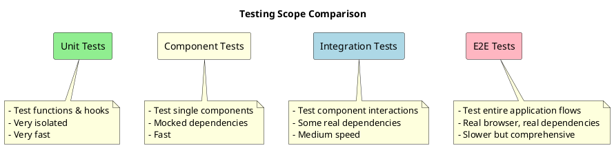

# End-to-End Testing

End-to-end (E2E) testing verifies that your application works correctly from a user's perspective, testing complete workflows across multiple pages and components. This section covers how to set up and write E2E tests for React TypeScript applications using Cypress and Playwright.

## Introduction to E2E Testing

While unit and component tests focus on specific pieces of functionality, E2E tests validate the entire application as a whole, ensuring all parts work together correctly.



### When to Use E2E Tests

E2E tests are ideal for:

1. Critical user workflows (registration, checkout, etc.)
2. Complex multi-step processes
3. System integration points
4. Authentication and authorization flows
5. Performance testing of real user experiences

## E2E Testing Tools

### Cypress

[Cypress](https://www.cypress.io/) is a popular E2E testing framework designed specifically for modern web applications. It offers:

- A visual test runner that shows tests executing in real-time
- Automatic waiting and retry behavior
- Time-travel debugging
- Network traffic control and stubbing
- Screenshots and video recording

### Playwright

[Playwright](https://playwright.dev/) is a newer E2E testing library developed by Microsoft that supports multiple browsers (Chromium, Firefox, WebKit). Its features include:

- Cross-browser support
- Mobile emulation
- Automatic waiting
- Powerful selectors
- Network interception
- Parallelized test execution

## Setting Up Cypress with TypeScript

Let's set up Cypress for a React TypeScript project:

1. Install Cypress and its TypeScript dependencies:

```bash
npm install --save-dev cypress @testing-library/cypress @cypress/webpack-preprocessor typescript
```

2. Create a `cypress.config.ts` file:

```typescript
import { defineConfig } from 'cypress';

export default defineConfig({
  e2e: {
    baseUrl: 'http://localhost:3000',
    setupNodeEvents(on, config) {
      // implement node event listeners here
    },
  },
  component: {
    devServer: {
      framework: 'create-react-app',
      bundler: 'webpack',
    },
  },
});
```

3. Create type definitions in `cypress/support/index.d.ts`:

```typescript
/// <reference types="cypress" />
/// <reference types="@testing-library/cypress" />

declare namespace Cypress {
  interface Chainable {
    /**
     * Custom command to login with email and password
     */
    login(email: string, password: string): Chainable<Element>;
    
    /**
     * Custom command to select item by data-testid
     */
    getByTestId(testId: string): Chainable<Element>;
  }
}
```

4. Set up support file in `cypress/support/e2e.ts`:

```typescript
import '@testing-library/cypress/add-commands';
// Import commands.ts using the ES2015 syntax:
import './commands';
```

5. Add custom commands in `cypress/support/commands.ts`:

```typescript
// cypress/support/commands.ts

// Login command
Cypress.Commands.add('login', (email: string, password: string) => {
  cy.visit('/login');
  cy.get('input[name=email]').type(email);
  cy.get('input[name=password]').type(password);
  cy.get('button[type=submit]').click();
  cy.url().should('not.include', '/login');
});

// Get by test ID command
Cypress.Commands.add('getByTestId', (testId: string) => {
  return cy.get(`[data-testid="${testId}"]`);
});
```

6. Add scripts to `package.json`:

```json
{
  "scripts": {
    "cypress:open": "cypress open",
    "cypress:run": "cypress run"
  }
}
```

## Writing Your First Cypress E2E Test

Let's create a simple E2E test for a todo application:

```typescript
// cypress/e2e/todo.cy.ts
describe('Todo Application', () => {
  beforeEach(() => {
    // Visit the app before each test
    cy.visit('/');
    
    // Clear todos to start fresh
    cy.get('[data-testid="clear-button"]').click();
  });
  
  it('allows adding new todos', () => {
    // Add a new todo
    cy.getByTestId('new-todo-input').type('Buy groceries');
    cy.getByTestId('add-button').click();
    
    // Verify it was added
    cy.getByTestId('todo-list').should('contain', 'Buy groceries');
    
    // Add another todo
    cy.getByTestId('new-todo-input').type('Clean the house');
    cy.getByTestId('add-button').click();
    
    // Verify both todos exist
    cy.getByTestId('todo-list').should('contain', 'Buy groceries');
    cy.getByTestId('todo-list').should('contain', 'Clean the house');
  });
  
  it('allows marking todos as completed', () => {
    // Add a todo
    cy.getByTestId('new-todo-input').type('Learn Cypress');
    cy.getByTestId('add-button').click();
    
    // Initially not completed
    cy.getByTestId('todo-list').find('li').first().should('not.have.class', 'completed');
    
    // Mark as completed
    cy.getByTestId('todo-list').find('input[type="checkbox"]').first().check();
    
    // Verify it's completed
    cy.getByTestId('todo-list').find('li').first().should('have.class', 'completed');
  });
  
  it('allows filtering todos', () => {
    // Add active and completed todos
    cy.getByTestId('new-todo-input').type('Active todo');
    cy.getByTestId('add-button').click();
    
    cy.getByTestId('new-todo-input').type('Completed todo');
    cy.getByTestId('add-button').click();
    
    // Mark second todo as completed
    cy.getByTestId('todo-list').find('input[type="checkbox"]').eq(1).check();
    
    // Filter to show only active
    cy.getByTestId('filter-active').click();
    cy.getByTestId('todo-list').should('contain', 'Active todo');
    cy.getByTestId('todo-list').should('not.contain', 'Completed todo');
    
    // Filter to show only completed
    cy.getByTestId('filter-completed').click();
    cy.getByTestId('todo-list').should('not.contain', 'Active todo');
    cy.getByTestId('todo-list').should('contain', 'Completed todo');
    
    // Show all
    cy.getByTestId('filter-all').click();
    cy.getByTestId('todo-list').should('contain', 'Active todo');
    cy.getByTestId('todo-list').should('contain', 'Completed todo');
  });
});
```

### Testing Authentication Flows

Testing login/authentication is a common E2E testing scenario:

```typescript
// cypress/e2e/auth.cy.ts
describe('Authentication', () => {
  it('allows users to log in', () => {
    // Visit login page
    cy.visit('/login');
    
    // Fill out login form
    cy.get('input[name="email"]').type('user@example.com');
    cy.get('input[name="password"]').type('password123');
    cy.get('button[type="submit"]').click();
    
    // Verify user is logged in
    cy.url().should('eq', Cypress.config().baseUrl + '/dashboard');
    cy.get('[data-testid="user-greeting"]').should('contain', 'Welcome, User');
  });
  
  it('shows validation errors for invalid login', () => {
    cy.visit('/login');
    
    // Try invalid email format
    cy.get('input[name="email"]').type('invalid-email');
    cy.get('input[name="password"]').type('password123');
    cy.get('button[type="submit"]').click();
    
    // Check for validation error
    cy.get('[data-testid="email-error"]').should('be.visible')
      .and('contain', 'Please enter a valid email');
    
    // URL should still be login page
    cy.url().should('include', '/login');
  });
  
  it('allows users to log out', () => {
    // Use custom login command
    cy.login('user@example.com', 'password123');
    
    // Click logout button
    cy.getByTestId('logout-button').click();
    
    // Verify user is logged out and redirected
    cy.url().should('eq', Cypress.config().baseUrl + '/login');
    cy.get('[data-testid="login-form"]').should('be.visible');
  });
});
```

## Setting Up Playwright with TypeScript

Playwright is another powerful option for E2E testing. Let's set it up:

1. Install Playwright:

```bash
npm init playwright@latest
```

2. Configure TypeScript support in `playwright.config.ts`:

```typescript
import { PlaywrightTestConfig } from '@playwright/test';

const config: PlaywrightTestConfig = {
  testDir: './tests',
  timeout: 30 * 1000,
  fullyParallel: true,
  forbidOnly: !!process.env.CI,
  retries: process.env.CI ? 2 : 0,
  workers: process.env.CI ? 1 : undefined,
  reporter: 'html',
  use: {
    baseURL: 'http://localhost:3000',
    trace: 'on-first-retry',
    screenshot: 'only-on-failure',
  },
  projects: [
    {
      name: 'chromium',
      use: { browserName: 'chromium' },
    },
    {
      name: 'firefox',
      use: { browserName: 'firefox' },
    },
    {
      name: 'webkit',
      use: { browserName: 'webkit' },
    },
  ],
};

export default config;
```

3. Create a fixture for authentication in `tests/fixtures.ts`:

```typescript
import { test as base } from '@playwright/test';

// Extend the base test fixture
export const test = base.extend({
  // Add authenticated page fixture
  authenticatedPage: async ({ page }, use) => {
    // Navigate to login page
    await page.goto('/login');
    
    // Fill login form
    await page.fill('input[name="email"]', 'user@example.com');
    await page.fill('input[name="password"]', 'password123');
    await page.click('button[type="submit"]');
    
    // Wait for navigation
    await page.waitForURL('**/dashboard');
    
    // Use the authenticated page
    await use(page);
    
    // Optional teardown (e.g., log out)
    await page.click('[data-testid="logout-button"]');
  },
});

export { expect } from '@playwright/test';
```

## Writing Your First Playwright Test

Let's write a similar todo application test with Playwright:

```typescript
// tests/todo.spec.ts
import { test, expect } from '@playwright/test';

test.describe('Todo Application', () => {
  test.beforeEach(async ({ page }) => {
    // Go to the app
    await page.goto('/');
    
    // Clear existing todos
    await page.click('[data-testid="clear-button"]');
  });
  
  test('allows adding new todos', async ({ page }) => {
    // Add a new todo
    await page.fill('[data-testid="new-todo-input"]', 'Buy groceries');
    await page.click('[data-testid="add-button"]');
    
    // Check if it's added
    await expect(page.locator('[data-testid="todo-list"]')).toContainText('Buy groceries');
    
    // Add another todo
    await page.fill('[data-testid="new-todo-input"]', 'Clean the house');
    await page.click('[data-testid="add-button"]');
    
    // Check if both are added
    const todoList = page.locator('[data-testid="todo-list"]');
    await expect(todoList).toContainText('Buy groceries');
    await expect(todoList).toContainText('Clean the house');
  });
  
  test('allows marking todos as completed', async ({ page }) => {
    // Add a todo
    await page.fill('[data-testid="new-todo-input"]', 'Learn Playwright');
    await page.click('[data-testid="add-button"]');
    
    // Get the first todo
    const firstTodo = page.locator('[data-testid="todo-list"] li').first();
    
    // Initially not completed
    await expect(firstTodo).not.toHaveClass(/completed/);
    
    // Mark as completed
    await page.click('[data-testid="todo-list"] input[type="checkbox"]');
    
    // Verify it's completed
    await expect(firstTodo).toHaveClass(/completed/);
  });
  
  test('allows filtering todos', async ({ page }) => {
    // Add todos
    await page.fill('[data-testid="new-todo-input"]', 'Active todo');
    await page.click('[data-testid="add-button"]');
    
    await page.fill('[data-testid="new-todo-input"]', 'Completed todo');
    await page.click('[data-testid="add-button"]');
    
    // Complete the second todo
    await page.locator('[data-testid="todo-list"] input[type="checkbox"]').nth(1).click();
    
    // Filter to active only
    await page.click('[data-testid="filter-active"]');
    await expect(page.locator('[data-testid="todo-list"]')).toContainText('Active todo');
    await expect(page.locator('[data-testid="todo-list"]')).not.toContainText('Completed todo');
    
    // Filter to completed only
    await page.click('[data-testid="filter-completed"]');
    await expect(page.locator('[data-testid="todo-list"]')).not.toContainText('Active todo');
    await expect(page.locator('[data-testid="todo-list"]')).toContainText('Completed todo');
    
    // Show all
    await page.click('[data-testid="filter-all"]');
    await expect(page.locator('[data-testid="todo-list"]')).toContainText('Active todo');
    await expect(page.locator('[data-testid="todo-list"]')).toContainText('Completed todo');
  });
});
```

### Testing Authentication with Playwright

Here's how to test authentication flows with Playwright:

```typescript
// tests/auth.spec.ts
import { test, expect } from '@playwright/test';
import { test as authTest } from './fixtures';

test.describe('Authentication', () => {
  test('allows users to log in', async ({ page }) => {
    await page.goto('/login');
    
    // Fill the login form
    await page.fill('input[name="email"]', 'user@example.com');
    await page.fill('input[name="password"]', 'password123');
    await page.click('button[type="submit"]');
    
    // Check if login worked
    await expect(page).toHaveURL(/dashboard/);
    await expect(page.locator('[data-testid="user-greeting"]')).toContainText('Welcome, User');
  });
  
  test('shows validation errors for invalid login', async ({ page }) => {
    await page.goto('/login');
    
    // Try invalid email
    await page.fill('input[name="email"]', 'invalid-email');
    await page.fill('input[name="password"]', 'password123');
    await page.click('button[type="submit"]');
    
    // Check for error message
    await expect(page.locator('[data-testid="email-error"]')).toBeVisible();
    await expect(page.locator('[data-testid="email-error"]')).toContainText('Please enter a valid email');
    
    // Should still be on login page
    await expect(page).toHaveURL(/login/);
  });
  
  test('allows users to log out', async ({ page }) => {
    // Login first
    await page.goto('/login');
    await page.fill('input[name="email"]', 'user@example.com');
    await page.fill('input[name="password"]', 'password123');
    await page.click('button[type="submit"]');
    await expect(page).toHaveURL(/dashboard/);
    
    // Logout
    await page.click('[data-testid="logout-button"]');
    
    // Should be redirected to login
    await expect(page).toHaveURL(/login/);
    await expect(page.locator('[data-testid="login-form"]')).toBeVisible();
  });
});

// Using the authenticated fixture
authTest.describe('Authenticated User Tests', () => {
  authTest('can access dashboard features', async ({ authenticatedPage }) => {
    // User is already logged in via the fixture
    await expect(authenticatedPage.locator('[data-testid="dashboard-content"]')).toBeVisible();
    await expect(authenticatedPage.locator('[data-testid="user-profile"]')).toBeVisible();
  });
});
```

## Testing Complex User Flows

E2E tests excel at testing complex, multi-step user flows. Let's create tests for an e-commerce checkout process:

```typescript
// tests/checkout.spec.ts
import { test, expect } from '@playwright/test';

test.describe('E-commerce Checkout Flow', () => {
  test('complete checkout process', async ({ page }) => {
    // Step 1: Browse products
    await page.goto('/products');
    
    // Add items to cart
    await page.click('[data-testid="add-to-cart-123"]');
    await page.click('[data-testid="add-to-cart-456"]');
    
    // Verify cart count
    await expect(page.locator('[data-testid="cart-count"]')).toContainText('2');
    
    // Step 2: Go to cart
    await page.click('[data-testid="cart-icon"]');
    await expect(page).toHaveURL(/cart/);
    
    // Verify cart contents
    await expect(page.locator('[data-testid="cart-item-123"]')).toBeVisible();
    await expect(page.locator('[data-testid="cart-item-456"]')).toBeVisible();
    
    // Update quantity
    await page.fill('[data-testid="quantity-123"]', '2');
    await page.click('[data-testid="update-cart"]');
    
    // Step 3: Proceed to checkout
    await page.click('[data-testid="checkout-button"]');
    await expect(page).toHaveURL(/checkout/);
    
    // Step 4: Fill shipping information
    await page.fill('[data-testid="first-name"]', 'John');
    await page.fill('[data-testid="last-name"]', 'Doe');
    await page.fill('[data-testid="email"]', 'john.doe@example.com');
    await page.fill('[data-testid="address"]', '123 Main St');
    await page.fill('[data-testid="city"]', 'Anytown');
    await page.selectOption('[data-testid="state"]', 'CA');
    await page.fill('[data-testid="zip"]', '12345');
    
    await page.click('[data-testid="continue-to-payment"]');
    
    // Step 5: Fill payment information
    await page.fill('[data-testid="card-number"]', '4242424242424242');
    await page.fill('[data-testid="expiry"]', '12/25');
    await page.fill('[data-testid="cvv"]', '123');
    await page.fill('[data-testid="cardholder-name"]', 'John Doe');
    
    // Step 6: Place order
    await page.click('[data-testid="place-order"]');
    
    // Step 7: Verify order confirmation
    await expect(page).toHaveURL(/order-confirmation/);
    await expect(page.locator('[data-testid="order-success"]')).toContainText('Order placed successfully');
    await expect(page.locator('[data-testid="order-number"]')).toBeVisible();
  });
  
  test('handles payment failure gracefully', async ({ page }) => {
    // Setup cart with items
    await page.goto('/cart');
    await page.click('[data-testid="add-sample-items"]'); // Helper button for testing
    
    // Go through checkout process
    await page.click('[data-testid="checkout-button"]');
    
    // Fill shipping info quickly
    await page.fill('[data-testid="first-name"]', 'Test');
    await page.fill('[data-testid="last-name"]', 'User');
    await page.fill('[data-testid="email"]', 'test@example.com');
    await page.fill('[data-testid="address"]', '123 Test St');
    await page.fill('[data-testid="city"]', 'Test City');
    await page.selectOption('[data-testid="state"]', 'CA');
    await page.fill('[data-testid="zip"]', '12345');
    await page.click('[data-testid="continue-to-payment"]');
    
    // Use a card number that will be declined
    await page.fill('[data-testid="card-number"]', '4000000000000002');
    await page.fill('[data-testid="expiry"]', '12/25');
    await page.fill('[data-testid="cvv"]', '123');
    await page.fill('[data-testid="cardholder-name"]', 'Test User');
    
    // Attempt to place order
    await page.click('[data-testid="place-order"]');
    
    // Should show error message
    await expect(page.locator('[data-testid="payment-error"]')).toContainText('Payment was declined');
    
    // Should still be on checkout page
    await expect(page).toHaveURL(/checkout/);
    
    // Cart should still contain items
    await expect(page.locator('[data-testid="cart-summary"]')).toBeVisible();
  });
});
```

## Network Interception and Mocking

Both Cypress and Playwright support network interception for testing different scenarios:

### Cypress Network Interception

```typescript
// cypress/e2e/api-integration.cy.ts
describe('API Integration Tests', () => {
  beforeEach(() => {
    cy.visit('/');
  });
  
  it('handles successful API response', () => {
    // Intercept API call and return mock data
    cy.intercept('GET', '/api/users', {
      statusCode: 200,
      body: [
        { id: 1, name: 'John Doe', email: 'john@example.com' },
        { id: 2, name: 'Jane Smith', email: 'jane@example.com' }
      ]
    }).as('getUsers');
    
    // Trigger the API call
    cy.get('[data-testid="load-users"]').click();
    
    // Wait for the API call
    cy.wait('@getUsers');
    
    // Verify UI updates
    cy.get('[data-testid="user-list"]').should('contain', 'John Doe');
    cy.get('[data-testid="user-list"]').should('contain', 'Jane Smith');
  });
  
  it('handles API error gracefully', () => {
    // Intercept API call and return error
    cy.intercept('GET', '/api/users', {
      statusCode: 500,
      body: { error: 'Internal server error' }
    }).as('getUsersError');
    
    // Trigger the API call
    cy.get('[data-testid="load-users"]').click();
    
    // Wait for the API call
    cy.wait('@getUsersError');
    
    // Verify error handling
    cy.get('[data-testid="error-message"]').should('contain', 'Failed to load users');
  });
  
  it('shows loading state during API call', () => {
    // Intercept with delay
    cy.intercept('GET', '/api/users', (req) => {
      req.reply((res) => {
        res.delay(2000);
        res.send([]);
      });
    }).as('getUsers');
    
    // Trigger the API call
    cy.get('[data-testid="load-users"]').click();
    
    // Verify loading state
    cy.get('[data-testid="loading-spinner"]').should('be.visible');
    
    // Wait for completion
    cy.wait('@getUsers');
    cy.get('[data-testid="loading-spinner"]').should('not.exist');
  });
});
```

### Playwright Network Interception

```typescript
// tests/api-integration.spec.ts
import { test, expect } from '@playwright/test';

test.describe('API Integration Tests', () => {
  test('handles successful API response', async ({ page }) => {
    // Mock API response
    await page.route('/api/users', route => {
      route.fulfill({
        status: 200,
        contentType: 'application/json',
        body: JSON.stringify([
          { id: 1, name: 'John Doe', email: 'john@example.com' },
          { id: 2, name: 'Jane Smith', email: 'jane@example.com' }
        ])
      });
    });
    
    await page.goto('/');
    
    // Trigger API call
    await page.click('[data-testid="load-users"]');
    
    // Verify UI updates
    await expect(page.locator('[data-testid="user-list"]')).toContainText('John Doe');
    await expect(page.locator('[data-testid="user-list"]')).toContainText('Jane Smith');
  });
  
  test('handles API error gracefully', async ({ page }) => {
    // Mock API error
    await page.route('/api/users', route => {
      route.fulfill({
        status: 500,
        contentType: 'application/json',
        body: JSON.stringify({ error: 'Internal server error' })
      });
    });
    
    await page.goto('/');
    
    // Trigger API call
    await page.click('[data-testid="load-users"]');
    
    // Verify error handling
    await expect(page.locator('[data-testid="error-message"]')).toContainText('Failed to load users');
  });
  
  test('shows loading state during API call', async ({ page }) => {
    // Mock delayed API response
    await page.route('/api/users', async route => {
      await new Promise(resolve => setTimeout(resolve, 2000));
      route.fulfill({
        status: 200,
        contentType: 'application/json',
        body: JSON.stringify([])
      });
    });
    
    await page.goto('/');
    
    // Trigger API call
    await page.click('[data-testid="load-users"]');
    
    // Verify loading state
    await expect(page.locator('[data-testid="loading-spinner"]')).toBeVisible();
    
    // Wait for completion and verify loading disappears
    await expect(page.locator('[data-testid="loading-spinner"]')).not.toBeVisible({ timeout: 3000 });
  });
});
```

## Testing with Recoil State

When testing applications that use Recoil for state management, you might need to manipulate global state during E2E tests:

```typescript
// tests/recoil-integration.spec.ts
import { test, expect } from '@playwright/test';

test.describe('Recoil State Integration', () => {
  test('persists state across page navigation', async ({ page }) => {
    await page.goto('/');
    
    // Add items to a Recoil-managed shopping cart
    await page.click('[data-testid="add-item-1"]');
    await page.click('[data-testid="add-item-2"]');
    
    // Verify cart count
    await expect(page.locator('[data-testid="cart-count"]')).toContainText('2');
    
    // Navigate to another page
    await page.click('[data-testid="nav-products"]');
    await expect(page).toHaveURL(/products/);
    
    // Cart count should persist
    await expect(page.locator('[data-testid="cart-count"]')).toContainText('2');
    
    // Navigate back to home
    await page.click('[data-testid="nav-home"]');
    await expect(page).toHaveURL('/');
    
    // Cart count should still be there
    await expect(page.locator('[data-testid="cart-count"]')).toContainText('2');
  });
  
  test('resets state on logout', async ({ page }) => {
    // Login first
    await page.goto('/login');
    await page.fill('input[name="email"]', 'user@example.com');
    await page.fill('input[name="password"]', 'password123');
    await page.click('button[type="submit"]');
    
    // Add some state
    await page.click('[data-testid="add-item-1"]');
    await expect(page.locator('[data-testid="cart-count"]')).toContainText('1');
    
    // Logout
    await page.click('[data-testid="logout-button"]');
    
    // Login again
    await page.fill('input[name="email"]', 'user@example.com');
    await page.fill('input[name="password"]', 'password123');
    await page.click('button[type="submit"]');
    
    // State should be reset
    await expect(page.locator('[data-testid="cart-count"]')).toContainText('0');
  });
});
```

## Performance Testing

E2E tests can also be used for basic performance testing:

### Cypress Performance Testing

```typescript
// cypress/e2e/performance.cy.ts
describe('Performance Tests', () => {
  it('loads the homepage within acceptable time', () => {
    const start = Date.now();
    
    cy.visit('/');
    cy.get('[data-testid="main-content"]').should('be.visible');
    
    cy.then(() => {
      const loadTime = Date.now() - start;
      expect(loadTime).to.be.lessThan(3000); // Should load within 3 seconds
    });
  });
  
  it('handles large lists efficiently', () => {
    // Visit page with large dataset
    cy.visit('/large-list');
    
    // Measure time to render
    const start = Date.now();
    cy.get('[data-testid="list-item"]').should('have.length.greaterThan', 1000);
    
    cy.then(() => {
      const renderTime = Date.now() - start;
      expect(renderTime).to.be.lessThan(2000); // Should render within 2 seconds
    });
  });
});
```

### Playwright Performance Testing

```typescript
// tests/performance.spec.ts
import { test, expect } from '@playwright/test';

test.describe('Performance Tests', () => {
  test('measures page load performance', async ({ page }) => {
    const startTime = Date.now();
    
    await page.goto('/');
    await page.waitForSelector('[data-testid="main-content"]');
    
    const loadTime = Date.now() - startTime;
    expect(loadTime).toBeLessThan(3000);
  });
  
  test('measures API response time', async ({ page }) => {
    let apiResponseTime: number;
    
    // Listen for API response
    page.on('response', response => {
      if (response.url().includes('/api/users')) {
        apiResponseTime = response.timing().responseEnd;
      }
    });
    
    await page.goto('/users');
    await page.click('[data-testid="load-users"]');
    await page.waitForSelector('[data-testid="user-list"]');
    
    expect(apiResponseTime).toBeLessThan(1000); // API should respond within 1 second
  });
  
  test('checks for performance metrics', async ({ page }) => {
    await page.goto('/');
    
    // Wait for page to fully load
    await page.waitForLoadState('networkidle');
    
    // Get performance metrics
    const metrics = await page.evaluate(() => {
      const navigation = performance.getEntriesByType('navigation')[0] as PerformanceNavigationTiming;
      return {
        domContentLoaded: navigation.domContentLoadedEventEnd - navigation.domContentLoadedEventStart,
        loadComplete: navigation.loadEventEnd - navigation.loadEventStart,
        firstContentfulPaint: performance.getEntriesByName('first-contentful-paint')[0]?.startTime || 0
      };
    });
    
    expect(metrics.domContentLoaded).toBeLessThan(2000);
    expect(metrics.loadComplete).toBeLessThan(3000);
    expect(metrics.firstContentfulPaint).toBeLessThan(1500);
  });
});
```

## Mobile Testing

Both frameworks support mobile testing:

### Cypress Mobile Testing

```typescript
// cypress/e2e/mobile.cy.ts
describe('Mobile Tests', () => {
  beforeEach(() => {
    // Set mobile viewport
    cy.viewport('iphone-x');
  });
  
  it('navigation works on mobile', () => {
    cy.visit('/');
    
    // Open mobile menu
    cy.get('[data-testid="mobile-menu-button"]').click();
    cy.get('[data-testid="mobile-nav"]').should('be.visible');
    
    // Navigate using mobile menu
    cy.get('[data-testid="mobile-nav-products"]').click();
    cy.url().should('include', '/products');
  });
  
  it('form works on mobile', () => {
    cy.visit('/contact');
    
    // Fill form on mobile
    cy.get('[data-testid="name-input"]').type('John Doe');
    cy.get('[data-testid="email-input"]').type('john@example.com');
    cy.get('[data-testid="message-input"]').type('Test message');
    
    // Submit form
    cy.get('[data-testid="submit-button"]').click();
    
    // Verify success
    cy.get('[data-testid="success-message"]').should('be.visible');
  });
});
```

### Playwright Mobile Testing

```typescript
// tests/mobile.spec.ts
import { test, expect, devices } from '@playwright/test';

// Test with iPhone configuration
test.use(devices['iPhone 12']);

test.describe('Mobile Tests', () => {
  test('navigation works on mobile', async ({ page }) => {
    await page.goto('/');
    
    // Open mobile menu
    await page.click('[data-testid="mobile-menu-button"]');
    await expect(page.locator('[data-testid="mobile-nav"]')).toBeVisible();
    
    // Navigate using mobile menu
    await page.click('[data-testid="mobile-nav-products"]');
    await expect(page).toHaveURL(/products/);
  });
  
  test('touch gestures work correctly', async ({ page }) => {
    await page.goto('/gallery');
    
    // Test swipe gesture on image carousel
    const carousel = page.locator('[data-testid="image-carousel"]');
    
    // Get initial image
    const firstImage = await carousel.locator('img').first().getAttribute('src');
    
    // Swipe left
    await carousel.hover();
    await page.mouse.down();
    await page.mouse.move(-200, 0);
    await page.mouse.up();
    
    // Wait for animation and check new image
    await page.waitForTimeout(500);
    const secondImage = await carousel.locator('img').first().getAttribute('src');
    
    expect(secondImage).not.toBe(firstImage);
  });
});
```

## Best Practices for E2E Testing

### 1. Use Page Object Model

Organize your tests using the Page Object Model pattern:

```typescript
// tests/pages/LoginPage.ts
import { Page, Locator } from '@playwright/test';

export class LoginPage {
  readonly page: Page;
  readonly emailInput: Locator;
  readonly passwordInput: Locator;
  readonly submitButton: Locator;
  readonly errorMessage: Locator;

  constructor(page: Page) {
    this.page = page;
    this.emailInput = page.locator('input[name="email"]');
    this.passwordInput = page.locator('input[name="password"]');
    this.submitButton = page.locator('button[type="submit"]');
    this.errorMessage = page.locator('[data-testid="error-message"]');
  }

  async goto() {
    await this.page.goto('/login');
  }

  async login(email: string, password: string) {
    await this.emailInput.fill(email);
    await this.passwordInput.fill(password);
    await this.submitButton.click();
  }

  async expectErrorMessage(message: string) {
    await expect(this.errorMessage).toContainText(message);
  }
}

// tests/auth.spec.ts
import { test, expect } from '@playwright/test';
import { LoginPage } from './pages/LoginPage';

test('login with invalid credentials shows error', async ({ page }) => {
  const loginPage = new LoginPage(page);
  
  await loginPage.goto();
  await loginPage.login('invalid@email.com', 'wrongpassword');
  await loginPage.expectErrorMessage('Invalid credentials');
});
```

### 2. Use Test Data Management

```typescript
// tests/data/testData.ts
export const testUsers = {
  validUser: {
    email: 'user@example.com',
    password: 'password123'
  },
  invalidUser: {
    email: 'invalid@example.com',
    password: 'wrongpassword'
  }
};

export const testProducts = [
  { id: 1, name: 'Test Product 1', price: 29.99 },
  { id: 2, name: 'Test Product 2', price: 49.99 }
];
```

### 3. Environment Configuration

```typescript
// tests/config/environment.ts
interface Environment {
  baseURL: string;
  apiURL: string;
  timeout: number;
}

const environments: Record<string, Environment> = {
  development: {
    baseURL: 'http://localhost:3000',
    apiURL: 'http://localhost:3001/api',
    timeout: 30000
  },
  staging: {
    baseURL: 'https://staging.example.com',
    apiURL: 'https://api-staging.example.com',
    timeout: 60000
  },
  production: {
    baseURL: 'https://example.com',
    apiURL: 'https://api.example.com',
    timeout: 90000
  }
};

export const getEnvironment = (): Environment => {
  const env = process.env.TEST_ENV || 'development';
  return environments[env];
};
```

### 4. Test Parallelization and Sharding

For Playwright, you can run tests in parallel across multiple workers:

```typescript
// playwright.config.ts
export default defineConfig({
  workers: process.env.CI ? 2 : undefined,
  projects: [
    {
      name: 'chromium',
      use: { ...devices['Desktop Chrome'] },
    },
    {
      name: 'firefox',
      use: { ...devices['Desktop Firefox'] },
    },
    {
      name: 'webkit',
      use: { ...devices['Desktop Safari'] },
    },
  ],
});
```

### 5. CI/CD Integration

Example GitHub Actions workflow:

```yaml
# .github/workflows/e2e-tests.yml
name: E2E Tests

on:
  push:
    branches: [main]
  pull_request:
    branches: [main]

jobs:
  test:
    runs-on: ubuntu-latest
    
    steps:
    - uses: actions/checkout@v3
    
    - name: Setup Node.js
      uses: actions/setup-node@v3
      with:
        node-version: '18'
        
    - name: Install dependencies
      run: npm ci
      
    - name: Install Playwright browsers
      run: npx playwright install --with-deps
      
    - name: Start application
      run: |
        npm run build
        npm run start &
        npx wait-on http://localhost:3000
        
    - name: Run E2E tests
      run: npm run test:e2e
      
    - name: Upload test results
      uses: actions/upload-artifact@v3
      if: failure()
      with:
        name: playwright-report
        path: playwright-report/
```

## Common E2E Testing Pitfalls

1. **Flaky tests**: Tests that sometimes pass and sometimes fail
   - Solution: Use proper waits, avoid hardcoded delays, handle async operations correctly

2. **Slow tests**: Tests that take too long to run
   - Solution: Run tests in parallel, mock external dependencies, optimize selectors

3. **Brittle selectors**: Tests breaking when UI changes
   - Solution: Use semantic selectors, data-testid attributes, and stable element identifiers

4. **Test data pollution**: Tests affecting each other
   - Solution: Clean up data between tests, use isolated test environments

5. **Over-testing**: Testing too many scenarios at the E2E level
   - Solution: Focus on critical user journeys, test details at lower levels

## Conclusion

End-to-end testing is crucial for ensuring your React TypeScript applications work correctly from a user's perspective. Both Cypress and Playwright offer powerful capabilities for creating reliable E2E tests.

Key takeaways:
- E2E tests validate complete user workflows
- Choose between Cypress and Playwright based on your needs
- Use Page Object Model for maintainable test code
- Focus on critical user journeys
- Implement proper CI/CD integration
- Follow best practices to avoid common pitfalls

In this comprehensive testing guide, we've covered:
1. Testing libraries and their setup
2. Component testing strategies
3. User interaction testing
4. End-to-end testing with real user workflows

By implementing these testing strategies, you'll build more reliable and maintainable React TypeScript applications that provide confidence in your deployments and user experience.
