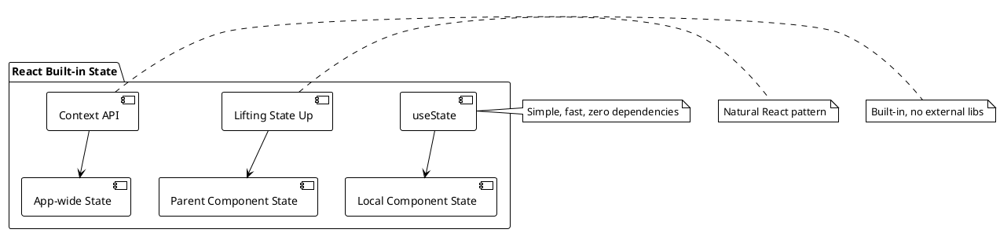
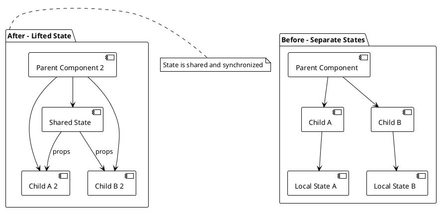

# React's Built-in State Management

## Table of Contents
1. [Introduction to Built-in State](#introduction)
2. [Local State with useState](#local-state)
3. [Lifting State Up](#lifting-state)
4. [When to Use Built-in State](#when-to-use)
5. [Parent-Child State Sharing Example](#example)
6. [Best Practices and Common Pitfalls](#best-practices)
7. [Testing State Management](#testing)

## Introduction to Built-in State {#introduction}

React's built-in state management is the foundation of any React application. Before reaching for external libraries, it's crucial to understand and master React's native state capabilities. React provides several built-in hooks for state management:

- `useState` - For simple local state
- `useReducer` - For complex state logic
- `useContext` - For sharing state across components

This guide focuses on `useState` and the concept of lifting state up, which forms the backbone of React's component-based architecture.

### Why Start with Built-in State?



## Local State with useState {#local-state}

The `useState` hook is the most fundamental way to add state to functional components. It returns a state value and a setter function.

### Basic useState Syntax

```typescript
const [state, setState] = useState<StateType>(initialValue);
```

### TypeScript Considerations

When using TypeScript with `useState`, you have several options for typing:

1. **Type Inference** (recommended for simple types):
```typescript
const [count, setCount] = useState(0); // TypeScript infers number
const [name, setName] = useState(''); // TypeScript infers string
```

2. **Explicit Typing** (for complex types):
```typescript
interface User {
  id: number;
  name: string;
  email: string;
}

const [user, setUser] = useState<User | null>(null);
```

3. **Union Types**:
```typescript
const [status, setStatus] = useState<'loading' | 'success' | 'error'>('loading');
```

### Complete Counter Example

Let's build a comprehensive counter component that demonstrates various useState patterns:

```typescript
// Counter.tsx
import { useState, useCallback } from 'react';

interface CounterProps {
  initialValue?: number;
  step?: number;
  min?: number;
  max?: number;
  onCountChange?: (count: number) => void;
}

interface CounterState {
  count: number;
  history: number[];
}

const Counter = ({ 
  initialValue = 0, 
  step = 1, 
  min = Number.MIN_SAFE_INTEGER,
  max = Number.MAX_SAFE_INTEGER,
  onCountChange 
}: CounterProps) => {
  // Simple state for the current count
  const [count, setCount] = useState(initialValue);
  
  // Complex state object for history tracking
  const [state, setState] = useState<CounterState>({
    count: initialValue,
    history: [initialValue]
  });

  // Memoized increment function to prevent unnecessary re-renders
  const increment = useCallback(() => {
    const newCount = Math.min(count + step, max);
    setCount(newCount);
    setState(prev => ({
      count: newCount,
      history: [...prev.history, newCount]
    }));
    onCountChange?.(newCount);
  }, [count, step, max, onCountChange]);

  const decrement = useCallback(() => {
    const newCount = Math.max(count - step, min);
    setCount(newCount);
    setState(prev => ({
      count: newCount,
      history: [...prev.history, newCount]
    }));
    onCountChange?.(newCount);
  }, [count, step, min, onCountChange]);

  const reset = useCallback(() => {
    setCount(initialValue);
    setState({
      count: initialValue,
      history: [initialValue]
    });
    onCountChange?.(initialValue);
  }, [initialValue, onCountChange]);

  const canIncrement = count < max;
  const canDecrement = count > min;

  return (
    <div className="counter">
      <div className="counter-display">
        <h2>Count: {count}</h2>
        <p>History: {state.history.join(' → ')}</p>
      </div>
      
      <div className="counter-controls">
        <button 
          onClick={decrement} 
          disabled={!canDecrement}
          aria-label="Decrement counter"
        >
          - {step}
        </button>
        
        <button 
          onClick={reset}
          aria-label="Reset counter"
        >
          Reset
        </button>
        
        <button 
          onClick={increment} 
          disabled={!canIncrement}
          aria-label="Increment counter"
        >
          + {step}
        </button>
      </div>
    </div>
  );
};

export default Counter;
```

### Key Points Explained:

1. **Multiple State Variables**: We use both simple state (`count`) and complex state (`state` object) to show different approaches.

2. **useCallback for Performance**: We wrap our event handlers in `useCallback` to prevent unnecessary re-renders of child components.

3. **Immutable Updates**: When updating the state object, we create a new object rather than mutating the existing one.

4. **Controlled Boundaries**: We implement min/max constraints to demonstrate controlled state updates.

5. **Accessibility**: We include proper ARIA labels for screen readers.

## Advanced useState Patterns {#advanced-patterns}

### Functional Updates and State Batching

```typescript
// State batching with functional updates
const AdvancedCounter = () => {
  const [count, setCount] = useState(0);
  const [history, setHistory] = useState<number[]>([0]);

  // React 18+ automatically batches these updates
  const handleMultipleUpdates = () => {
    setCount(prev => prev + 1);
    setCount(prev => prev + 2); // Only one re-render
    setHistory(prev => [...prev, count + 3]);
  };

  // Manual batching for older React versions
  const handleBatchedUpdates = () => {
    startTransition(() => {
      setCount(prev => prev + 1);
      setHistory(prev => [...prev, count + 1]);
    });
  };

  return (
    <div>
      <p>Count: {count}</p>
      <button onClick={handleMultipleUpdates}>Batched Updates</button>
    </div>
  );
};
```

### State Initialization Patterns

```typescript
// Lazy initial state for expensive computations
const ExpensiveComponent = ({ initialData }: { initialData: any[] }) => {
  // ❌ This runs on every render
  const [processedData, setProcessedData] = useState(
    expensiveProcessing(initialData)
  );

  // ✅ This only runs once
  const [processedData, setProcessedData] = useState(() => 
    expensiveProcessing(initialData)
  );

  // State synchronization with props
  const [searchTerm, setSearchTerm] = useState('');
  const [filteredData, setFilteredData] = useState<any[]>([]);

  useEffect(() => {
    setFilteredData(
      processedData.filter(item => 
        item.name.toLowerCase().includes(searchTerm.toLowerCase())
      )
    );
  }, [processedData, searchTerm]);

  return (
    <div>
      <input 
        value={searchTerm}
        onChange={(e) => setSearchTerm(e.target.value)}
        placeholder="Search..."
      />
      {/* Render filtered data */}
    </div>
  );
};
```

### Custom Hooks for State Logic

```typescript
// Custom hook for form state management
interface UseFormOptions<T> {
  initialValues: T;
  validationRules?: Partial<Record<keyof T, (value: any) => string | null>>;
  onSubmit?: (values: T) => void | Promise<void>;
}

interface UseFormReturn<T> {
  values: T;
  errors: Partial<Record<keyof T, string>>;
  touched: Partial<Record<keyof T, boolean>>;
  isSubmitting: boolean;
  handleChange: (field: keyof T) => (e: React.ChangeEvent<HTMLInputElement>) => void;
  handleBlur: (field: keyof T) => () => void;
  handleSubmit: (e: React.FormEvent) => void;
  resetForm: () => void;
  setFieldValue: (field: keyof T, value: any) => void;
}

const useForm = <T extends Record<string, any>>({
  initialValues,
  validationRules = {},
  onSubmit
}: UseFormOptions<T>): UseFormReturn<T> => {
  const [values, setValues] = useState<T>(initialValues);
  const [errors, setErrors] = useState<Partial<Record<keyof T, string>>>({});
  const [touched, setTouched] = useState<Partial<Record<keyof T, boolean>>>({});
  const [isSubmitting, setIsSubmitting] = useState(false);

  const validateField = useCallback((field: keyof T, value: any): string | null => {
    const rule = validationRules[field];
    return rule ? rule(value) : null;
  }, [validationRules]);

  const handleChange = useCallback((field: keyof T) => 
    (e: React.ChangeEvent<HTMLInputElement>) => {
      const value = e.target.value;
      setValues(prev => ({ ...prev, [field]: value }));
      
      // Clear error when user starts typing
      if (errors[field]) {
        setErrors(prev => ({ ...prev, [field]: undefined }));
      }
    }, [errors]);

  const handleBlur = useCallback((field: keyof T) => () => {
    setTouched(prev => ({ ...prev, [field]: true }));
    
    const error = validateField(field, values[field]);
    if (error) {
      setErrors(prev => ({ ...prev, [field]: error }));
    }
  }, [values, validateField]);

  const handleSubmit = useCallback(async (e: React.FormEvent) => {
    e.preventDefault();
    
    // Validate all fields
    const newErrors: Partial<Record<keyof T, string>> = {};
    let hasErrors = false;

    Object.keys(values).forEach(key => {
      const field = key as keyof T;
      const error = validateField(field, values[field]);
      if (error) {
        newErrors[field] = error;
        hasErrors = true;
      }
    });

    setErrors(newErrors);
    setTouched(Object.keys(values).reduce((acc, key) => {
      acc[key as keyof T] = true;
      return acc;
    }, {} as Partial<Record<keyof T, boolean>>));

    if (!hasErrors && onSubmit) {
      setIsSubmitting(true);
      try {
        await onSubmit(values);
      } finally {
        setIsSubmitting(false);
      }
    }
  }, [values, validateField, onSubmit]);

  const resetForm = useCallback(() => {
    setValues(initialValues);
    setErrors({});
    setTouched({});
    setIsSubmitting(false);
  }, [initialValues]);

  const setFieldValue = useCallback((field: keyof T, value: any) => {
    setValues(prev => ({ ...prev, [field]: value }));
  }, []);

  return {
    values,
    errors,
    touched,
    isSubmitting,
    handleChange,
    handleBlur,
    handleSubmit,
    resetForm,
    setFieldValue
  };
};

// Usage example
const UserRegistrationForm = () => {
  const {
    values,
    errors,
    touched,
    isSubmitting,
    handleChange,
    handleBlur,
    handleSubmit
  } = useForm({
    initialValues: {
      username: '',
      email: '',
      password: '',
      confirmPassword: ''
    },
    validationRules: {
      username: (value) => {
        if (!value) return 'Username is required';
        if (value.length < 3) return 'Username must be at least 3 characters';
        return null;
      },
      email: (value) => {
        if (!value) return 'Email is required';
        if (!/\S+@\S+\.\S+/.test(value)) return 'Email is invalid';
        return null;
      },
      password: (value) => {
        if (!value) return 'Password is required';
        if (value.length < 8) return 'Password must be at least 8 characters';
        return null;
      },
      confirmPassword: (value) => {
        if (value !== values.password) return 'Passwords do not match';
        return null;
      }
    },
    onSubmit: async (formValues) => {
      await registerUser(formValues);
    }
  });

  return (
    <form onSubmit={handleSubmit}>
      <div>
        <input
          type="text"
          value={values.username}
          onChange={handleChange('username')}
          onBlur={handleBlur('username')}
          placeholder="Username"
        />
        {touched.username && errors.username && (
          <span className="error">{errors.username}</span>
        )}
      </div>
      
      {/* Similar for other fields */}
      
      <button type="submit" disabled={isSubmitting}>
        {isSubmitting ? 'Registering...' : 'Register'}
      </button>
    </form>
  );
};
```

## State Synchronization Patterns {#state-sync}

### Derived State Best Practices

```typescript
// ❌ Anti-pattern: Storing derived state
const BadProductList = ({ products }: { products: Product[] }) => {
  const [filteredProducts, setFilteredProducts] = useState<Product[]>([]);
  const [searchTerm, setSearchTerm] = useState('');

  useEffect(() => {
    setFilteredProducts(
      products.filter(p => p.name.includes(searchTerm))
    );
  }, [products, searchTerm]);

  // Problems: Extra state, potential sync issues, more complex logic
};

// ✅ Good: Computing derived state
const GoodProductList = ({ products }: { products: Product[] }) => {
  const [searchTerm, setSearchTerm] = useState('');

  const filteredProducts = useMemo(() => 
    products.filter(p => p.name.toLowerCase().includes(searchTerm.toLowerCase())),
    [products, searchTerm]
  );

  // Benefits: Single source of truth, automatic updates, cleaner logic
};
```

### State Normalization

```typescript
// Normalized state structure for complex data
interface NormalizedTodoState {
  todos: Record<string, Todo>;
  categories: Record<string, Category>;
  todosByCategory: Record<string, string[]>;
  allTodoIds: string[];
}

const useTodoState = () => {
  const [state, setState] = useState<NormalizedTodoState>({
    todos: {},
    categories: {},
    todosByCategory: {},
    allTodoIds: []
  });

  const addTodo = useCallback((todo: Todo) => {
    setState(prev => ({
      ...prev,
      todos: { ...prev.todos, [todo.id]: todo },
      allTodoIds: [...prev.allTodoIds, todo.id],
      todosByCategory: {
        ...prev.todosByCategory,
        [todo.categoryId]: [
          ...(prev.todosByCategory[todo.categoryId] || []),
          todo.id
        ]
      }
    }));
  }, []);

  const updateTodo = useCallback((id: string, updates: Partial<Todo>) => {
    setState(prev => ({
      ...prev,
      todos: {
        ...prev.todos,
        [id]: { ...prev.todos[id], ...updates }
      }
    }));
  }, []);

  // Selectors for computed values
  const selectors = useMemo(() => ({
    getAllTodos: () => state.allTodoIds.map(id => state.todos[id]),
    getTodosByCategory: (categoryId: string) => 
      (state.todosByCategory[categoryId] || []).map(id => state.todos[id]),
    getCompletedTodos: () => 
      state.allTodoIds
        .map(id => state.todos[id])
        .filter(todo => todo.completed)
  }), [state]);

  return { state, addTodo, updateTodo, selectors };
};
```

## Error Boundaries and State Recovery {#error-recovery}

```typescript
// Error boundary for state management errors
interface ErrorBoundaryState {
  hasError: boolean;
  error?: Error;
  errorInfo?: React.ErrorInfo;
}

class StateErrorBoundary extends React.Component<
  React.PropsWithChildren<{}>,
  ErrorBoundaryState
> {
  constructor(props: React.PropsWithChildren<{}>) {
    super(props);
    this.state = { hasError: false };
  }

  static getDerivedStateFromError(error: Error): ErrorBoundaryState {
    return { hasError: true, error };
  }

  componentDidCatch(error: Error, errorInfo: React.ErrorInfo) {
    this.setState({ errorInfo });
    
    // Log error to monitoring service
    console.error('State management error:', error, errorInfo);
  }

  render() {
    if (this.state.hasError) {
      return (
        <div className="error-fallback">
          <h2>Something went wrong with the application state.</h2>
          <button onClick={() => this.setState({ hasError: false })}>
            Try again
          </button>
        </div>
      );
    }

    return this.props.children;
  }
}

// Hook for error recovery
const useErrorRecovery = () => {
  const [retryCount, setRetryCount] = useState(0);
  const [lastError, setLastError] = useState<Error | null>(null);

  const retry = useCallback(() => {
    setRetryCount(prev => prev + 1);
    setLastError(null);
  }, []);

  const handleError = useCallback((error: Error) => {
    setLastError(error);
    
    // Auto-retry logic for transient errors
    if (retryCount < 3 && isTransientError(error)) {
      setTimeout(retry, 1000 * Math.pow(2, retryCount));
    }
  }, [retryCount, retry]);

  return { retryCount, lastError, retry, handleError };
};
```

## Lifting State Up {#lifting-state}

Lifting state up is a fundamental React pattern where you move state from a child component to a parent component to share it between multiple children.

### When to Lift State Up



You should lift state up when:
- Two or more components need to share the same state
- A parent component needs to coordinate between its children
- You need to synchronize state between sibling components

## When to Use Built-in State {#when-to-use}

### Decision Matrix

| Use Case | Built-in State | External Library |
|----------|---------------|------------------|
| Component-specific state | ✅ useState | ❌ |
| Sharing between 2-3 components | ✅ Lift state up | ❌ |
| Form state | ✅ useState/useReducer | ⚠️ Consider form libraries |
| App-wide user settings | ⚠️ Context API | ✅ External state manager |
| Complex async state | ❌ | ✅ External state manager |
| Server state caching | ❌ | ✅ React Query/SWR |

### Guidelines:
- **Start simple**: Always begin with built-in state
- **Lift gradually**: Only lift state when you need to share it
- **Consider Context**: For app-wide state that doesn't change frequently
- **External libraries**: When built-in solutions become cumbersome

## Parent-Child State Sharing Example {#example}

Let's build a comprehensive shopping cart example that demonstrates state lifting:

```typescript
// types.ts
export interface Product {
  id: string;
  name: string;
  price: number;
  image: string;
  description: string;
}

export interface CartItem {
  product: Product;
  quantity: number;
}

export interface CartState {
  items: CartItem[];
  total: number;
  itemCount: number;
}
```

```typescript
// ProductCard.tsx
import type { Product } from './types';

interface ProductCardProps {
  product: Product;
  onAddToCart: (product: Product) => void;
  isInCart: boolean;
  cartQuantity: number;
}

const ProductCard = ({ product, onAddToCart, isInCart, cartQuantity }: ProductCardProps) => {
  const handleAddToCart = () => {
    onAddToCart(product);
  };

  return (
    <div className="product-card">
      
      <h3>{product.name}</h3>
      <p>{product.description}</p>
      <div className="price">${product.price.toFixed(2)}</div>
      
      <button 
        onClick={handleAddToCart}
        className={isInCart ? 'in-cart' : 'add-to-cart'}
      >
        {isInCart ? `In Cart (${cartQuantity})` : 'Add to Cart'}
      </button>
    </div>
  );
};

export default ProductCard;
```

```typescript
// CartSummary.tsx
import type { CartState } from './types';

interface CartSummaryProps {
  cart: CartState;
  onUpdateQuantity: (productId: string, quantity: number) => void;
  onRemoveItem: (productId: string) => void;
  onClearCart: () => void;
}

const CartSummary = ({ cart, onUpdateQuantity, onRemoveItem, onClearCart }: CartSummaryProps) => {
  if (cart.items.length === 0) {
    return (
      <div className="cart-summary empty">
        <h2>Your Cart</h2>
        <p>Your cart is empty</p>
      </div>
    );
  }

  return (
    <div className="cart-summary">
      <h2>Your Cart ({cart.itemCount} items)</h2>
      
      <div className="cart-items">
        {cart.items.map(item => (
          <div key={item.product.id} className="cart-item">
            
            <div className="item-details">
              <h4>{item.product.name}</h4>
              <p>${item.product.price.toFixed(2)} each</p>
            </div>
            
            <div className="quantity-controls">
              <button 
                onClick={() => onUpdateQuantity(item.product.id, item.quantity - 1)}
                disabled={item.quantity <= 1}
              >
                -
              </button>
              <span>{item.quantity}</span>
              <button 
                onClick={() => onUpdateQuantity(item.product.id, item.quantity + 1)}
              >
                +
              </button>
            </div>
            
            <div className="item-total">
              ${(item.product.price * item.quantity).toFixed(2)}
            </div>
            
            <button 
              onClick={() => onRemoveItem(item.product.id)}
              className="remove-item"
            >
              Remove
            </button>
          </div>
        ))}
      </div>
      
      <div className="cart-total">
        <h3>Total: ${cart.total.toFixed(2)}</h3>
        <button onClick={onClearCart} className="clear-cart">
          Clear Cart
        </button>
      </div>
    </div>
  );
};

export default CartSummary;
```

```typescript
// ShoppingApp.tsx - Parent component with lifted state
import { useState, useCallback, useMemo } from 'react';
import ProductCard from './ProductCard';
import CartSummary from './CartSummary';
import type { Product, CartItem, CartState } from './types';

// Mock products data
const PRODUCTS: Product[] = [
  {
    id: '1',
    name: 'Laptop',
    price: 999.99,
    image: '/images/laptop.jpg',
    description: 'High-performance laptop for professionals'
  },
  {
    id: '2',
    name: 'Smartphone',
    price: 699.99,
    image: '/images/phone.jpg',
    description: 'Latest smartphone with advanced features'
  },
  {
    id: '3',
    name: 'Headphones',
    price: 199.99,
    image: '/images/headphones.jpg',
    description: 'Noise-cancelling wireless headphones'
  }
];

const ShoppingApp = () => {
  // Lifted state - managed in parent component
  const [cartItems, setCartItems] = useState<CartItem[]>([]);

  // Computed cart state using useMemo for performance
  const cartState: CartState = useMemo(() => {
    const total = cartItems.reduce((sum, item) => sum + (item.product.price * item.quantity), 0);
    const itemCount = cartItems.reduce((sum, item) => sum + item.quantity, 0);
    
    return {
      items: cartItems,
      total,
      itemCount
    };
  }, [cartItems]);

  // Add product to cart
  const handleAddToCart = useCallback((product: Product) => {
    setCartItems(prev => {
      const existingItem = prev.find(item => item.product.id === product.id);
      
      if (existingItem) {
        // Update quantity if item already exists
        return prev.map(item =>
          item.product.id === product.id
            ? { ...item, quantity: item.quantity + 1 }
            : item
        );
      } else {
        // Add new item
        return [...prev, { product, quantity: 1 }];
      }
    });
  }, []);

  // Update item quantity
  const handleUpdateQuantity = useCallback((productId: string, newQuantity: number) => {
    if (newQuantity <= 0) {
      handleRemoveItem(productId);
      return;
    }

    setCartItems(prev =>
      prev.map(item =>
        item.product.id === productId
          ? { ...item, quantity: newQuantity }
          : item
      )
    );
  }, []);

  // Remove item from cart
  const handleRemoveItem = useCallback((productId: string) => {
    setCartItems(prev => prev.filter(item => item.product.id !== productId));
  }, []);

  // Clear entire cart
  const handleClearCart = useCallback(() => {
    setCartItems([]);
  }, []);

  // Helper function to check if product is in cart
  const isProductInCart = useCallback((productId: string) => {
    return cartItems.some(item => item.product.id === productId);
  }, [cartItems]);

  // Get quantity of specific product in cart
  const getCartQuantity = useCallback((productId: string) => {
    const item = cartItems.find(item => item.product.id === productId);
    return item ? item.quantity : 0;
  }, [cartItems]);

  return (
    <div className="shopping-app">
      <header>
        <h1>Shopping App</h1>
        <div className="cart-indicator">
          Cart: {cartState.itemCount} items (${cartState.total.toFixed(2)})
        </div>
      </header>

      <main className="app-content">
        <section className="products-section">
          <h2>Products</h2>
          <div className="products-grid">
            {PRODUCTS.map(product => (
              <ProductCard
                key={product.id}
                product={product}
                onAddToCart={handleAddToCart}
                isInCart={isProductInCart(product.id)}
                cartQuantity={getCartQuantity(product.id)}
              />
            ))}
          </div>
        </section>

        <aside className="cart-section">
          <CartSummary
            cart={cartState}
            onUpdateQuantity={handleUpdateQuantity}
            onRemoveItem={handleRemoveItem}
            onClearCart={handleClearCart}
          />
        </aside>
      </main>
    </div>
  );
};

export default ShoppingApp;
```

### Architecture Explanation

```plantuml
@startuml
!theme plain

package "ShoppingApp (Parent)" {
  [Cart State] --> [cartItems: CartItem[]]
  [Computed State] --> [cartState: CartState]
  [Event Handlers] --> [Add/Update/Remove/Clear]
}

package "ProductCard (Child)" {
  [Product Display]
  [Add to Cart Button]
}

package "CartSummary (Child)" {
  [Cart Items List]
  [Quantity Controls]
  [Total Display]
}

[ShoppingApp (Parent)] --> [ProductCard (Child)] : product, onAddToCart, isInCart
[ShoppingApp (Parent)] --> [CartSummary (Child)] : cart, onUpdate, onRemove
[ProductCard (Child)] --> [ShoppingApp (Parent)] : addToCart events
[CartSummary (Child)] --> [ShoppingApp (Parent)] : update/remove events

note right of "ShoppingApp (Parent)" : Centralized state management
note right of "ProductCard (Child)" : Stateless, receives props
note right of "CartSummary (Child)" : Stateless, receives props

@enduml
```

## Best Practices and Common Pitfalls {#best-practices}

### Best Practices

1. **Start Simple**: Begin with `useState` in the component that needs the state
2. **Lift Gradually**: Only lift state when you need to share it
3. **Use useMemo for Computed State**: Prevent unnecessary recalculations
4. **Use useCallback for Event Handlers**: Prevent unnecessary re-renders
5. **Keep State Minimal**: Only store what you can't compute from other state
6. **Use Proper TypeScript Types**: Define interfaces for complex state objects

### Common Pitfalls

1. **Lifting State Too Early**: Don't lift state until you actually need to share it
2. **Not Using Keys**: Always provide stable keys for dynamic lists
3. **Mutating State Directly**: Always create new objects/arrays when updating state
4. **Over-using useCallback**: Don't wrap every function in useCallback
5. **Storing Derived Data**: Don't store computed values in state

### Anti-Pattern Examples

```typescript
// ❌ Anti-pattern: Mutating state directly
const badUpdateCart = () => {
  cartItems.push(newItem); // Don't mutate state directly
  setCartItems(cartItems); // This won't trigger re-render
};

// ✅ Correct: Creating new array
const goodUpdateCart = () => {
  setCartItems(prev => [...prev, newItem]);
};

// ❌ Anti-pattern: Storing derived data
const [total, setTotal] = useState(0);
const [items, setItems] = useState([]);

// ✅ Correct: Computing derived data
const [items, setItems] = useState([]);
const total = useMemo(() => 
  items.reduce((sum, item) => sum + item.price, 0), 
  [items]
);
```

## Testing State Management {#testing}

Here's how to test components with state management:

```typescript
// ShoppingApp.test.tsx
import { render, screen, fireEvent, waitFor } from '@testing-library/react';
import userEvent from '@testing-library/user-event';
import ShoppingApp from './ShoppingApp';

describe('ShoppingApp', () => {
  test('should add item to cart', async () => {
    const user = userEvent.setup();
    render(<ShoppingApp />);

    // Initially cart should be empty
    expect(screen.getByText('Cart: 0 items ($0.00)')).toBeInTheDocument();
    expect(screen.getByText('Your cart is empty')).toBeInTheDocument();

    // Add laptop to cart
    const addLaptopButton = screen.getByRole('button', { name: /add to cart/i });
    await user.click(addLaptopButton);

    // Check cart is updated
    expect(screen.getByText('Cart: 1 items ($999.99)')).toBeInTheDocument();
    expect(screen.getByText('Laptop')).toBeInTheDocument();
    expect(screen.getByText('In Cart (1)')).toBeInTheDocument();
  });

  test('should update item quantity', async () => {
    const user = userEvent.setup();
    render(<ShoppingApp />);

    // Add item first
    const addButton = screen.getByRole('button', { name: /add to cart/i });
    await user.click(addButton);

    // Increase quantity
    const increaseButton = screen.getByRole('button', { name: '+' });
    await user.click(increaseButton);

    // Check quantity is updated
    expect(screen.getByText('Cart: 2 items ($1999.98)')).toBeInTheDocument();
    expect(screen.getByText('2')).toBeInTheDocument();
  });

  test('should remove item from cart', async () => {
    const user = userEvent.setup();
    render(<ShoppingApp />);

    // Add item first
    const addButton = screen.getByRole('button', { name: /add to cart/i });
    await user.click(addButton);

    // Remove item
    const removeButton = screen.getByRole('button', { name: /remove/i });
    await user.click(removeButton);

    // Check item is removed
    expect(screen.getByText('Cart: 0 items ($0.00)')).toBeInTheDocument();
    expect(screen.getByText('Your cart is empty')).toBeInTheDocument();
  });

  test('should clear entire cart', async () => {
    const user = userEvent.setup();
    render(<ShoppingApp />);

    // Add multiple items
    const addButtons = screen.getAllByRole('button', { name: /add to cart/i });
    await user.click(addButtons[0]);
    await user.click(addButtons[1]);

    // Clear cart
    const clearButton = screen.getByRole('button', { name: /clear cart/i });
    await user.click(clearButton);

    // Check cart is empty
    expect(screen.getByText('Cart: 0 items ($0.00)')).toBeInTheDocument();
    expect(screen.getByText('Your cart is empty')).toBeInTheDocument();
  });
});
```

```typescript
// Counter.test.tsx
import { render, screen } from '@testing-library/react';
import userEvent from '@testing-library/user-event';
import Counter from './Counter';

describe('Counter', () => {
  test('should increment counter', async () => {
    const user = userEvent.setup();
    render(<Counter />);

    const incrementButton = screen.getByLabelText('Increment counter');
    await user.click(incrementButton);

    expect(screen.getByText('Count: 1')).toBeInTheDocument();
  });

  test('should respect min and max constraints', async () => {
    const user = userEvent.setup();
    render(<Counter min={0} max={2} />);

    const incrementButton = screen.getByLabelText('Increment counter');
    const decrementButton = screen.getByLabelText('Decrement counter');

    // Should not go below min
    expect(decrementButton).toBeDisabled();

    // Should reach max and disable increment
    await user.click(incrementButton); // 1
    await user.click(incrementButton); // 2
    expect(incrementButton).toBeDisabled();
  });

  test('should call onCountChange callback', async () => {
    const mockOnCountChange = jest.fn();
    const user = userEvent.setup();
    
    render(<Counter onCountChange={mockOnCountChange} />);

    const incrementButton = screen.getByLabelText('Increment counter');
    await user.click(incrementButton);

    expect(mockOnCountChange).toHaveBeenCalledWith(1);
  });

  test('should track history', async () => {
    const user = userEvent.setup();
    render(<Counter />);

    const incrementButton = screen.getByLabelText('Increment counter');
    await user.click(incrementButton);
    await user.click(incrementButton);

    expect(screen.getByText('History: 0 → 1 → 2')).toBeInTheDocument();
  });
});
```

## Summary

React's built-in state management with `useState` is powerful and should be your first choice for most state management needs. The key principles are:

1. **Start Local**: Begin with state in the component that needs it
2. **Lift When Needed**: Move state up only when sharing is required
3. **Keep It Simple**: Don't over-engineer early in development
4. **Use TypeScript**: Proper typing prevents many common bugs
5. **Test Thoroughly**: State changes are critical application behavior

In the next section, we'll explore the Context API for more complex state sharing scenarios, followed by Recoil for advanced state management needs.
