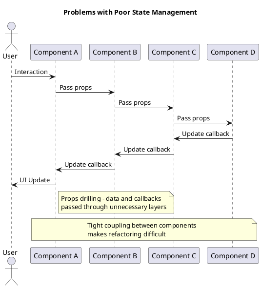
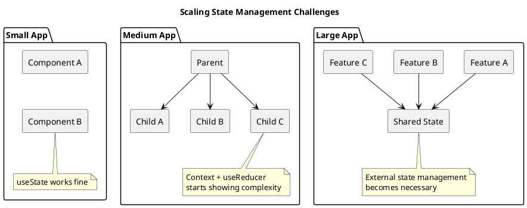
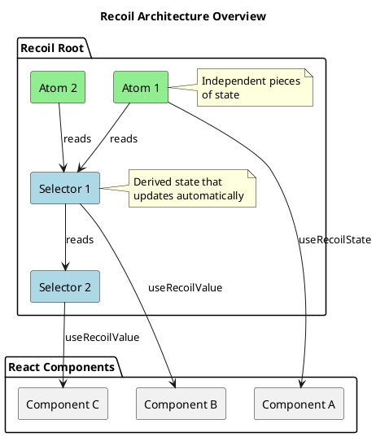
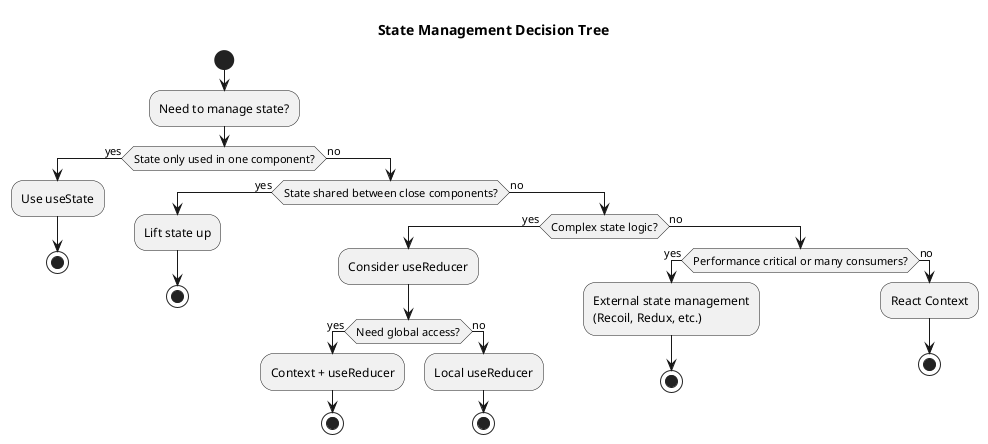

# Introduction to State Management

State management is one of the most crucial concepts in React development. Understanding how to properly manage state determines whether your application will be maintainable, performant, and bug-free. This comprehensive guide will take you from basic state concepts to advanced patterns using Recoil.

## What is State?

State represents data that can change over time and affects how your application renders and behaves. In React applications, state can exist at different levels and serve different purposes.

```plantuml
@startuml
title Types of State in React Applications

package "Application State" {
  rectangle "Component State" as compState #lightgreen {
    note right: Local to individual components
  }
  
  rectangle "Shared State" as sharedState #lightblue {
    note right: Shared between multiple components
  }
  
  rectangle "Global State" as globalState #lightyellow {
    note right: Available throughout the entire application
  }
  
  rectangle "Server State" as serverState #lightpink {
    note right: Data fetched from external sources
  }
}

compState -[hidden]-> sharedState
sharedState -[hidden]-> globalState
globalState -[hidden]-> serverState
@enduml
```

### Types of State

Understanding different types of state helps you choose the right state management approach:

1. **Component State**: Data that belongs to a single component
2. **Shared State**: Data that multiple components need to access
3. **Global State**: Application-wide data (user authentication, theme, etc.)
4. **Server State**: Data fetched from APIs or external sources

## Why State Management Matters

Poor state management leads to:
- **Props drilling**: Passing props through many component layers
- **State synchronization issues**: Components getting out of sync
- **Performance problems**: Unnecessary re-renders
- **Complex debugging**: Hard to track where state changes occur
- **Maintainability issues**: Code becomes harder to understand and modify



## State Management Evolution in React

Let's examine how state management has evolved and why we need different approaches:

### 1. Component State with useState

The most basic form of state management:

```tsx
// src/components/Counter/SimpleCounter.tsx
import React, { useState } from 'react';

function SimpleCounter() {
  const [count, setCount] = useState<number>(0);
  
  const increment = () => setCount(prev => prev + 1);
  const decrement = () => setCount(prev => prev - 1);
  const reset = () => setCount(0);
  
  return (
    <div className="counter">
      <h2>Count: {count}</h2>
      <div className="button-group">
        <button onClick={decrement} disabled={count <= 0}>
          -
        </button>
        <button onClick={reset}>
          Reset
        </button>
        <button onClick={increment}>
          +
        </button>
      </div>
    </div>
  );
}

export default SimpleCounter;
```

**Pros:**
- Simple and straightforward
- No external dependencies
- Perfect for component-specific data

**Cons:**
- Cannot share state between components
- Becomes complex with multiple state pieces
- No built-in state persistence

### 2. Props and Callbacks

Sharing state by lifting it up to a common parent:

```tsx
// src/components/Counter/SharedCounter.tsx
import React, { useState } from 'react';

interface CounterDisplayProps {
  count: number;
  onIncrement: () => void;
  onDecrement: () => void;
  onReset: () => void;
}

function CounterDisplay({ count, onIncrement, onDecrement, onReset }: CounterDisplayProps) {
  return (
    <div className="counter-display">
      <h3>Current Count: {count}</h3>
      <div className="controls">
        <button onClick={onDecrement} disabled={count <= 0}>
          Decrease
        </button>
        <button onClick={onReset}>
          Reset
        </button>
        <button onClick={onIncrement}>
          Increase
        </button>
      </div>
    </div>
  );
}

interface CounterStatsProps {
  count: number;
}

function CounterStats({ count }: CounterStatsProps) {
  const isEven = count % 2 === 0;
  const isPositive = count > 0;
  
  return (
    <div className="counter-stats">
      <p>Status: {isEven ? 'Even' : 'Odd'}</p>
      <p>Sign: {isPositive ? 'Positive' : 'Zero or Negative'}</p>
      <p>Square: {count * count}</p>
    </div>
  );
}

function SharedCounterApp() {
  const [count, setCount] = useState<number>(0);
  
  const increment = () => setCount(prev => prev + 1);
  const decrement = () => setCount(prev => prev - 1);
  const reset = () => setCount(0);
  
  return (
    <div className="shared-counter-app">
      <h2>Shared Counter Example</h2>
      <CounterDisplay 
        count={count}
        onIncrement={increment}
        onDecrement={decrement}
        onReset={reset}
      />
      <CounterStats count={count} />
    </div>
  );
}

export default SharedCounterApp;
```

**Pros:**
- Enables state sharing between components
- Keeps state synchronized
- Uses only React built-ins

**Cons:**
- Props drilling becomes problematic with deep nesting
- Parent component becomes a state management hub
- Difficult to share state across distant components

## React Context: Built-in State Sharing

React Context provides a way to share state without props drilling:

```tsx
// src/contexts/ThemeContext.tsx
import React, { createContext, useContext, useState, ReactNode } from 'react';

type Theme = 'light' | 'dark';

interface ThemeContextType {
  theme: Theme;
  toggleTheme: () => void;
  setTheme: (theme: Theme) => void;
}

const ThemeContext = createContext<ThemeContextType | undefined>(undefined);

export function useTheme() {
  const context = useContext(ThemeContext);
  if (context === undefined) {
    throw new Error('useTheme must be used within a ThemeProvider');
  }
  return context;
}

interface ThemeProviderProps {
  children: ReactNode;
}

export function ThemeProvider({ children }: ThemeProviderProps) {
  const [theme, setThemeState] = useState<Theme>('light');
  
  const toggleTheme = () => {
    setThemeState(prevTheme => prevTheme === 'light' ? 'dark' : 'light');
  };
  
  const setTheme = (newTheme: Theme) => {
    setThemeState(newTheme);
  };
  
  const value: ThemeContextType = {
    theme,
    toggleTheme,
    setTheme
  };
  
  return (
    <ThemeContext.Provider value={value}>
      {children}
    </ThemeContext.Provider>
  );
}

// src/components/Theme/ThemeToggle.tsx
import React from 'react';
import { useTheme } from '../../contexts/ThemeContext';

function ThemeToggle() {
  const { theme, toggleTheme } = useTheme();
  
  return (
    <button 
      onClick={toggleTheme}
      className={`theme-toggle theme-toggle--${theme}`}
      aria-label={`Switch to ${theme === 'light' ? 'dark' : 'light'} mode`}
    >
      {theme === 'light' ? '🌙' : '☀️'} 
      {theme === 'light' ? 'Dark Mode' : 'Light Mode'}
    </button>
  );
}

export default ThemeToggle;

// src/components/Theme/ThemedComponent.tsx
import React from 'react';
import { useTheme } from '../../contexts/ThemeContext';

function ThemedComponent() {
  const { theme } = useTheme();
  
  return (
    <div className={`themed-component themed-component--${theme}`}>
      <h3>Themed Component</h3>
      <p>Current theme: {theme}</p>
      <p>This component automatically adapts to the current theme.</p>
    </div>
  );
}

export default ThemedComponent;
```

**Pros:**
- No props drilling
- Built into React
- Good for theming, authentication, etc.

**Cons:**
- Can cause performance issues with frequent updates
- Every context change re-renders all consumers
- Becomes complex with multiple contexts

## Complex State with useReducer

For complex state logic, `useReducer` provides a more predictable state management pattern:

```tsx
// src/hooks/useShoppingCart.ts
import { useReducer } from 'react';

export interface CartItem {
  id: string;
  name: string;
  price: number;
  quantity: number;
}

export interface CartState {
  items: CartItem[];
  total: number;
  itemCount: number;
}

export type CartAction =
  | { type: 'ADD_ITEM'; payload: Omit<CartItem, 'quantity'> }
  | { type: 'REMOVE_ITEM'; payload: { id: string } }
  | { type: 'UPDATE_QUANTITY'; payload: { id: string; quantity: number } }
  | { type: 'CLEAR_CART' }
  | { type: 'APPLY_DISCOUNT'; payload: { percentage: number } };

function calculateTotal(items: CartItem[]): number {
  return items.reduce((total, item) => total + (item.price * item.quantity), 0);
}

function calculateItemCount(items: CartItem[]): number {
  return items.reduce((count, item) => count + item.quantity, 0);
}

function cartReducer(state: CartState, action: CartAction): CartState {
  switch (action.type) {
    case 'ADD_ITEM': {
      const existingItem = state.items.find(item => item.id === action.payload.id);
      
      let newItems: CartItem[];
      if (existingItem) {
        newItems = state.items.map(item =>
          item.id === action.payload.id
            ? { ...item, quantity: item.quantity + 1 }
            : item
        );
      } else {
        newItems = [...state.items, { ...action.payload, quantity: 1 }];
      }
      
      return {
        items: newItems,
        total: calculateTotal(newItems),
        itemCount: calculateItemCount(newItems)
      };
    }
    
    case 'REMOVE_ITEM': {
      const newItems = state.items.filter(item => item.id !== action.payload.id);
      return {
        items: newItems,
        total: calculateTotal(newItems),
        itemCount: calculateItemCount(newItems)
      };
    }
    
    case 'UPDATE_QUANTITY': {
      if (action.payload.quantity <= 0) {
        return cartReducer(state, { type: 'REMOVE_ITEM', payload: { id: action.payload.id } });
      }
      
      const newItems = state.items.map(item =>
        item.id === action.payload.id
          ? { ...item, quantity: action.payload.quantity }
          : item
      );
      
      return {
        items: newItems,
        total: calculateTotal(newItems),
        itemCount: calculateItemCount(newItems)
      };
    }
    
    case 'CLEAR_CART': {
      return {
        items: [],
        total: 0,
        itemCount: 0
      };
    }
    
    case 'APPLY_DISCOUNT': {
      const discountedItems = state.items.map(item => ({
        ...item,
        price: item.price * (1 - action.payload.percentage / 100)
      }));
      
      return {
        items: discountedItems,
        total: calculateTotal(discountedItems),
        itemCount: state.itemCount
      };
    }
    
    default:
      return state;
  }
}

const initialState: CartState = {
  items: [],
  total: 0,
  itemCount: 0
};

export function useShoppingCart() {
  const [state, dispatch] = useReducer(cartReducer, initialState);
  
  const addItem = (item: Omit<CartItem, 'quantity'>) => {
    dispatch({ type: 'ADD_ITEM', payload: item });
  };
  
  const removeItem = (id: string) => {
    dispatch({ type: 'REMOVE_ITEM', payload: { id } });
  };
  
  const updateQuantity = (id: string, quantity: number) => {
    dispatch({ type: 'UPDATE_QUANTITY', payload: { id, quantity } });
  };
  
  const clearCart = () => {
    dispatch({ type: 'CLEAR_CART' });
  };
  
  const applyDiscount = (percentage: number) => {
    dispatch({ type: 'APPLY_DISCOUNT', payload: { percentage } });
  };
  
  return {
    ...state,
    addItem,
    removeItem,
    updateQuantity,
    clearCart,
    applyDiscount
  };
}

// src/components/ShoppingCart/CartDisplay.tsx
import React from 'react';
import { useShoppingCart } from '../../hooks/useShoppingCart';

function CartDisplay() {
  const { 
    items, 
    total, 
    itemCount, 
    removeItem, 
    updateQuantity, 
    clearCart 
  } = useShoppingCart();
  
  if (items.length === 0) {
    return (
      <div className="cart-display cart-display--empty">
        <h3>Shopping Cart</h3>
        <p>Your cart is empty</p>
      </div>
    );
  }
  
  return (
    <div className="cart-display">
      <div className="cart-header">
        <h3>Shopping Cart ({itemCount} items)</h3>
        <button onClick={clearCart} className="clear-cart-btn">
          Clear Cart
        </button>
      </div>
      
      <div className="cart-items">
        {items.map(item => (
          <div key={item.id} className="cart-item">
            <div className="item-info">
              <h4>{item.name}</h4>
              <p>${item.price.toFixed(2)} each</p>
            </div>
            
            <div className="item-controls">
              <button 
                onClick={() => updateQuantity(item.id, item.quantity - 1)}
                disabled={item.quantity <= 1}
              >
                -
              </button>
              <span className="quantity">{item.quantity}</span>
              <button onClick={() => updateQuantity(item.id, item.quantity + 1)}>
                +
              </button>
              <button 
                onClick={() => removeItem(item.id)}
                className="remove-btn"
              >
                Remove
              </button>
            </div>
            
            <div className="item-total">
              ${(item.price * item.quantity).toFixed(2)}
            </div>
          </div>
        ))}
      </div>
      
      <div className="cart-footer">
        <div className="cart-total">
          <strong>Total: ${total.toFixed(2)}</strong>
        </div>
      </div>
    </div>
  );
}

export default CartDisplay;
```

**Pros:**
- Predictable state updates
- Good for complex state logic
- Easier to test and debug
- Scales well with application complexity

**Cons:**
- More boilerplate code
- Steeper learning curve
- Still doesn't solve sharing between distant components

## The Need for External State Management

As applications grow, you encounter limitations with built-in React state management:



### When to Consider External State Management

Consider external state management when you have:

1. **State shared across many components**
2. **Complex state update logic**
3. **Need for state persistence**
4. **Performance optimization requirements**
5. **Time-travel debugging needs**
6. **Multiple sources of truth**

## Introduction to Recoil

Recoil is Facebook's experimental state management library for React. It provides:

- **Atomic state**: Small, independent pieces of state
- **Derived state**: Computed values that update automatically
- **Async support**: Built-in support for async operations
- **Performance**: Only re-renders components that use specific state
- **Developer experience**: Excellent debugging and time-travel



### Basic Recoil Concepts

1. **Atoms**: Units of state that components can subscribe to
2. **Selectors**: Pure functions that derive state from atoms or other selectors
3. **RecoilRoot**: Provider that manages Recoil state
4. **Hooks**: useRecoilState, useRecoilValue, useSetRecoilState

Here's a simple Recoil example:

```tsx
// src/state/atoms.ts
import { atom } from 'recoil';

export const countState = atom({
  key: 'countState',
  default: 0,
});

// src/state/selectors.ts
import { selector } from 'recoil';
import { countState } from './atoms';

export const doubleCountState = selector({
  key: 'doubleCountState',
  get: ({ get }) => {
    const count = get(countState);
    return count * 2;
  },
});

export const countStatusState = selector({
  key: 'countStatusState',
  get: ({ get }) => {
    const count = get(countState);
    if (count === 0) return 'zero';
    if (count > 0) return 'positive';
    return 'negative';
  },
});

// src/components/RecoilCounter/RecoilCounter.tsx
import React from 'react';
import { useRecoilState, useRecoilValue } from 'recoil';
import { countState, doubleCountState, countStatusState } from '../../state/atoms';

function RecoilCounter() {
  const [count, setCount] = useRecoilState(countState);
  const doubleCount = useRecoilValue(doubleCountState);
  const countStatus = useRecoilValue(countStatusState);
  
  return (
    <div className="recoil-counter">
      <h3>Recoil Counter</h3>
      <div className="count-display">
        <p>Count: {count}</p>
        <p>Double: {doubleCount}</p>
        <p>Status: {countStatus}</p>
      </div>
      
      <div className="controls">
        <button onClick={() => setCount(count - 1)}>
          Decrease
        </button>
        <button onClick={() => setCount(0)}>
          Reset
        </button>
        <button onClick={() => setCount(count + 1)}>
          Increase
        </button>
      </div>
    </div>
  );
}

export default RecoilCounter;
```

## Testing State Management

Proper testing is crucial for state management. Here are examples for different approaches:

### Testing useState Components

```tsx
// src/components/Counter/SimpleCounter.test.tsx
import React from 'react';
import { render, screen, fireEvent } from '@testing-library/react';
import userEvent from '@testing-library/user-event';
import SimpleCounter from './SimpleCounter';

describe('SimpleCounter', () => {
  test('renders with initial count of 0', () => {
    render(<SimpleCounter />);
    expect(screen.getByText('Count: 0')).toBeInTheDocument();
  });
  
  test('increments count when + button is clicked', async () => {
    const user = userEvent.setup();
    render(<SimpleCounter />);
    
    await user.click(screen.getByText('+'));
    expect(screen.getByText('Count: 1')).toBeInTheDocument();
  });
  
  test('decrements count when - button is clicked', async () => {
    const user = userEvent.setup();
    render(<SimpleCounter />);
    
    // First increment to 1
    await user.click(screen.getByText('+'));
    expect(screen.getByText('Count: 1')).toBeInTheDocument();
    
    // Then decrement back to 0
    await user.click(screen.getByText('-'));
    expect(screen.getByText('Count: 0')).toBeInTheDocument();
  });
  
  test('disables decrement button when count is 0', () => {
    render(<SimpleCounter />);
    expect(screen.getByText('-')).toBeDisabled();
  });
  
  test('resets count to 0', async () => {
    const user = userEvent.setup();
    render(<SimpleCounter />);
    
    // Increment to 5
    for (let i = 0; i < 5; i++) {
      await user.click(screen.getByText('+'));
    }
    expect(screen.getByText('Count: 5')).toBeInTheDocument();
    
    // Reset
    await user.click(screen.getByText('Reset'));
    expect(screen.getByText('Count: 0')).toBeInTheDocument();
  });
});
```

### Testing useReducer Hooks

```tsx
// src/hooks/useShoppingCart.test.ts
import { renderHook, act } from '@testing-library/react';
import { useShoppingCart } from './useShoppingCart';

describe('useShoppingCart', () => {
  test('starts with empty cart', () => {
    const { result } = renderHook(() => useShoppingCart());
    
    expect(result.current.items).toHaveLength(0);
    expect(result.current.total).toBe(0);
    expect(result.current.itemCount).toBe(0);
  });
  
  test('adds items to cart', () => {
    const { result } = renderHook(() => useShoppingCart());
    
    act(() => {
      result.current.addItem({
        id: '1',
        name: 'Test Product',
        price: 10.99
      });
    });
    
    expect(result.current.items).toHaveLength(1);
    expect(result.current.items[0]).toEqual({
      id: '1',
      name: 'Test Product',
      price: 10.99,
      quantity: 1
    });
    expect(result.current.total).toBe(10.99);
    expect(result.current.itemCount).toBe(1);
  });
  
  test('increases quantity when adding existing item', () => {
    const { result } = renderHook(() => useShoppingCart());
    
    const item = {
      id: '1',
      name: 'Test Product',
      price: 10.99
    };
    
    act(() => {
      result.current.addItem(item);
      result.current.addItem(item);
    });
    
    expect(result.current.items).toHaveLength(1);
    expect(result.current.items[0].quantity).toBe(2);
    expect(result.current.total).toBe(21.98);
    expect(result.current.itemCount).toBe(2);
  });
  
  test('removes items from cart', () => {
    const { result } = renderHook(() => useShoppingCart());
    
    act(() => {
      result.current.addItem({
        id: '1',
        name: 'Test Product',
        price: 10.99
      });
    });
    
    expect(result.current.items).toHaveLength(1);
    
    act(() => {
      result.current.removeItem('1');
    });
    
    expect(result.current.items).toHaveLength(0);
    expect(result.current.total).toBe(0);
    expect(result.current.itemCount).toBe(0);
  });
  
  test('updates item quantity', () => {
    const { result } = renderHook(() => useShoppingCart());
    
    act(() => {
      result.current.addItem({
        id: '1',
        name: 'Test Product',
        price: 10.99
      });
    });
    
    act(() => {
      result.current.updateQuantity('1', 3);
    });
    
    expect(result.current.items[0].quantity).toBe(3);
    expect(result.current.total).toBe(32.97);
    expect(result.current.itemCount).toBe(3);
  });
  
  test('removes item when quantity is set to 0', () => {
    const { result } = renderHook(() => useShoppingCart());
    
    act(() => {
      result.current.addItem({
        id: '1',
        name: 'Test Product',
        price: 10.99
      });
    });
    
    act(() => {
      result.current.updateQuantity('1', 0);
    });
    
    expect(result.current.items).toHaveLength(0);
  });
  
  test('clears entire cart', () => {
    const { result } = renderHook(() => useShoppingCart());
    
    act(() => {
      result.current.addItem({
        id: '1',
        name: 'Product 1',
        price: 10.99
      });
      result.current.addItem({
        id: '2',
        name: 'Product 2',
        price: 15.99
      });
    });
    
    expect(result.current.items).toHaveLength(2);
    
    act(() => {
      result.current.clearCart();
    });
    
    expect(result.current.items).toHaveLength(0);
    expect(result.current.total).toBe(0);
    expect(result.current.itemCount).toBe(0);
  });
  
  test('applies discount to all items', () => {
    const { result } = renderHook(() => useShoppingCart());
    
    act(() => {
      result.current.addItem({
        id: '1',
        name: 'Product 1',
        price: 100
      });
    });
    
    expect(result.current.total).toBe(100);
    
    act(() => {
      result.current.applyDiscount(10); // 10% discount
    });
    
    expect(result.current.total).toBe(90);
    expect(result.current.items[0].price).toBe(90);
  });
});
```

### Testing Context Components

```tsx
// src/contexts/ThemeContext.test.tsx
import React from 'react';
import { render, screen } from '@testing-library/react';
import userEvent from '@testing-library/user-event';
import { ThemeProvider, useTheme } from './ThemeContext';

// Test component that uses the theme context
function TestComponent() {
  const { theme, toggleTheme, setTheme } = useTheme();
  
  return (
    <div>
      <div data-testid="current-theme">{theme}</div>
      <button onClick={toggleTheme} data-testid="toggle-theme">
        Toggle Theme
      </button>
      <button onClick={() => setTheme('dark')} data-testid="set-dark">
        Set Dark
      </button>
      <button onClick={() => setTheme('light')} data-testid="set-light">
        Set Light
      </button>
    </div>
  );
}

describe('ThemeContext', () => {
  test('provides default light theme', () => {
    render(
      <ThemeProvider>
        <TestComponent />
      </ThemeProvider>
    );
    
    expect(screen.getByTestId('current-theme')).toHaveTextContent('light');
  });
  
  test('toggles theme between light and dark', async () => {
    const user = userEvent.setup();
    render(
      <ThemeProvider>
        <TestComponent />
      </ThemeProvider>
    );
    
    expect(screen.getByTestId('current-theme')).toHaveTextContent('light');
    
    await user.click(screen.getByTestId('toggle-theme'));
    expect(screen.getByTestId('current-theme')).toHaveTextContent('dark');
    
    await user.click(screen.getByTestId('toggle-theme'));
    expect(screen.getByTestId('current-theme')).toHaveTextContent('light');
  });
  
  test('sets specific theme', async () => {
    const user = userEvent.setup();
    render(
      <ThemeProvider>
        <TestComponent />
      </ThemeProvider>
    );
    
    await user.click(screen.getByTestId('set-dark'));
    expect(screen.getByTestId('current-theme')).toHaveTextContent('dark');
    
    await user.click(screen.getByTestId('set-light'));
    expect(screen.getByTestId('current-theme')).toHaveTextContent('light');
  });
  
  test('throws error when used outside provider', () => {
    // Suppress console.error for this test
    const consoleSpy = jest.spyOn(console, 'error').mockImplementation(() => {});
    
    expect(() => {
      render(<TestComponent />);
    }).toThrow('useTheme must be used within a ThemeProvider');
    
    consoleSpy.mockRestore();
  });
});
```

## Best Practices for State Management

### 1. Start Simple, Scale Gradually



### 2. Keep State Normalized

```tsx
// ❌ Bad: Nested state is hard to update
interface BadState {
  users: {
    [id: string]: {
      id: string;
      name: string;
      posts: {
        id: string;
        title: string;
        content: string;
      }[];
    };
  };
}

// ✅ Good: Normalized state is easier to manage
interface GoodState {
  users: {
    [id: string]: {
      id: string;
      name: string;
      postIds: string[];
    };
  };
  posts: {
    [id: string]: {
      id: string;
      title: string;
      content: string;
      authorId: string;
    };
  };
}
```

### 3. Use TypeScript for State Safety

```tsx
// Define clear interfaces for your state
interface User {
  id: string;
  name: string;
  email: string;
  role: 'admin' | 'user' | 'guest';
}

interface AppState {
  currentUser: User | null;
  isLoading: boolean;
  error: string | null;
}

// Use discriminated unions for action types
type UserAction =
  | { type: 'SET_USER'; payload: User }
  | { type: 'CLEAR_USER' }
  | { type: 'SET_LOADING'; payload: boolean }
  | { type: 'SET_ERROR'; payload: string };
```

### 4. Keep Effects Separate from State

```tsx
// ❌ Bad: Mixing side effects with state logic
function BadComponent() {
  const [data, setData] = useState(null);
  const [loading, setLoading] = useState(false);
  
  const fetchData = async () => {
    setLoading(true);
    try {
      const response = await api.getData();
      setData(response);
      // Side effect mixed with state update
      analytics.track('data_loaded');
    } catch (error) {
      console.error(error);
    } finally {
      setLoading(false);
    }
  };
  
  return <div>...</div>;
}

// ✅ Good: Separate concerns
function GoodComponent() {
  const { data, loading, error, fetchData } = useDataFetching();
  
  useEffect(() => {
    if (data) {
      // Side effects in separate effect
      analytics.track('data_loaded');
    }
  }, [data]);
  
  return <div>...</div>;
}
```

## Common Pitfalls and How to Avoid Them

### 1. State Over-Engineering

**Problem:** Using complex state management for simple use cases.

```tsx
// ❌ Over-engineered for a simple modal
const modalAtom = atom({
  key: 'modalState',
  default: {
    isOpen: false,
    title: '',
    content: '',
    onConfirm: null,
    onCancel: null
  }
});

// ✅ Simple useState is sufficient
function Modal() {
  const [isOpen, setIsOpen] = useState(false);
  // ... rest of component
}
```

### 2. Mutations Instead of Immutable Updates

```tsx
// ❌ Mutating state directly
setUsers(users => {
  users.push(newUser); // Mutation!
  return users;
});

// ✅ Immutable updates
setUsers(users => [...users, newUser]);
```

### 3. Not Optimizing Context Performance

```tsx
// ❌ Single context with all state causes unnecessary re-renders
const AppContext = createContext({
  user: null,
  theme: 'light',
  cart: [],
  notifications: []
});

// ✅ Separate contexts for different concerns
const UserContext = createContext(null);
const ThemeContext = createContext('light');
const CartContext = createContext([]);
```

### 4. Forgetting to Handle Loading and Error States

```tsx
// ❌ Only handling success state
function UserProfile({ userId }) {
  const [user, setUser] = useState(null);
  
  useEffect(() => {
    fetchUser(userId).then(setUser);
  }, [userId]);
  
  return <div>{user?.name}</div>; // What if user is null or loading?
}

// ✅ Handle all states
function UserProfile({ userId }) {
  const [user, setUser] = useState(null);
  const [loading, setLoading] = useState(true);
  const [error, setError] = useState(null);
  
  useEffect(() => {
    setLoading(true);
    fetchUser(userId)
      .then(setUser)
      .catch(setError)
      .finally(() => setLoading(false));
  }, [userId]);
  
  if (loading) return <div>Loading...</div>;
  if (error) return <div>Error: {error.message}</div>;
  if (!user) return <div>User not found</div>;
  
  return <div>{user.name}</div>;
}
```

## Conclusion

State management is a journey from simple component state to sophisticated global state management. The key principles are:

1. **Start simple** with useState and lift state up as needed
2. **Use the right tool** for the job - not everything needs global state
3. **Keep state flat and normalized** for easier updates
4. **Separate concerns** - keep side effects separate from state logic
5. **Type your state** to catch errors early
6. **Test your state logic** thoroughly

In the next sections, we'll dive deeper into advanced patterns with useState and useReducer, then explore the power of Recoil for complex state management scenarios.

Remember: Good state management isn't about using the most advanced tool - it's about choosing the right approach for your specific needs and scaling appropriately as your application grows.
