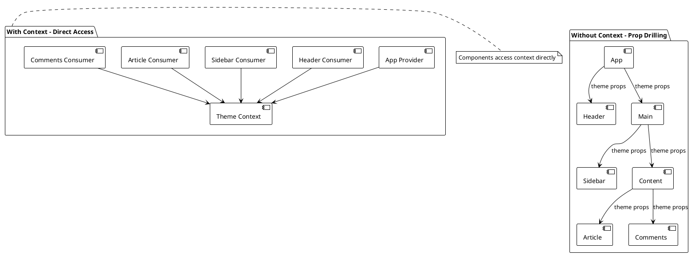
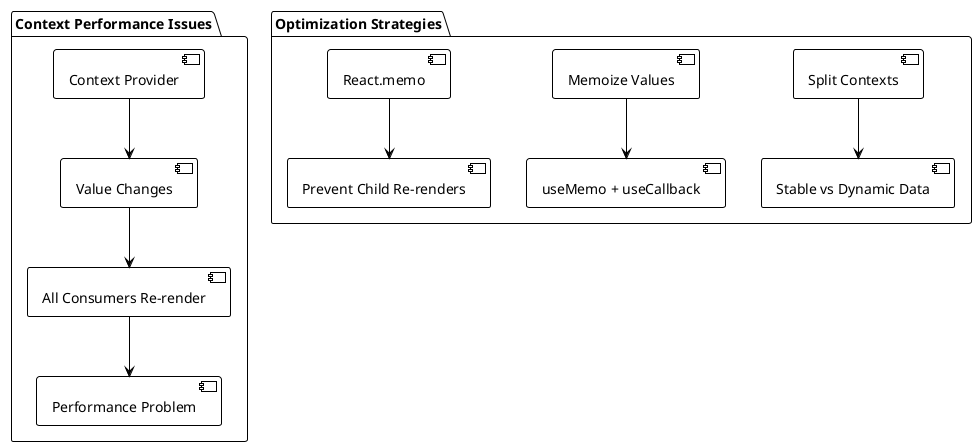
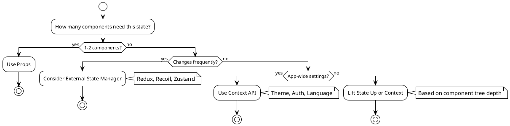

# Context API with TypeScript

## Table of Contents
1. [Introduction to Context API](#introduction)
2. [Creating Context with TypeScript](#creating-context)
3. [useContext Hook](#usecontext-hook)
4. [Context Providers and Consumers](#providers-consumers)
5. [Theme Switcher Example](#theme-example)
6. [Advanced Context Patterns](#advanced-patterns)
7. [Performance Considerations](#performance)
8. [Testing Context](#testing)
9. [Best Practices and Pitfalls](#best-practices)

## Introduction to Context API {#introduction}

The Context API is React's built-in solution for sharing state across multiple components without prop drilling. It's particularly useful for global app state like themes, user authentication, language preferences, and other cross-cutting concerns.

### When to Use Context API



### Context vs Props vs State Management

| Scenario | Solution | Reason |
|----------|----------|---------|
| 2-3 component levels | Props | Simple, explicit, no overhead |
| 4+ component levels | Context | Avoids prop drilling |
| Frequently changing data | External state manager | Context causes re-renders |
| Global app settings | Context | Perfect use case |
| Server state | React Query/SWR | Specialized tools |
| Complex state logic | Recoil/Redux | Better debugging/devtools |

## Creating Context with TypeScript {#creating-context}

TypeScript provides excellent support for Context API with proper type safety. Let's start with the basics:

### Basic Context Creation

```typescript
// ThemeContext.tsx
import { createContext, useContext, ReactNode } from 'react';

// Define the shape of our context data
interface ThemeContextType {
  theme: 'light' | 'dark';
  toggleTheme: () => void;
  colors: {
    primary: string;
    secondary: string;
    background: string;
    text: string;
  };
}

// Create context with default value
const ThemeContext = createContext<ThemeContextType | undefined>(undefined);

// Custom hook to use theme context with type safety
export const useTheme = (): ThemeContextType => {
  const context = useContext(ThemeContext);
  
  if (context === undefined) {
    throw new Error('useTheme must be used within a ThemeProvider');
  }
  
  return context;
};

// Export the context for provider
export { ThemeContext };
```

### Key TypeScript Patterns Explained:

1. **Type-Safe Context**: We define `ThemeContextType` interface for complete type safety
2. **Undefined Check**: Context can be `undefined` if used outside provider
3. **Custom Hook**: `useTheme` provides type-safe access with error handling
4. **Error Boundaries**: Throw meaningful errors when context is misused

## useContext Hook {#usecontext-hook}

The `useContext` hook is the modern way to consume context in functional components. It's cleaner and more intuitive than the old `Consumer` pattern.

### Basic Usage Pattern

```typescript
import { useContext } from 'react';

// ❌ Direct usage (not recommended)
const MyComponent = () => {
  const theme = useContext(ThemeContext); // Could be undefined
  // ...
};

// ✅ Using custom hook (recommended)
const MyComponent = () => {
  const theme = useTheme(); // Type-safe, with error handling
  // ...
};
```

### Multiple Contexts

```typescript
// UserContext.tsx
interface User {
  id: string;
  name: string;
  email: string;
  role: 'admin' | 'user' | 'guest';
}

interface UserContextType {
  user: User | null;
  login: (email: string, password: string) => Promise<void>;
  logout: () => void;
  isAuthenticated: boolean;
  isLoading: boolean;
}

const UserContext = createContext<UserContextType | undefined>(undefined);

export const useUser = (): UserContextType => {
  const context = useContext(UserContext);
  
  if (context === undefined) {
    throw new Error('useUser must be used within a UserProvider');
  }
  
  return context;
};

// Component using multiple contexts
const HeaderComponent = () => {
  const { theme, toggleTheme } = useTheme();
  const { user, logout, isAuthenticated } = useUser();
  
  return (
    <header className={`header header--${theme}`}>
      <h1>My App</h1>
      
      <div className="header-controls">
        <button onClick={toggleTheme}>
          Switch to {theme === 'light' ? 'dark' : 'light'} mode
        </button>
        
        {isAuthenticated ? (
          <div className="user-menu">
            <span>Welcome, {user?.name}</span>
            <button onClick={logout}>Logout</button>
          </div>
        ) : (
          <button>Login</button>
        )}
      </div>
    </header>
  );
};
```

## Context Providers and Consumers {#providers-consumers}

Providers are components that supply context values to their descendants. Let's build comprehensive providers with proper TypeScript typing.

### Theme Provider Implementation

```typescript
// ThemeProvider.tsx
import { useState, useCallback, ReactNode, useMemo } from 'react';
import { ThemeContext } from './ThemeContext';

interface ThemeProviderProps {
  children: ReactNode;
  defaultTheme?: 'light' | 'dark';
}

// Theme configuration
const THEME_CONFIG = {
  light: {
    primary: '#007bff',
    secondary: '#6c757d',
    background: '#ffffff',
    text: '#212529',
    surface: '#f8f9fa',
    border: '#dee2e6'
  },
  dark: {
    primary: '#0d6efd',
    secondary: '#6c757d',
    background: '#121212',
    text: '#ffffff',
    surface: '#1e1e1e',
    border: '#333333'
  }
} as const;

export const ThemeProvider = ({ children, defaultTheme = 'light' }: ThemeProviderProps) => {
  const [theme, setTheme] = useState<'light' | 'dark'>(() => {
    // Initialize from localStorage if available
    if (typeof window !== 'undefined') {
      const saved = localStorage.getItem('theme') as 'light' | 'dark' | null;
      return saved || defaultTheme;
    }
    return defaultTheme;
  });

  const toggleTheme = useCallback(() => {
    setTheme(prev => {
      const newTheme = prev === 'light' ? 'dark' : 'light';
      
      // Persist to localStorage
      if (typeof window !== 'undefined') {
        localStorage.setItem('theme', newTheme);
      }
      
      return newTheme;
    });
  }, []);

  // Memoize context value to prevent unnecessary re-renders
  const contextValue = useMemo(() => ({
    theme,
    toggleTheme,
    colors: THEME_CONFIG[theme]
  }), [theme, toggleTheme]);

  return (
    <ThemeContext.Provider value={contextValue}>
      {children}
    </ThemeContext.Provider>
  );
};
```

## Advanced Context Patterns {#advanced-patterns}

### Context Splitting for Performance

```typescript
// Split stable and dynamic contexts for better performance
interface UserData {
  id: string;
  name: string;
  email: string;
}

interface UserActions {
  updateProfile: (data: Partial<UserData>) => Promise<void>;
  logout: () => void;
}

// Stable data context
const UserDataContext = createContext<UserData | null>(null);

// Actions context (rarely changes)
const UserActionsContext = createContext<UserActions | undefined>(undefined);

// Dynamic data context
const UserPreferencesContext = createContext<UserPreferences | undefined>(undefined);

export const UserProvider = ({ children }: { children: ReactNode }) => {
  const [userData, setUserData] = useState<UserData | null>(null);
  const [preferences, setPreferences] = useState<UserPreferences>({
    theme: 'light',
    language: 'en',
    notifications: true
  });

  // Memoized actions (stable references)
  const actions = useMemo<UserActions>(() => ({
    updateProfile: async (data) => {
      const response = await fetch('/api/user/profile', {
        method: 'PATCH',
        body: JSON.stringify(data)
      });
      const updatedUser = await response.json();
      setUserData(updatedUser);
    },
    logout: () => {
      setUserData(null);
      localStorage.removeItem('token');
    }
  }), []);

  return (
    <UserDataContext.Provider value={userData}>
      <UserActionsContext.Provider value={actions}>
        <UserPreferencesContext.Provider value={preferences}>
          {children}
        </UserPreferencesContext.Provider>
      </UserActionsContext.Provider>
    </UserDataContext.Provider>
  );
};

// Granular hooks for specific data
export const useUserData = () => {
  const context = useContext(UserDataContext);
  return context; // Can be null for unauthenticated users
};

export const useUserActions = () => {
  const context = useContext(UserActionsContext);
  if (!context) {
    throw new Error('useUserActions must be used within UserProvider');
  }
  return context;
};

export const useUserPreferences = () => {
  const context = useContext(UserPreferencesContext);
  if (!context) {
    throw new Error('useUserPreferences must be used within UserProvider');
  }
  return context;
};
```

### Context with Subscriptions

```typescript
// Event-driven context for real-time updates
type EventType = 'notification' | 'message' | 'status_change';

interface AppEvent {
  type: EventType;
  payload: any;
  timestamp: Date;
}

interface EventSubscription {
  id: string;
  eventType: EventType;
  callback: (event: AppEvent) => void;
}

interface EventContextType {
  subscribe: (eventType: EventType, callback: (event: AppEvent) => void) => () => void;
  emit: (event: AppEvent) => void;
  getEvents: (eventType?: EventType) => AppEvent[];
}

const EventContext = createContext<EventContextType | undefined>(undefined);

export const EventProvider = ({ children }: { children: ReactNode }) => {
  const [events, setEvents] = useState<AppEvent[]>([]);
  const subscriptionsRef = useRef<Map<string, EventSubscription>>(new Map());

  const subscribe = useCallback((
    eventType: EventType, 
    callback: (event: AppEvent) => void
  ) => {
    const id = Math.random().toString(36);
    const subscription: EventSubscription = { id, eventType, callback };
    
    subscriptionsRef.current.set(id, subscription);

    // Return unsubscribe function
    return () => {
      subscriptionsRef.current.delete(id);
    };
  }, []);

  const emit = useCallback((event: AppEvent) => {
    // Add to events history
    setEvents(prev => [event, ...prev.slice(0, 99)]); // Keep last 100 events

    // Notify subscribers
    subscriptionsRef.current.forEach(subscription => {
      if (subscription.eventType === event.type) {
        subscription.callback(event);
      }
    });
  }, []);

  const getEvents = useCallback((eventType?: EventType) => {
    return eventType 
      ? events.filter(event => event.type === eventType)
      : events;
  }, [events]);

  const contextValue = useMemo(() => ({
    subscribe,
    emit,
    getEvents
  }), [subscribe, emit, getEvents]);

  return (
    <EventContext.Provider value={contextValue}>
      {children}
    </EventContext.Provider>
  );
};

// Hook for event management
export const useEvents = () => {
  const context = useContext(EventContext);
  if (!context) {
    throw new Error('useEvents must be used within EventProvider');
  }
  return context;
};

// Hook for specific event types
export const useEventSubscription = (eventType: EventType) => {
  const { subscribe, getEvents } = useEvents();
  const [eventHistory, setEventHistory] = useState<AppEvent[]>([]);

  useEffect(() => {
    const unsubscribe = subscribe(eventType, (event) => {
      setEventHistory(prev => [event, ...prev.slice(0, 9)]); // Keep last 10
    });

    // Initialize with existing events
    setEventHistory(getEvents(eventType).slice(0, 10));

    return unsubscribe;
  }, [eventType, subscribe, getEvents]);

  return eventHistory;
};
```

### Context Composition and Higher-Order Providers

```typescript
// Higher-order component for provider composition
interface ProviderConfig {
  providers: Array<React.ComponentType<{ children: ReactNode }>>;
}

const composeProviders = ({ providers }: ProviderConfig) => {
  return ({ children }: { children: ReactNode }) => {
    return providers.reduceRight(
      (acc, Provider) => <Provider>{acc}</Provider>,
      children as ReactElement
    );
  };
};

// Usage
const AppProviders = composeProviders({
  providers: [
    ThemeProvider,
    UserProvider,
    EventProvider,
    NotificationProvider
  ]
});

// Context factory for creating typed contexts
function createTypedContext<T>() {
  const context = createContext<T | undefined>(undefined);
  
  const useTypedContext = () => {
    const contextValue = useContext(context);
    if (contextValue === undefined) {
      throw new Error('useTypedContext must be used within its Provider');
    }
    return contextValue;
  };

  return [context, useTypedContext] as const;
}

// Usage
const [SettingsContext, useSettings] = createTypedContext<SettingsContextType>();
```

## Context Optimization Strategies {#optimization-strategies}

### Selector Pattern for Context

```typescript
// Selector pattern to prevent unnecessary re-renders
interface AppState {
  user: User | null;
  notifications: Notification[];
  theme: Theme;
  settings: Settings;
}

const AppStateContext = createContext<AppState | undefined>(undefined);

// Generic selector hook
function useAppSelector<T>(selector: (state: AppState) => T): T {
  const state = useContext(AppStateContext);
  if (!state) {
    throw new Error('useAppSelector must be used within AppStateProvider');
  }
  
  return useMemo(() => selector(state), [selector, state]);
}

// Specific selectors
export const useUser = () => useAppSelector(state => state.user);
export const useTheme = () => useAppSelector(state => state.theme);
export const useUnreadNotifications = () => 
  useAppSelector(state => state.notifications.filter(n => !n.read));

// Memoized component to prevent re-renders
const UserProfile = memo(() => {
  const user = useUser(); // Only re-renders when user changes
  return <div>{user?.name}</div>;
});
```

### Context with Immutable Updates

```typescript
// Using Immer for immutable context updates
import { produce } from 'immer';

interface TodoState {
  todos: Todo[];
  filter: FilterType;
  isLoading: boolean;
}

type TodoAction =
  | { type: 'ADD_TODO'; payload: Todo }
  | { type: 'TOGGLE_TODO'; payload: string }
  | { type: 'SET_FILTER'; payload: FilterType }
  | { type: 'SET_LOADING'; payload: boolean };

const todoReducer = produce((draft: TodoState, action: TodoAction) => {
  switch (action.type) {
    case 'ADD_TODO':
      draft.todos.push(action.payload);
      break;
    case 'TOGGLE_TODO':
      const todo = draft.todos.find(t => t.id === action.payload);
      if (todo) {
        todo.completed = !todo.completed;
      }
      break;
    case 'SET_FILTER':
      draft.filter = action.payload;
      break;
    case 'SET_LOADING':
      draft.isLoading = action.payload;
      break;
  }
});

const TodoProvider = ({ children }: { children: ReactNode }) => {
  const [state, dispatch] = useReducer(todoReducer, {
    todos: [],
    filter: 'all',
    isLoading: false
  });

  // Memoized context value
  const contextValue = useMemo(() => ({ state, dispatch }), [state]);

  return (
    <TodoContext.Provider value={contextValue}>
      {children}
    </TodoContext.Provider>
  );
};
```

## Context Persistence and Hydration {#persistence}

```typescript
// Context with localStorage persistence
interface PersistedContextOptions<T> {
  key: string;
  defaultValue: T;
  serialize?: (value: T) => string;
  deserialize?: (value: string) => T;
}

function createPersistedContext<T>({
  key,
  defaultValue,
  serialize = JSON.stringify,
  deserialize = JSON.parse
}: PersistedContextOptions<T>) {
  const Context = createContext<{
    value: T;
    setValue: (value: T | ((prev: T) => T)) => void;
  } | undefined>(undefined);

  const Provider = ({ children }: { children: ReactNode }) => {
    const [value, setValue] = useState<T>(() => {
      if (typeof window === 'undefined') return defaultValue;
      
      try {
        const stored = localStorage.getItem(key);
        return stored ? deserialize(stored) : defaultValue;
      } catch {
        return defaultValue;
      }
    });

    const setPersistedValue = useCallback((newValue: T | ((prev: T) => T)) => {
      setValue(prev => {
        const next = typeof newValue === 'function' 
          ? (newValue as (prev: T) => T)(prev)
          : newValue;
        
        try {
          localStorage.setItem(key, serialize(next));
        } catch (error) {
          console.warn('Failed to persist value:', error);
        }
        
        return next;
      });
    }, []);

    const contextValue = useMemo(() => ({
      value,
      setValue: setPersistedValue
    }), [value, setPersistedValue]);

    return (
      <Context.Provider value={contextValue}>
        {children}
      </Context.Provider>
    );
  };

  const usePersistedContext = () => {
    const context = useContext(Context);
    if (!context) {
      throw new Error('usePersistedContext must be used within its Provider');
    }
    return context;
  };

  return { Provider, usePersistedContext };
}

// Usage
const { Provider: UserPreferencesProvider, usePersistedContext: useUserPreferences } = 
  createPersistedContext({
    key: 'userPreferences',
    defaultValue: {
      theme: 'light' as const,
      language: 'en' as const,
      sidebarCollapsed: false
    }
  });
```

## Performance Considerations {#performance}

### Context Re-render Issues

Context causes all consumers to re-render when the value changes. Here's how to optimize:



```typescript
// ❌ Anti-pattern: Object recreation on every render
const BadThemeProvider = ({ children }: { children: ReactNode }) => {
  const [theme, setTheme] = useState('light');
  
  return (
    <ThemeContext.Provider value={{
      theme,
      setTheme, // New function reference every render!
      colors: THEME_CONFIG[theme] // New object every render!
    }}>
      {children}
    </ThemeContext.Provider>
  );
};

// ✅ Good: Memoized values
const GoodThemeProvider = ({ children }: { children: ReactNode }) => {
  const [theme, setTheme] = useState('light');
  
  const toggleTheme = useCallback(() => {
    setTheme(prev => prev === 'light' ? 'dark' : 'light');
  }, []);
  
  const value = useMemo(() => ({
    theme,
    toggleTheme,
    colors: THEME_CONFIG[theme]
  }), [theme, toggleTheme]);
  
  return (
    <ThemeContext.Provider value={value}>
      {children}
    </ThemeContext.Provider>
  );
};
```

### Splitting Contexts

Split frequently changing and stable contexts:

```typescript
// Split frequently changing user data from stable theme settings
const UserDataContext = createContext<UserData | undefined>(undefined);
const UserSettingsContext = createContext<UserSettings | undefined>(undefined);

// This way, theme changes don't cause user data consumers to re-render
```

## Testing Context {#testing}

Testing Context requires creating test wrappers and mocking context values:

```typescript
// test-utils/context-wrapper.tsx
import type { ReactNode, ReactElement } from 'react';
import { render } from '@testing-library/react';
import { ThemeProvider } from '../contexts/ThemeProvider';
import { UserProvider } from '../contexts/UserProvider';

interface TestWrappersProps {
  children: ReactNode;
  themeValue?: { defaultTheme?: 'light' | 'dark' };
}

export const TestWrappers = ({ 
  children, 
  themeValue = {}
}: TestWrappersProps) => {
  return (
    <UserProvider>
      <ThemeProvider {...themeValue}>
        {children}
      </ThemeProvider>
    </UserProvider>
  );
};

// Custom render function for testing
export const renderWithContext = (
  ui: ReactElement,
  options?: TestWrappersProps
) => {
  const Wrapper = ({ children }: { children: ReactNode }) => (
    <TestWrappers {...options}>{children}</TestWrappers>
  );
  
  return render(ui, { wrapper: Wrapper });
};
```

```typescript
// contexts/__tests__/ThemeProvider.test.tsx
import { renderHook, act } from '@testing-library/react';
import type { ReactNode } from 'react';
import { ThemeProvider } from '../ThemeProvider';
import { useTheme } from '../ThemeContext';

const wrapper = ({ children }: { children: ReactNode }) => (
  <ThemeProvider>{children}</ThemeProvider>
);

describe('ThemeProvider', () => {
  beforeEach(() => {
    localStorage.clear();
  });

  test('provides default light theme', () => {
    const { result } = renderHook(() => useTheme(), { wrapper });
    
    expect(result.current.theme).toBe('light');
    expect(result.current.colors.background).toBe('#ffffff');
  });

  test('toggles theme correctly', () => {
    const { result } = renderHook(() => useTheme(), { wrapper });
    
    act(() => {
      result.current.toggleTheme();
    });
    
    expect(result.current.theme).toBe('dark');
    expect(result.current.colors.background).toBe('#121212');
  });

  test('persists theme to localStorage', () => {
    const setItemSpy = jest.spyOn(Storage.prototype, 'setItem');
    const { result } = renderHook(() => useTheme(), { wrapper });
    
    act(() => {
      result.current.toggleTheme();
    });
    
    expect(setItemSpy).toHaveBeenCalledWith('theme', 'dark');
  });

  test('loads theme from localStorage', () => {
    localStorage.setItem('theme', 'dark');
    
    const { result } = renderHook(() => useTheme(), { wrapper });
    
    expect(result.current.theme).toBe('dark');
  });

  test('throws error when used outside provider', () => {
    const { result } = renderHook(() => useTheme());
    
    expect(result.error).toEqual(
      Error('useTheme must be used within a ThemeProvider')
    );
  });
});
```

```typescript
// components/__tests__/ThemeToggle.test.tsx
import { screen } from '@testing-library/react';
import userEvent from '@testing-library/user-event';
import { renderWithContext } from '../../test-utils/context-wrapper';
import { useTheme } from '../ThemeContext';

const ThemeToggle = () => {
  const { theme, toggleTheme } = useTheme();
  
  return (
    <button onClick={toggleTheme} data-testid="theme-toggle">
      Switch to {theme === 'light' ? 'dark' : 'light'} mode
    </button>
  );
};

describe('ThemeToggle', () => {
  test('displays correct toggle text for light theme', () => {
    renderWithContext(<ThemeToggle />);
    
    expect(screen.getByText('Switch to dark mode')).toBeInTheDocument();
  });

  test('toggles theme when clicked', async () => {
    const user = userEvent.setup();
    renderWithContext(<ThemeToggle />);
    
    const button = screen.getByTestId('theme-toggle');
    await user.click(button);
    
    expect(screen.getByText('Switch to light mode')).toBeInTheDocument();
  });

  test('starts with dark theme when specified', () => {
    renderWithContext(<ThemeToggle />, { 
      themeValue: { defaultTheme: 'dark' } 
    });
    
    expect(screen.getByText('Switch to light mode')).toBeInTheDocument();
  });
});
```

## Best Practices and Pitfalls {#best-practices}

### Best Practices

1. **Use Custom Hooks**: Always wrap `useContext` in custom hooks
2. **Memoize Context Values**: Use `useMemo` and `useCallback` to prevent unnecessary re-renders
3. **Split Contexts**: Separate frequently changing from stable data
4. **Provide Default Values**: Always provide sensible defaults for context
5. **Error Boundaries**: Implement proper error handling for context usage
6. **TypeScript Integration**: Use interfaces for type safety

### Common Pitfalls

```typescript
// ❌ Don't: Using context for frequently changing data
const BadCounterContext = () => {
  const [count, setCount] = useState(0);
  // This will cause all consumers to re-render on every count change
  return (
    <CounterContext.Provider value={{ count, setCount }}>
      {children}
    </CounterContext.Provider>
  );
};

// ✅ Do: Use local state for frequently changing data
const GoodCounter = () => {
  const [count, setCount] = useState(0);
  // Keep local state local
};

// ❌ Don't: Creating new objects/functions on every render
const BadProvider = ({ children }) => (
  <MyContext.Provider value={{
    data: someData,
    handler: () => doSomething() // New function reference every render!
  }}>
    {children}
  </MyContext.Provider>
);

// ✅ Do: Memoize context values
const GoodProvider = ({ children }) => {
  const handler = useCallback(() => doSomething(), []);
  const value = useMemo(() => ({ data: someData, handler }), [someData, handler]);
  
  return (
    <MyContext.Provider value={value}>
      {children}
    </MyContext.Provider>
  );
};
```

### Context vs Other Solutions



### Performance Guidelines

1. **Measure First**: Use React DevTools Profiler to identify actual performance issues
2. **Split Wisely**: Don't over-split contexts - it adds complexity
3. **Memoize Appropriately**: Only memoize when you have a performance issue
4. **Consider Alternatives**: For complex state, external libraries might be better

## Summary

The Context API is a powerful tool for sharing state across your React application without prop drilling. Key takeaways:

1. **Start Simple**: Use Context for truly global state like themes and authentication
2. **Type Safety**: Leverage TypeScript for better developer experience
3. **Performance**: Memoize context values and split contexts when needed
4. **Testing**: Create proper test utilities for components using context
5. **Know When Not to Use**: Context isn't always the answer - consider alternatives

Context API works great for relatively stable, app-wide state. For more complex state management needs with better performance and developer tools, we'll explore Recoil in the next section.
