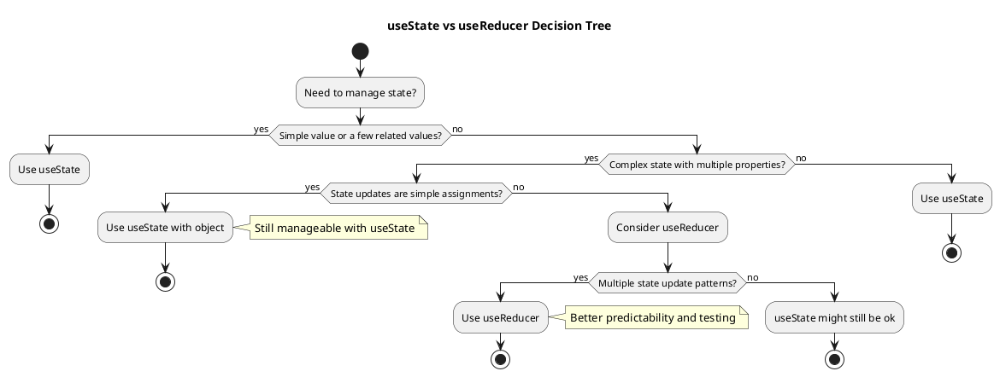

# Component State Management

Component state management is the foundation of React applications. Understanding how to effectively manage state within individual components is crucial before moving to more complex state management solutions. This section covers `useState`, `useReducer`, and advanced patterns for component-level state.

## Understanding useState

The `useState` hook is the most basic way to add state to functional components. It follows the pattern of state and setState from class components but with a more functional approach.

### Basic useState Pattern

```tsx
// src/components/Examples/BasicState.tsx
import React, { useState } from 'react';

function BasicState() {
  // useState returns [currentValue, setterFunction]
  const [count, setCount] = useState<number>(0);
  const [name, setName] = useState<string>('');
  const [isVisible, setIsVisible] = useState<boolean>(true);
  
  return (
    <div className="basic-state">
      <h3>Basic useState Examples</h3>
      
      <div className="example-section">
        <h4>Counter: {count}</h4>
        <button onClick={() => setCount(count + 1)}>
          Increment
        </button>
        <button onClick={() => setCount(prev => prev + 1)}>
          Increment (functional)
        </button>
      </div>
      
      <div className="example-section">
        <h4>Name Input</h4>
        <input 
          value={name}
          onChange={(e) => setName(e.target.value)}
          placeholder="Enter your name"
        />
        <p>Hello, {name || 'stranger'}!</p>
      </div>
      
      <div className="example-section">
        <button onClick={() => setIsVisible(!isVisible)}>
          Toggle Visibility
        </button>
        {isVisible && <p>This text is conditionally rendered!</p>}
      </div>
    </div>
  );
}

export default BasicState;
```

### Functional Updates vs Direct Updates

Understanding when to use functional updates is crucial for avoiding bugs:

```tsx
// src/components/Examples/FunctionalUpdates.tsx
import React, { useState } from 'react';

function FunctionalUpdates() {
  const [count, setCount] = useState<number>(0);
  
  // ❌ Problematic: Multiple updates in quick succession
  const incrementThreeTimesBad = () => {
    setCount(count + 1); // All three calls use the same initial value
    setCount(count + 1);
    setCount(count + 1);
    // Result: count is only incremented by 1, not 3
  };
  
  // ✅ Correct: Using functional updates
  const incrementThreeTimesGood = () => {
    setCount(prev => prev + 1); // Each call gets the latest value
    setCount(prev => prev + 1);
    setCount(prev => prev + 1);
    // Result: count is correctly incremented by 3
  };
  
  // ❌ Problematic: Async operations
  const incrementAfterDelayBad = () => {
    setTimeout(() => {
      setCount(count + 1); // Uses stale closure value
    }, 1000);
  };
  
  // ✅ Correct: Functional update with async
  const incrementAfterDelayGood = () => {
    setTimeout(() => {
      setCount(prev => prev + 1); // Always gets latest value
    }, 1000);
  };
  
  return (
    <div className="functional-updates">
      <h3>Count: {count}</h3>
      
      <div className="button-group">
        <button onClick={() => setCount(0)}>Reset</button>
        <button onClick={incrementThreeTimesBad}>+3 (Bad)</button>
        <button onClick={incrementThreeTimesGood}>+3 (Good)</button>
        <button onClick={incrementAfterDelayBad}>+1 Delayed (Bad)</button>
        <button onClick={incrementAfterDelayGood}>+1 Delayed (Good)</button>
      </div>
    </div>
  );
}

export default FunctionalUpdates;
```

### Complex State with useState

When state becomes more complex, you need to be careful about immutability:

```tsx
// src/components/Examples/ComplexState.tsx
import React, { useState } from 'react';

interface User {
  id: number;
  name: string;
  email: string;
  age: number;
}

interface UserSettings {
  theme: 'light' | 'dark';
  notifications: boolean;
  language: string;
}

function ComplexState() {
  const [user, setUser] = useState<User>({
    id: 1,
    name: 'John Doe',
    email: 'john@example.com',
    age: 30
  });
  
  const [settings, setSettings] = useState<UserSettings>({
    theme: 'light',
    notifications: true,
    language: 'en'
  });
  
  const [users, setUsers] = useState<User[]>([
    { id: 1, name: 'John Doe', email: 'john@example.com', age: 30 },
    { id: 2, name: 'Jane Smith', email: 'jane@example.com', age: 25 }
  ]);
  
  // ❌ Bad: Mutating state directly
  const updateUserAgeBad = (newAge: number) => {
    user.age = newAge; // Direct mutation
    setUser(user); // React won't detect the change
  };
  
  // ✅ Good: Immutable update
  const updateUserAge = (newAge: number) => {
    setUser(prevUser => ({
      ...prevUser,
      age: newAge
    }));
  };
  
  // ✅ Update nested property
  const toggleNotifications = () => {
    setSettings(prevSettings => ({
      ...prevSettings,
      notifications: !prevSettings.notifications
    }));
  };
  
  // ✅ Update array item
  const updateUserInList = (userId: number, updates: Partial<User>) => {
    setUsers(prevUsers => 
      prevUsers.map(user => 
        user.id === userId 
          ? { ...user, ...updates }
          : user
      )
    );
  };
  
  // ✅ Add to array
  const addUser = (newUser: Omit<User, 'id'>) => {
    const id = Math.max(...users.map(u => u.id)) + 1;
    setUsers(prevUsers => [...prevUsers, { ...newUser, id }]);
  };
  
  // ✅ Remove from array
  const removeUser = (userId: number) => {
    setUsers(prevUsers => prevUsers.filter(user => user.id !== userId));
  };
  
  return (
    <div className="complex-state">
      <h3>Complex State Management</h3>
      
      <div className="user-section">
        <h4>Current User</h4>
        <p>Name: {user.name}</p>
        <p>Email: {user.email}</p>
        <p>Age: {user.age}</p>
        
        <div className="controls">
          <button onClick={() => updateUserAge(user.age + 1)}>
            Increase Age
          </button>
          <button 
            onClick={() => setUser(prev => ({ ...prev, name: 'Updated Name' }))}
          >
            Update Name
          </button>
        </div>
      </div>
      
      <div className="settings-section">
        <h4>Settings</h4>
        <label>
          <input 
            type="checkbox"
            checked={settings.notifications}
            onChange={toggleNotifications}
          />
          Enable Notifications
        </label>
        
        <select 
          value={settings.theme}
          onChange={(e) => setSettings(prev => ({ 
            ...prev, 
            theme: e.target.value as 'light' | 'dark' 
          }))}
        >
          <option value="light">Light</option>
          <option value="dark">Dark</option>
        </select>
      </div>
      
      <div className="users-list">
        <h4>All Users</h4>
        {users.map(user => (
          <div key={user.id} className="user-item">
            <span>{user.name} ({user.age})</span>
            <button onClick={() => updateUserInList(user.id, { age: user.age + 1 })}>
              Age +1
            </button>
            <button onClick={() => removeUser(user.id)}>
              Remove
            </button>
          </div>
        ))}
        
        <button 
          onClick={() => addUser({ 
            name: 'New User', 
            email: 'new@example.com', 
            age: 20 
          })}
        >
          Add User
        </button>
      </div>
    </div>
  );
}

export default ComplexState;
```

## Introduction to useReducer

When state logic becomes complex, `useReducer` provides a more predictable way to manage state updates. It follows the Redux pattern of actions and reducers.

### When to Use useReducer

Consider `useReducer` when you have:

1. **Complex state logic** with multiple sub-values
2. **State transitions** that depend on previous state
3. **Multiple ways** to update the same piece of state
4. **State updates** that need to be tested independently



### Basic useReducer Pattern

```tsx
// src/hooks/useCounter.ts
import { useReducer } from 'react';

// Define state type
interface CounterState {
  count: number;
  step: number;
  history: number[];
}

// Define action types
type CounterAction =
  | { type: 'INCREMENT' }
  | { type: 'DECREMENT' }
  | { type: 'RESET' }
  | { type: 'SET_STEP'; payload: number }
  | { type: 'SET_COUNT'; payload: number }
  | { type: 'UNDO' };

// Initial state
const initialState: CounterState = {
  count: 0,
  step: 1,
  history: [0]
};

// Reducer function
function counterReducer(state: CounterState, action: CounterAction): CounterState {
  switch (action.type) {
    case 'INCREMENT': {
      const newCount = state.count + state.step;
      return {
        ...state,
        count: newCount,
        history: [...state.history, newCount]
      };
    }
    
    case 'DECREMENT': {
      const newCount = state.count - state.step;
      return {
        ...state,
        count: newCount,
        history: [...state.history, newCount]
      };
    }
    
    case 'RESET': {
      return {
        ...state,
        count: 0,
        history: [0]
      };
    }
    
    case 'SET_STEP': {
      return {
        ...state,
        step: Math.max(1, action.payload) // Ensure step is at least 1
      };
    }
    
    case 'SET_COUNT': {
      return {
        ...state,
        count: action.payload,
        history: [...state.history, action.payload]
      };
    }
    
    case 'UNDO': {
      if (state.history.length <= 1) return state;
      
      const newHistory = state.history.slice(0, -1);
      const previousCount = newHistory[newHistory.length - 1];
      
      return {
        ...state,
        count: previousCount,
        history: newHistory
      };
    }
    
    default:
      throw new Error(`Unknown action type: ${(action as any).type}`);
  }
}

// Custom hook
export function useCounter(initialCount: number = 0) {
  const [state, dispatch] = useReducer(counterReducer, {
    ...initialState,
    count: initialCount,
    history: [initialCount]
  });
  
  const increment = () => dispatch({ type: 'INCREMENT' });
  const decrement = () => dispatch({ type: 'DECREMENT' });
  const reset = () => dispatch({ type: 'RESET' });
  const setStep = (step: number) => dispatch({ type: 'SET_STEP', payload: step });
  const setCount = (count: number) => dispatch({ type: 'SET_COUNT', payload: count });
  const undo = () => dispatch({ type: 'UNDO' });
  
  return {
    ...state,
    increment,
    decrement,
    reset,
    setStep,
    setCount,
    undo,
    canUndo: state.history.length > 1
  };
}

// src/components/AdvancedCounter/AdvancedCounter.tsx
import React from 'react';
import { useCounter } from '../../hooks/useCounter';

function AdvancedCounter() {
  const { 
    count, 
    step, 
    history, 
    increment, 
    decrement, 
    reset, 
    setStep, 
    setCount, 
    undo, 
    canUndo 
  } = useCounter(10);
  
  return (
    <div className="advanced-counter">
      <h3>Advanced Counter with useReducer</h3>
      
      <div className="current-value">
        <h4>Count: {count}</h4>
        <p>Step: {step}</p>
      </div>
      
      <div className="controls">
        <button onClick={decrement}>- {step}</button>
        <button onClick={increment}>+ {step}</button>
        <button onClick={reset}>Reset</button>
        <button onClick={undo} disabled={!canUndo}>
          Undo
        </button>
      </div>
      
      <div className="step-controls">
        <label>
          Step size:
          <input 
            type="number"
            value={step}
            onChange={(e) => setStep(Number(e.target.value))}
            min="1"
          />
        </label>
      </div>
      
      <div className="direct-set">
        <label>
          Set count directly:
          <input 
            type="number"
            placeholder="Enter value"
            onKeyPress={(e) => {
              if (e.key === 'Enter') {
                const target = e.target as HTMLInputElement;
                setCount(Number(target.value));
                target.value = '';
              }
            }}
          />
        </label>
      </div>
      
      <div className="history">
        <h5>History:</h5>
        <div className="history-items">
          {history.map((value, index) => (
            <span 
              key={index} 
              className={index === history.length - 1 ? 'current' : ''}
            >
              {value}
              {index < history.length - 1 && ' → '}
            </span>
          ))}
        </div>
      </div>
    </div>
  );
}

export default AdvancedCounter;
```

### Complex Form Management with useReducer

Forms are a perfect use case for `useReducer` when they have complex validation and multiple fields:

```tsx
// src/hooks/useForm.ts
import { useReducer, useCallback } from 'react';

export interface FormField {
  value: string;
  error: string | null;
  touched: boolean;
}

export interface FormState<T extends string> {
  fields: Record<T, FormField>;
  isSubmitting: boolean;
  submitError: string | null;
  isValid: boolean;
}

export type FormAction<T extends string> =
  | { type: 'SET_FIELD_VALUE'; field: T; value: string }
  | { type: 'SET_FIELD_ERROR'; field: T; error: string | null }
  | { type: 'SET_FIELD_TOUCHED'; field: T; touched: boolean }
  | { type: 'SET_SUBMITTING'; isSubmitting: boolean }
  | { type: 'SET_SUBMIT_ERROR'; error: string | null }
  | { type: 'RESET_FORM' }
  | { type: 'SUBMIT_SUCCESS' };

export type Validator<T> = (value: T) => string | null;

export interface UseFormConfig<T extends string> {
  initialValues: Record<T, string>;
  validators?: Partial<Record<T, Validator<string>>>;
  onSubmit: (values: Record<T, string>) => Promise<void> | void;
}

function createFormReducer<T extends string>(fieldNames: T[]) {
  return function formReducer(
    state: FormState<T>, 
    action: FormAction<T>
  ): FormState<T> {
    switch (action.type) {
      case 'SET_FIELD_VALUE': {
        const newFields = {
          ...state.fields,
          [action.field]: {
            ...state.fields[action.field],
            value: action.value
          }
        };
        
        return {
          ...state,
          fields: newFields,
          isValid: Object.values(newFields).every(field => !field.error)
        };
      }
      
      case 'SET_FIELD_ERROR': {
        const newFields = {
          ...state.fields,
          [action.field]: {
            ...state.fields[action.field],
            error: action.error
          }
        };
        
        return {
          ...state,
          fields: newFields,
          isValid: Object.values(newFields).every(field => !field.error)
        };
      }
      
      case 'SET_FIELD_TOUCHED': {
        return {
          ...state,
          fields: {
            ...state.fields,
            [action.field]: {
              ...state.fields[action.field],
              touched: action.touched
            }
          }
        };
      }
      
      case 'SET_SUBMITTING': {
        return {
          ...state,
          isSubmitting: action.isSubmitting
        };
      }
      
      case 'SET_SUBMIT_ERROR': {
        return {
          ...state,
          submitError: action.error,
          isSubmitting: false
        };
      }
      
      case 'SUBMIT_SUCCESS': {
        return {
          ...state,
          isSubmitting: false,
          submitError: null
        };
      }
      
      case 'RESET_FORM': {
        const resetFields = {} as Record<T, FormField>;
        fieldNames.forEach(field => {
          resetFields[field] = {
            value: '',
            error: null,
            touched: false
          };
        });
        
        return {
          fields: resetFields,
          isSubmitting: false,
          submitError: null,
          isValid: true
        };
      }
      
      default:
        return state;
    }
  };
}

export function useForm<T extends string>(config: UseFormConfig<T>) {
  const fieldNames = Object.keys(config.initialValues) as T[];
  const formReducer = createFormReducer(fieldNames);
  
  const initialState: FormState<T> = {
    fields: {} as Record<T, FormField>,
    isSubmitting: false,
    submitError: null,
    isValid: true
  };
  
  // Initialize fields
  fieldNames.forEach(field => {
    initialState.fields[field] = {
      value: config.initialValues[field],
      error: null,
      touched: false
    };
  });
  
  const [state, dispatch] = useReducer(formReducer, initialState);
  
  const setFieldValue = useCallback((field: T, value: string) => {
    dispatch({ type: 'SET_FIELD_VALUE', field, value });
    
    // Run validation
    const validator = config.validators?.[field];
    if (validator) {
      const error = validator(value);
      dispatch({ type: 'SET_FIELD_ERROR', field, error });
    }
  }, [config.validators]);
  
  const setFieldTouched = useCallback((field: T, touched: boolean = true) => {
    dispatch({ type: 'SET_FIELD_TOUCHED', field, touched });
  }, []);
  
  const validateField = useCallback((field: T) => {
    const validator = config.validators?.[field];
    if (validator) {
      const value = state.fields[field].value;
      const error = validator(value);
      dispatch({ type: 'SET_FIELD_ERROR', field, error });
      return !error;
    }
    return true;
  }, [config.validators, state.fields]);
  
  const validateAllFields = useCallback(() => {
    let isFormValid = true;
    fieldNames.forEach(field => {
      const isFieldValid = validateField(field);
      if (!isFieldValid) {
        isFormValid = false;
      }
    });
    return isFormValid;
  }, [fieldNames, validateField]);
  
  const handleSubmit = useCallback(async (e?: React.FormEvent) => {
    e?.preventDefault();
    
    dispatch({ type: 'SET_SUBMITTING', isSubmitting: true });
    dispatch({ type: 'SET_SUBMIT_ERROR', error: null });
    
    // Mark all fields as touched
    fieldNames.forEach(field => {
      setFieldTouched(field, true);
    });
    
    // Validate all fields
    const isFormValid = validateAllFields();
    
    if (!isFormValid) {
      dispatch({ type: 'SET_SUBMITTING', isSubmitting: false });
      return;
    }
    
    try {
      const values = {} as Record<T, string>;
      fieldNames.forEach(field => {
        values[field] = state.fields[field].value;
      });
      
      await config.onSubmit(values);
      dispatch({ type: 'SUBMIT_SUCCESS' });
    } catch (error) {
      const errorMessage = error instanceof Error ? error.message : 'An error occurred';
      dispatch({ type: 'SET_SUBMIT_ERROR', error: errorMessage });
    }
  }, [fieldNames, setFieldTouched, validateAllFields, config.onSubmit, state.fields]);
  
  const resetForm = useCallback(() => {
    dispatch({ type: 'RESET_FORM' });
  }, []);
  
  return {
    fields: state.fields,
    isSubmitting: state.isSubmitting,
    submitError: state.submitError,
    isValid: state.isValid,
    setFieldValue,
    setFieldTouched,
    validateField,
    validateAllFields,
    handleSubmit,
    resetForm
  };
}

// Example usage: Contact form
// src/components/ContactForm/ContactForm.tsx
import React from 'react';
import { useForm } from '../../hooks/useForm';

type ContactFormFields = 'name' | 'email' | 'subject' | 'message';

function ContactForm() {
  const { 
    fields, 
    isSubmitting, 
    submitError, 
    isValid, 
    setFieldValue, 
    setFieldTouched, 
    handleSubmit 
  } = useForm<ContactFormFields>({
    initialValues: {
      name: '',
      email: '',
      subject: '',
      message: ''
    },
    validators: {
      name: (value) => {
        if (!value.trim()) return 'Name is required';
        if (value.trim().length < 2) return 'Name must be at least 2 characters';
        return null;
      },
      email: (value) => {
        if (!value.trim()) return 'Email is required';
        const emailRegex = /^[^\s@]+@[^\s@]+\.[^\s@]+$/;
        if (!emailRegex.test(value)) return 'Please enter a valid email';
        return null;
      },
      subject: (value) => {
        if (!value.trim()) return 'Subject is required';
        return null;
      },
      message: (value) => {
        if (!value.trim()) return 'Message is required';
        if (value.trim().length < 10) return 'Message must be at least 10 characters';
        return null;
      }
    },
    onSubmit: async (values) => {
      // Simulate API call
      await new Promise(resolve => setTimeout(resolve, 2000));
      console.log('Form submitted:', values);
      alert('Message sent successfully!');
    }
  });
  
  return (
    <form onSubmit={handleSubmit} className="contact-form">
      <h3>Contact Us</h3>
      
      <div className="form-field">
        <label htmlFor="name">Name</label>
        <input
          id="name"
          type="text"
          value={fields.name.value}
          onChange={(e) => setFieldValue('name', e.target.value)}
          onBlur={() => setFieldTouched('name')}
          className={fields.name.error && fields.name.touched ? 'error' : ''}
        />
        {fields.name.error && fields.name.touched && (
          <span className="error-message">{fields.name.error}</span>
        )}
      </div>
      
      <div className="form-field">
        <label htmlFor="email">Email</label>
        <input
          id="email"
          type="email"
          value={fields.email.value}
          onChange={(e) => setFieldValue('email', e.target.value)}
          onBlur={() => setFieldTouched('email')}
          className={fields.email.error && fields.email.touched ? 'error' : ''}
        />
        {fields.email.error && fields.email.touched && (
          <span className="error-message">{fields.email.error}</span>
        )}
      </div>
      
      <div className="form-field">
        <label htmlFor="subject">Subject</label>
        <input
          id="subject"
          type="text"
          value={fields.subject.value}
          onChange={(e) => setFieldValue('subject', e.target.value)}
          onBlur={() => setFieldTouched('subject')}
          className={fields.subject.error && fields.subject.touched ? 'error' : ''}
        />
        {fields.subject.error && fields.subject.touched && (
          <span className="error-message">{fields.subject.error}</span>
        )}
      </div>
      
      <div className="form-field">
        <label htmlFor="message">Message</label>
        <textarea
          id="message"
          rows={4}
          value={fields.message.value}
          onChange={(e) => setFieldValue('message', e.target.value)}
          onBlur={() => setFieldTouched('message')}
          className={fields.message.error && fields.message.touched ? 'error' : ''}
        />
        {fields.message.error && fields.message.touched && (
          <span className="error-message">{fields.message.error}</span>
        )}
      </div>
      
      {submitError && (
        <div className="submit-error">
          {submitError}
        </div>
      )}
      
      <button 
        type="submit" 
        disabled={isSubmitting || !isValid}
        className="submit-button"
      >
        {isSubmitting ? 'Sending...' : 'Send Message'}
      </button>
    </form>
  );
}

export default ContactForm;
```

## Performance Optimization Patterns

### Optimizing useState Updates

```tsx
// src/components/OptimizedComponents/MemoizedChild.tsx
import React, { memo } from 'react';

interface ChildProps {
  value: string;
  onValueChange: (value: string) => void;
}

// Memoize child component to prevent unnecessary re-renders
const MemoizedChild = memo(function Child({ value, onValueChange }: ChildProps) {
  console.log('Child rendered with value:', value);
  
  return (
    <div>
      <input 
        value={value} 
        onChange={(e) => onValueChange(e.target.value)} 
      />
    </div>
  );
});

// src/components/OptimizedComponents/OptimizedParent.tsx
import React, { useState, useCallback } from 'react';
import MemoizedChild from './MemoizedChild';

function OptimizedParent() {
  const [childValue, setChildValue] = useState('');
  const [parentValue, setParentValue] = useState('');
  
  // ❌ This function is recreated on every render
  const handleChildValueChangeBad = (value: string) => {
    setChildValue(value);
  };
  
  // ✅ useCallback prevents function recreation
  const handleChildValueChangeGood = useCallback((value: string) => {
    setChildValue(value);
  }, []);
  
  return (
    <div>
      <h3>Parent Component</h3>
      <input 
        value={parentValue}
        onChange={(e) => setParentValue(e.target.value)}
        placeholder="Parent input (causes re-render)"
      />
      
      <h4>Child Component</h4>
      <MemoizedChild 
        value={childValue}
        onValueChange={handleChildValueChangeGood}
      />
    </div>
  );
}

export default OptimizedParent;
```

### Lazy State Initialization

For expensive initial state calculations:

```tsx
// src/hooks/useLazyState.ts
import { useState } from 'react';

// ❌ Expensive calculation runs on every render
function ExpensiveComponent() {
  const [data, setData] = useState(expensiveCalculation());
  return <div>{data.length} items</div>;
}

// ✅ Lazy initialization - calculation runs only once
function OptimizedComponent() {
  const [data, setData] = useState(() => expensiveCalculation());
  return <div>{data.length} items</div>;
}

function expensiveCalculation(): string[] {
  console.log('Running expensive calculation...');
  return Array.from({ length: 1000 }, (_, i) => `Item ${i}`);
}

export { OptimizedComponent };
```

### State Batching and Concurrent Features

```tsx
// src/components/Batching/BatchingExample.tsx
import React, { useState, startTransition } from 'react';

function BatchingExample() {
  const [count, setCount] = useState(0);
  const [flag, setFlag] = useState(false);
  
  // React 18 automatically batches these updates
  const handleClick = () => {
    setCount(c => c + 1);
    setFlag(f => !f);
    // Only one re-render occurs
  };
  
  // For non-urgent updates, use startTransition
  const handleLargeUpdate = () => {
    startTransition(() => {
      // This update is marked as non-urgent
      setCount(c => c + 1000);
    });
  };
  
  console.log('Component rendered');
  
  return (
    <div>
      <h3>Batching Example</h3>
      <p>Count: {count}</p>
      <p>Flag: {flag.toString()}</p>
      
      <button onClick={handleClick}>
        Update both (batched)
      </button>
      
      <button onClick={handleLargeUpdate}>
        Large update (with transition)
      </button>
    </div>
  );
}

export default BatchingExample;
```

## Testing Component State

Comprehensive testing for component state management:

```tsx
// src/hooks/useCounter.test.ts
import { renderHook, act } from '@testing-library/react';
import { useCounter } from './useCounter';

describe('useCounter', () => {
  test('initializes with default values', () => {
    const { result } = renderHook(() => useCounter());
    
    expect(result.current.count).toBe(0);
    expect(result.current.step).toBe(1);
    expect(result.current.history).toEqual([0]);
    expect(result.current.canUndo).toBe(false);
  });
  
  test('initializes with custom initial count', () => {
    const { result } = renderHook(() => useCounter(10));
    
    expect(result.current.count).toBe(10);
    expect(result.current.history).toEqual([10]);
  });
  
  test('increments count by step', () => {
    const { result } = renderHook(() => useCounter());
    
    act(() => {
      result.current.increment();
    });
    
    expect(result.current.count).toBe(1);
    expect(result.current.history).toEqual([0, 1]);
    expect(result.current.canUndo).toBe(true);
  });
  
  test('decrements count by step', () => {
    const { result } = renderHook(() => useCounter(5));
    
    act(() => {
      result.current.decrement();
    });
    
    expect(result.current.count).toBe(4);
    expect(result.current.history).toEqual([5, 4]);
  });
  
  test('changes step size', () => {
    const { result } = renderHook(() => useCounter());
    
    act(() => {
      result.current.setStep(5);
    });
    
    expect(result.current.step).toBe(5);
    
    act(() => {
      result.current.increment();
    });
    
    expect(result.current.count).toBe(5);
  });
  
  test('prevents step from being less than 1', () => {
    const { result } = renderHook(() => useCounter());
    
    act(() => {
      result.current.setStep(0);
    });
    
    expect(result.current.step).toBe(1);
    
    act(() => {
      result.current.setStep(-5);
    });
    
    expect(result.current.step).toBe(1);
  });
  
  test('sets count directly', () => {
    const { result } = renderHook(() => useCounter());
    
    act(() => {
      result.current.setCount(42);
    });
    
    expect(result.current.count).toBe(42);
    expect(result.current.history).toEqual([0, 42]);
  });
  
  test('resets count to 0', () => {
    const { result } = renderHook(() => useCounter(10));
    
    act(() => {
      result.current.increment();
      result.current.reset();
    });
    
    expect(result.current.count).toBe(0);
    expect(result.current.history).toEqual([0]);
    expect(result.current.canUndo).toBe(false);
  });
  
  test('undoes last action', () => {
    const { result } = renderHook(() => useCounter());
    
    act(() => {
      result.current.increment();
      result.current.increment();
    });
    
    expect(result.current.count).toBe(2);
    expect(result.current.history).toEqual([0, 1, 2]);
    
    act(() => {
      result.current.undo();
    });
    
    expect(result.current.count).toBe(1);
    expect(result.current.history).toEqual([0, 1]);
  });
  
  test('cannot undo when history has only one item', () => {
    const { result } = renderHook(() => useCounter());
    
    act(() => {
      result.current.undo();
    });
    
    expect(result.current.count).toBe(0);
    expect(result.current.history).toEqual([0]);
    expect(result.current.canUndo).toBe(false);
  });
});

// src/hooks/useForm.test.ts
import { renderHook, act } from '@testing-library/react';
import { useForm } from './useForm';

type TestFormFields = 'email' | 'password';

describe('useForm', () => {
  const mockOnSubmit = jest.fn();
  
  beforeEach(() => {
    mockOnSubmit.mockClear();
  });
  
  const defaultConfig = {
    initialValues: {
      email: '',
      password: ''
    } as Record<TestFormFields, string>,
    validators: {
      email: (value: string) => {
        if (!value) return 'Email is required';
        if (!value.includes('@')) return 'Invalid email';
        return null;
      },
      password: (value: string) => {
        if (!value) return 'Password is required';
        if (value.length < 6) return 'Password must be at least 6 characters';
        return null;
      }
    },
    onSubmit: mockOnSubmit
  };
  
  test('initializes with default values', () => {
    const { result } = renderHook(() => useForm(defaultConfig));
    
    expect(result.current.fields.email.value).toBe('');
    expect(result.current.fields.email.error).toBe(null);
    expect(result.current.fields.email.touched).toBe(false);
    
    expect(result.current.isSubmitting).toBe(false);
    expect(result.current.submitError).toBe(null);
    expect(result.current.isValid).toBe(true);
  });
  
  test('updates field values', () => {
    const { result } = renderHook(() => useForm(defaultConfig));
    
    act(() => {
      result.current.setFieldValue('email', 'test@example.com');
    });
    
    expect(result.current.fields.email.value).toBe('test@example.com');
    expect(result.current.fields.email.error).toBe(null);
  });
  
  test('validates fields on value change', () => {
    const { result } = renderHook(() => useForm(defaultConfig));
    
    act(() => {
      result.current.setFieldValue('email', 'invalid-email');
    });
    
    expect(result.current.fields.email.error).toBe('Invalid email');
    expect(result.current.isValid).toBe(false);
  });
  
  test('marks fields as touched', () => {
    const { result } = renderHook(() => useForm(defaultConfig));
    
    act(() => {
      result.current.setFieldTouched('email', true);
    });
    
    expect(result.current.fields.email.touched).toBe(true);
  });
  
  test('validates all fields before submission', async () => {
    const { result } = renderHook(() => useForm(defaultConfig));
    
    await act(async () => {
      await result.current.handleSubmit();
    });
    
    expect(result.current.fields.email.touched).toBe(true);
    expect(result.current.fields.password.touched).toBe(true);
    expect(result.current.fields.email.error).toBe('Email is required');
    expect(result.current.fields.password.error).toBe('Password is required');
    expect(mockOnSubmit).not.toHaveBeenCalled();
  });
  
  test('submits form when valid', async () => {
    const { result } = renderHook(() => useForm(defaultConfig));
    
    act(() => {
      result.current.setFieldValue('email', 'test@example.com');
      result.current.setFieldValue('password', 'password123');
    });
    
    await act(async () => {
      await result.current.handleSubmit();
    });
    
    expect(mockOnSubmit).toHaveBeenCalledWith({
      email: 'test@example.com',
      password: 'password123'
    });
  });
  
  test('handles submission errors', async () => {
    const errorConfig = {
      ...defaultConfig,
      onSubmit: jest.fn().mockRejectedValue(new Error('Submission failed'))
    };
    
    const { result } = renderHook(() => useForm(errorConfig));
    
    act(() => {
      result.current.setFieldValue('email', 'test@example.com');
      result.current.setFieldValue('password', 'password123');
    });
    
    await act(async () => {
      await result.current.handleSubmit();
    });
    
    expect(result.current.submitError).toBe('Submission failed');
    expect(result.current.isSubmitting).toBe(false);
  });
  
  test('resets form to initial state', () => {
    const { result } = renderHook(() => useForm(defaultConfig));
    
    act(() => {
      result.current.setFieldValue('email', 'test@example.com');
      result.current.setFieldTouched('email', true);
    });
    
    act(() => {
      result.current.resetForm();
    });
    
    expect(result.current.fields.email.value).toBe('');
    expect(result.current.fields.email.error).toBe(null);
    expect(result.current.fields.email.touched).toBe(false);
  });
});

// src/components/ContactForm/ContactForm.test.tsx
import React from 'react';
import { render, screen, waitFor } from '@testing-library/react';
import userEvent from '@testing-library/user-event';
import ContactForm from './ContactForm';

// Mock the form submission
jest.mock('../../hooks/useForm', () => ({
  useForm: jest.fn(() => ({
    fields: {
      name: { value: '', error: null, touched: false },
      email: { value: '', error: null, touched: false },
      subject: { value: '', error: null, touched: false },
      message: { value: '', error: null, touched: false }
    },
    isSubmitting: false,
    submitError: null,
    isValid: true,
    setFieldValue: jest.fn(),
    setFieldTouched: jest.fn(),
    handleSubmit: jest.fn()
  }))
}));

describe('ContactForm', () => {
  test('renders all form fields', () => {
    render(<ContactForm />);
    
    expect(screen.getByLabelText(/name/i)).toBeInTheDocument();
    expect(screen.getByLabelText(/email/i)).toBeInTheDocument();
    expect(screen.getByLabelText(/subject/i)).toBeInTheDocument();
    expect(screen.getByLabelText(/message/i)).toBeInTheDocument();
    expect(screen.getByRole('button', { name: /send message/i })).toBeInTheDocument();
  });
  
  test('displays field errors when touched and invalid', () => {
    const mockUseForm = require('../../hooks/useForm').useForm;
    mockUseForm.mockReturnValue({
      fields: {
        name: { value: '', error: 'Name is required', touched: true },
        email: { value: '', error: null, touched: false },
        subject: { value: '', error: null, touched: false },
        message: { value: '', error: null, touched: false }
      },
      isSubmitting: false,
      submitError: null,
      isValid: false,
      setFieldValue: jest.fn(),
      setFieldTouched: jest.fn(),
      handleSubmit: jest.fn()
    });
    
    render(<ContactForm />);
    
    expect(screen.getByText('Name is required')).toBeInTheDocument();
  });
  
  test('disables submit button when form is invalid', () => {
    const mockUseForm = require('../../hooks/useForm').useForm;
    mockUseForm.mockReturnValue({
      fields: {
        name: { value: '', error: null, touched: false },
        email: { value: '', error: null, touched: false },
        subject: { value: '', error: null, touched: false },
        message: { value: '', error: null, touched: false }
      },
      isSubmitting: false,
      submitError: null,
      isValid: false,
      setFieldValue: jest.fn(),
      setFieldTouched: jest.fn(),
      handleSubmit: jest.fn()
    });
    
    render(<ContactForm />);
    
    expect(screen.getByRole('button', { name: /send message/i })).toBeDisabled();
  });
});
```

## Best Practices for Component State

### 1. Choose the Right State Management Pattern

```tsx
// ✅ Simple state: Use useState
function SimpleCounter() {
  const [count, setCount] = useState(0);
  return <div>{count}</div>;
}

// ✅ Complex state: Use useReducer
function ComplexForm() {
  const { fields, handleSubmit } = useForm(config);
  return <form onSubmit={handleSubmit}>...</form>;
}
```

### 2. Keep State Close to Where It's Used

```tsx
// ❌ Don't lift state unnecessarily
function App() {
  const [modalOpen, setModalOpen] = useState(false);
  return (
    <div>
      <Header />
      <MainContent />
      <Modal isOpen={modalOpen} onClose={() => setModalOpen(false)} />
    </div>
  );
}

// ✅ Keep state local when possible
function Modal() {
  const [isOpen, setIsOpen] = useState(false);
  return (
    <div>
      <button onClick={() => setIsOpen(true)}>Open Modal</button>
      {isOpen && <ModalContent onClose={() => setIsOpen(false)} />}
    </div>
  );
}
```

### 3. Use Descriptive State Names

```tsx
// ❌ Unclear state names
const [flag, setFlag] = useState(false);
const [data, setData] = useState([]);

// ✅ Descriptive state names
const [isLoading, setIsLoading] = useState(false);
const [userProfiles, setUserProfiles] = useState<UserProfile[]>([]);
```

### 4. Avoid Deep State Nesting

```tsx
// ❌ Deep nesting is hard to update
const [state, setState] = useState({
  user: {
    profile: {
      personal: {
        name: '',
        address: {
          street: '',
          city: ''
        }
      }
    }
  }
});

// ✅ Flatten state structure
const [userName, setUserName] = useState('');
const [userAddress, setUserAddress] = useState({ street: '', city: '' });
```

### 5. Use Custom Hooks for Reusable Logic

```tsx
// ✅ Extract reusable state logic into custom hooks
function useToggle(initialValue = false) {
  const [value, setValue] = useState(initialValue);
  
  const toggle = useCallback(() => setValue(v => !v), []);
  const setTrue = useCallback(() => setValue(true), []);
  const setFalse = useCallback(() => setValue(false), []);
  
  return [value, toggle, setTrue, setFalse] as const;
}

// Usage
function Component() {
  const [isVisible, toggleVisible, showContent, hideContent] = useToggle();
  
  return (
    <div>
      <button onClick={toggleVisible}>Toggle</button>
      {isVisible && <div>Content</div>}
    </div>
  );
}
```

## Common Pitfalls and Solutions

### 1. Stale Closures

```tsx
// ❌ Stale closure problem
function Counter() {
  const [count, setCount] = useState(0);
  
  useEffect(() => {
    const interval = setInterval(() => {
      setCount(count + 1); // Always uses initial count value (0)
    }, 1000);
    
    return () => clearInterval(interval);
  }, []); // Empty dependency array causes stale closure
  
  return <div>{count}</div>;
}

// ✅ Solution 1: Use functional update
function Counter() {
  const [count, setCount] = useState(0);
  
  useEffect(() => {
    const interval = setInterval(() => {
      setCount(prevCount => prevCount + 1); // Uses current count
    }, 1000);
    
    return () => clearInterval(interval);
  }, []);
  
  return <div>{count}</div>;
}

// ✅ Solution 2: Include in dependencies
function Counter() {
  const [count, setCount] = useState(0);
  
  useEffect(() => {
    const interval = setInterval(() => {
      setCount(count + 1);
    }, 1000);
    
    return () => clearInterval(interval);
  }, [count]); // Include count in dependencies
  
  return <div>{count}</div>;
}
```

### 2. Unnecessary Re-renders

```tsx
// ❌ Object created on every render causes unnecessary re-renders
function Parent() {
  const [count, setCount] = useState(0);
  
  return (
    <Child 
      data={{ value: count }} // New object on every render
      onIncrement={() => setCount(count + 1)} // New function on every render
    />
  );
}

// ✅ Optimize with useMemo and useCallback
function Parent() {
  const [count, setCount] = useState(0);
  
  const data = useMemo(() => ({ value: count }), [count]);
  const handleIncrement = useCallback(() => setCount(c => c + 1), []);
  
  return (
    <Child 
      data={data}
      onIncrement={handleIncrement}
    />
  );
}
```

### 3. State Synchronization Issues

```tsx
// ❌ Derived state can get out of sync
function UserList() {
  const [users, setUsers] = useState<User[]>([]);
  const [filteredUsers, setFilteredUsers] = useState<User[]>([]);
  const [searchTerm, setSearchTerm] = useState('');
  
  // Easy to forget to update filteredUsers when users change
  const addUser = (user: User) => {
    setUsers(prev => [...prev, user]);
    // Forgot to update filteredUsers!
  };
  
  return <div>...</div>;
}

// ✅ Calculate derived state instead
function UserList() {
  const [users, setUsers] = useState<User[]>([]);
  const [searchTerm, setSearchTerm] = useState('');
  
  // Always in sync with users and searchTerm
  const filteredUsers = useMemo(() => 
    users.filter(user => 
      user.name.toLowerCase().includes(searchTerm.toLowerCase())
    ), 
    [users, searchTerm]
  );
  
  const addUser = (user: User) => {
    setUsers(prev => [...prev, user]); // filteredUsers updates automatically
  };
  
  return <div>...</div>;
}
```

## Conclusion

Component state management is the foundation of React applications. Key takeaways:

1. **Start with useState** for simple state, move to useReducer for complex logic
2. **Use functional updates** to avoid stale closure bugs
3. **Keep state immutable** and avoid deep nesting
4. **Optimize performance** with useCallback, useMemo, and React.memo
5. **Extract reusable logic** into custom hooks
6. **Test your state logic** thoroughly

In the next section, we'll explore sharing state between components using React Context and advanced patterns, before moving on to global state management with Recoil.

Remember: Good component state management sets the foundation for scalable React applications. Master these patterns before moving to more complex state management solutions.
