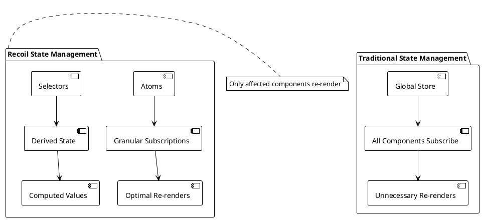
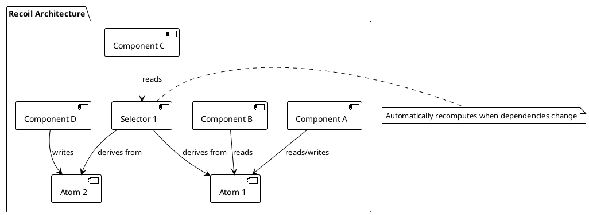

# Recoil State Management with TypeScript

## Table of Contents
1. [Introduction to Recoil](#introduction)
2. [Core Concepts](#core-concepts)
3. [Atoms and Selectors](#atoms-selectors)
4. [Async Data Handling](#async-data)
5. [TypeScript Integration](#typescript-integration)
6. [Todo Application Example](#todo-example)
7. [Advanced Patterns](#advanced-patterns)
8. [Performance Optimization](#performance)
9. [Testing Recoil](#testing)
10. [Best Practices](#best-practices)

## Introduction to Recoil {#introduction}

Recoil is Facebook's experimental state management library for React that provides a more flexible and performant alternative to Context API for complex state management scenarios. It's designed specifically for React and offers excellent TypeScript support.

### Why Choose Recoil?



### Key Benefits:
- **Granular subscriptions**: Components only re-render when atoms they use change
- **Derived state**: Selectors compute values from atoms automatically
- **Async support**: Built-in support for async data fetching
- **Time travel debugging**: Excellent DevTools support
- **TypeScript friendly**: Excellent type inference and safety

## Core Concepts {#core-concepts}

Recoil is built around two main concepts:

### Atoms
Atoms are units of state that components can subscribe to. When an atom is updated, all components subscribed to it will re-render.

### Selectors
Selectors are pure functions that derive state from atoms or other selectors. They can be synchronous or asynchronous.



## Atoms and Selectors {#atoms-selectors}

Let's start with basic atoms and selectors:

### Installing Recoil

```bash
npm install recoil
npm install --save-dev @types/recoil  # If needed
```

### Setting Up Recoil Root

```typescript
// App.tsx
import { RecoilRoot } from 'recoil';
import TodoApp from './components/TodoApp';

const App = () => {
  return (
    <RecoilRoot>
      <TodoApp />
    </RecoilRoot>
  );
};

export default App;
```

### Basic Atoms

```typescript
// atoms/todoAtoms.ts
import { atom, selector } from 'recoil';

// Define interfaces for type safety
export interface Todo {
  id: string;
  text: string;
  completed: boolean;
  createdAt: Date;
  priority: 'low' | 'medium' | 'high';
  category: string;
}

export interface Filter {
  status: 'all' | 'active' | 'completed';
  category: string;
  priority: 'all' | 'low' | 'medium' | 'high';
}

// Atom for storing all todos
export const todoListState = atom<Todo[]>({
  key: 'todoListState', // unique ID (with respect to other atoms/selectors)
  default: [], // default value (aka initial value)
});

// Atom for the current filter
export const todoFilterState = atom<Filter>({
  key: 'todoFilterState',
  default: {
    status: 'all',
    category: '',
    priority: 'all'
  },
});

// Atom for new todo input
export const newTodoTextState = atom<string>({
  key: 'newTodoTextState',
  default: '',
});

// Atom for categories
export const categoriesState = atom<string[]>({
  key: 'categoriesState',
  default: ['Personal', 'Work', 'Shopping', 'Health'],
});
```

### Basic Selectors

```typescript
// selectors/todoSelectors.ts
import { selector } from 'recoil';
import { todoListState, todoFilterState } from '../atoms/todoAtoms';

// Selector to get filtered todos
export const filteredTodoListState = selector<Todo[]>({
  key: 'filteredTodoListState',
  get: ({ get }) => {
    const filter = get(todoFilterState);
    const list = get(todoListState);

    return list.filter(todo => {
      // Filter by completion status
      if (filter.status === 'active' && todo.completed) return false;
      if (filter.status === 'completed' && !todo.completed) return false;
      
      // Filter by category
      if (filter.category && todo.category !== filter.category) return false;
      
      // Filter by priority
      if (filter.priority !== 'all' && todo.priority !== filter.priority) return false;
      
      return true;
    });
  },
});

// Selector for todo statistics
export const todoStatsState = selector({
  key: 'todoStatsState',
  get: ({ get }) => {
    const todoList = get(todoListState);
    const totalNum = todoList.length;
    const totalCompletedNum = todoList.filter(item => item.completed).length;
    const totalUncompletedNum = totalNum - totalCompletedNum;
    const percentCompleted = totalNum === 0 ? 0 : (totalCompletedNum / totalNum) * 100;

    return {
      totalNum,
      totalCompletedNum,
      totalUncompletedNum,
      percentCompleted: Math.round(percentCompleted)
    };
  },
});

// Selector for todos by category
export const todosByCategoryState = selector({
  key: 'todosByCategoryState',
  get: ({ get }) => {
    const todoList = get(todoListState);
    
    return todoList.reduce((acc, todo) => {
      const category = todo.category || 'Uncategorized';
      if (!acc[category]) {
        acc[category] = [];
      }
      acc[category].push(todo);
      return acc;
    }, {} as Record<string, Todo[]>);
  },
});
```

## Async Data Handling {#async-data}

Recoil provides excellent support for async data with selectors:

### Async Selectors

```typescript
// selectors/userSelectors.ts
import { selector, selectorFamily } from 'recoil';

interface User {
  id: string;
  name: string;
  email: string;
  avatar: string;
}

interface ApiResponse<T> {
  data: T;
  status: number;
  message: string;
}

// Mock API functions
const userAPI = {
  getUser: async (userId: string): Promise<User> => {
    // Simulate API delay
    await new Promise(resolve => setTimeout(resolve, 1000));
    
    if (userId === 'error') {
      throw new Error('User not found');
    }
    
    return {
      id: userId,
      name: `User ${userId}`,
      email: `user${userId}@example.com`,
      avatar: `https://api.dicebear.com/7.x/avataaars/svg?seed=${userId}`
    };
  },
  
  getTodos: async (userId: string): Promise<Todo[]> => {
    await new Promise(resolve => setTimeout(resolve, 800));
    
    return [
      {
        id: '1',
        text: `Sample todo for ${userId}`,
        completed: false,
        createdAt: new Date(),
        priority: 'medium',
        category: 'Work'
      }
    ];
  }
};

// Selector family for fetching user data
export const userState = selectorFamily<User, string>({
  key: 'userState',
  get: (userId) => async ({ get }) => {
    try {
      const user = await userAPI.getUser(userId);
      return user;
    } catch (error) {
      throw error; // Recoil will handle the error state
    }
  },
});

// Selector family for user todos
export const userTodosState = selectorFamily<Todo[], string>({
  key: 'userTodosState',
  get: (userId) => async ({ get }) => {
    const todos = await userAPI.getTodos(userId);
    return todos;
  },
});

// Async selector with error handling
export const weatherState = selector({
  key: 'weatherState',
  get: async ({ get }) => {
    try {
      const response = await fetch('https://api.openweathermap.org/data/2.5/weather?q=London&appid=demo');
      
      if (!response.ok) {
        throw new Error('Weather data unavailable');
      }
      
      const data = await response.json();
      return {
        temperature: Math.round(data.main.temp - 273.15), // Convert to Celsius
        description: data.weather[0].description,
        humidity: data.main.humidity
      };
    } catch (error) {
      // Return default weather data on error
      return {
        temperature: 20,
        description: 'Weather unavailable',
        humidity: 50
      };
    }
  },
});
```

### Handling Async States in Components

```typescript
// components/UserProfile.tsx
import { Suspense } from 'react';
import { useRecoilValue, useRecoilValueLoadable } from 'recoil';
import { userState } from '../selectors/userSelectors';
import ErrorBoundary from './ErrorBoundary';

interface UserProfileProps {
  userId: string;
}

// Using Suspense (recommended)
const UserProfileSuspense = ({ userId }: UserProfileProps) => {
  return (
    <ErrorBoundary fallback={<div>Error loading user</div>}>
      <Suspense fallback={<div>Loading user...</div>}>
        <UserProfileContent userId={userId} />
      </Suspense>
    </ErrorBoundary>
  );
};

const UserProfileContent = ({ userId }: UserProfileProps) => {
  const user = useRecoilValue(userState(userId));
  
  return (
    <div className="user-profile">
      
      <h2>{user.name}</h2>
      <p>{user.email}</p>
    </div>
  );
};

// Using Loadable (more control)
const UserProfileLoadable = ({ userId }: UserProfileProps) => {
  const userLoadable = useRecoilValueLoadable(userState(userId));
  
  switch (userLoadable.state) {
    case 'hasValue':
      const user = userLoadable.contents;
      return (
        <div className="user-profile">
          
          <h2>{user.name}</h2>
          <p>{user.email}</p>
        </div>
      );
      
    case 'loading':
      return <div className="loading">Loading user profile...</div>;
      
    case 'hasError':
      return (
        <div className="error">
          Error: {userLoadable.contents.message}
          <button onClick={() => window.location.reload()}>
            Retry
          </button>
        </div>
      );
  }
};

export default UserProfileSuspense;
```

## TypeScript Integration {#typescript-integration}

Recoil provides excellent TypeScript support with proper type inference:

### Typed Atoms and Selectors

```typescript
// types/index.ts
export interface AppState {
  user: User | null;
  theme: 'light' | 'dark';
  notifications: Notification[];
}

export interface User {
  id: string;
  name: string;
  email: string;
  preferences: UserPreferences;
}

export interface UserPreferences {
  theme: 'light' | 'dark';
  language: 'en' | 'es' | 'fr';
  notifications: boolean;
}

export interface Notification {
  id: string;
  type: 'info' | 'success' | 'warning' | 'error';
  title: string;
  message: string;
  timestamp: Date;
  read: boolean;
}
```

```typescript
// atoms/appAtoms.ts
import { atom } from 'recoil';
import { User, Notification } from '../types';

export const currentUserState = atom<User | null>({
  key: 'currentUserState',
  default: null,
});

export const themeState = atom<'light' | 'dark'>({
  key: 'themeState',
  default: 'light',
});

export const notificationsState = atom<Notification[]>({
  key: 'notificationsState',
  default: [],
});

// Type-safe atom effects
export const userPreferencesState = atom<UserPreferences>({
  key: 'userPreferencesState',
  default: {
    theme: 'light',
    language: 'en',
    notifications: true
  },
  effects: [
    // Persist to localStorage with proper typing
    ({ setSelf, onSet }) => {
      const savedValue = localStorage.getItem('userPreferences');
      if (savedValue != null) {
        try {
          const parsed: UserPreferences = JSON.parse(savedValue);
          setSelf(parsed);
        } catch (error) {
          console.error('Failed to parse user preferences:', error);
        }
      }

      onSet((newValue, _, isReset) => {
        if (isReset) {
          localStorage.removeItem('userPreferences');
        } else {
          localStorage.setItem('userPreferences', JSON.stringify(newValue));
        }
      });
    }
  ]
});
```

### Custom Hooks with TypeScript

```typescript
// hooks/useRecoilHelpers.ts
import { useCallback } from 'react';
import { useRecoilState, useSetRecoilState, useResetRecoilState } from 'recoil';
import { todoListState } from '../atoms/todoAtoms';
import { notificationsState } from '../atoms/appAtoms';
import type { Todo, Notification } from '../types';

// Custom hook for todo operations
export const useTodoActions = () => {
  const [todos, setTodos] = useRecoilState(todoListState);
  const setNotifications = useSetRecoilState(notificationsState);

  const addTodo = useCallback((text: string, category: string, priority: Todo['priority']) => {
    const newTodo: Todo = {
      id: Date.now().toString(),
      text,
      completed: false,
      createdAt: new Date(),
      priority,
      category
    };

    setTodos(prev => [...prev, newTodo]);
    
    // Add notification
    const notification: Notification = {
      id: Date.now().toString(),
      type: 'success',
      title: 'Todo Added',
      message: `"${text}" has been added to your todos`,
      timestamp: new Date(),
      read: false
    };
    
    setNotifications(prev => [notification, ...prev]);
  }, [setTodos, setNotifications]);

  const updateTodo = useCallback((id: string, updates: Partial<Todo>) => {
    setTodos(prev => 
      prev.map(todo => 
        todo.id === id ? { ...todo, ...updates } : todo
      )
    );
  }, [setTodos]);

  const deleteTodo = useCallback((id: string) => {
    setTodos(prev => prev.filter(todo => todo.id !== id));
  }, [setTodos]);

  const toggleTodo = useCallback((id: string) => {
    updateTodo(id, { 
      completed: !todos.find(t => t.id === id)?.completed 
    });
  }, [updateTodo, todos]);

  return {
    todos,
    addTodo,
    updateTodo,
    deleteTodo,
    toggleTodo
  };
};

// Custom hook for notifications
export const useNotifications = () => {
  const [notifications, setNotifications] = useRecoilState(notificationsState);

  const addNotification = useCallback((notification: Omit<Notification, 'id' | 'timestamp' | 'read'>) => {
    const newNotification: Notification = {
      ...notification,
      id: Date.now().toString(),
      timestamp: new Date(),
      read: false
    };
    
    setNotifications(prev => [newNotification, ...prev]);
  }, [setNotifications]);

  const markAsRead = useCallback((id: string) => {
    setNotifications(prev =>
      prev.map(notification =>
        notification.id === id ? { ...notification, read: true } : notification
      )
    );
  }, [setNotifications]);

  const removeNotification = useCallback((id: string) => {
    setNotifications(prev => prev.filter(n => n.id !== id));
  }, [setNotifications]);

  return {
    notifications,
    addNotification,
    markAsRead,
    removeNotification
  };
};
```

## Todo Application Example {#todo-example}

Let's build a comprehensive todo application using Recoil:

### Main Todo Component

```typescript
// components/TodoApp.tsx
import { Suspense } from 'react';
import { useRecoilValue } from 'recoil';
import { todoStatsState } from '../selectors/todoSelectors';
import TodoInput from './TodoInput';
import TodoList from './TodoList';
import TodoFilter from './TodoFilter';
import TodoStats from './TodoStats';
import NotificationPanel from './NotificationPanel';
import ErrorBoundary from './ErrorBoundary';

const TodoApp = () => {
  return (
    <div className="todo-app">
      <header className="todo-header">
        <h1>Recoil Todo App</h1>
        <ErrorBoundary fallback={<div>Something went wrong</div>}>
          <Suspense fallback={<div>Loading stats...</div>}>
            <TodoStats />
          </Suspense>
        </ErrorBoundary>
      </header>

      <main className="todo-main">
        <TodoInput />
        <TodoFilter />
        
        <ErrorBoundary fallback={<div>Error loading todos</div>}>
          <Suspense fallback={<div>Loading todos...</div>}>
            <TodoList />
          </Suspense>
        </ErrorBoundary>
      </main>

      <NotificationPanel />
    </div>
  );
};

export default TodoApp;
```

### Todo Input Component

```typescript
// components/TodoInput.tsx
import { useState } from 'react';
import { useRecoilValue } from 'recoil';
import { categoriesState } from '../atoms/todoAtoms';
import { useTodoActions } from '../hooks/useRecoilHelpers';
import type { Todo } from '../types';

const TodoInput = () => {
  const [text, setText] = useState('');
  const [category, setCategory] = useState('Personal');
  const [priority, setPriority] = useState<Todo['priority']>('medium');
  const categories = useRecoilValue(categoriesState);
  const { addTodo } = useTodoActions();

  const handleSubmit = (e: React.FormEvent) => {
    e.preventDefault();
    
    if (text.trim()) {
      addTodo(text.trim(), category, priority);
      setText('');
    }
  };

  return (
    <form onSubmit={handleSubmit} className="todo-input">
      <div className="input-group">
        <input
          type="text"
          value={text}
          onChange={(e) => setText(e.target.value)}
          placeholder="What needs to be done?"
          className="todo-text-input"
          required
        />
        
        <select
          value={category}
          onChange={(e) => setCategory(e.target.value)}
          className="category-select"
        >
          {categories.map(cat => (
            <option key={cat} value={cat}>{cat}</option>
          ))}
        </select>
        
        <select
          value={priority}
          onChange={(e) => setPriority(e.target.value as Todo['priority'])}
          className="priority-select"
        >
          <option value="low">Low</option>
          <option value="medium">Medium</option>
          <option value="high">High</option>
        </select>
        
        <button type="submit" className="add-button">
          Add Todo
        </button>
      </div>
    </form>
  );
};

export default TodoInput;
```

### Todo List Component

```typescript
// components/TodoList.tsx
import { useRecoilValue } from 'recoil';
import { filteredTodoListState } from '../selectors/todoSelectors';
import TodoItem from './TodoItem';

const TodoList = () => {
  const filteredTodos = useRecoilValue(filteredTodoListState);

  if (filteredTodos.length === 0) {
    return (
      <div className="empty-state">
        <p>No todos match your current filter.</p>
      </div>
    );
  }

  return (
    <ul className="todo-list">
      {filteredTodos.map(todo => (
        <TodoItem key={todo.id} todo={todo} />
      ))}
    </ul>
  );
};

export default TodoList;
```

### Individual Todo Item

```typescript
// components/TodoItem.tsx
import { useState } from 'react';
import type { Todo } from '../types';
import { useTodoActions } from '../hooks/useRecoilHelpers';

interface TodoItemProps {
  todo: Todo;
}

const TodoItem = ({ todo }: TodoItemProps) => {
  const [isEditing, setIsEditing] = useState(false);
  const [editText, setEditText] = useState(todo.text);
  const { updateTodo, deleteTodo, toggleTodo } = useTodoActions();

  const handleSave = () => {
    if (editText.trim()) {
      updateTodo(todo.id, { text: editText.trim() });
      setIsEditing(false);
    }
  };

  const handleCancel = () => {
    setEditText(todo.text);
    setIsEditing(false);
  };

  const getPriorityColor = (priority: Todo['priority']) => {
    switch (priority) {
      case 'high': return '#ff6b6b';
      case 'medium': return '#feca57';
      case 'low': return '#48dbfb';
      default: return '#ddd';
    }
  };

  return (
    <li className={`todo-item ${todo.completed ? 'completed' : ''}`}>
      <div className="todo-content">
        <input
          type="checkbox"
          checked={todo.completed}
          onChange={() => toggleTodo(todo.id)}
          className="todo-checkbox"
        />
        
        {isEditing ? (
          <div className="edit-mode">
            <input
              type="text"
              value={editText}
              onChange={(e) => setEditText(e.target.value)}
              onKeyDown={(e) => {
                if (e.key === 'Enter') handleSave();
                if (e.key === 'Escape') handleCancel();
              }}
              className="edit-input"
              autoFocus
            />
            <button onClick={handleSave} className="save-btn">Save</button>
            <button onClick={handleCancel} className="cancel-btn">Cancel</button>
          </div>
        ) : (
          <div className="view-mode">
            <span className="todo-text">{todo.text}</span>
            <div className="todo-meta">
              <span className="category">{todo.category}</span>
              <span 
                className="priority" 
                style={{ backgroundColor: getPriorityColor(todo.priority) }}
              >
                {todo.priority}
              </span>
              <span className="created-date">
                {todo.createdAt.toLocaleDateString()}
              </span>
            </div>
          </div>
        )}
      </div>
      
      <div className="todo-actions">
        <button 
          onClick={() => setIsEditing(true)}
          className="edit-btn"
          disabled={todo.completed}
        >
          Edit
        </button>
        <button 
          onClick={() => deleteTodo(todo.id)}
          className="delete-btn"
        >
          Delete
        </button>
      </div>
    </li>
  );
};

export default TodoItem;
```

### Todo Statistics Component

```typescript
// components/TodoStats.tsx
import { useRecoilValue } from 'recoil';
import { todoStatsState, todosByCategoryState } from '../selectors/todoSelectors';

const TodoStats = () => {
  const stats = useRecoilValue(todoStatsState);
  const todosByCategory = useRecoilValue(todosByCategoryState);

  return (
    <div className="todo-stats">
      <div className="stats-overview">
        <div className="stat-item">
          <span className="stat-label">Total:</span>
          <span className="stat-value">{stats.totalNum}</span>
        </div>
        <div className="stat-item">
          <span className="stat-label">Completed:</span>
          <span className="stat-value">{stats.totalCompletedNum}</span>
        </div>
        <div className="stat-item">
          <span className="stat-label">Remaining:</span>
          <span className="stat-value">{stats.totalUncompletedNum}</span>
        </div>
        <div className="stat-item">
          <span className="stat-label">Progress:</span>
          <span className="stat-value">{stats.percentCompleted}%</span>
        </div>
      </div>
      
      <div className="progress-bar">
        <div 
          className="progress-fill" 
          style={{ width: `${stats.percentCompleted}%` }}
        />
      </div>
      
      <div className="category-breakdown">
        <h3>By Category:</h3>
        {Object.entries(todosByCategory).map(([category, todos]) => (
          <div key={category} className="category-stat">
            <span>{category}:</span>
            <span>{todos.length} items</span>
          </div>
        ))}
      </div>
    </div>
  );
};

export default TodoStats;
```

## Advanced Patterns {#advanced-patterns}

### Atom Effects for Persistence

```typescript
// effects/persistenceEffects.ts
import { AtomEffect } from 'recoil';

export const localStorageEffect = <T>(key: string): AtomEffect<T> => ({ setSelf, onSet }) => {
  const savedValue = localStorage.getItem(key);
  if (savedValue != null) {
    try {
      setSelf(JSON.parse(savedValue));
    } catch (error) {
      console.error(`Failed to parse localStorage value for key "${key}":`, error);
    }
  }

  onSet((newValue, _, isReset) => {
    if (isReset) {
      localStorage.removeItem(key);
    } else {
      localStorage.setItem(key, JSON.stringify(newValue));
    }
  });
};

// Usage in atom
export const persistedTodoListState = atom<Todo[]>({
  key: 'persistedTodoListState',
  default: [],
  effects: [localStorageEffect('todoList')]
});
```

### Optimistic Updates

```typescript
// hooks/useOptimisticTodos.ts
import { useCallback } from 'react';
import { useRecoilState, useSetRecoilState } from 'recoil';
import { todoListState } from '../atoms/todoAtoms';
import { notificationsState } from '../atoms/appAtoms';

export const useOptimisticTodos = () => {
  const [todos, setTodos] = useRecoilState(todoListState);
  const setNotifications = useSetRecoilState(notificationsState);

  const updateTodoOptimistic = useCallback(async (
    id: string, 
    updates: Partial<Todo>,
    apiCall: () => Promise<void>
  ) => {
    // Optimistically update UI
    const originalTodo = todos.find(t => t.id === id);
    setTodos(prev => 
      prev.map(todo => 
        todo.id === id ? { ...todo, ...updates } : todo
      )
    );

    try {
      // Perform API call
      await apiCall();
    } catch (error) {
      // Revert on error
      if (originalTodo) {
        setTodos(prev => 
          prev.map(todo => 
            todo.id === id ? originalTodo : todo
          )
        );
      }
      
      setNotifications(prev => [{
        id: Date.now().toString(),
        type: 'error',
        title: 'Update Failed',
        message: 'Failed to update todo. Please try again.',
        timestamp: new Date(),
        read: false
      }, ...prev]);
    }
  }, [todos, setTodos, setNotifications]);

  return { updateTodoOptimistic };
};
```

## Performance Optimization {#performance}

### Measuring Performance

```typescript
// components/PerformanceMonitor.tsx
import { useEffect } from 'react';
import { useRecoilSnapshot } from 'recoil';

const PerformanceMonitor = () => {
  const snapshot = useRecoilSnapshot();

  useEffect(() => {
    console.debug('Recoil state changed:', Array.from(snapshot.getNodes_UNSTABLE()));
  }, [snapshot]);

  return null;
};

// Add to your app during development
const App = () => (
  <RecoilRoot>
    {process.env.NODE_ENV === 'development' && <PerformanceMonitor />}
    <TodoApp />
  </RecoilRoot>
);
```

### Selector Optimization

```typescript
// Optimized selectors with proper dependencies
export const expensiveCalculationState = selector({
  key: 'expensiveCalculationState',
  get: ({ get }) => {
    const todos = get(todoListState);
    const filter = get(todoFilterState);
    
    // Only recalculate when dependencies actually change
    return todos
      .filter(todo => /* filter logic */)
      .reduce((acc, todo) => {
        // Expensive calculation
        return acc + complexCalculation(todo);
      }, 0);
  },
  // Add caching for expensive operations
  cachePolicy_UNSTABLE: {
    eviction: 'most-recent',
  },
});
```

## Testing Recoil {#testing}

### Testing Utilities

```typescript
// test-utils/recoil-test-utils.tsx
import React, { ReactElement, ReactNode } from 'react';
import { render } from '@testing-library/react';
import { RecoilRoot } from 'recoil';
import { MutableSnapshot } from 'recoil';

interface RecoilTestWrapperProps {
  children: ReactNode;
  initializeState?: (snapshot: MutableSnapshot) => void;
}

const RecoilTestWrapper = ({ children, initializeState }: RecoilTestWrapperProps) => (
  <RecoilRoot initializeState={initializeState}>
    {children}
  </RecoilRoot>
);

export const renderWithRecoil = (
  ui: ReactElement,
  options?: {
    initializeState?: (snapshot: MutableSnapshot) => void;
  }
) => {
  return render(ui, {
    wrapper: ({ children }) => (
      <RecoilTestWrapper initializeState={options?.initializeState}>
        {children}
      </RecoilTestWrapper>
    ),
  });
};
```

### Testing Components with Recoil

```typescript
// components/__tests__/TodoList.test.tsx
import { screen } from '@testing-library/react';
import userEvent from '@testing-library/user-event';
import { renderWithRecoil } from '../../test-utils/recoil-test-utils';
import { todoListState } from '../../atoms/todoAtoms';
import TodoList from '../TodoList';
import { Todo } from '../../types';

const mockTodos: Todo[] = [
  {
    id: '1',
    text: 'Test todo 1',
    completed: false,
    createdAt: new Date(),
    priority: 'high',
    category: 'Work'
  },
  {
    id: '2',
    text: 'Test todo 2',
    completed: true,
    createdAt: new Date(),
    priority: 'low',
    category: 'Personal'
  }
];

describe('TodoList', () => {
  test('renders todos from recoil state', () => {
    renderWithRecoil(<TodoList />, {
      initializeState: (snapshot) => {
        snapshot.set(todoListState, mockTodos);
      }
    });

    expect(screen.getByText('Test todo 1')).toBeInTheDocument();
    expect(screen.getByText('Test todo 2')).toBeInTheDocument();
  });

  test('shows empty state when no todos', () => {
    renderWithRecoil(<TodoList />, {
      initializeState: (snapshot) => {
        snapshot.set(todoListState, []);
      }
    });

    expect(screen.getByText('No todos match your current filter.')).toBeInTheDocument();
  });
});
```

### Testing Selectors

```typescript
// selectors/__tests__/todoSelectors.test.ts
import { renderHook } from '@testing-library/react';
import { useRecoilValue } from 'recoil';
import { RecoilRoot } from 'recoil';
import { todoStatsState } from '../todoSelectors';
import { todoListState } from '../../atoms/todoAtoms';

const wrapper = ({ children, initialTodos = [] }) => (
  <RecoilRoot
    initializeState={(snapshot) => {
      snapshot.set(todoListState, initialTodos);
    }}
  >
    {children}
  </RecoilRoot>
);

describe('todoStatsState', () => {
  test('calculates correct statistics', () => {
    const mockTodos = [
      { id: '1', completed: true },
      { id: '2', completed: false },
      { id: '3', completed: true }
    ];

    const { result } = renderHook(
      () => useRecoilValue(todoStatsState),
      { wrapper: ({ children }) => wrapper({ children, initialTodos: mockTodos }) }
    );

    expect(result.current).toEqual({
      totalNum: 3,
      totalCompletedNum: 2,
      totalUncompletedNum: 1,
      percentCompleted: 67
    });
  });
});
```

## Best Practices {#best-practices}

### 1. Atomic State Design

```typescript
// ✅ Good: Atomic, focused state
const userNameState = atom({
  key: 'userName',
  default: ''
});

const userEmailState = atom({
  key: 'userEmail',
  default: ''
});

// ❌ Avoid: Monolithic state objects
const userState = atom({
  key: 'user',
  default: {
    name: '',
    email: '',
    preferences: {},
    todos: [],
    // ... many other properties
  }
});
```

### 2. Proper Key Naming

```typescript
// ✅ Good: Descriptive, unique keys
const currentUserTodosState = atom({
  key: 'currentUserTodosState',
  default: []
});

// ❌ Avoid: Generic keys
const dataState = atom({
  key: 'data',
  default: []
});
```

### 3. Error Handling

```typescript
// ✅ Good: Proper error handling in selectors
const dataWithErrorHandling = selector({
  key: 'dataWithErrorHandling',
  get: async () => {
    try {
      const data = await fetchData();
      return data;
    } catch (error) {
      // Log error for debugging
      console.error('Data fetch failed:', error);
      
      // Return sensible default or re-throw based on requirements
      throw new Error('Failed to load data. Please try again.');
    }
  }
});
```

### 4. Performance Considerations

```typescript
// ✅ Good: Memoized expensive calculations
const expensiveSelector = selector({
  key: 'expensiveSelector',
  get: ({ get }) => {
    const data = get(dataState);
    
    // Only recalculate when data actually changes
    return useMemo(() => {
      return data.map(item => expensiveTransformation(item));
    }, [data]);
  }
});
```

## Advanced Recoil Patterns {#advanced-patterns}

### Atom Families for Dynamic State

```typescript
// Atom families for managing collections
export const todoItemState = atomFamily<Todo, string>({
  key: 'todoItemState',
  default: (id) => ({
    id,
    text: '',
    completed: false,
    createdAt: new Date(),
    priority: 'medium' as const,
    category: 'Personal'
  }),
});

// Selector families for computed values per item
export const todoItemStatsState = selectorFamily<TodoStats, string>({
  key: 'todoItemStatsState',
  get: (todoId) => ({ get }) => {
    const todo = get(todoItemState(todoId));
    const allTodos = get(todoListState);
    
    return {
      daysActive: Math.floor(
        (Date.now() - todo.createdAt.getTime()) / (1000 * 60 * 60 * 24)
      ),
      categoryCount: allTodos.filter(t => t.category === todo.category).length,
      priorityRank: allTodos
        .filter(t => t.priority === todo.priority)
        .findIndex(t => t.id === todoId) + 1
    };
  },
});

// Dynamic atom creation with cleanup
export const useTemporaryAtom = <T>(initialValue: T) => {
  const atomKey = useMemo(() => `temp_${Math.random()}`, []);
  
  const tempAtom = useMemo(() => atom({
    key: atomKey,
    default: initialValue,
  }), [atomKey, initialValue]);

  // Cleanup on unmount
  useEffect(() => {
    return () => {
      // Note: In production, you'd want proper atom cleanup
      console.log(`Cleaning up temporary atom: ${atomKey}`);
    };
  }, [atomKey]);

  return tempAtom;
};
```

### Advanced Selector Patterns

```typescript
// Parameterized selectors with caching
export const filteredTodosByComplexCriteria = selectorFamily<
  Todo[],
  {
    status?: 'all' | 'active' | 'completed';
    category?: string;
    priority?: Todo['priority'] | 'all';
    dateRange?: { start: Date; end: Date };
    searchTerm?: string;
  }
>({
  key: 'filteredTodosByComplexCriteria',
  get: (criteria) => ({ get }) => {
    const todos = get(todoListState);
    
    return todos.filter(todo => {
      // Status filter
      if (criteria.status === 'active' && todo.completed) return false;
      if (criteria.status === 'completed' && !todo.completed) return false;
      
      // Category filter
      if (criteria.category && todo.category !== criteria.category) return false;
      
      // Priority filter
      if (criteria.priority && criteria.priority !== 'all' && 
          todo.priority !== criteria.priority) return false;
      
      // Date range filter
      if (criteria.dateRange) {
        const todoDate = new Date(todo.createdAt);
        if (todoDate < criteria.dateRange.start || todoDate > criteria.dateRange.end) {
          return false;
        }
      }
      
      // Search term filter
      if (criteria.searchTerm) {
        const searchLower = criteria.searchTerm.toLowerCase();
        if (!todo.text.toLowerCase().includes(searchLower) &&
            !todo.category.toLowerCase().includes(searchLower)) {
          return false;
        }
      }
      
      return true;
    });
  },
  // Enhanced caching for better performance
  cachePolicy_UNSTABLE: {
    eviction: 'most-recent',
  },
});

// Async selector with retry logic
export const userProfileWithRetry = selectorFamily<User, string>({
  key: 'userProfileWithRetry',
  get: (userId) => async ({ get }) => {
    const retryCount = get(retryCountState(userId));
    
    for (let attempt = 0; attempt <= retryCount; attempt++) {
      try {
        const response = await fetch(`/api/users/${userId}`, {
          headers: {
            'X-Retry-Attempt': attempt.toString()
          }
        });
        
        if (!response.ok) {
          throw new Error(`HTTP ${response.status}: ${response.statusText}`);
        }
        
        return await response.json();
      } catch (error) {
        if (attempt === retryCount) throw error;
        
        // Exponential backoff
        await new Promise(resolve => 
          setTimeout(resolve, Math.pow(2, attempt) * 1000)
        );
      }
    }
    
    throw new Error('Max retries exceeded');
  },
});

const retryCountState = atomFamily<number, string>({
  key: 'retryCountState',
  default: 3,
});
```

### State Synchronization Patterns

```typescript
// Bidirectional sync between atoms and external sources
export const syncedTodoListState = atom<Todo[]>({
  key: 'syncedTodoListState',
  default: [],
  effects: [
    // Sync with localStorage
    ({ setSelf, onSet, getPromise }) => {
      // Load from localStorage on init
      const stored = localStorage.getItem('todos');
      if (stored) {
        try {
          setSelf(JSON.parse(stored));
        } catch (error) {
          console.error('Failed to parse stored todos:', error);
        }
      }

      // Save to localStorage on changes
      onSet((newValue, oldValue) => {
        if (newValue !== oldValue) {
          localStorage.setItem('todos', JSON.stringify(newValue));
        }
      });
    },
    
    // Sync with server
    ({ setSelf, onSet, getPromise, getInfo_UNSTABLE }) => {
      let ws: WebSocket;
      
      const connectWebSocket = () => {
        ws = new WebSocket('wss://api.example.com/todos');
        
        ws.onmessage = (event) => {
          const data = JSON.parse(event.data);
          
          if (data.type === 'TODOS_UPDATED') {
            setSelf(data.todos);
          }
        };
        
        ws.onclose = () => {
          // Reconnect after delay
          setTimeout(connectWebSocket, 5000);
        };
      };
      
      connectWebSocket();
      
      // Send updates to server
      onSet(async (newValue, oldValue) => {
        if (newValue !== oldValue && ws.readyState === WebSocket.OPEN) {
          ws.send(JSON.stringify({
            type: 'UPDATE_TODOS',
            todos: newValue
          }));
        }
      });
      
      return () => {
        if (ws) {
          ws.close();
        }
      };
    }
  ]
});

// Derived state with complex dependencies
export const todoAnalyticsState = selector({
  key: 'todoAnalyticsState',
  get: ({ get }) => {
    const todos = get(syncedTodoListState);
    const filter = get(todoFilterState);
    const categories = get(categoriesState);
    
    // Complex analytics computation
    const analytics = {
      totalTodos: todos.length,
      completedTodos: todos.filter(t => t.completed).length,
      todosByCategory: categories.reduce((acc, category) => {
        acc[category] = todos.filter(t => t.category === category).length;
        return acc;
      }, {} as Record<string, number>),
      averageCompletionTime: calculateAverageCompletionTime(todos),
      productivityTrend: calculateProductivityTrend(todos),
      upcomingDeadlines: getUpcomingDeadlines(todos),
      priorityDistribution: {
        high: todos.filter(t => t.priority === 'high').length,
        medium: todos.filter(t => t.priority === 'medium').length,
        low: todos.filter(t => t.priority === 'low').length,
      }
    };
    
    return analytics;
  },
  // Cache expensive calculations
  cachePolicy_UNSTABLE: {
    eviction: 'lru',
    maxSize: 100,
  },
});
```

## Recoil DevTools and Debugging {#devtools}

```typescript
// Enhanced debugging with Recoil
export const DebugObserver = () => {
  const snapshot = useRecoilSnapshot();
  
  useEffect(() => {
    console.debug('Recoil state snapshot:', {
      modifiedAtoms: Array.from(snapshot.getNodes_UNSTABLE({
        isModified: true
      })).map(node => node.key),
      allAtoms: Array.from(snapshot.getNodes_UNSTABLE()).length
    });
    
    // Debug specific atoms
    for (const node of snapshot.getNodes_UNSTABLE()) {
      const value = snapshot.getLoadable(node);
      
      if (value.state === 'hasValue') {
        console.debug(`Atom ${node.key}:`, value.contents);
      } else if (value.state === 'hasError') {
        console.error(`Atom ${node.key} error:`, value.contents);
      }
    }
  }, [snapshot]);

  return null;
};

// Performance monitoring
export const useRecoilPerformance = () => {
  const [metrics, setMetrics] = useState<{
    renderCount: number;
    lastRenderTime: number;
    atomSubscriptions: number;
  }>({
    renderCount: 0,
    lastRenderTime: 0,
    atomSubscriptions: 0
  });

  const snapshot = useRecoilSnapshot();

  useEffect(() => {
    const startTime = performance.now();
    
    setMetrics(prev => ({
      ...prev,
      renderCount: prev.renderCount + 1,
      lastRenderTime: performance.now() - startTime,
      atomSubscriptions: Array.from(snapshot.getNodes_UNSTABLE()).length
    }));
  }, [snapshot]);

  return metrics;
};

// Time travel debugging
export const useRecoilTimeTravel = () => {
  const [history, setHistory] = useState<RecoilSnapshot[]>([]);
  const [currentIndex, setCurrentIndex] = useState(-1);
  const snapshot = useRecoilSnapshot();
  const gotoSnapshot = useGotoRecoilSnapshot();

  useEffect(() => {
    setHistory(prev => [...prev, snapshot]);
    setCurrentIndex(prev => prev + 1);
  }, [snapshot]);

  const goBack = useCallback(() => {
    if (currentIndex > 0) {
      const previousSnapshot = history[currentIndex - 1];
      gotoSnapshot(previousSnapshot);
      setCurrentIndex(prev => prev - 1);
    }
  }, [currentIndex, history, gotoSnapshot]);

  const goForward = useCallback(() => {
    if (currentIndex < history.length - 1) {
      const nextSnapshot = history[currentIndex + 1];
      gotoSnapshot(nextSnapshot);
      setCurrentIndex(prev => prev + 1);
    }
  }, [currentIndex, history, gotoSnapshot]);

  return {
    canGoBack: currentIndex > 0,
    canGoForward: currentIndex < history.length - 1,
    goBack,
    goForward,
    historyLength: history.length
  };
};
```

## Production Considerations {#production}

### Error Handling and Fallbacks

```typescript
// Robust error handling with fallbacks
export const robustUserState = selector({
  key: 'robustUserState',
  get: async ({ get }) => {
    try {
      // Primary data source
      const response = await fetch('/api/user');
      if (response.ok) {
        return await response.json();
      }
      throw new Error(`HTTP ${response.status}`);
    } catch (primaryError) {
      console.warn('Primary user fetch failed:', primaryError);
      
      try {
        // Fallback to cached data
        const cached = localStorage.getItem('cachedUser');
        if (cached) {
          const user = JSON.parse(cached);
          console.info('Using cached user data');
          return { ...user, isStale: true };
        }
      } catch (cacheError) {
        console.warn('Cache fallback failed:', cacheError);
      }
      
      // Final fallback to guest user
      return {
        id: 'guest',
        name: 'Guest User',
        email: '',
        isGuest: true
      };
    }
  },
});

// Circuit breaker pattern for external APIs
class CircuitBreaker {
  private failures = 0;
  private lastFailureTime = 0;
  private state: 'closed' | 'open' | 'half-open' = 'closed';
  
  constructor(
    private threshold = 5,
    private timeout = 60000
  ) {}
  
  async execute<T>(operation: () => Promise<T>): Promise<T> {
    if (this.state === 'open') {
      if (Date.now() - this.lastFailureTime >= this.timeout) {
        this.state = 'half-open';
      } else {
        throw new Error('Circuit breaker is open');
      }
    }
    
    try {
      const result = await operation();
      this.onSuccess();
      return result;
    } catch (error) {
      this.onFailure();
      throw error;
    }
  }
  
  private onSuccess() {
    this.failures = 0;
    this.state = 'closed';
  }
  
  private onFailure() {
    this.failures++;
    this.lastFailureTime = Date.now();
    
    if (this.failures >= this.threshold) {
      this.state = 'open';
    }
  }
}

const apiCircuitBreaker = new CircuitBreaker();

export const resilientApiState = selector({
  key: 'resilientApiState',
  get: async () => {
    return apiCircuitBreaker.execute(async () => {
      const response = await fetch('/api/data');
      if (!response.ok) throw new Error('API error');
      return response.json();
    });
  },
});
```

### Memory Management and Cleanup

```typescript
// Automatic cleanup for dynamic atoms
export const createManagedAtomFamily = <T, P extends SerializableParam>(
  options: {
    key: string;
    default: T | ((param: P) => T);
    ttl?: number; // Time to live in milliseconds
  }
) => {
  const atomMap = new Map<string, RecoilState<T>>();
  const lastAccessed = new Map<string, number>();
  
  const cleanup = () => {
    const now = Date.now();
    const ttl = options.ttl || 300000; // Default 5 minutes
    
    for (const [key, timestamp] of lastAccessed.entries()) {
      if (now - timestamp > ttl) {
        atomMap.delete(key);
        lastAccessed.delete(key);
      }
    }
  };
  
  // Periodic cleanup
  setInterval(cleanup, 60000); // Every minute
  
  return selectorFamily<T, P>({
    key: options.key,
    get: (param) => ({ get }) => {
      const paramKey = JSON.stringify(param);
      lastAccessed.set(paramKey, Date.now());
      
      if (!atomMap.has(paramKey)) {
        const newAtom = atom({
          key: `${options.key}_${paramKey}`,
          default: typeof options.default === 'function' 
            ? (options.default as (param: P) => T)(param)
            : options.default
        });
        atomMap.set(paramKey, newAtom);
      }
      
      return get(atomMap.get(paramKey)!);
    },
  });
};

// Usage
const managedUserState = createManagedAtomFamily<User, string>({
  key: 'managedUserState',
  default: (userId) => ({ id: userId, name: '', email: '' }),
  ttl: 600000 // 10 minutes
});
```

## Summary

Recoil provides a powerful and flexible state management solution for React applications:

### Key Benefits:
1. **Granular subscriptions** - Only re-render components that use changed atoms
2. **Derived state** - Selectors automatically update when dependencies change
3. **Async support** - Built-in handling for async data
4. **TypeScript friendly** - Excellent type safety and inference
5. **DevTools** - Great debugging experience

### When to Use Recoil:
- Complex state relationships
- Need for derived/computed state
- Async data fetching requirements
- Performance-critical applications
- Teams comfortable with experimental APIs

### Migration Path:
1. Start with built-in React state
2. Move to Context API for cross-component state
3. Adopt Recoil for complex state management needs

In the next section, we'll compare all state management approaches to help you choose the right tool for your specific use case.
