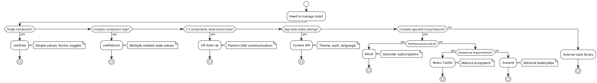

# State Management: Summary and Next Steps

## Table of Contents
1. [Complete Guide Overview](#overview)
2. [Key Takeaways](#key-takeaways)
3. [Decision Framework Summary](#decision-framework)
4. [Implementation Roadmap](#implementation-roadmap)
5. [Advanced Topics](#advanced-topics)
6. [Future Considerations](#future-considerations)
7. [Resources and Learning Path](#resources)
8. [Common Questions and Answers](#qa)

## Complete Guide Overview {#overview}

This comprehensive state management guide has covered all major approaches to managing state in React TypeScript applications:

### What We've Covered

```typescript
interface GuideContents {
  builtInState: {
    topics: ['useState', 'useReducer', 'lifting state up'];
    useCase: 'Local component state and simple sharing';
    complexity: 'Simple to Medium';
  };
  
  contextAPI: {
    topics: ['createContext', 'useContext', 'providers', 'optimization'];
    useCase: 'App-wide settings and stable shared state';
    complexity: 'Medium';
  };
  
  recoil: {
    topics: ['atoms', 'selectors', 'async state', 'atom families'];
    useCase: 'Complex state with granular subscriptions';
    complexity: 'Medium to High';
  };
  
  comparison: {
    topics: ['performance analysis', 'decision matrices', 'migration strategies'];
    useCase: 'Choosing the right tool for your needs';
    complexity: 'Strategic';
  };
  
  implementation: {
    topics: ['project setup', 'testing', 'production deployment', 'monitoring'];
    useCase: 'Real-world implementation guidance';
    complexity: 'Practical';
  };
}
```

## Key Takeaways {#key-takeaways}

### Universal Principles

1. **Start Simple**: Always begin with built-in React state management
2. **Measure Before Optimizing**: Use React DevTools to identify actual performance issues
3. **Choose Based on Complexity**: Match your state management complexity to your application complexity
4. **Type Everything**: Use TypeScript interfaces for all state shapes and operations
5. **Test Thoroughly**: State management is critical infrastructure - test it well

### When to Use Each Approach



### Performance Guidelines

```typescript
// Performance decision matrix
interface PerformanceGuidelines {
  measurements: {
    acceptable: 'Under 50ms for state updates';
    warning: '50-100ms indicates potential optimization needed';
    critical: 'Over 100ms requires immediate attention';
  };
  
  optimizationStrategies: {
    builtIn: ['useMemo', 'useCallback', 'React.memo'];
    context: ['Split contexts', 'Memoize providers', 'Granular consumers'];
    recoil: ['Selector optimization', 'Atom families', 'Caching policies'];
    redux: ['Normalized state', 'Reselect', 'RTK Query'];
  };
  
  commonBottlenecks: {
    unnecessaryRerenders: 'Use React DevTools Profiler to identify';
    expensiveCalculations: 'Move to selectors or memoized values';
    largeStateObjects: 'Normalize and split state structure';
    frequentUpdates: 'Batch updates or use specialized solutions';
  };
}
```

## Decision Framework Summary {#decision-framework}

### Quick Decision Guide

```typescript
// 30-second decision tree
export const quickDecision = (requirements: AppRequirements): string => {
  const { 
    componentCount, 
    stateComplexity, 
    teamExperience, 
    performanceNeeds,
    timeConstraints 
  } = requirements;
  
  // Simple applications
  if (componentCount < 10 && stateComplexity === 'low') {
    return 'useState + lifting state up';
  }
  
  // Medium applications
  if (componentCount < 50 && stateComplexity === 'medium') {
    if (teamExperience === 'junior' || timeConstraints === 'tight') {
      return 'Context API';
    }
    return 'Recoil or Zustand';
  }
  
  // Large applications
  if (componentCount >= 50 || stateComplexity === 'high') {
    if (performanceNeeds === 'critical') {
      return 'Recoil';
    }
    if (teamExperience === 'senior') {
      return 'Redux Toolkit';
    }
    return 'Recoil with gradual migration plan';
  }
  
  return 'Start with built-in state, evaluate as you grow';
};

interface AppRequirements {
  componentCount: number;
  stateComplexity: 'low' | 'medium' | 'high';
  teamExperience: 'junior' | 'mixed' | 'senior';
  performanceNeeds: 'basic' | 'high' | 'critical';
  timeConstraints: 'tight' | 'moderate' | 'flexible';
}
```

### Detailed Evaluation Matrix

```typescript
// Comprehensive evaluation framework
export const evaluateStateManagement = (project: ProjectContext): Recommendation => {
  const scores = {
    useState: calculateScore('useState', project),
    useReducer: calculateScore('useReducer', project),
    contextAPI: calculateScore('contextAPI', project),
    recoil: calculateScore('recoil', project),
    reduxToolkit: calculateScore('reduxToolkit', project),
    zustand: calculateScore('zustand', project)
  };
  
  const topChoice = Object.entries(scores).reduce((a, b) => 
    a[1] > b[1] ? a : b
  )[0];
  
  return {
    primary: topChoice,
    alternatives: Object.entries(scores)
      .sort(([,a], [,b]) => b - a)
      .slice(1, 3)
      .map(([name]) => name),
    reasoning: generateReasoning(project, scores),
    migrationPath: generateMigrationPath(project, topChoice)
  };
};

interface ProjectContext {
  teamSize: number;
  experience: 'junior' | 'mixed' | 'senior';
  timeline: 'weeks' | 'months' | 'years';
  complexity: 'simple' | 'medium' | 'complex';
  performance: 'basic' | 'high' | 'critical';
  maintenance: 'short' | 'medium' | 'long';
}

interface Recommendation {
  primary: string;
  alternatives: string[];
  reasoning: string[];
  migrationPath: string[];
}
```

## Implementation Roadmap {#implementation-roadmap}

### Phase-by-Phase Implementation

```typescript
// 12-week implementation timeline
export const IMPLEMENTATION_TIMELINE = {
  weeks1to2: {
    title: 'Planning and Setup',
    tasks: [
      'Analyze current state management needs',
      'Choose primary state management approach',
      'Set up development environment and tools',
      'Create TypeScript interfaces for state',
      'Design state structure and data flow'
    ],
    deliverables: [
      'State management architecture document',
      'TypeScript type definitions',
      'Development environment setup',
      'Initial project structure'
    ]
  },
  
  weeks3to6: {
    title: 'Core Implementation',
    tasks: [
      'Implement chosen state management solution',
      'Create atoms/actions/reducers with proper typing',
      'Implement selectors for derived state',
      'Add error handling and loading states',
      'Create custom hooks for complex logic'
    ],
    deliverables: [
      'Core state management implementation',
      'Custom hooks library',
      'Error handling patterns',
      'Loading state management'
    ]
  },
  
  weeks7to9: {
    title: 'Testing and Optimization',
    tasks: [
      'Write comprehensive unit tests',
      'Create integration tests for user flows',
      'Performance testing and optimization',
      'Add performance monitoring',
      'Implement state persistence if needed'
    ],
    deliverables: [
      'Complete test suite',
      'Performance benchmarks',
      'Monitoring dashboard',
      'Optimization documentation'
    ]
  },
  
  weeks10to12: {
    title: 'Production and Maintenance',
    tasks: [
      'Configure production optimizations',
      'Set up error monitoring and logging',
      'Implement state hydration for SSR',
      'Team training and documentation',
      'Deployment and monitoring setup'
    ],
    deliverables: [
      'Production-ready application',
      'Monitoring and alerting',
      'Team documentation',
      'Maintenance procedures'
    ]
  }
};
```

### Migration Strategy Template

```typescript
// Template for migrating between state management solutions
export const createMigrationPlan = (
  from: StateManagementType,
  to: StateManagementType,
  appSize: 'small' | 'medium' | 'large'
): MigrationPlan => {
  const basePhases = [
    'Analysis and Planning',
    'Parallel Implementation',
    'Gradual Migration',
    'Testing and Validation',
    'Cleanup and Documentation'
  ];
  
  const timeEstimate = {
    small: '2-4 weeks',
    medium: '1-3 months',
    large: '3-6 months'
  }[appSize];
  
  const riskLevel = calculateMigrationRisk(from, to, appSize);
  
  return {
    phases: basePhases,
    timeEstimate,
    riskLevel,
    mitigationStrategies: getMitigationStrategies(from, to),
    rollbackPlan: createRollbackPlan(from, to),
    successMetrics: defineSuccessMetrics(to)
  };
};

interface MigrationPlan {
  phases: string[];
  timeEstimate: string;
  riskLevel: 'low' | 'medium' | 'high';
  mitigationStrategies: string[];
  rollbackPlan: string[];
  successMetrics: string[];
}
```

## Advanced Topics {#advanced-topics}

### Topics for Further Exploration

```typescript
interface AdvancedTopics {
  stateNormalization: {
    description: 'Structuring nested data for optimal performance';
    resources: ['Redux Toolkit Entity Adapter', 'Normalizr library'];
    useCase: 'Complex relational data structures';
  };
  
  offlineFirstState: {
    description: 'Managing state in offline-capable applications';
    resources: ['Redux Persist', 'IndexedDB', 'Service Workers'];
    useCase: 'Progressive Web Apps and mobile applications';
  };
  
  stateStreaming: {
    description: 'Real-time state synchronization across clients';
    resources: ['WebSockets', 'Server-Sent Events', 'WebRTC'];
    useCase: 'Collaborative applications and live updates';
  };
  
  stateTime: {
    description: 'Temporal state management and undo/redo functionality';
    resources: ['Redux DevTools', 'Immer patches', 'Custom time travel'];
    useCase: 'Complex user interfaces with history requirements';
  };
  
  crossTabState: {
    description: 'Synchronizing state across browser tabs';
    resources: ['Broadcast Channel API', 'Local Storage events'];
    useCase: 'Multi-tab applications with shared state';
  };
  
  stateValidation: {
    description: 'Runtime validation and type checking of state';
    resources: ['Joi', 'Yup', 'Zod', 'io-ts'];
    useCase: 'Applications with complex validation requirements';
  };
  
  microfrontendState: {
    description: 'State management across microfrontend boundaries';
    resources: ['Single-spa', 'Module Federation', 'Custom events'];
    useCase: 'Large applications with multiple teams';
  }
}
```

### Performance Deep Dive

```typescript
// Advanced performance optimization techniques
export const ADVANCED_PERFORMANCE_TECHNIQUES = {
  stateStructure: {
    normalization: 'Use flat, normalized state structures',
    immutability: 'Leverage structural sharing with Immer',
    granularity: 'Split state by update frequency',
    indexing: 'Create lookup tables for O(1) access'
  },
  
  subscriptionOptimization: {
    selectors: 'Use memoized selectors to prevent recalculations',
    equality: 'Implement custom equality functions for deep objects',
    batching: 'Batch multiple state updates together',
    debouncing: 'Debounce rapid state changes'
  },
  
  renderOptimization: {
    memoization: 'Memoize expensive components and calculations',
    virtualization: 'Use virtual scrolling for large lists',
    codesplitting: 'Split state management code by feature',
    lazy: 'Lazy load state management modules'
  },
  
  memoryManagement: {
    cleanup: 'Clean up subscriptions and event listeners',
    pooling: 'Reuse objects and arrays where possible',
    weakmaps: 'Use WeakMap for temporary associations',
    profiling: 'Regular memory profiling and leak detection'
  }
};
```

## Future Considerations {#future-considerations}

### React's Evolution

```typescript
// Preparing for React's future
interface ReactFuture {
  concurrent: {
    features: ['Suspense', 'Transitions', 'Streaming'];
    impact: 'Better handling of async state and loading states';
    preparation: 'Design state to work with Suspense boundaries';
  };
  
  serverComponents: {
    features: ['Zero-bundle server components', 'Selective hydration'];
    impact: 'Reduced client-side state needs';
    preparation: 'Separate server state from client state';
  };
  
  automaticBatching: {
    features: ['Automatic state update batching'];
    impact: 'Better performance out of the box';
    preparation: 'Review manual batching implementations';
  };
  
  fiberArchitecture: {
    features: ['Improved reconciliation', 'Time slicing'];
    impact: 'Better performance for complex state updates';
    preparation: 'Optimize state update patterns';
  }
}
```

### Emerging Patterns

```typescript
// State management trends to watch
export const EMERGING_PATTERNS = {
  atomicState: {
    description: 'Fine-grained reactive state atoms',
    libraries: ['Recoil', 'Jotai', 'Valtio'],
    benefits: ['Granular subscriptions', 'Automatic dependency tracking']
  },
  
  signalsBased: {
    description: 'Signal-based reactive programming',
    libraries: ['SolidJS signals', '@preact/signals'],
    benefits: ['Optimal performance', 'Simple mental model']
  },
  
  serverFirstState: {
    description: 'Server-centric state management',
    libraries: ['Next.js App Router', 'Remix', 'React Server Components'],
    benefits: ['Reduced client complexity', 'Better SEO']
  },
  
  edgeState: {
    description: 'State management at the edge',
    libraries: ['Cloudflare Workers', 'Vercel Edge Functions'],
    benefits: ['Lower latency', 'Global consistency']
  }
};
```

## Resources and Learning Path {#resources}

### Recommended Learning Progression

```typescript
interface LearningPath {
  beginner: {
    timeframe: '2-4 weeks';
    topics: [
      'React useState and useEffect fundamentals',
      'Props vs state understanding',
      'Simple form state management',
      'Basic TypeScript with React'
    ];
    projects: [
      'Todo app with local state',
      'Simple form with validation',
      'Counter with multiple components'
    ];
    resources: [
      'React official documentation',
      'TypeScript handbook',
      'React DevTools tutorial'
    ];
  };
  
  intermediate: {
    timeframe: '4-8 weeks';
    topics: [
      'useReducer for complex state logic',
      'Context API for shared state',
      'Custom hooks creation',
      'Performance optimization basics'
    ];
    projects: [
      'Shopping cart with Context',
      'Theme switcher implementation',
      'Multi-step form with useReducer'
    ];
    resources: [
      'React Patterns documentation',
      'Context API best practices',
      'React Performance guide'
    ];
  };
  
  advanced: {
    timeframe: '8-12 weeks';
    topics: [
      'Recoil or Redux Toolkit mastery',
      'State normalization patterns',
      'Testing state management',
      'Production optimization'
    ];
    projects: [
      'Real-time chat application',
      'E-commerce platform',
      'Collaborative editing tool'
    ];
    resources: [
      'Recoil documentation and examples',
      'Redux Toolkit tutorials',
      'Testing Library guides'
    ];
  };
}
```

### Essential Tools and Libraries

```typescript
// Curated list of essential tools
export const ESSENTIAL_TOOLS = {
  development: {
    required: [
      'React Developer Tools',
      'TypeScript',
      'ESLint with React rules',
      'Prettier for code formatting'
    ],
    recommended: [
      'Redux DevTools (even for non-Redux apps)',
      'React Hook Form for forms',
      'React Query for server state',
      'Storybook for component development'
    ]
  },
  
  testing: {
    required: [
      'Jest for unit testing',
      '@testing-library/react for component testing',
      '@testing-library/react-hooks for hook testing'
    ],
    recommended: [
      'MSW for API mocking',
      'Cypress for E2E testing',
      'React Testing Library utilities'
    ]
  },
  
  production: {
    required: [
      'Bundle analyzer for size monitoring',
      'Error boundary implementation',
      'Performance monitoring setup'
    ],
    recommended: [
      'Sentry for error tracking',
      'Web Vitals monitoring',
      'React Profiler for performance'
    ]
  }
};
```

### Community Resources

```typescript
interface CommunityResources {
  documentation: {
    official: [
      'React Documentation (react.dev)',
      'TypeScript Handbook',
      'Recoil Documentation',
      'Redux Toolkit Documentation'
    ];
    community: [
      'React Patterns',
      'TypeScript Deep Dive',
      'Awesome React',
      'React Status Newsletter'
    ];
  };
  
  courses: {
    free: [
      'React Official Tutorial',
      'TypeScript for JavaScript Developers',
      'Kent C. Dodds Testing JavaScript'
    ];
    paid: [
      'Epic React by Kent C. Dodds',
      'Advanced React Patterns',
      'TypeScript Fundamentals'
    ];
  };
  
  blogs: {
    recommended: [
      'Dan Abramov (Overreacted)',
      'Kent C. Dodds Blog',
      'React Blog',
      'TypeScript Blog'
    ];
  };
  
  conferences: {
    annual: [
      'React Conf',
      'TSConf',
      'React Summit',
      'React Europe'
    ];
  };
}
```

## Common Questions and Answers {#qa}

### Frequently Asked Questions

```typescript
interface FAQEntry {
  question: string;
  answer: string;
  codeExample?: string;
  relatedTopics: string[];
}

export const FREQUENTLY_ASKED_QUESTIONS: FAQEntry[] = [
  {
    question: "Should I use useState or useReducer for form state?",
    answer: "Use useState for simple forms (2-3 fields), useReducer for complex forms with validation, multiple steps, or interdependent fields.",
    codeExample: `
// Simple form - useState
const [email, setEmail] = useState('');
const [password, setPassword] = useState('');

// Complex form - useReducer
const [state, dispatch] = useReducer(formReducer, {
  values: {}, errors: {}, touched: {}, isSubmitting: false
});
    `,
    relatedTopics: ['useState vs useReducer', 'Form state management']
  },
  
  {
    question: "When should I consider moving from Context to a state management library?",
    answer: "Consider moving when you experience performance issues due to frequent re-renders, need complex derived state, or require advanced debugging tools.",
    codeExample: `
// Performance issue indicators:
// - Context value changes causing 100+ component re-renders
// - Expensive calculations running on every render
// - Difficulty debugging state changes
    `,
    relatedTopics: ['Context API performance', 'Migration strategies']
  },
  
  {
    question: "How do I handle async state properly?",
    answer: "Use libraries like React Query for server state, or implement loading/error states explicitly with your chosen state management solution.",
    codeExample: `
// With React Query
const { data, isLoading, error } = useQuery('todos', fetchTodos);

// With Recoil
const todosState = selector({
  key: 'todosState',
  get: async () => {
    const response = await fetch('/api/todos');
    return response.json();
  }
});
    `,
    relatedTopics: ['Async state management', 'React Query', 'Recoil async']
  },
  
  {
    question: "How do I test components that use state management?",
    answer: "Create test wrappers that provide the necessary context/providers, and test state logic separately from UI components.",
    codeExample: `
// Test wrapper for Context
const TestWrapper = ({ children }) => (
  <ThemeProvider>
    <UserProvider>
      {children}
    </UserProvider>
  </ThemeProvider>
);

// Test with wrapper
render(<MyComponent />, { wrapper: TestWrapper });
    `,
    relatedTopics: ['Testing state management', 'Test utilities']
  },
  
  {
    question: "How do I optimize performance in large applications?",
    answer: "Use granular state subscriptions, normalize state structure, implement proper memoization, and consider state splitting strategies.",
    codeExample: `
// Granular subscriptions with Recoil
const userName = useRecoilValue(userNameState); // Only re-renders on name change
const userEmail = useRecoilValue(userEmailState); // Independent subscription

// Memoization
const expensiveValue = useMemo(() => 
  heavyCalculation(data), [data]);
    `,
    relatedTopics: ['Performance optimization', 'State normalization']
  }
];
```

### Troubleshooting Guide

```typescript
interface TroubleshootingGuide {
  performanceIssues: {
    symptoms: string[];
    diagnostics: string[];
    solutions: string[];
  };
  
  memoryLeaks: {
    symptoms: string[];
    diagnostics: string[];
    solutions: string[];
  };
  
  stateInconsistency: {
    symptoms: string[];
    diagnostics: string[];
    solutions: string[];
  };
}

export const TROUBLESHOOTING_GUIDE: TroubleshootingGuide = {
  performanceIssues: {
    symptoms: [
      'Slow UI updates',
      'High CPU usage',
      'Delayed user interactions',
      'Frequent unnecessary re-renders'
    ],
    diagnostics: [
      'Use React DevTools Profiler',
      'Check component render counts',
      'Monitor state update frequency',
      'Analyze bundle size and loading times'
    ],
    solutions: [
      'Implement React.memo for expensive components',
      'Use useMemo and useCallback appropriately',
      'Split large contexts into smaller ones',
      'Consider state management library with granular subscriptions'
    ]
  },
  
  memoryLeaks: {
    symptoms: [
      'Increasing memory usage over time',
      'Browser becomes slow after extended use',
      'Tab crashes in production'
    ],
    diagnostics: [
      'Use browser DevTools Memory tab',
      'Monitor heap snapshots',
      'Check for uncleaned event listeners',
      'Analyze component unmount behavior'
    ],
    solutions: [
      'Clean up subscriptions in useEffect return function',
      'Remove event listeners on component unmount',
      'Avoid closures that capture large objects',
      'Use WeakMap for temporary associations'
    ]
  },
  
  stateInconsistency: {
    symptoms: [
      'UI shows stale data',
      'State updates don\'t reflect in UI',
      'Race conditions in async operations'
    ],
    diagnostics: [
      'Check state update patterns',
      'Verify proper dependency arrays',
      'Review async operation handling',
      'Examine state mutation patterns'
    ],
    solutions: [
      'Ensure immutable state updates',
      'Use proper cleanup for async operations',
      'Implement optimistic updates correctly',
      'Add proper error handling and rollback'
    ]
  }
};
```

## Conclusion

State management in React TypeScript applications is a journey from simple local state to sophisticated global state orchestration. The key principles to remember:

1. **Start Simple**: Begin with `useState` and progress to more complex solutions only when needed
2. **Understand Your Needs**: Choose tools that match your application's complexity and team's expertise
3. **Measure and Optimize**: Use data to drive optimization decisions, not assumptions
4. **Plan for Scale**: Design your state architecture to grow with your application
5. **Stay Current**: Keep up with React's evolution and emerging patterns

The React ecosystem continues to evolve, with new patterns and tools emerging regularly. The fundamentals covered in this guide will serve as a solid foundation regardless of how the landscape changes.

### Next Steps

1. **Practice**: Build applications using different state management approaches
2. **Experiment**: Try new libraries and patterns in side projects
3. **Contribute**: Share your experiences with the community
4. **Learn**: Stay updated with React's roadmap and new developments
5. **Teach**: Help others learn by sharing your knowledge

Remember: the best state management solution is the simplest one that meets your current needs while allowing for future growth.
